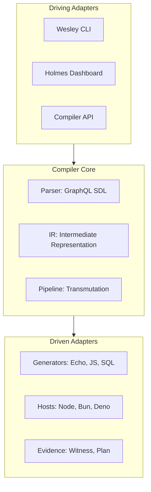

# ARCHITECTURE

Wesley is a schema-first contract compiler organized around a strict Hexagonal (Ports and Adapters) architecture.

## System Shape

Wesley acts as the contract membrane between high-level intent (GraphQL SDL) and physical implementations (SQL, Rust, TypeScript).

## Core Components

### 1. Intermediate Representation (IR)
The central heart of the compiler. Wesley lowers GraphQL SDL into a platform-neutral IR before transmuting it into target-specific artifacts. This ensures that a single schema change results in bit-identical updates across multiple languages.

For local CLI workflows, Wesley now reuses lowered IR through a hash-addressed cache under `.wesley-cache/ir/<authored-sdl-hash>.json`. Commands such as `generate`, `plan`, `rehearse`, `up`, `typescript`, and `zod` can therefore reuse prior lowerings when the authored SDL is unchanged.

### 2. Transmutation Pipeline
A governed sequence of transformations:
1. **Ingest**: Load and validate authored schemas and operations.
2. **Lower**: Transform SDL into the internal IR model.
3. **Generate**: Transmute IR into derived artifacts (Rust structs, TS types, SQL migrations).
4. **Certify**: Run rehearsal and witness protocols to produce machine-readable evidence.

### 3. Generators & Hosts
Pluggable modules that own the physical emission of code.
- **Generator-Echo**: Bit-exact Rust/WASM bridges for the Echo engine.
- **Generator-JS**: TypeScript types and Zod validators for browser/Node clients.
- **Host-Node/Bun/Deno**: Runtime-specific adapters for file I/O and process execution.

### 4. HOLMES (Policy Engine)
The governance layer. It evaluates proposed changes against a set of policy invariants (e.g., "No breaking changes to public envelopes") and issues cryptographic certificates of conformance.

## Realization Manifests

Wesley emits a lightweight `realization/manifest.json` under every output root. This manifest carries:
- Build traceability (which schema version produced this artifact).
- Conformance status (whether a witness has verified this leg).
- Registry identifiers for shared Continuum nouns.

---
**The goal is inevitably. Every derived artifact is a provable consequence of the sovereign schema.**
