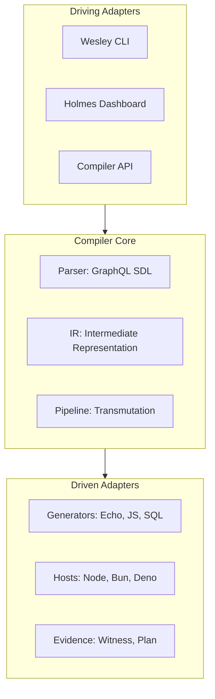

# ARCHITECTURE

Wesley is a schema-first contract compiler organized around a strict Hexagonal (Ports and Adapters) architecture.

## System Shape

Wesley acts as the contract membrane between high-level intent (GraphQL SDL) and physical implementations (SQL, Rust, TypeScript).

## Core Components

### 1. Intermediate Representation (IR)
The central heart of the compiler. Wesley lowers GraphQL SDL into a platform-neutral IR before transmuting it into target-specific artifacts. This ensures that a single schema change results in bit-identical updates across multiple languages.

For local CLI workflows, Wesley now reuses lowered IR through a hash-addressed cache under `.wesley-cache/ir/<authored-sdl-hash>.json`. Commands such as `generate`, `plan`, `rehearse`, `up`, `typescript`, and `zod` can therefore reuse prior lowerings when the authored SDL is unchanged.

### 2. Transmutation Pipeline
A governed sequence of transformations:
1. **Ingest**: Load and validate authored schemas and operations.
2. **Lower**: Transform SDL into the internal IR model.
3. **Emit**: Transmute IR into derived artifact families (Rust structs, TS types, SQL migrations).
4. **Package**: Write a `realization/manifest.json` shell that records source identity, artifact inventory, and artifact signatures for the emitted leg.
5. **Certify**: Run rehearsal and witness protocols that verify bounded properties against the authored source, the emitted leg, and the realization shell.

### 3. Generators & Hosts
Pluggable modules that own the physical emission of code.
- **Generator-Echo**: Bit-exact Rust/WASM bridges for the Echo engine.
- **Generator-JS**: TypeScript types and Zod validators for browser/Node clients.
- **Host-Node/Bun/Deno**: Runtime-specific adapters for file I/O and process execution.

### 4. HOLMES (Policy Engine)
The governance layer. It evaluates proposed changes against a set of policy invariants (e.g., "No breaking changes to public envelopes") and issues cryptographic certificates of conformance. Shared execution lives in `@wesley/holmes`, while product packages such as `@wesley/continuum` can supply domain-specific judgment profiles, scope defaults, and publication-boundary policy without absorbing generic compiler infrastructure.

## Admission Surfaces

Wesley now treats each compile path as a small admission stack with distinct surfaces:

1. **Authored Source**: The sovereign GraphQL SDL. This is the only authored contract authority.
2. **Lowered IR**: Wesley's admitted internal reading of that SDL. It is compiler truth, not a publication artifact.
3. **Emitted Artifact Family**: The generated files for one target or transmutation.
4. **Realization Shell**: The emitted `realization/manifest.json`, which packages source identity, artifact signatures, and witness status for the leg.
5. **Witness Output**: The bounded proof result that certifies explicit properties of the leg. Witness output is not the same thing as the realization shell, and neither is the same thing as runtime observation.

This distinction matters for Continuum work. A manifest can say what was emitted and where it came from, but only witness can certify bounded properties such as source traceability, artifact integrity, or cross-leg coherence. Runtime, storage, and debugger semantics remain neighboring surfaces unless a witness explicitly proves them.

For the current release-line doctrine behind these terms, see [`docs/design/0004-realization-admission-and-witness/realization-admission-and-witness.md`](./docs/design/0004-realization-admission-and-witness/realization-admission-and-witness.md).

## Realization Manifests

Wesley emits a `realization/manifest.json` under every output root. This manifest is the packaging shell for one emitted leg, not the proof by itself. It carries:
- Source identity through the authored SDL hash (`sourceHash`).
- A signed inventory of generated files for the leg.
- Witness/conformance status for the leg.
- Registry identifiers for shared Continuum nouns where relevant.

The manifest is what `verify-realization` and witness commands inspect when they check whether a leg is still faithful to its admitted source. For the release line, the manifest should be read as a boring, machine-checkable shell around emitted artifacts rather than as a substitute for witness output.

---
**The goal is inevitably. Every derived artifact is a provable consequence of the sovereign schema.**
