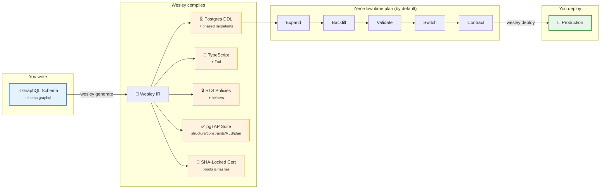

# Wesley

> GraphQL is the schema. Postgres & Supabase are generated.

Write your GraphQL once. Wesley compiles phased, zero-downtime plans by default, generates RLS + tests, and ships a SHA-locked certificate proving it’s safe.

```graphql
type Document @table @tenant(by: "org_id") @rls(enable: true) {
  id: ID! @pk
  title: String!
  org_id: ID! @fk(ref: "Org.id")
  created_by: ID! @fk(ref: "User.id")
}
```



Why GraphQL as schema?

- One source of truth: Describe the domain once; Wesley generates SQL, migrations, types, validation, and RLS from it.
- Naturally relational: Graphs express relationships and constraints cleanly; directives capture DB semantics where they’re used.
- Portable by design: A schema → IR → generators pipeline targets Postgres/Supabase today, other backends tomorrow.

⸻

The problem (short version)

You maintain the same shape in 5+ places:

- GraphQL for APIs
- Postgres DDL for DB
- TypeScript for apps
- Zod for runtime
- RLS for security
- migrations that drift

When they drift, prod breaks. Reviews get harder. Deploys get scary. You’re playing schema telephone.

⸻

How Wesley works

1) Define once

type User @table {
  id: ID! @pk
  email: String! @unique
  org_id: ID! @fk(ref: "Org.id")
}

2) Compile everything

wesley generate --schema schema.graphql
wesley plan         # expand → backfill → validate → switch → contract
wesley rehearse     # run the plan on a shadow DB
wesley certify      # emit SHA-locked proofs
wesley deploy       # apply plan to production

3) What you get

✓ migrations/001_expand.sql     # online DDL
✓ migrations/001_backfill.sql   # idempotent data moves
✓ migrations/001_contract.sql   # cleanup phase
✓ types/generated.ts            # TypeScript interfaces
✓ schemas/zod.ts                # runtime validation
✓ policies/rls.sql              # RLS policies + helpers
✓ tests/                        # pgTAP suites (structure/constraints/RLS/plan)
✓ certs/deploy-<sha>.json       # proofs & hashes

## Key features

### 🔒 Industrial-grade RLS

- Tenant isolation via @tenant, composable security functions, required indexes auto-generated.
- Every policy ships with allow/deny tests.

### 🔄 Zero-downtime plans (by default)

- Expand → Backfill → Validate → Switch → Contract protocol.
- CONCURRENT indexes, NOT VALID constraints, chunked backfills, rollback steps.

#### ✅ Tests you’ll actually run

- pgTAP suites for structure, constraints, RLS paths, and plan rehearsal.
- Idempotence checks and basic plan performance assertions.

### 🔍 Drift detection

- Enforces Schema === Database === Types before deploy.
- Diff explains exactly what’s out of sync.

### 📊 Evidence-based shipping

- SHA-locked deploy certificates.
- Optional “Moriarty” predictions from recent history (with regime-shift detection).

### 🚀 Postgres-first, Supabase-native

- Realtime, Storage, Auth helpers, and policy scaffolding generated from directives.

## Compare

|   | Hand-written | ORMs | Wesley |
| --- | --------- | ---- | ------ |
| Source of truth | ❌ many files | ❌ code-first | ✅ GraphQL schema |
| Zero-downtime | ❌ manual | ❌ table locks risk | ✅ planned by default |
| RLS generation | ❌ manual SQL | ❌ limited | ✅ automated + tests |
| Drift detection | ❌ ad-hoc | ❌ partial | ✅ enforced |
| Test coverage | ❌ rare | ❌ app-only | ✅ pgTAP suites |
| Proof of safety | ❌ none | ❌ none | ✅ SHA-locked certs |

## Getting started

```bash
npm install -g @wesley/cli
wesley init
```

### Write a schema:

```graphql
type Post @table @rls(enable: true) {
  id: ID! @pk
  title: String!
  author_id: ID! @fk(ref: "User.id")
  published: Boolean! @default(expr: "false")
}
```

Generate → rehearse → deploy:

```
wesley generate
wesley rehearse
wesley deploy
```

## FAQ

> [!faq] What if I need custom SQL?\

Use @custom blocks; Wesley will test them and preserve them across generations.

> [!faq] Can I bring an existing DB?

Yes—introspect to a starting GraphQL schema, then let Wesley own the future diffs.

> [!faq] What about breaking changes?

Detected and flagged. Wesley prefers backward-compatible plans; explicit approval is required for breaking steps.

> [!faq] Prisma vs Wesley?

Prisma focuses on queries. Wesley compiles the data layer (DDL, migrations, RLS, tests, proofs).

---

**Stop maintaining schemas in 5 places.**  
**Start shipping with confidence.**  
**GraphQL in, Supabase out. Deployments are boring.**  
