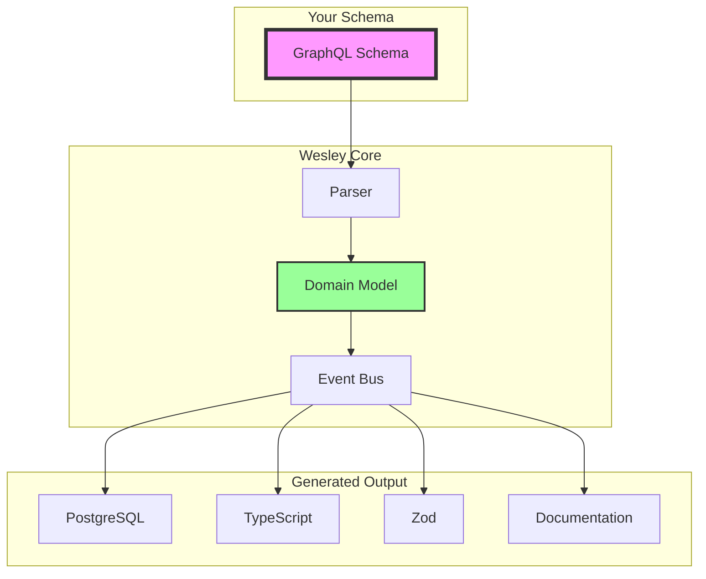

# 🚀 Wesley - The GraphQL Revolution

<div align="center">
  
  
  **Everyone generates GraphQL from databases.**  
  **Wesley generates databases from GraphQL.**
  
  [](https://opensource.org/licenses/MIT)
  [](https://www.npmjs.com/package/@wesley/cli)
  [](http://makeapullrequest.com)
</div>

## 📖 The Problem

You write the same data shape **5+ times**:
- SQL DDL for database
- GraphQL schema for API  
- TypeScript types for frontend
- Zod schemas for validation
- JSON Schema for OpenAPI

**This is insane.**

## ✨ The Solution

GraphQL is your single source of truth. Everything else is generated.

```graphql
# THIS is your entire data layer
type User @table {
  id: ID! @primaryKey @default(expr: "gen_random_uuid()")
  email: String! @unique @index
  posts: [Post!]! @hasMany
}

type Post @table {
  id: ID! @primaryKey @default(expr: "gen_random_uuid()")
  user_id: ID! @foreignKey(ref: "User.id") @index
  title: String!
  content: String
  published: Boolean! @default(expr: "false")
}
```

Wesley generates **everything** from this:

```bash
wesley generate --schema schema.graphql

✨ Generated:
  ✓ PostgreSQL DDL       → out/schema.sql
  ✓ TypeScript Types     → out/types.ts
  ✓ Zod Schemas         → out/validation.ts
  ✓ Migrations          → migrations/20240320_auto.sql
  ✓ pgTAP Tests         → tests/20240320_auto.sql
  ✓ API Documentation   → out/api-docs.md
```

## 🎯 Quick Start

```bash
# Install Wesley
npm install -g @wesley/cli

# Create your schema
cat > schema.graphql << 'EOF'
type User @table {
  id: ID! @primaryKey @default(expr: "gen_random_uuid()")
  email: String! @unique
  name: String!
}
EOF

# Generate everything with evidence bundle
wesley generate --schema schema.graphql --emit-bundle

# Install SHA-lock HOLMES (optional intelligence sidecar)
npm install -g @wesley/holmes

# Run investigation
holmes investigate

# Watch for changes
wesley watch --schema schema.graphql
```

## 🏗️ Architecture

Wesley uses **Hexagonal Architecture** with **Event-Driven** patterns and **Zero Dependencies** in core:



## 🔥 Features

### 🎯 Schema-First Development
Write your GraphQL schema. Get everything else for free.

### 🔄 Automatic Migrations
Change your schema. Migrations are generated automatically as diffs.

### 🧪 Automatic Testing
Every migration gets pgTAP tests. Structure, constraints, performance—all tested.

### 🔍 SHA-lock HOLMES Integration
Schema intelligence system: weighted scoring, evidence mapping, independent verification.

### 🏃 Zero Dependencies Core
Pure JavaScript domain logic. Run anywhere.

### 🔌 Extensible
Add custom generators, directives, and adapters.

### 📦 Multi-Platform
Works with Node.js, Deno, Bun, and Edge runtimes.

### 🎨 Rich Directives

```graphql
# Core Directives
@table                              # Mark as database table
@primaryKey                         # Primary key constraint
@unique                            # Unique constraint
@index                             # Create index
@default(expr: "SQL expression")   # Default value
@foreignKey(ref: "Table.field")    # Foreign key
@hasOne / @hasMany                 # Virtual relations

# Intelligence Directives (NEW!)
@uid(value: "stable-id")           # Stable identity across renames
@weight(value: 10)                 # Importance weighting (1-10)
@critical                          # Mark as mission-critical
@sensitive                         # Security-sensitive field
@pii                              # Personal identifiable information
```

## 📚 Documentation

- [**The Paradigm Shift**](./docs/architecture/paradigm-shift.md) - Why GraphQL should be your source of truth
- [**Architecture Overview**](./docs/architecture/overview.md) - Hexagonal, event-driven design
- [**The Algorithm**](./docs/architecture/algorithm.md) - How GraphQL becomes everything
- [**Test Generation**](./docs/architecture/test-generation.md) - Automatic pgTAP tests
- [**HOLMES Integration**](./docs/architecture/holmes-integration.md) - Schema intelligence system
- [**Internals Deep Dive**](./docs/internals/deep-dive.md) - Under the hood

## 🛠️ Advanced Usage

### Custom Generators

```javascript
import { Wesley, CustomGenerator } from '@wesley/core';

class PythonGenerator extends CustomGenerator {
  generate(schema) {
    // Generate Python dataclasses
    return schema.getTables()
      .map(table => `@dataclass\nclass ${table.name}:\n${this.fields(table)}`)
      .join('\n\n');
  }
}

wesley.register('python', new PythonGenerator());
```

### Custom Directives

```graphql
type User @table @audit @softDelete {
  id: ID! @primaryKey
  email: String! @unique @encrypted
  role: Role! @default(value: "USER")
  deleted_at: DateTime @index
}
```

### Supabase Integration

```graphql
type Post @table @realtime @rls(
  select: "true"
  insert: "auth.uid() = user_id"
  update: "auth.uid() = user_id"
  delete: "false"
) {
  id: ID! @primaryKey
  user_id: ID! @foreignKey(ref: "User.id")
  content: String!
}
```

## 🔮 Roadmap

### Shipped Today ✅
- [x] Core architecture (Hexagonal, Event-driven)
- [x] GraphQL parser with directives
- [x] PostgreSQL generator
- [x] TypeScript generator (basic)
- [x] Migration diff engine
- [x] Evidence mapping system
- [x] SCS/MRI/TCI scoring
- [x] @uid stable identities
- [x] @weight/@critical directives

### Coming This Week 🚀
- [ ] @wesley/holmes package
- [ ] Full TypeScript generator
- [ ] Zod schema generator
- [ ] HOLMES CI/CD integration
- [ ] WATSON verification
- [ ] MORIARTY predictions

### Coming Soon 📅
- [ ] Supabase RLS policies
- [ ] Realtime subscriptions
- [ ] Storage configuration
- [ ] Multi-database support (MySQL, SQLite)
- [ ] Visual schema editor (Ten Forward)
- [ ] VS Code extension
- [ ] Framework plugins (Next.js, Remix, SvelteKit)

## 🤝 Contributing

Wesley is looking for contributors! Areas we need help:

- **Generators**: MySQL, SQLite, MongoDB, Prisma
- **Frameworks**: Next.js, Remix, SvelteKit integrations
- **Languages**: Python, Go, Rust type generators
- **Testing**: Test coverage, edge cases
- **Documentation**: Tutorials, examples, videos

See [CONTRIBUTING.md](./CONTRIBUTING.md) for guidelines.

## 📜 Philosophy

> "Migrations are a byproduct, not a task."

You shouldn't "write migrations." You should evolve your schema and get migrations for free. Rails tried with ActiveRecord but got it backwards—they made you write migrations instead of schemas.

Wesley does it right: **Schema first. Migrations are just diffs.**

## 🌟 Why "Wesley"?

Named after Wesley Crusher, the brilliant ensign who saw possibilities others couldn't. Like his namesake, Wesley (the tool) transcends conventional thinking to solve problems in ways that seem obvious only in hindsight.

## 📄 License

MIT © Captain James

---

<div align="center">
  <strong>Stop writing migrations. Write GraphQL.</strong>
  
  **"Make it so, schema."**
  
  [Documentation](./docs) • [Examples](./examples) • [Discord](https://discord.gg/wesley) • [Twitter](https://twitter.com/wesleyql)
</div>