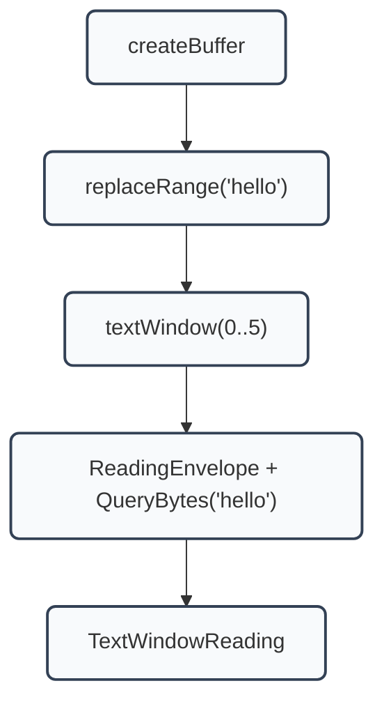

<!-- docs-truth: status=experimental owner=@flyingrobots -->
<div align="center">

</div>

## What Is Wesley?

**Wesley is a semantic contract compiler.**

Wesley takes authored GraphQL Schema Definition Language (SDL), lowers it into
domain-empty compiler facts, and emits derived artifacts through explicit Rust
emitters or external target modules.

The important boundary is simple:

- GraphQL SDL is the source contract.
- Wesley owns semantic compilation and generic evidence plumbing.
- Domains own law: runtime policy, storage behavior, footprints, schedulers,
  transports, replication, product semantics, and substrate truth.

Wesley itself is the core `GraphQL -> whatever` compiler and assurance
toolchain. The `whatever` comes from explicitly selected modules or projection
crates. Domain systems such as Echo, Continuum, PostgreSQL, and Supabase are not
Wesley product surfaces; their generators, policies, witnesses, and runtime
conventions belong in external owning repos or modules.

## Entry Point

Start with the Rust-native surface:

```bash
cargo xtask preflight
cargo wesley --help
```

Wesley currently has legacy Node packages and a newer Rust kernel in the same
repository. They are not equal product fronts.

- `crates/wesley-core/` is the compiler truth for new work.
- `crates/wesley-cli/` is the native `wesley` command for Rust-backed compiler
  facts.
- `crates/wesley-emit-rust/` emits Rust data models and operation bindings.
- `crates/wesley-emit-typescript/` emits TypeScript declarations and operation
  bindings.
- `xtask/` is repository automation.
- `packages/` is the historical Node toolchain: old commands, generators,
  hosts, module loading, evidence tooling, package tests, and docs support.
- `package.json` keeps that old Node workspace installable; it is not the
  product entry point.

For the full map, read [ENTRYPOINTS.md](./docs/ENTRYPOINTS.md). For the
developer-level operator guide, read [GUIDE.md](./docs/GUIDE.md).

## Why Wesley?

Traditional code generators often treat schemas as suggestions. Wesley treats
authored SDL as the sovereign system of record and keeps generated artifacts as
derived surfaces.

- **Contract Sovereignty**: Authored GraphQL SDL is the single source of truth.
  Generated artifacts are never allowed to become peer authorities.
- **Domain-Empty Core**: Wesley owns parsing, lowering, hashing, structural
  operation facts, projection, dispatch, artifact bookkeeping, and generic
  assurance plumbing. Domain law belongs outside generic core.
- **Module-Brought Targets**: Modules own target semantics, generators, policy,
  witness scopes, release conventions, and runtime interpretation.
- **Admission Discipline**: Authored source, lowered IR, realization shells,
  and witness output remain distinct so Wesley can certify explicit properties
  without overstating runtime truth.
- **Evidence-Backed Change**: Toolchain surfaces can produce machine-readable
  evidence that a proposed artifact bundle is coherent with the authored source
  and selected modules.
- **Local-First Operation**: Compiler and witness checks run on the local
  developer workstation, keeping contract verification in the fast inner loop.

## Shape, Law, And Extensions

GraphQL is useful here because SDL describes shape while directives can carry
domain-owned meaning at inspectable schema locations.

- Types define **shape**: fields, entities, relationships, arguments, and
  payloads.
- Directives carry **law-shaped data**: footprints, capabilities, constraints,
  and other semantics for an owning extension to interpret.
- Extensions provide **interpretation**: a Postgres module may emit SQL; an Echo
  module may prove footprint honesty; a TypeScript emitter may produce client
  bindings.

Generic Wesley preserves directive data and operation structure. It does not
decide what Echo, Postgres, Continuum, or any other domain directive means.
Those owners may reject dishonest or unsupported contracts through their own
module-owned checks.

For the longer doctrine note, read [SDL, Shape, And Law](./docs/SDL.md).

## Quick Start

### 1. Verify The Rust Workspace

```bash
cargo xtask preflight
```

### 2. Inspect The Native Command

```bash
cargo wesley --help
```

The native command can lower schema SDL to L1 IR, compute schema hashes, diff
schema structure, list schema root operations, emit Rust models and TypeScript
declarations with root operation bindings, resolve operation selections, and
extract operation directive arguments.

```bash
cargo wesley schema lower --schema test/fixtures/ir-parity/small-schema.graphql --json
cargo wesley schema hash --schema test/fixtures/ir-parity/small-schema.graphql
cargo wesley schema operations --schema test/fixtures/consumer-models/jedit-hot-text-runtime.graphql --json
cargo wesley schema diff --old old.graphql --new new.graphql --format summary --exit-code
cargo wesley schema diff --schema schema.graphql --against HEAD --format summary
cargo wesley emit rust --schema test/fixtures/consumer-models/jedit-hot-text-runtime.graphql --out generated/model.rs
cargo wesley emit typescript --schema test/fixtures/consumer-models/jedit-hot-text-runtime.graphql --out generated/types.ts
```

Echo-owned tooling owns Echo-specific footprint honesty checks. Wesley core
exposes generic operation facts and preserved directive data for that tooling to
consume.

## What's New In v0.0.2

Wesley's `0.0.2` alpha hardens the Rust-native crates.io release path. The
GitHub Actions release workflow now keeps temporary GitHub Release notes and
draft-state files outside the repository checkout, so the real-publish
clean-worktree guard can run immediately before registry mutation.

The native alpha line centers the Rust front door: it lowers GraphQL SDL to
domain-empty L1 IR, hashes schemas, diffs schema structure, lists schema root
operations, emits Rust and TypeScript model/operation bindings, resolves
operation selection paths, and extracts operation directive arguments without
requiring an npm entry point. See [CHANGELOG.md](./CHANGELOG.md) for the full
release notes.

## Rust-Native Front Door

Wesley core work now starts from Cargo.

- `cargo wesley ...` runs the native Rust `wesley` binary from
  `crates/wesley-cli`.
- `cargo xtask ...` runs repository automation from `xtask`.
- `cargo xtask docs-check` runs Rust-native documentation hygiene checks.
- `cargo xtask preflight` is the normal Rust-native health check: docs checks,
  Rust tests, and native CLI help.
- `cargo xtask release-check` builds the optimized native binary and packages
  the Rust library crate without publishing anything.
- `cargo xtask legacy-preflight` runs the historical npm/package preflight
  while old package surfaces are being retired.

The distinction matters: `wesley` is the user-facing compiler command, while
`xtask` is for maintaining this repository. Avoid adding new core workflows to
`pnpm wesley`; new compiler behavior should land in Rust first.

### Native Install And Release

Install the published alpha native binary from crates.io.

```bash
cargo install wesley-cli --version 0.0.2
wesley --help
```

Install the local native binary directly from the Rust workspace when working
inside this checkout.

```bash
cargo install --locked --path crates/wesley-cli
wesley --help
```

Before cutting or attaching a native release artifact, run the Rust release
check.

```bash
cargo xtask release-check
./target/release/wesley --help
```

This path does not require an npm entry point. The native CLI is distributed as
the `wesley-cli` crate on crates.io, which installs a `wesley` binary. The
historical Node packages remain available only for legacy package projections
and surrounding tooling until those surfaces are extracted, retired, or
reimplemented in Rust.

### Extending Wesley

Extend Wesley at the narrowest boundary that owns the meaning:

- Add generic GraphQL compiler facts in `crates/wesley-core`.
- Add user-facing Rust commands in `crates/wesley-cli`.
- Add generic Rust or TypeScript projections in the existing Rust emitter crates
  when the projection is domain-empty and broadly reusable.
- Put domain targets, policies, witnesses, and runtime conventions in external
  modules or crates owned by that domain.

The practical extension guide is [docs/guides/extending.md](./docs/guides/extending.md).

### Legacy Repository Tooling

The repo still carries historical Node package tooling while the Rust-native
front door takes over. Use legacy preflight when changing docs, package
boundaries, or legacy package surfaces.

```bash
pnpm install
cargo xtask legacy-preflight
```

Generate TypeScript from an authored GraphQL schema through the legacy package
surface only when that old path is the intended target:

```bash
pnpm wesley typescript \
  --schema ./schema.graphql \
  --out-file ./generated/types.generated.ts
```

Select legacy target behavior explicitly from project config or `WESLEY_MODULES`.

```bash
WESLEY_MODULES=/path/to/my-wesley-module.mjs pnpm wesley --help
```

Modules are trusted Node code. Use `WESLEY_DISABLE_MODULES=1` for a no-module
diagnostic run, or set `WESLEY_MODULE_ALLOWLIST` to path-delimited config/module
paths in CI environments that must refuse unapproved module imports.

## Current Grounding

The current Stack Witness 0001 fixture captures a small jedit-through-Echo file
history boundary:


```mermaid
flowchart TD
  A[createBuffer] --> B["replaceRange('hello')"]
  B --> C["textWindow(0..5)"]
  C --> D["ReadingEnvelope + QueryBytes('hello')"]
  D --> E[TextWindowReading]

  classDef default fill:#f8fafc,stroke:#334155,stroke-width:2px,rx:6,ry:6
```

That fixture gives Wesley a hermetic contract shape and operation-binding test
surface. It does not make Wesley core an Echo runtime, an editor host, or the
owner of Echo footprint law.

## Overall Status

<!-- BEGIN:OVERALL_STATUS -->
Stage: MVP  \
Progress: 61% → Alpha
<!-- END:OVERALL_STATUS -->

## Package Matrix

<!-- BEGIN:PACKAGE_MATRIX -->
| Package | Status | Stage | Progress | CI | Notes |
| --- | --- | --- | --- | --- | --- |
| `@wesley/core` | Active | MVP | 45% → Alpha | — | Pure domain logic, no Node builtins |
| `@wesley/cli` | Active | Alpha | 50% → Beta | — | CLI + Bats suites |
| `@wesley/host-node` | Active | MVP | 50% → Alpha | — | Node adapters + binary |
| `@wesley/host-browser` | Experimental | MVP | 40% → Alpha | — | Pure ESM; in-memory FS; minimal parser; smoke-level only |
| `@wesley/generator-js` | Active | MVP | 50% → Alpha | — | TS/Zod emitters |
| `@wesley/generator-vue` | Experimental | MVP | 0% → Alpha | — | Vue-facing TS/composable emitters |
| `@wesley/holmes` | Active | Alpha | 50% → Beta | — | Evidence scoring |
| `@wesley/runtime-node` | Active | MVP | 0% → Alpha | — | Shared Node runtime adapters |
| `@wesley/tasks` | Active | MVP | 50% → Alpha | — | Planner utilities |
| `@wesley/host-deno` | Experimental | Alpha | 50% → Beta | — | Deno host runtime (demo) |
| `@wesley/host-bun` | Experimental | Alpha | 50% → Beta | — | Bun host runtime (demo) |
| `@wesley/scaffold-multitenant` | Too soon | Prototype | 50% → MVP | — | Early scaffold, no CI yet |
| `@wesley/test-fixtures` | Active | MVP | 20% → Alpha | — | Private shared fixtures + schema builders |
<!-- END:PACKAGE_MATRIX -->

## Documentation

- **[Entrypoints](./docs/ENTRYPOINTS.md)**: Short map of which Wesley command or
  package to run or edit.
- **[Guide](./docs/GUIDE.md)**: Orientation, the fast path, and compiler usage.
- **[Crates.io Release](./docs/CRATES_IO_RELEASE.md)**: Native Rust alpha
  package set and publish order.
- **[Wesley Glossary](./docs/WESLEY_GLOSSARY.md)**: The main nouns, layers, and
  boundary terms for Wesley and its surrounding toolchain.
- **[SDL, Shape, And Law](./docs/SDL.md)**: Why SDL is the contract substrate
  and where domain law interpretation belongs.
- **[Advanced Guide](./docs/ADVANCED_GUIDE.md)**: Deep dives into the IR model,
  custom directives, and the Holmes policy engine.
- **[Architecture](./docs/ARCHITECTURE.md)**: The authoritative system map
  across Rust kernel, native CLI, legacy packages, and external owners.
- **[Extending Wesley](./docs/guides/extending.md)**: How to add Rust compiler
  behavior, native CLI surfaces, emitter projections, or external modules
  without breaking the core boundary.
- **[Realization Admission and Witness](./docs/design/0004-realization-admission-and-witness/realization-admission-and-witness.md)**:
  The release-line doctrine for authored source, IR, realization shells, and
  bounded witness claims.
- **[Module Contract](./docs/design/wesley-module-contract.md)**: The boundary
  between the Wesley compiler kernel and external target modules.
- **[Module Capability Contract](./docs/design/wesley-module-capability-contract.md)**:
  The capability surfaces external modules bring to Wesley.
- **[Extraction Map](./docs/design/wesley-extraction-map.md)**: Known wrong-repo
  domain residue and its intended external homes.
- **[Vision](./docs/VISION.md)**: Core tenets and the "Trustworthy Change"
  mission.
- **[Method](./docs/METHOD.md)**: Repo work doctrine and the cycle loop.

---
Built with bit-exact ambition by [FLYING ROBOTS](https://github.com/flyingrobots)
