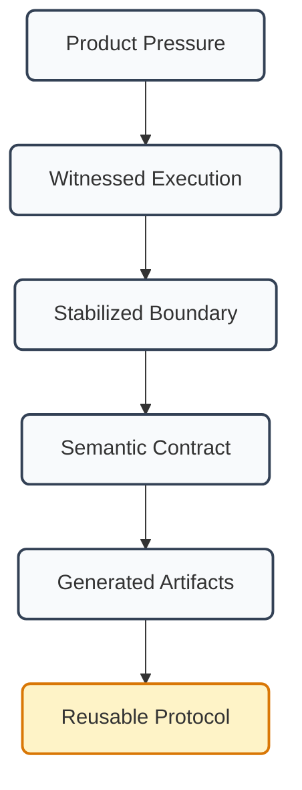
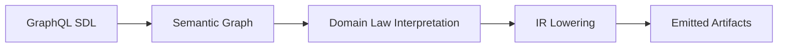
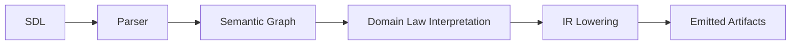
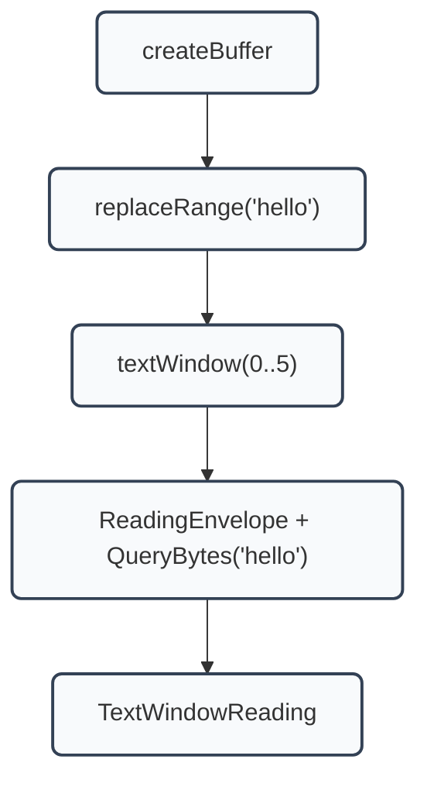

<!-- docs-truth: status=experimental owner=@flyingrobots -->

> "Things are only impossible until they're not."
> -- Jean-Luc Picard

<div align="center">

</div>

## What is Wesley?

**Wesley is a domain-free GraphQL-to-IR transformation toolchain.**

It takes GraphQL Schema Definition Language (SDL), lowers it into deterministic
JSON IR, and preserves enough structure, provenance, directives, and weslaw
extension context for downstream tools to make their own meaning.

> _There is no graph. Only structure and what you make of it._

Wesley is deliberately domain-empty. It claims no ownership over runtime law,
scheduler semantics, persistence models, replication behavior, storage engines,
transport protocols, or substrate truth. Those concerns belong entirely to
extension modules.

**Wesley owns the GraphQL-to-IR transformation. Extensions own meaning.**

For the bounded-autonomy direction, read
[Wesley North Star](./docs/NORTHSTAR.md). For the SDL boundary, read
[SDL, Shape, And Law](./docs/SDL.md). For the active ownership boundary, read
[Domain-Empty Core Boundary](./docs/design/0014-domain-empty-core-boundary/domain-empty-core-boundary.md).
For a full first-principles walkthrough, read
[Wesley End To End](./docs/END_TO_END.md).

---

## What's New in v0.1.0

Wesley `0.1.0` is the LE-binary codec-plan release. It ships the breaking
decode API cleanup needed to keep Rust and TypeScript codec emitters aligned:

- **Shared codec plan**: `wesley-emit-codec` lowers GraphQL L1 IR and selected
  operations into a language-neutral LE-binary codec plan. Rust and TypeScript
  emitters now render from that same plan instead of each re-deriving codec
  shape.
- **Decode result contract**: TypeScript generated `decode*` functions now
  return `Result<T>` instead of throwing directly from the public boundary,
  matching the Rust `Result<T, CodecError>` style more closely.
- **Trailing-byte rejection**: TypeScript decoders now reject extra bytes after
  a top-level decode, closing the same #603 class already fixed for Rust.
- **Runtime ports**: Generated codec modules include explicit
  `Writer`/`Reader`/`CodecError` port contracts so consumer runtimes can see the
  required shape at the generated boundary.

This release also carries the accumulated Rust-native compiler hardening,
strict preflight, and Holmes law-assurance foundation work that was staged
before the `0.1.0` release packet was finalized.

For the complete release history, read [CHANGELOG.md](./CHANGELOG.md).

---

## Core doctrine

Product pressure determines architectural truth.

The stack evolves in this order:


```mermaid
flowchart TD
  PP[Product Pressure] --> WE[Witnessed Execution]
  WE --> SB[Stabilized Boundary]
  SB --> SC[Semantic Contract]
  SC --> GA[Generated Artifacts]
  GA --> RP[Reusable Protocol]

  classDef default fill:#f8fafc,stroke:#334155,stroke-width:2px,rx:6,ry:6
  classDef final fill:#fef3c7,stroke:#d97706,stroke-width:2px,rx:6,ry:6

  class RP final
```

Wesley lives at the contract and boundary layers. It exists to stabilize truths
that product pressure and real-world execution have already forced into
existence, never before.

## The inversion

The industry generates GraphQL schemas from runtime models or application code.
Wesley inverts this relationship:


```mermaid
flowchart LR
  SDL[GraphQL SDL] --> SG[Semantic Graph]
  SG --> DLI[Domain Law Interpretation]
  DLI --> IR[IR Lowering]
  IR --> EA[Emitted Artifacts]
```

One schema can now drive multiple outputs without making those outputs peer
authorities. The current Wesley core ships:

- TypeScript declarations and operation bindings
- Rust models and operation bindings
- TypeScript and Rust LE-binary codecs
- Schema hashes, schema diffs, and operation facts
- `weslaw/v1` Law IR, hashes, coverage, and bundle metadata

Target-owned modules can consume the same compiler facts to produce SQL
schemas, migrations, validators, observer plans, runtime manifests, transport
bindings, or other domain artifacts. That alignment eliminates hand-maintained
drift without moving domain ownership into Wesley core.

---

## Why GraphQL?

GraphQL was chosen for several deep, structural reasons.

**Additive evolution.** Schemas can grow safely without breaking existing
consumers. SDL has proven to be an exceptionally stable, long-lived contract
substrate.

**Ontology over layout.** GraphQL describes entities, operations, and
relationships rather than dictating storage or implementation details. It is a
semantic schema language first, and an API layer second.

**Behavioral extension through directives.** Directives allow additional meaning
to be attached to schema elements without altering their fundamental shape. This
distinction is foundational:

- Types define **shape**.
- Directives define **law**.
- Extensions define **interpretation**.

Because directives attach semantics structurally to schema locations, law
becomes statically inspectable instead of being hidden inside arbitrary runtime
code.

**Strong contract boundaries.** Schema-first GraphQL already treats the SDL as
the single source of truth. Wesley generalizes this principle: one SDL becomes
the common root for many different technical systems simultaneously.

---

## Runtime-Neutral Extension North Star

Wesley's long-term north star is **bounded, lawful autonomy**.

Agents and applications should be able to declare the GraphQL operation shape,
variables, directive evidence, and law hooks they need. Wesley compiles that
declaration into typed, inspectable compiler evidence. External targets such as
Echo, Continuum, PostgreSQL, or future modules decide how that evidence maps to
runtime profiles, footprints, target identifiers, scheduling, witnesses, and
receipts.

The target is not ambient authority. It is a lawful path for agents to propose
precise interactions without making Wesley core a runtime or an admission
authority.

---

## Compilation model

Wesley follows a clear, deterministic pipeline:


```mermaid
flowchart LR
  SDL[SDL] --> P[Parser]
  P --> SG[Semantic Graph]
  SG --> DLI[Domain Law Interpretation]
  DLI --> IR[IR Lowering]
  IR --> EA[Emitted Artifacts]
```

- **L1 - Semantic graph:** Normalizes types, fields, directives, and
  relationships.
- **L2 - Domain law:** Binds semantic law, constraints, compatibility rules,
  and interpreted schema facts without owning target execution.
- **L3 - Emitted outputs:** Generates target-neutral models, codecs,
  operation variable bindings, metadata, and artifacts. External targets
  generate runtime plans, witnesses, and target dispatch data.

Most extensions operate entirely at L1 and L2. They remain completely unaware
of L3. L3 exists strictly for runtimes with deeper execution requirements.

---

## Operator entry point

Start with the Rust-native surface:

```bash
cargo xtask preflight
cargo wesley --help
```

`cargo xtask preflight` is the strict pre-PR and release quality gate. It runs
`cargo fmt --check`, `cargo clippy --workspace --all-targets -- -D warnings`,
`pnpm audit --prod=false --json`, documentation checks, workspace tests, and a
native CLI smoke test. `cargo xtask strict-preflight` is an explicit alias for
the same gate. `cargo xtask release-check` runs that same gate before building
and packaging release artifacts, so local developer truth and release truth do
not split.

The retained pnpm workspace still supports docs, website, package tests, and
advisory checks. Use Node `>=22.12.0` with pnpm `9.15.9` when working from this
checkout.

The native command can run Rust-native health checks, lower schema SDL to L1
IR, compute schema hashes, diff schema structure, list schema root operations,
emit Rust models and TypeScript declarations with root operation variable bindings,
resolve operation selections, validate `weslaw` semantic law against active
schema facts, and extract operation directive arguments.

```bash
cargo wesley doctor
cargo wesley schema lower --schema test/fixtures/ir-parity/small-schema.graphql --json
cargo wesley schema hash --schema test/fixtures/ir-parity/small-schema.graphql
cargo wesley schema operations --schema test/fixtures/consumer-models/jedit-rope.graphql --json
cargo wesley schema diff --old old.graphql --new new.graphql --format summary --exit-code
cargo wesley schema diff --schema schema.graphql --against HEAD --format summary
cargo wesley law validate --schema test/fixtures/weslaw/contract-bundle-shape.graphql --law test/fixtures/weslaw/accepted/footprint-replace-range.weslaw.yaml
cargo wesley law validate --schema test/fixtures/weslaw/contract-bundle-shape.graphql --law test/fixtures/weslaw/accepted/footprint-replace-range.weslaw.yaml --json
cargo wesley emit rust --schema test/fixtures/weslaw/contract-bundle-shape.graphql --law test/fixtures/weslaw/accepted/footprint-replace-range.weslaw.yaml --out generated/model.rs --metadata-out generated/model.metadata.json
cargo wesley emit typescript --schema test/fixtures/weslaw/contract-bundle-shape.graphql --law test/fixtures/weslaw/accepted/footprint-replace-range.weslaw.yaml --out generated/types.ts --metadata-out generated/types.metadata.json
```

For the full map, read [ENTRYPOINTS.md](./docs/ENTRYPOINTS.md). For the
developer-level operator guide, read [GUIDE.md](./docs/GUIDE.md).

Historical `pnpm wesley` commands are migration bridges only. Prefer
`wesley schema lower`, `wesley schema hash`, `wesley schema diff`,
`wesley doctor`, and explicit `wesley emit ...` commands for generic compiler
work. The historical Node wrapper has been retired; compatibility and
migration docs list replacements for old callers.

---

## Project status

<!-- BEGIN:OVERALL_STATUS -->

| Stage | Progress   |
| ----- | ---------- |
| Alpha | 50% → Beta |

<!-- END:OVERALL_STATUS -->

<!-- BEGIN:PACKAGE_MATRIX -->

| Package                | Status                   | Stage | Progress    | CI  | Notes                                                                    |
| ---------------------- | ------------------------ | ----- | ----------- | --- | ------------------------------------------------------------------------ |
| `@wesley/holmes`       | Assurance                | Alpha | 50% → Beta  | —   | Self-contained assurance tooling outside compiler authority              |
| `@wesley/host-browser` | External host experiment | MVP   | 40% → Alpha | —   | Browser host smoke adapter with no dependency on retired JS core/runtime |
| `@wesley/host-deno`    | External host experiment | Alpha | 50% → Beta  | —   | Deno host smoke adapter with no dependency on retired JS core/runtime    |
| `@wesley/host-bun`     | External host experiment | Alpha | 50% → Beta  | —   | Bun host smoke adapter with no dependency on retired JS core/runtime     |

<!-- END:PACKAGE_MATRIX -->

---

## External module examples

A single schema can be compiled by many extensions simultaneously. Each
extension walks the semantic graph independently and emits its own artifacts.
Extensions do not need to know about one another.
These are externally owned module families; Wesley preserves the neutral IR
contract and module seam they consume.

| Module family | External owner                    | Responsibility                                        |
| :------------ | :-------------------------------- | ----------------------------------------------------- |
| Postgres      | `wesley-postgres`                 | SQL schemas, migrations, indexes, pgTAP, CRUD helpers |
| Validation    | external target/module            | Runtime and static validation rules                   |
| Codec         | Wesley emitter or external target | Binary and runtime codecs                             |
| TypeScript    | Wesley emitter or external target | Type contracts and client bindings                    |
| Observer      | external target/module            | Observation plans and projections                     |
| Echo          | Echo-owned integration            | Runtime law, footprints, observation semantics        |
| Continuum     | Continuum-owned module/repo       | Deferred protocol generation                          |

---

## Shape vs Law

### Shape

Shape answers: _What exists?_

It defines the structural reality of the system, covering fields, entities,
relationships, arguments, and payloads. GraphQL types define shape.

```graphql
type User {
  id: ID!
  email: String!
  createdAt: String!
}
```

A Postgres extension can safely observe this shape and emit tables, migrations,
indexes, and tests without any knowledge of runtime footprints or causal
execution.

### Law

Law answers: _What is permitted, required, or forbidden?_

It governs interpreted semantics such as reads, writes, capabilities,
footprints, and operational constraints. Directives carry this law when
interpreted by extensions.

```graphql
@wes_op(name: "replaceRangeAsTick")
@wes_footprint(
  reads: ["BufferWorldline", "RopeHead"]
  writes: ["BufferWorldline"]
)
```

The Postgres extension ignores these directives completely. An Echo-owned
extension may interpret them as target law. Neither extension needs to
understand the other. Wesley sees both as structured directive evidence but
assigns no runtime meaning itself; that responsibility belongs solely to the
extensions.

---

## The deep end

For most use cases, Wesley is a powerful drift-eliminating code generator with a
clean extension model. That alone justifies the investment.

But GraphQL has a deeper property that matters enormously here: **GraphQL
operation structure is statically analyzable.**

Selections, mutations, arguments, and directives together form a fully
declarative operational surface. That means the complete intent and footprint of
an operation can be inspected before execution begins.

This enables extensions to:

- Declare precise operational footprints
- Validate read/write honesty
- Detect forbidden dependencies
- Compile deterministic runtime plans
- Define bounded observation apertures
- Reject dishonest operations at compile time

Arbitrary application code can lie about what it reads or writes. A GraphQL
operation plus directive evidence gives an owning target extension a static
surface to check before it emits target runtime artifacts.

This is not merely code generation. It is semantic law evidence through
compilation, with enforcement owned by the selected target.

The Echo extension currently pushes this capability the furthest, but it is not
required for all uses of Wesley. Most Wesley users may never touch causal
runtimes at all.

---

## Layer separation

| Layer      | Responsibility                       |
| :--------- | :----------------------------------- |
| Product    | Product pressure and user semantics  |
| Runtime    | Execution and substrate truth        |
| Wesley     | Semantic compilation                 |
| Extensions | Domain law                           |
| Protocols  | Deferred publication of proven seams |

The compiler must not silently become a runtime.
The runtime must not silently become product policy.
The product must not manufacture substrate coordinates.

If any layer requires forbidden knowledge from another to progress, either the
boundary is wrong or the witness is not ready. **That is the trap detector.**

---

## Anti-goals

Wesley is **not**:

- A runtime
- A scheduler
- A database
- A replication engine
- A GraphQL server replacement
- A universal protocol
- A transport framework
- A "one true architecture"

It is not a venue for premature abstractions to look impressive before reality
demands them. Keeping Wesley narrow and focused is what allows extensions to
own rich semantics without the compiler collapsing into hidden platform ideology
or architectural sludge.

---

## Current grounding

The current witness:


```mermaid
flowchart TD
  A[createBuffer] --> B["replaceRange('hello')"]
  B --> C["textWindow(0..5)"]
  C --> D["ReadingEnvelope + QueryBytes('hello')"]
  D --> E[TextWindowReading]

  classDef default fill:#f8fafc,stroke:#334155,stroke-width:2px,rx:6,ry:6
```

This sequence proves a real product/runtime seam. Wesley's job is to stabilize
that seam. It did not invent it.

---

## Final doctrine

Wesley does not exist to invent universal semantics. It exists to make proven
semantics reproducible, inspectable, and drift-resistant.

1. GraphQL SDL provides the semantic source contract.
2. Directives carry domain-owned law.
3. Extensions interpret that law.

The compiler stabilizes truths that product pressure has already forced into
existence. **Not before.**
