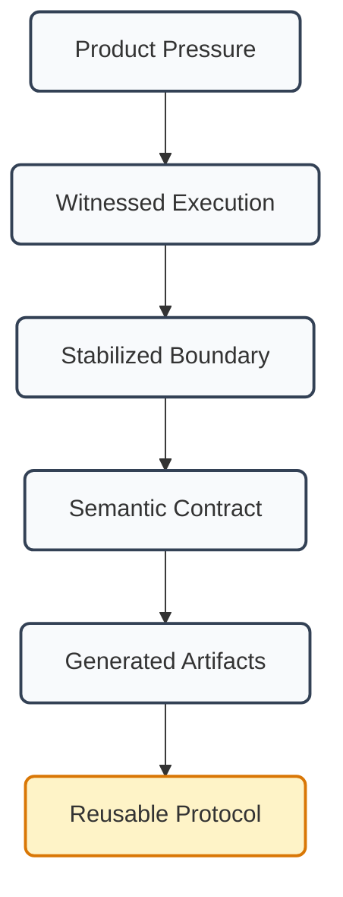
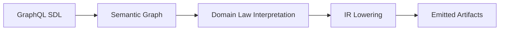
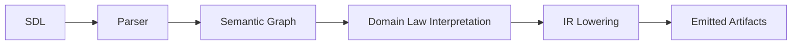
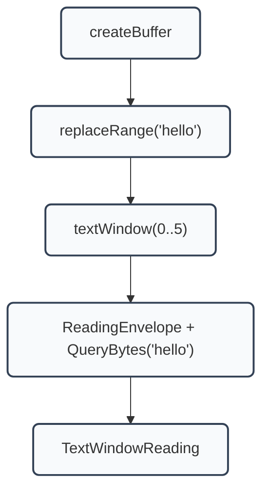

<!-- docs-truth: status=experimental owner=@flyingrobots -->

> "Things are only impossible until they're not."
> -- Jean-Luc Picard

<div align="center">

</div>

## What is Wesley?

**Wesley is a semantic contract compiler.**

It takes GraphQL Schema Definition Language (SDL) as its single source of truth,
constructs a semantic graph, and compiles that graph into domain-specific
outputs through a system of extensions.

Wesley is deliberately domain-empty. It claims no ownership over runtime law,
scheduler semantics, persistence models, replication behavior, storage engines,
transport protocols, or substrate truth. Those concerns belong entirely to
extension modules.

**Wesley owns semantic compilation. Domains own law.**

For the bounded-autonomy direction, read
[Wesley North Star](./docs/NORTHSTAR.md). For the SDL boundary, read
[SDL, Shape, And Law](./docs/SDL.md). For the active ownership boundary, read
[Domain-Empty Core Boundary](./docs/design/0014-domain-empty-core-boundary/domain-empty-core-boundary.md).
For a full first-principles walkthrough, read
[Wesley End To End](./docs/END_TO_END.md).

---

## What's New in v0.0.4

Wesley `0.0.4` makes runtime optic admission requirements importable as a
canonical compiler-owned artifact. `compile_runtime_optic()` still exposes the
structured `OpticAdmissionRequirements` for compiler-side inspection, and now
also emits deterministic requirement bytes, an explicit
`wesley.requirements.canonical-json.v0` codec, and a digest computed from those
exact bytes.

This release keeps the runtime boundary narrow. Downstream runtimes can import
Wesley's requirement bytes, digest, and codec directly instead of reserializing
compiler structs to create admission truth. Echo still owns registration,
handles, grants, tickets, witnesses, and runtime enforcement.

For the complete release history, read [CHANGELOG.md](./CHANGELOG.md).

---

## Core doctrine

Product pressure determines architectural truth.

The stack evolves in this order:


```mermaid
flowchart TD
  PP[Product Pressure] --> WE[Witnessed Execution]
  WE --> SB[Stabilized Boundary]
  SB --> SC[Semantic Contract]
  SC --> GA[Generated Artifacts]
  GA --> RP[Reusable Protocol]

  classDef default fill:#f8fafc,stroke:#334155,stroke-width:2px,rx:6,ry:6
  classDef final fill:#fef3c7,stroke:#d97706,stroke-width:2px,rx:6,ry:6

  class RP final
```

Wesley lives at the contract and boundary layers. It exists to stabilize truths
that product pressure and real-world execution have already forced into
existence, never before.

## The inversion

The industry generates GraphQL schemas from runtime models or application code.
Wesley inverts this relationship:


```mermaid
flowchart LR
  SDL[GraphQL SDL] --> SG[Semantic Graph]
  SG --> DLI[Domain Law Interpretation]
  DLI --> IR[IR Lowering]
  IR --> EA[Emitted Artifacts]
```

One schema can now drive many outputs simultaneously:

- TypeScript contracts
- Rust bindings
- SQL schemas and migrations
- pgTAP test suites
- Runtime manifests
- Codecs
- Validators
- Observer plans
- Transport bindings

This alignment happens automatically, eliminating hand-maintained drift.

---

## Why GraphQL?

GraphQL was chosen for several deep, structural reasons.

**Additive evolution.** Schemas can grow safely without breaking existing
consumers. SDL has proven to be an exceptionally stable, long-lived contract
substrate.

**Ontology over layout.** GraphQL describes entities, operations, and
relationships rather than dictating storage or implementation details. It is a
semantic schema language first, and an API layer second.

**Behavioral extension through directives.** Directives allow additional meaning
to be attached to schema elements without altering their fundamental shape. This
distinction is foundational:

- Types define **shape**.
- Directives define **law**.
- Extensions define **interpretation**.

Because directives attach semantics structurally to schema locations, law
becomes statically inspectable instead of being hidden inside arbitrary runtime
code.

**Strong contract boundaries.** Schema-first GraphQL already treats the SDL as
the single source of truth. Wesley generalizes this principle: one SDL becomes
the common root for many different technical systems simultaneously.

---

## Runtime optic north star

Wesley's long-term north star is **bounded, lawful autonomy**.

Agents and applications should be able to declare the GraphQL optic they need:
the reading or rewrite shape, basis, aperture, footprint, variables, support
obligations, and law hooks. Wesley compiles that declaration into a typed,
inspectable contract artifact. Host policy and runtimes such as Echo then admit,
obstruct, schedule, witness, and replay it under explicit law.

The target is not ambient authority. It is a lawful path for agents to propose
precise interactions and receive evidence-bearing readings or receipts.

---

## Compilation model

Wesley follows a clear, deterministic pipeline:


```mermaid
flowchart LR
  SDL[SDL] --> P[Parser]
  P --> SG[Semantic Graph]
  SG --> DLI[Domain Law Interpretation]
  DLI --> IR[IR Lowering]
  IR --> EA[Emitted Artifacts]
```

- **L1 - Semantic graph:** Normalizes types, fields, directives, and
  relationships.
- **L2 - Domain law:** Validates operational footprints, admissibility rules,
  capabilities, constraints, and interpreted semantics.
- **L3 - Emitted outputs:** Generates runtime plans, witnesses,
  materializations, bindings, and artifacts.

Most extensions operate entirely at L1 and L2. They remain completely unaware
of L3. L3 exists strictly for runtimes with deeper execution requirements.

---

## Operator entry point

Start with the Rust-native surface:

```bash
cargo xtask preflight
cargo wesley --help
```

The native command can run Rust-native health checks, lower schema SDL to L1
IR, compute schema hashes, diff schema structure, list schema root operations,
emit Rust models and TypeScript declarations with root operation bindings,
resolve operation selections, and extract operation directive arguments.

```bash
cargo wesley doctor
cargo wesley schema lower --schema test/fixtures/ir-parity/small-schema.graphql --json
cargo wesley schema hash --schema test/fixtures/ir-parity/small-schema.graphql
cargo wesley schema operations --schema test/fixtures/consumer-models/jedit-hot-text-runtime.graphql --json
cargo wesley schema diff --old old.graphql --new new.graphql --format summary --exit-code
cargo wesley schema diff --schema schema.graphql --against HEAD --format summary
cargo wesley emit rust --schema test/fixtures/consumer-models/jedit-hot-text-runtime.graphql --out generated/model.rs --metadata-out generated/model.metadata.json
cargo wesley emit typescript --schema test/fixtures/consumer-models/jedit-hot-text-runtime.graphql --out generated/types.ts --metadata-out generated/types.metadata.json
```

For the full map, read [ENTRYPOINTS.md](./docs/ENTRYPOINTS.md). For the
developer-level operator guide, read [GUIDE.md](./docs/GUIDE.md).

Historical `pnpm wesley` commands are migration bridges only. Prefer
`wesley schema lower`, `wesley schema hash`, `wesley schema diff`,
`wesley doctor`, and explicit `wesley emit ...` commands for generic compiler
work. Legacy package commands now warn when a native replacement exists.

---

## Project status

<!-- BEGIN:OVERALL_STATUS -->

| Stage | Progress    |
| ----- | ----------- |
| MVP   | 66% → Alpha |

<!-- END:OVERALL_STATUS -->

<!-- BEGIN:PACKAGE_MATRIX -->

| Package                | Status               | Stage | Progress    | CI                                                                                                                           | Notes                                                                        |
| ---------------------- | -------------------- | ----- | ----------- | ---------------------------------------------------------------------------------------------------------------------------- | ---------------------------------------------------------------------------- |
| `@wesley/core`         | Legacy Compatibility | MVP   | 45% → Alpha |                  | Historical JS core; Rust compiler authority lives in crates/wesley-core      |
| `@wesley/cli`          | Legacy Compatibility | Alpha | 50% → Beta  |                    | Historical Node command framework; native Rust CLI is the product front door |
| `@wesley/host-node`    | Legacy Compatibility | MVP   | 50% → Alpha |        | Legacy Node wrapper; use the native Rust CLI for product work                |
| `@wesley/host-browser` | Legacy Compatibility | MVP   | 40% → Alpha |        | Host experiment pending deletion or externalization                          |
| `@wesley/generator-js` | Legacy Compatibility | MVP   | 50% → Alpha |  | Legacy JS/Zod emitters; retained TypeScript output lives in Rust emitters    |
| `@wesley/holmes`       | Legacy Compatibility | Alpha | 50% → Beta  |              | Assurance tooling pending explicit non-compiler boundary                     |
| `@wesley/runtime-node` | Legacy Compatibility | MVP   | 0% → Alpha  | —                                                                                                                            | Legacy Node module loading and host utilities                                |
| `@wesley/host-deno`    | Legacy Compatibility | Alpha | 50% → Beta  |        | Host experiment pending deletion or externalization                          |
| `@wesley/host-bun`     | Legacy Compatibility | Alpha | 50% → Beta  |          | Host experiment pending deletion or externalization                          |

<!-- END:PACKAGE_MATRIX -->

---

## External module examples

A single schema can be compiled by many extensions simultaneously. Each
extension walks the semantic graph independently and emits its own artifacts.
Extensions do not need to know about one another.
These are externally owned module families; Wesley preserves the neutral IR
contract and module seam they consume.

| Module family | External owner                  | Responsibility                                        |
| :------------ | :------------------------------ | ----------------------------------------------------- |
| Postgres      | `wesley-postgres`               | SQL schemas, migrations, indexes, pgTAP, CRUD helpers |
| Validation    | loaded module                   | Runtime and static validation rules                   |
| Codec         | loaded module                   | Binary and runtime codecs                             |
| TypeScript    | Wesley emitter or loaded module | Type contracts and client bindings                    |
| Observer      | loaded module                   | Observation plans and projections                     |
| Echo          | Echo-owned integration          | Runtime law, footprints, observation semantics        |
| Continuum     | Continuum-owned module/repo     | Deferred protocol generation                          |

---

## Shape vs Law

### Shape

Shape answers: _What exists?_

It defines the structural reality of the system, covering fields, entities,
relationships, arguments, and payloads. GraphQL types define shape.

```graphql
type User {
  id: ID!
  email: String!
  createdAt: String!
}
```

A Postgres extension can safely observe this shape and emit tables, migrations,
indexes, and tests without any knowledge of runtime footprints or causal
execution.

### Law

Law answers: _What is permitted, required, or forbidden?_

It governs execution, covering reads, writes, capabilities, footprints,
admissibility rules, and operational constraints. Directives carry this law when
interpreted by extensions.

```graphql
@wes_op(name: "replaceRangeAsTick")
@wes_footprint(
  reads: ["BufferWorldline", "RopeHead"]
  writes: ["BufferWorldline"]
)
```

The Postgres extension ignores these directives completely. The Echo extension
interprets them as runtime law. Neither extension needs to understand the other.
Wesley sees both but assigns no meaning itself; that responsibility belongs
solely to the extensions.

---

## The deep end

For most use cases, Wesley is a powerful drift-eliminating code generator with a
clean extension model. That alone justifies the investment.

But GraphQL has a deeper property that matters enormously here: **GraphQL
operation structure is statically analyzable.**

Selections, mutations, arguments, and directives together form a fully
declarative operational surface. That means the complete intent and footprint of
an operation can be inspected before execution begins.

This enables extensions to:

- Declare precise operational footprints
- Validate read/write honesty
- Detect forbidden dependencies
- Compile deterministic runtime plans
- Define bounded observation apertures
- Reject dishonest operations at compile time

Arbitrary application code can lie about what it reads or writes. A GraphQL
mutation structurally cannot: its footprint is an immutable part of the
contract.

**If your footprint is dishonest, Wesley becomes a compile-time error.**

This is not merely code generation. It is semantic law enforcement through
compilation.

The Echo extension currently pushes this capability the furthest, but it is not
required for all uses of Wesley. Most Wesley users may never touch causal
runtimes at all.

---

## Layer separation

| Layer      | Responsibility                       |
| :--------- | :----------------------------------- |
| Product    | Product pressure and user semantics  |
| Runtime    | Execution and substrate truth        |
| Wesley     | Semantic compilation                 |
| Extensions | Domain law                           |
| Protocols  | Deferred publication of proven seams |

The compiler must not silently become a runtime.
The runtime must not silently become product policy.
The product must not manufacture substrate coordinates.

If any layer requires forbidden knowledge from another to progress, either the
boundary is wrong or the witness is not ready. **That is the trap detector.**

---

## Anti-goals

Wesley is **not**:

- A runtime
- A scheduler
- A database
- A replication engine
- A GraphQL server replacement
- A universal protocol
- A transport framework
- A "one true architecture"

It is not a venue for premature abstractions to look impressive before reality
demands them. Keeping Wesley narrow and focused is what allows extensions to
own rich semantics without the compiler collapsing into hidden platform ideology
or architectural sludge.

---

## Current grounding

The current witness:


```mermaid
flowchart TD
  A[createBuffer] --> B["replaceRange('hello')"]
  B --> C["textWindow(0..5)"]
  C --> D["ReadingEnvelope + QueryBytes('hello')"]
  D --> E[TextWindowReading]

  classDef default fill:#f8fafc,stroke:#334155,stroke-width:2px,rx:6,ry:6
```

This sequence proves a real product/runtime seam. Wesley's job is to stabilize
that seam. It did not invent it.

---

## Final doctrine

Wesley does not exist to invent universal semantics. It exists to make proven
semantics reproducible, inspectable, and drift-resistant.

1. GraphQL SDL provides the semantic source contract.
2. Directives carry domain-owned law.
3. Extensions interpret that law.

The compiler stabilizes truths that product pressure has already forced into
existence. **Not before.**
