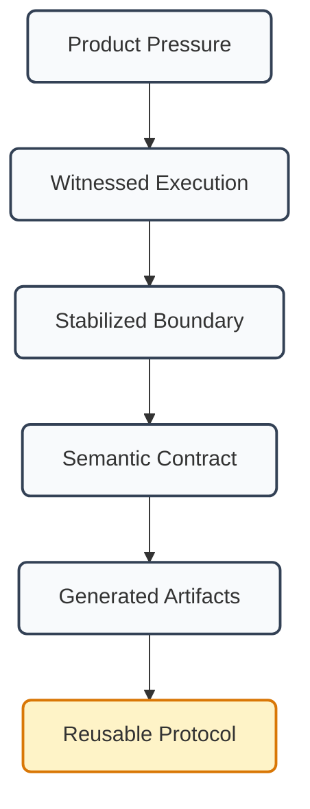
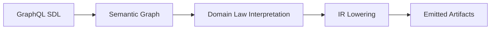
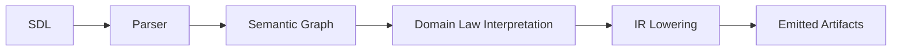
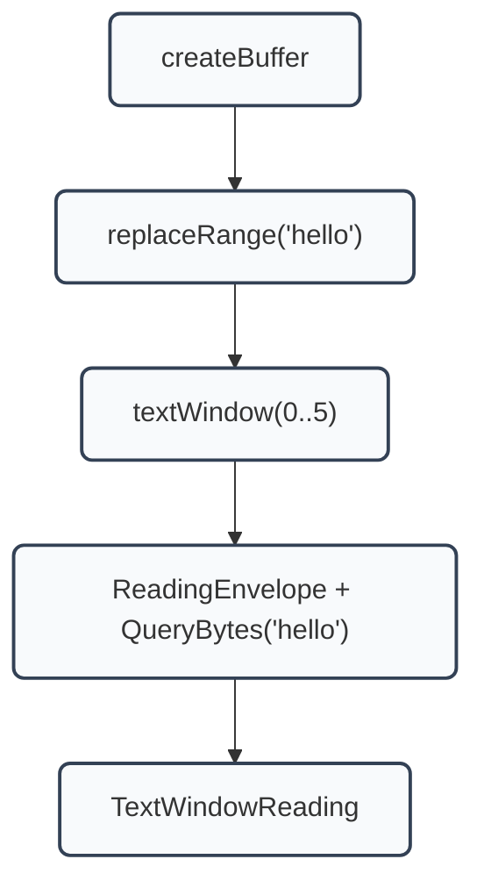

> “Things are only impossible until they’re not.”  
> — Jean-Luc Picard

<div align="center">

</div>

## What is Wesley?

**Wesley is a semantic contract compiler.**

It takes GraphQL Schema Definition Language (SDL) as its single source of truth, constructs a semantic graph, and compiles that graph into domain-specific outputs through a system of extensions.

Wesley is deliberately domain-empty. It claims no ownership over runtime law, scheduler semantics, persistence models, replication behavior, storage engines, transport protocols, or substrate truth. Those concerns belong entirely to extension modules.

**Wesley owns semantic compilation. Domains own law.**

---

## Core doctrine

Product pressure determines architectural truth.

The stack evolves in this order:


```mermaid
flowchart TD
  PP[Product Pressure] --> WE[Witnessed Execution]
  WE --> SB[Stabilized Boundary]
  SB --> SC[Semantic Contract]
  SC --> GA[Generated Artifacts]
  GA --> RP[Reusable Protocol]

  classDef default fill:#f8fafc,stroke:#334155,stroke-width:2px,rx:6,ry:6
  classDef final fill:#fef3c7,stroke:#d97706,stroke-width:2px,rx:6,ry:6

  class RP final
```

Wesley lives at the contract and boundary layers. It exists to stabilize truths that product pressure and real-world execution have already forced into existence — never before.

## The inversion

The industry generates GraphQL schemas from runtime models or application code. Wesley inverts this relationship:


```mermaid
flowchart LR
  SDL[GraphQL SDL] --> SG[Semantic Graph]
  SG --> DLI[Domain Law Interpretation]
  DLI --> IR[IR Lowering]
  IR --> EA[Emitted Artifacts]
```

One schema can now drive many outputs simultaneously:

* TypeScript contracts
* Rust bindings
* SQL schemas and migrations
* pgTAP test suites
* Runtime manifests
* Codecs
* Validators
* Observer plans
* Transport bindings

This alignment happens automatically, eliminating hand-maintained drift.

---

## Why GraphQL?

GraphQL was chosen for several deep, structural reasons.

**Additive evolution.** Schemas can grow safely without breaking existing consumers. SDL has proven to be an exceptionally stable, long-lived contract substrate.

**Ontology over layout.** GraphQL describes entities, operations, and relationships rather than dictating storage or implementation details. It is a semantic schema language first, and an API layer second.

**Behavioral extension through directives.** Directives allow additional meaning to be attached to schema elements without altering their fundamental shape. This distinction is foundational:

* Types define **shape**.
* Directives define **law**.
* Extensions define **interpretation**.

Because directives attach semantics structurally to schema locations, law becomes statically inspectable instead of being hidden inside arbitrary runtime code.

**Strong contract boundaries.** Schema-first GraphQL already treats the SDL as the single source of truth. Wesley generalizes this principle: one SDL becomes the common root for many different technical systems simultaneously.

---

## Compilation model

Wesley follows a clear, deterministic pipeline:


```mermaid
flowchart LR
  SDL[SDL] --> P[Parser]
  P --> SG[Semantic Graph]
  SG --> DLI[Domain Law Interpretation]
  DLI --> IR[IR Lowering]
  IR --> EA[Emitted Artifacts]
```

* **L1 — Semantic graph:** Normalizes types, fields, directives, and relationships.
* **L2 — Domain law:** Validates operational footprints, admissibility rules, capabilities, constraints, and interpreted semantics.
* **L3 — Emitted outputs:** Generates runtime plans, witnesses, materializations, bindings, and artifacts.

Most extensions operate entirely at L1 and L2. They remain completely unaware of L3. L3 exists strictly for runtimes with deeper execution requirements.

---

## Extension modules

A single schema can be compiled by many extensions simultaneously. Each extension walks the semantic graph independently and emits its own artifacts. Extensions do not need to know about one another.

| Extension | Responsibility |
| :--- | :--- |
| Postgres | SQL schemas, migrations, indexes, pgTAP, CRUD helpers |
| Validation | Runtime and static validation rules |
| Codec | Binary and runtime codecs |
| TypeScript | Type contracts and client bindings |
| Observer | Observation plans and projections |
| Echo | Runtime law, footprints, observation semantics |
| Continuum | Deferred protocol generation |

---

## Shape vs Law

### Shape

Shape answers: *What exists?*

It defines the structural reality of the system, covering fields, entities, relationships, arguments, and payloads. GraphQL types define shape.

```graphql
type User {
  id: ID!
  email: String!
  createdAt: String!
}
```

A Postgres extension can safely observe this shape and emit tables, migrations, indexes, and tests without any knowledge of runtime footprints or causal execution.

### Law

Law answers: *What is permitted, required, or forbidden?*

It governs execution, covering reads, writes, capabilities, footprints, admissibility rules, and operational constraints. Directives carry this law when interpreted by extensions.

```graphql
@wes_op(name: "replaceRangeAsTick")
@wes_footprint(
  reads: ["BufferWorldline", "RopeHead"]
  writes: ["BufferWorldline"]
)
```

The Postgres extension ignores these directives completely. The Echo extension interprets them as runtime law. Neither extension needs to understand the other. Wesley sees both but assigns no meaning itself — that responsibility belongs solely to the extensions.

---

## The deep end

For most use cases, Wesley is a powerful drift-eliminating code generator with a clean extension model. That alone justifies the investment.

But GraphQL has a deeper property that matters enormously here: **GraphQL operation structure is statically analyzable.**

Selections, mutations, arguments, and directives together form a fully declarative operational surface. That means the complete intent and footprint of an operation can be inspected before execution begins.

This enables extensions to:

* Declare precise operational footprints
* Validate read/write honesty
* Detect forbidden dependencies
* Compile deterministic runtime plans
* Define bounded observation apertures
* Reject dishonest operations at compile time

Arbitrary application code can lie about what it reads or writes. A GraphQL mutation structurally cannot — its footprint is an immutable part of the contract.

**If your footprint is dishonest, Wesley becomes a compile-time error.**

This is not merely code generation. It is semantic law enforcement through compilation.

The Echo extension currently pushes this capability the furthest, but it is not required for all uses of Wesley. Most Wesley users may never touch causal runtimes at all.

---

## Layer separation

| Layer | Responsibility |
| :--- | :--- |
| Product | Product pressure and user semantics |
| Runtime | Execution and substrate truth |
| Wesley | Semantic compilation |
| Extensions | Domain law |
| Protocols | Deferred publication of proven seams |

The compiler must not silently become a runtime.  
The runtime must not silently become product policy.  
The product must not manufacture substrate coordinates.

If any layer requires forbidden knowledge from another to progress, either the boundary is wrong or the witness is not ready. **That is the trap detector.**

---

## Anti-goals

Wesley is **not**:

* A runtime
* A scheduler
* A database
* A replication engine
* A GraphQL server replacement
* A universal protocol
* A transport framework
* A “one true architecture”

It is not a venue for premature abstractions to look impressive before reality demands them. Keeping Wesley narrow and focused is what allows extensions to own rich semantics without the compiler collapsing into hidden platform ideology or architectural sludge.

---

## Current grounding

The current witness:


```mermaid
flowchart TD
  A[createBuffer] --> B["replaceRange('hello')"]
  B --> C["textWindow(0..5)"]
  C --> D["ReadingEnvelope + QueryBytes('hello')"]
  D --> E[TextWindowReading]

  classDef default fill:#f8fafc,stroke:#334155,stroke-width:2px,rx:6,ry:6
```

This sequence proves a real product/runtime seam. Wesley’s job is to stabilize that seam. It did not invent it.

---

## Final doctrine

Wesley does not exist to invent universal semantics. It exists to make proven semantics reproducible, inspectable, and drift-resistant.

1. GraphQL SDL provides the semantic source contract.
2. Directives carry domain-owned law.
3. Extensions interpret that law.

The compiler stabilizes truths that product pressure has already forced into existence. **Not before.**
