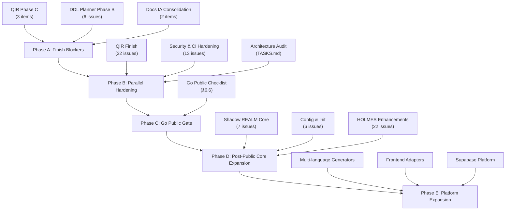

# Wesley — Master Roadmap

> Strategic source of truth for priorities, sequencing, and Alpha readiness.
> Supersedes `ROADMAP.md` and `BACKLOG.md`.

---

## 1. Scope and Governance

### What this document owns

- Strategic priorities and workstream grouping
- Dependency ordering between workstreams
- Alpha definition and blocker identification
- Active / deferred / completed categorization
- Primary home for each GitHub milestone

### What this document does not own

- Issue-level implementation state — **GitHub Issues + milestones**
- Exact task completion details — **GitHub Issues**
- Design specifications — **ADRs + specialized plan docs** (e.g., `docs/architecture/transmutations.md`)
- Milestone execution status beyond summarized state — **GitHub milestones**
- Idea capture — **`.claude/cool_ideas.md`**
- Package-level progress data — **`meta/progress.json`**

### How to update

1. When a workstream's strategic state changes (e.g., "not started" → "in flight"), update the Progress Snapshot and the workstream section.
2. When a milestone is created, closed, or reassigned, update the milestone mapping.
3. When a new planning artifact is created, add it to the Artifact Map (§9).
4. Do not hand-author percentages — derive from `meta/progress.json` or closed/total GitHub issues.

### Anti-entropy contract

- Every active GitHub milestone maps to exactly one primary workstream or to the deferred/completed section.
- Absorbed items carry provenance tags (e.g., "from BACKLOG.md", "from .claude/cool_ideas.md").
- ROADMAP.md and BACKLOG.md are superseded — strategic changes go here, not there.

---

## 2. Progress Snapshot

Data sources: `meta/progress.json` (generated 2026-03-09), GitHub milestone issue counts.

| Package / Workstream | Stage | Progress | Tracking |
| -------------------- | ----- | -------- | -------- |
| `@wesley/core` | MVP | 35% (progress.json) | Active development |
| `@wesley/cli` | MVP | 55% (progress.json) | Active development |
| `@wesley/host-node` | MVP | 25% (progress.json) | Active development |
| `@wesley/host-browser` | MVP | 50% (progress.json) | Active development |
| `@wesley/generator-js` | MVP | 25% (progress.json) | Active development |
| `@wesley/generator-supabase` | MVP | 25% (progress.json) | Active development |
| `@wesley/holmes` | MVP | 45% (progress.json) | Active development |
| `@wesley/tasks` | MVP | 25% (progress.json) | Active development |
| `@wesley/slaps` | MVP | 25% (progress.json) | Active development |
| `@wesley/host-deno` | Alpha | 50% (progress.json) | Experimental |
| `@wesley/host-bun` | Alpha | 50% (progress.json) | Experimental |
| `@wesley/scaffold-multitenant` | Prototype | 50% (progress.json) | Too soon |
| `@wesley/stack-supabase-nextjs` | Prototype | 50% (progress.json) | Too soon |

**Overall:** MVP stage, 35% toward Alpha.

---

## 3. Alpha Definition

Alpha = the project is usable, testable, and open for external contributors.

### Alpha checklist

- [ ] **QIR complete**: translator, pgTAP smoke, real EXPLAIN snapshots
- [ ] **DDL full lifecycle**: backfill/switch/contract SQL, drift detection, `plan --explain`
- [ ] **CI hardened**: all test suites in CI, required checks on default branch
- [ ] **Public-ready**: README explains problem/architecture/install/quickstart, contributor guide exists
- [ ] **Config/Init**: `wesley.config` generation, `wesley init` wizard functional
- [ ] **No blocker-grade security issues open**

### Alpha non-goals

- Multi-language generators (Prisma, Drizzle, etc.)
- Frontend adapter scaffolding
- Supabase platform features (Storage, Realtime, Edge Functions)
- Shadow REALM production readiness
- HOLMES merge projection
- Echo post-E4 work

---

## 4. Alpha Blockers Now

These workstreams must complete before Alpha can ship.

### QIR Phase C — 3 remaining items

- [ ] Translator: map GraphQL operations → QIR plans (selections, joins, filters, order, pagination, nested lists)
- [ ] pgTAP smoke tests for emitted ops
- [ ] Real EXPLAIN snapshots (branch only has mock mode)

Tracking: [#160](https://github.com/flyingrobots/wesley/issues/160), [#159](https://github.com/flyingrobots/wesley/issues/159)

### DDL Planner Phase B — 6 open issues

- [ ] Backfill/switch/contract SQL emission (per-phase files for rehearsal)
- [ ] Drift detection between live schema and Wesley-managed state
- [ ] `wesley plan --explain` coverage for new phases

Tracking: [Milestone #7](https://github.com/flyingrobots/wesley/milestone/7) (0/6)

### Docs IA Consolidation — 2 in-flight items

- [ ] Finish IA reorganization: Concepts / How-To / Reference / Internals / Roadmap
- [ ] Prune remaining dead links

---

## 5. Critical Path to Alpha

### Phase A — Finish blockers

Complete QIR Phase C, DDL Planner Phase B, and Docs IA Consolidation. These are serial dependencies — the translator must land before QIR Finish can absorb the remaining 32 issues.

### Phase B — Parallel hardening

QIR Finish (32 issues), Security & CI Hardening (13 issues), and architecture audit remainders run in parallel. All must be green before the Go Public gate.

### Phase C — Go Public gate

A pass/fail checklist (§6.6). The repository flips from private to public.

### Phase D — Post-public core expansion

Shadow REALM Core, Config & Init, and HOLMES Scoring Enhancements run in parallel after the project is public. These deepen the product without gating external access.

### Phase E — Platform expansion

Multi-language generators, frontend adapters, Supabase platform, adapter/generator demos. These extend Wesley's reach but are not Alpha requirements.

---

## 6. Active Workstreams

Each workstream uses a uniform template:
**Objective** | **Current state** | **Milestones** | **Dependencies** | **Tracking** | **Absorbed items** | **Exit condition**

---

### 6.1 Core Compiler (QIR + DDL)

**Objective:** Complete the query-to-SQL pipeline and migration planner.

**Current state:** QIR Phase C is 3 items from done (translator, pgTAP, real EXPLAIN). DDL Planner Phase B has not started. QIR Finish and Shadow REALM Core are queued behind Phase C.

**Milestones:**

| Milestone | Issues | State |
| --------- | ------ | ----- |
| QIR Phase C | 1/4 closed | in flight |
| QIR Finish | 1/33 closed | not started (blocked on Phase C) |
| DDL Planner Phase B | 0/6 | not started |
| Shadow REALM Core | 0/7 | not started |

**Dependencies:** QIR Phase C → QIR Finish. DDL Planner Phase B is independent.

**Tracking:** GitHub milestones #2, #16, #7, #3

**Absorbed items:**
- Consolidate RESERVED keyword set *(from BACKLOG.md — "Do First")*
- Schema-aware `search_path` generation *(from BACKLOG.md — "Do Next")*
- QIR `schemas/qir.schema.json` root self-reference *(from BACKLOG.md — "Park")*

**Exit condition:** All four milestones closed. `wesley compile --ops` produces deployable SQL from any valid SDL + ops manifest.

---

### 6.2 Observability & Trust (HOLMES + Certs)

**Objective:** Strengthen confidence scoring, evidence tracking, and merge projection.

**Current state:** HOLMES Scoring Enhancements milestone is open with 22 issues. Merge projection plan is documented but not started.

**Milestones:**

| Milestone | Issues | State |
| --------- | ------ | ----- |
| HOLMES Scoring Enhancements | 2/24 closed | not started |

**Dependencies:** None blocking Alpha.

**Tracking:** GitHub milestone #4; `docs/holmes-merge-projection-plan.md` (implementation plan for merge projection, 4 phases)

**Absorbed items:**
- Negative-path cert tests: wrong key type, missing key, corrupt SHIPME format *(from BACKLOG.md — "Do Next")*
- "Schema surface" integration test: validate all JSON artifacts against schemas *(from BACKLOG.md — "Do Next")*
- Watson schema-twin verification *(from .claude/cool_ideas.md — deferred, speculative)*

**Exit condition:** HOLMES milestone closed. Moriarty reports are actionable and trust scores are derived from evidence.

---

### 6.3 Developer Experience (CLI + Config + Docs)

**Objective:** Make Wesley installable, configurable, and well-documented for external users.

**Current state:** Config & Init has not started. Docs & Process Polish is active (4/29 closed). Wesley in the Browser is active (5/30 closed). Docs IA Consolidation has 2 in-flight items.

**Milestones:**

| Milestone | Issues | State |
| --------- | ------ | ----- |
| Config & Init | 0/6 | not started |
| Docs & Process Polish | 4/29 closed | in flight |
| Wesley in the Browser | 5/30 closed | in flight |

**Dependencies:** Docs IA Consolidation is an Alpha blocker.

**Tracking:** GitHub milestones #5, #14, #15

**Absorbed items:** *(none from BACKLOG.md or cool_ideas.md beyond what's already tracked)*

**Exit condition:** `wesley init` works. Docs are link-clean and organized. Browser playground is stable.

---

### 6.4 Platform & Ecosystem

**Objective:** Extend Wesley to multiple ORMs, frontend frameworks, and Supabase platform features.

**Current state:** All milestones are not started. These are post-Alpha.

**Milestones:**

| Milestone | Issues | State |
| --------- | ------ | ----- |
| Multi-language Generators | 0/10 | not started |
| Frontend Adapters | 0/4 | not started |
| Supabase Platform | 0/4 | not started |
| Adapter Demos | 0/4 | not started |
| Generator Demos | 0/4 | not started |

**Dependencies:** Requires stable QIR and DDL pipeline (§6.1).

**Tracking:** GitHub milestones #10, #8, #6, #9, #11

**Exit condition:** At least two generators and two adapters ship with working demos.

---

### 6.5 Infrastructure & Quality

**Objective:** Harden CI, address architecture debt, and shore up test coverage.

**Current state:** Security & CI Hardening has 13 open issues. DevOps Scaffolding has 2 open issues. Architecture audit from `TASKS.md` has several open remainders.

**Milestones:**

| Milestone | Issues | State |
| --------- | ------ | ----- |
| Security & CI Hardening | 0/13 | not started |
| DevOps Scaffolding | 0/2 | not started |

**Architecture audit remainders** (tracked in `TASKS.md`):

- [ ] ARC-2: Migrate test files to import from `@wesley/test-fixtures` (package created, migration pending)
- [ ] ARC-2: Add tests for untested packages (`generator-js`, `host-bun`, `scaffold-multitenant`, `slaps`)
- [ ] ARC-3: Define reusable `ValidationError`, `ConflictError`, `ResourceError` subclasses
- [ ] ARC-3: Extract domain event lifecycle boilerplate into a factory
- [ ] ARC-4: Add test — dropping a `.mjs` file in `commands/` auto-registers
- [ ] SRP decomposition: `ConcurrentSafetyAnalyzer` (1,081 lines), `BackpressureController` (793 lines), `RepairGenerator` (831 lines), `SafetyValidator` (782 lines), `DifferentialValidator` (634 lines)
- [ ] Dependency inversion: `EventEmitter` port extraction, `RepairGenerator` DI, `GeneratorPlugin.generate()` return shape normalization
- [ ] Test coverage gaps: `generator-js` (0 tests), `host-bun` (0 tests), `scaffold-multitenant` (0 tests), `slaps` (0 tests), `host-browser` (partial)
- [ ] Dead dependency: `@wesley/generator-echo` declares `@wesley/host-node` but no imports found

**Absorbed items:**
- Vendor Bats plugins into `test/vendor/` *(from BACKLOG.md — "Do First")*
- Schema twin drift CI check *(from BACKLOG.md — "Do First")*
- `--strict-ident` integration test for PG16 reserved keywords *(from BACKLOG.md — "Do Next")*
- Ajv → compiled validators at build time *(from BACKLOG.md — "Park")*
- Shared `generateRunId` utility *(from .claude/cool_ideas.md)*

**Tracking:** GitHub milestones #13, #12; `TASKS.md` (architecture audit)

**Exit condition:** CI passes all test suites. No security advisories. Architecture audit backlog is triaged.

---

### 6.6 Go Public

Explicit pass/fail checklist — all items must be green before flipping the repository from private to public.

- [ ] README explains problem, architecture, install, and quickstart
- [ ] Contributor guide exists (`CONTRIBUTING.md`)
- [ ] License and legal posture reviewed (Apache 2.0 + `NOTICE`)
- [ ] CI checks required for default branch
- [ ] Branch protections configured
- [ ] No-milestone issues triaged, assigned, deferred, or closed
- [ ] Public docs are link-clean
- [ ] No blocker-grade security issues open
- [ ] Issue templates and labels are minimally sane

**Dependencies:** Phase A blockers (§4) and Phase B hardening (§5) must complete first.

**Tracking:** Not a GitHub milestone — tracked here as a gate.

---

## 7. Deferred / Speculative

Each item has a reason for deferral.

| Item | Reason | Provenance |
| ---- | ------ | ---------- |
| SHA-256 → BLAKE3 migration | Breaking change to hash chains — coordinated across Wesley + Echo repos. Post-Alpha. | ROADMAP.md |
| Cross-platform CI matrix (Linux/macOS/Windows) | Nice-to-have after Go Public. Requires musl/glibc golden-vector verification. | ROADMAP.md |
| `echo-ttd-gen` Rust crate | Blocked on TTD protocol stabilization. May fold into `echo-wesley-gen`. | ROADMAP.md |
| Supabase/PG target for Echo | PG-backed storage for Echo schemas — speculative. | ROADMAP.md |
| RFC #365 — provenance | Blocked on design clarity. | GitHub |
| RFC #366 — SDL loop | Blocked on design clarity. | GitHub |
| Cross-language codec fuzzing | Post-Alpha nice-to-have. Property-based Rust↔TS round-trip tests. | .claude/cool_ideas.md |
| ABI codec versioning via schema hash | Speculative. Only relevant if WASM ABI types evolve. | .claude/cool_ideas.md |
| "Wesley Explain" visual mode | Blocked on real EXPLAIN snapshots (currently mock-only). | BACKLOG.md |
| `wesley explain` via T.A.S.K.S. DAGs | Blocked on transmutation wiring (Phase 0c). | .claude/cool_ideas.md |
| Reconcile `WesleyIR.schema.ts` with runtime IR | Completed — IR schema reconciliation landed (T-0 through T-13). | .claude/cool_ideas.md (stale) |
| Unify generator input signatures | Planned as Phase 0a of transmutations redesign. | .claude/cool_ideas.md |

---

## 8. Completed Milestones

Compact archive — name, completion state, link, one-line significance.

| Milestone | State | Reference | Significance |
| --------- | ----- | --------- | ------------ |
| Echo E0 — Plugin Pipeline | Complete | CHANGELOG.md | `GeneratorPlugin` contract, `ArtifactWriter`, plugin discovery |
| Echo E1 — Boundary Grammar | Complete | CHANGELOG.md | Canonical SDL, schema hash, hash chains, `wesley diff` |
| Echo E2a — Canonical Encodings | Complete | CHANGELOG.md | Raw LE codec (Rust + TS), layout hashes |
| Echo E2b — Core Type Schemas | Complete | CHANGELOG.md | Echo storage types in Wesley SDL |
| Echo E2c — Guarded Views | Complete | CHANGELOG.md | `@wes_view` directive, read/write view codegen |
| Echo E2d — Cross-Platform Determinism | Complete | CHANGELOG.md | 44 golden vectors across 12 fixture files |
| Echo E3 — @wes_join Directive | Complete | CHANGELOG.md | Join strategies (union/max/lww), Rust `JoinFn` codegen |
| Echo E4 — Privacy Types | Complete | CHANGELOG.md | Privacy type canonical encoding verification |
| Alpha Playground | Complete (343/343) | CHANGELOG.md | Browser-based "Try Wesley" with PGLite |
| TTD Protocol Compiler | Complete | `docs/plans/ttd-protocol-compiler.md` | TTD protocol compilation pipeline |
| WES-001 — Per-Op Var/Result Schema | Complete | `docs/plans/james-website-integration/` | Zod schemas for every operation |
| WES-002 — TS Runtime Client/Pump | Complete | `docs/plans/james-website-integration/` | Self-contained TypeScript client with dispatch/query APIs |
| WES-003 — Contract Versioning | Complete | `docs/plans/james-website-integration/` | `contract_version` field, deterministic output tests |
| WES-004 — One-Pass Codegen Profile | Complete | `docs/plans/james-website-integration/` | Atomic schema → IR/Rust/TS generation |
| WES-005 — Unify generator-vue | Complete | `docs/plans/james-website-integration/` | `VuePlugin` canonical entrypoint |
| IR Schema Reconciliation (T-0 – T-13) | Complete | `TASKS.md` | Parser emits `WesleyIR.schema.ts` shape, shim removed |
| ARC-1 — Duplicate Generators | Complete | `TASKS.md` | Removed dead supabase generator copies |
| ARC-4 — Command Auto-Discovery | Complete | `TASKS.md` | CLI commands auto-register from `commands/` directory |
| WASM ABI Codec Generation | Complete | CHANGELOG.md | Deterministic binary encode/decode for Echo WASM FFI |

---

## 9. Artifact Map

Reference table for all planning documents.

| Artifact | Purpose | Status |
| -------- | ------- | ------ |
| `ROADMAP_2.md` | Master strategic roadmap | **Active** — canonical |
| `ROADMAP.md` | Original roadmap | **Superseded** by ROADMAP_2.md |
| `BACKLOG.md` | PR review and retrospective items | **Absorbed** into ROADMAP_2.md |
| `TASKS.md` | Architecture audit findings and IR reconciliation | **Active** — specialized audit doc |
| `CHANGELOG.md` | Version history | **Active** |
| `meta/progress.json` | Per-package progress data | **Active** — data source for §2 |
| `docs/holmes-merge-projection-plan.md` | HOLMES merge projection design | **Active** — implementation plan |
| `docs/plans/ttd-protocol-compiler.md` | TTD protocol compiler plan | **Complete** |
| `docs/plans/james-website-integration/` | WES-001 through WES-005 task specs | **Complete** |
| `docs/architecture/transmutations.md` | Transmutations architecture spec | **Active** — design doc |
| `docs/drafts/Codex-Ideas.md` | Think-piece / brainstorming | **Active** — not a plan doc |
| `.claude/cool_ideas.md` | Speculative ideas capture | **Active** — idea space |
| `.claude/bad_code.md` | Code smell journal | **Active** — all current items resolved |
| `docs/site/roadmap.md` | Public-facing roadmap page | **Active** — points to ROADMAP_2.md |
