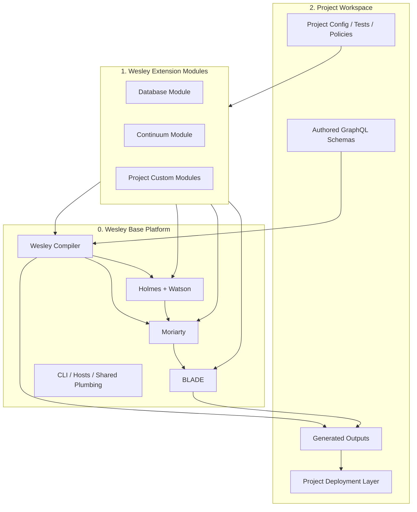

# ARCHITECTURE

Wesley is a schema-first compiler-and-assurance platform.

The clean picture is:

- **0. Wesley Base Platform**
- **1. Wesley Extension Modules**
- **2. Project Workspace**

This note is the high-level map of how those pieces fit together.

For the noun-by-noun version, use [WESLEY_GLOSSARY.md](./WESLEY_GLOSSARY.md).
For the stage-by-stage bundle flow, use
[design/wesley-pipeline.md](./design/wesley-pipeline.md).

## System Shape



The important responsibility cut is:

- Wesley base platform stays project-agnostic
- modules add domain meaning through explicit hooks
- project workspaces own authored schemas, local tests/policies, and deployment

## The Three Layers

### 0. Wesley Base Platform

The base platform contains the generic engines and entry points.

It includes:

- **Wesley**
  - GraphQL parsing
  - directive handling
  - IR lowering
  - generator/plugin orchestration
  - artifact emission
- **Holmes + Watson**
  - verification
  - witness/evidence
  - trust and consistency checks
- **Moriarty**
  - policy
  - judgment
  - prediction and counterfactual analysis
- **BLADE**
  - certification and release-readiness orchestration
- **CLI / hosts / plumbing**
  - node/browser/bun/deno host surfaces
  - command runners
  - runtime helpers

The base platform should not know project semantics directly.

### 1. Wesley Extension Modules

Modules extend the base platform with domain or ecosystem meaning.

A module may add:

- custom GraphQL directives
- generator plugins
- witness scopes
- judgment and policy rules
- bundle or projection behavior
- BLADE environment setup or extra test surfaces

Examples:

- **Database module**
  - Postgres submodule
  - Supabase-facing generation and verification
- **Continuum module**
  - Continuum-owned families and projections
  - Echo-facing submodule
  - TTD-facing submodule
- **Project custom modules**
  - repo-specific directives, generators, witness scopes, or gates

Modules should extend the platform through explicit hooks, not by contaminating
the base platform with domain-specific imports.

### 2. Project Workspace

This is where an actual user lives.

A project workspace contains:

- authored schemas
- project config
- project-specific tests and policies
- generated outputs
- local custom modules
- deployment and runtime layers

Wesley should help the project become deployable.
Wesley should **not** own the deployment step itself.

## The Bundle Pipeline

The clean stage model is:

```text
Wesley -> Holmes -> Watson -> Moriarty -> BLADE
```

The more honest operational model is:

```text
WesleyOutputBundle
  -> Holmes
  -> Watson

HolmesOutputBundle + WatsonOutputBundle + history/runtime/counterfactual context
  -> Moriarty

WesleyOutputBundle + HolmesOutputBundle + WatsonOutputBundle + MoriartyOutputBundle
+ project test/environment extensions
  -> BLADE
```

This means:

- **Wesley** compiles authored contracts into artifact bundles
- **Holmes** investigates structural completeness, evidence, and risk surfaces
- **Watson** verifies the evidence chain itself
- **Moriarty** produces judgment and prediction from evidence plus context
- **BLADE** turns all of that into a tested, certified, deployable bundle or failure bundle

BLADE stops short of deployment.
The project or operator layer deploys.

## Compiler And Assurance Surfaces

Wesley's important internal surfaces are:

1. **Authored source**
   - sovereign GraphQL SDL
2. **Lowered IR**
   - Wesley's admitted internal reading of the authored schema
3. **Emitted artifact family**
   - generated files for one compile leg
4. **Realization shell**
   - packaging shell around emitted artifacts
5. **Witness / evidence / judgment outputs**
   - bounded claims from Holmes, Watson, Moriarty, and BLADE

This distinction matters because Wesley must stay honest about what it proves.

For the current doctrine behind authored source, realization shells, and bounded
witness claims, use
[design/0004-realization-admission-and-witness/realization-admission-and-witness.md](./design/0004-realization-admission-and-witness/realization-admission-and-witness.md).

## Current Honest Posture

Wesley is still carrying multiple historical identities:

- database-change compiler/toolchain
- Continuum contract compiler/toolchain
- verification and judgment tooling

The current architecture should be read as:

- one base platform
- multiple extension modules
- many possible project workspaces

That is cleaner than treating one product lane as if it were the entire system.

## Practical Rule

When you are unsure where something belongs, ask:

1. Is this compiler truth?
2. Is this generic assurance/tooling?
3. Is this domain/module meaning?
4. Is this project/workspace policy?
5. Is this deployment/runtime behavior that Wesley should stop short of?

That usually tells you which layer owns the thing.

---
**The goal is inevitably. Wesley compiles, verifies, judges, and certifies; projects decide what to ship.**
