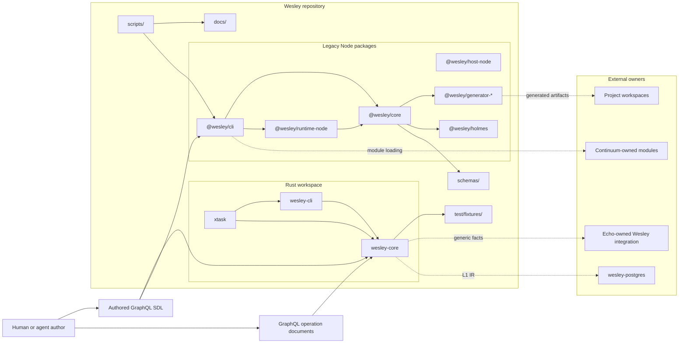
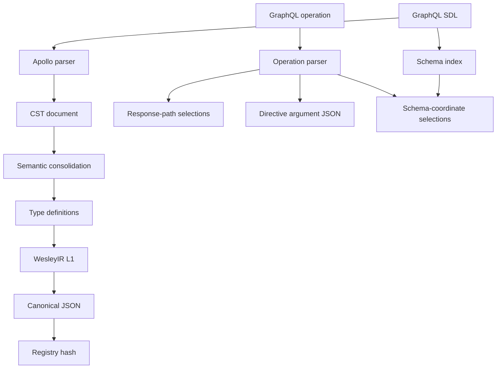
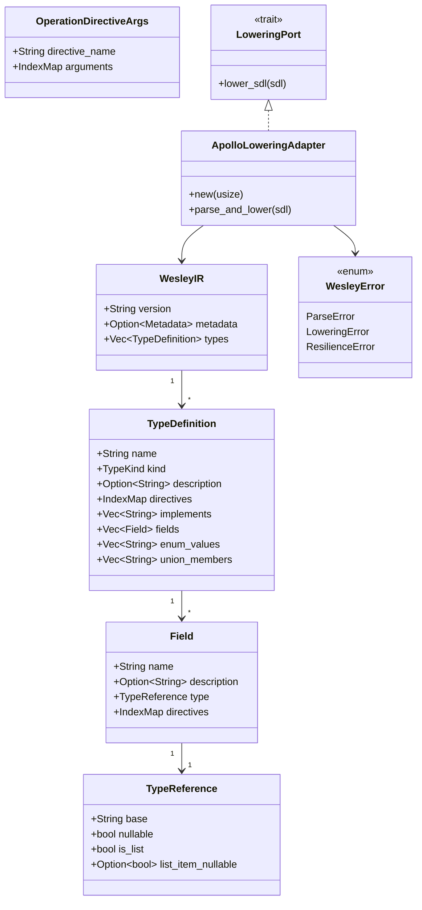
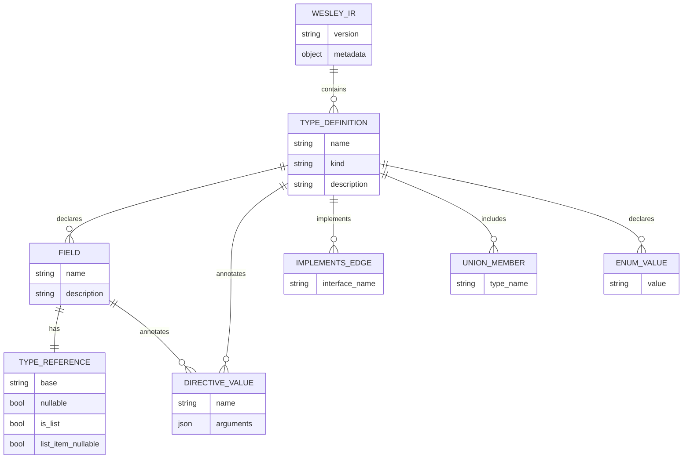
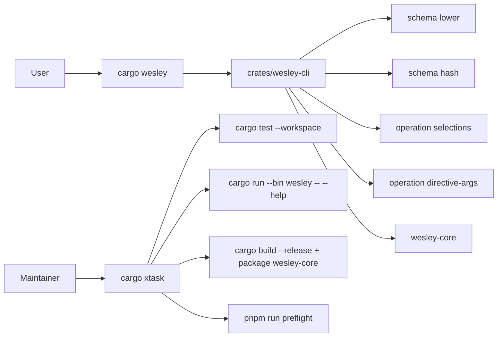
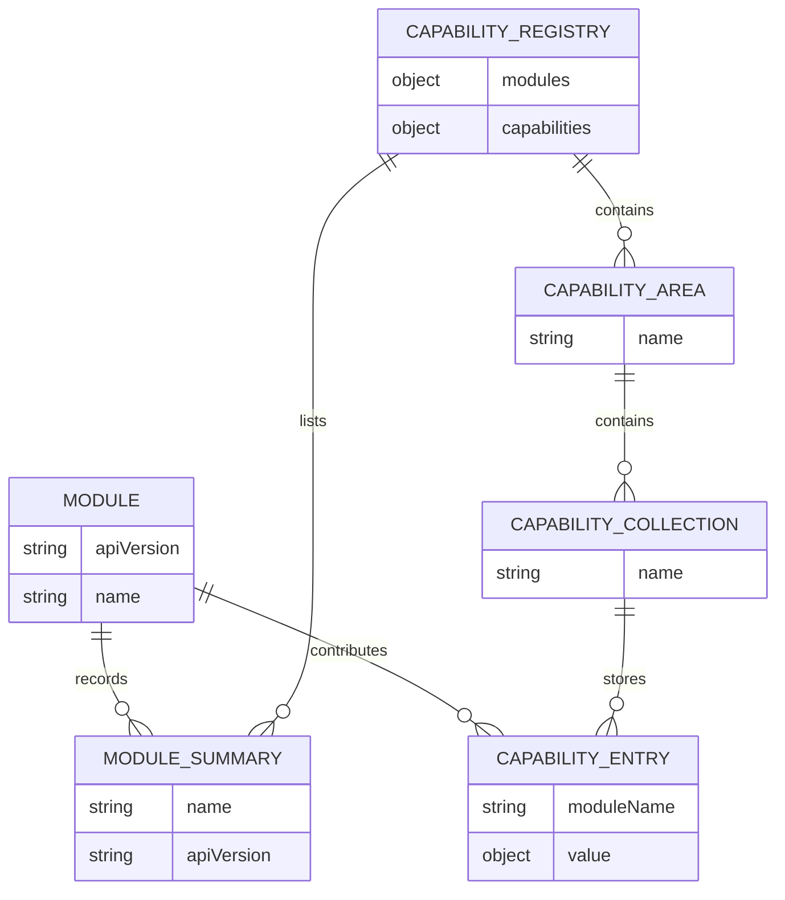
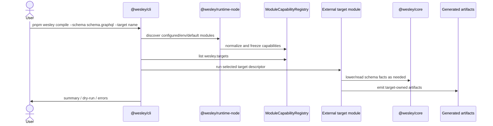
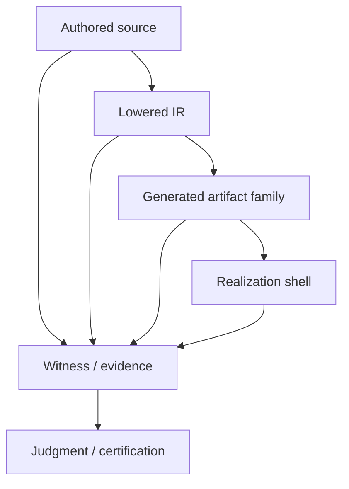
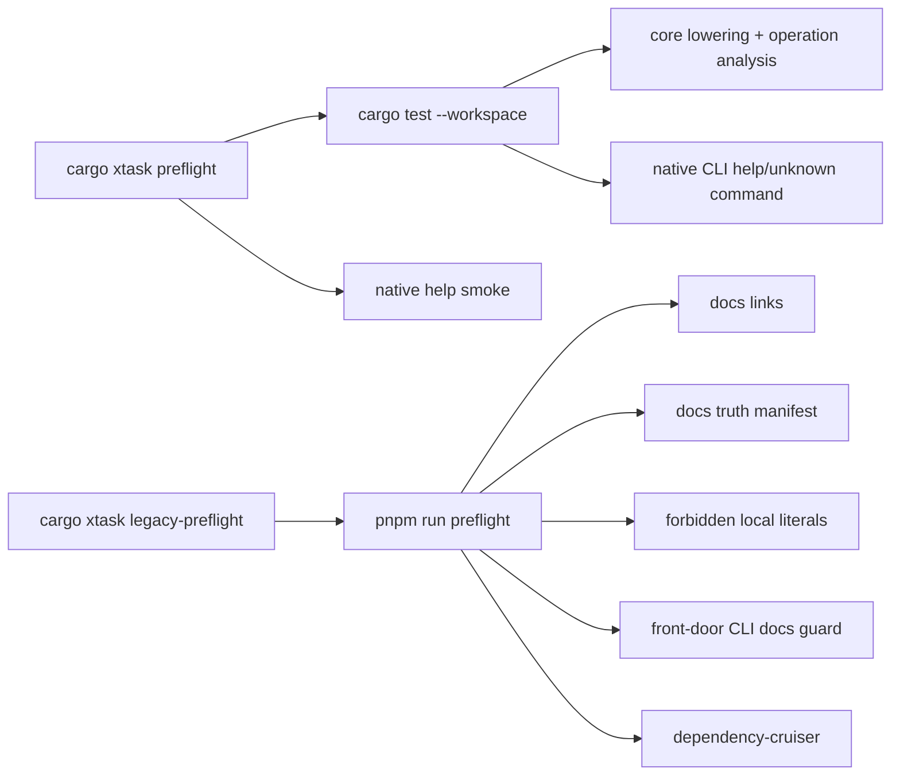

# ARCHITECTURE
<!-- docs-truth: status=experimental owner=@flyingrobots -->

Wesley is a schema-first compiler kernel and assurance toolchain.

The current architecture is intentionally narrower than older product-era docs:

```text
authored GraphQL -> Wesley core facts -> module-owned targets / evidence / hosts
```

Wesley owns compiler truth. External modules and sibling repos own target
semantics, runtime policy, database behavior, Echo behavior, and deployment.

If you are trying to figure out where to start, read
[ENTRYPOINTS.md](./ENTRYPOINTS.md) first. This document is the deeper structural
map; the entrypoint map is the short answer to "which Wesley do I run or edit?"

For the noun-by-noun reference, use [WESLEY_GLOSSARY.md](./WESLEY_GLOSSARY.md).
For current direction and active tensions, use [BEARING.md](./BEARING.md).
For work doctrine, use [METHOD.md](./METHOD.md).

## Where This Leaves Us

The repo is now split into three practical layers:

1. **Rust kernel / brain**: `crates/wesley-core` is the emerging authoritative
   compiler library. It lowers GraphQL SDL into L1 IR and exposes generic
   operation facts.
2. **Native CLI / body**: `crates/wesley-cli` is the Rust product command. It
   exposes schema lowering, schema hashing, operation selection analysis, and
   directive argument extraction from the Rust core.
3. **Legacy Node tooling**: `packages/` still carries the historical Node
   compiler, module runtime, generators, hosts, Holmes tooling, and fixture
   packages. These remain useful, but they are no longer the center of gravity
   for core compiler truth.

The root `package.json` keeps the legacy Node workspace installable. It is not
the Wesley product entry point.

The most recent boundary cleanup removed root-level footprint checking from
Wesley. `wesley-core` now exposes generic operation selection and directive
argument extraction. Echo-specific footprint honesty belongs in Echo-owned
tooling, not in generic Wesley.

## System Context



The dashed arrows are intentional boundaries. Wesley can produce facts and
artifacts that external systems consume, but it should not absorb their runtime
semantics.

## Repo Tour

| Path | Role |
| --- | --- |
| `crates/wesley-core/` | Rust compiler kernel. Parses/lower SDL to domain-empty L1 IR and analyzes operation documents. |
| `crates/wesley-cli/` | Native Rust `wesley` binary for schema and operation facts. |
| `xtask/` | Rust repository automation: tests, native preflight, release check, legacy preflight bridge. |
| `packages/wesley-core/` | Historical JS core: domain/application/port modules, module capabilities, generation pipeline, hashes, runtime-event helpers. |
| `packages/wesley-cli/` | Historical JS CLI command framework and module-aware command surfaces. |
| `packages/wesley-host-node/` | Node executable wrapper around the JS CLI and runtime adapters. |
| `packages/wesley-runtime-node/` | Shared Node module discovery/loading and host utilities. |
| `packages/wesley-generator-js/` | TypeScript/Zod/model generation surface. |
| `packages/wesley-generator-vue/` | Experimental Vue-facing generator surface. |
| `packages/wesley-holmes/` | Evidence, verification, counterfactual, Holmes/Moriarty-era tooling. |
| `packages/wesley-host-browser/`, `wesley-host-bun/`, `wesley-host-deno/` | Experimental host adapters. |
| `packages/wesley-tasks/` | Task planning/orchestration utilities. |
| `packages/wesley-test-fixtures/` | Shared test fixtures and schema builders for package tests. |
| `schemas/` | JSON schemas and generic directive/schema assets used by tooling and tests. |
| `test/fixtures/` | GraphQL fixtures, Rust L1 goldens, package examples, and reference schemas. |
| `scripts/` | Preflight, docs truth, docs link, fixture generation, smoke, and CI helper scripts. |
| `docs/` | Operator docs, architecture, design packets, backlog, audits, specs, and method docs. |
| `.github/workflows/` | CI workflows for Rust, packages, docs, hosts, security, and progress badges. |

Some directories still contain extraction residue. In particular,
`packages/wesley-generator-echo/` exists on disk but is not an active tracked
source package in this architecture. Echo-owned work should happen in Echo.

## Rust Kernel

`crates/wesley-core` is the cleanest current source of compiler truth.

It has three internal areas:

| Area | Files | Responsibility |
| --- | --- | --- |
| Domain | `src/domain/*` | IR structs, operation-analysis structs, error types, hashes. |
| Ports | `src/ports/*` | Host-neutral traits such as `LoweringPort`. |
| Adapters | `src/adapters/*` | Concrete parser/lowering implementation, currently Apollo Parser. |

Public Rust APIs currently include:

- `lower_schema_sdl(sdl) -> WesleyIR`
- `resolve_operation_selections(operation_sdl) -> Vec<String>`
- `resolve_operation_selections_with_schema(schema_sdl, operation_sdl) -> Vec<String>`
- `extract_operation_directive_args(operation_sdl, directive_name) -> Vec<OperationDirectiveArgs>`
- `compute_registry_hash(ir) -> String`
- `compute_content_hash(content) -> String`
- `to_canonical_json(value) -> String`

### Rust Flow



L1 IR is domain-empty. It knows GraphQL types, fields, directives, interfaces,
unions, enum values, input objects, nullability, lists, and source-level
directive data. It does not know tables, Echo graph nodes, migrations, routes,
deployments, or runtime policy.

### Rust Class Diagram



### L1 IR Entity Relationship



## Native CLI And Xtask

The native CLI exposes Rust-backed compiler facts:



`cargo xtask preflight` is the current native health check. It runs Rust
workspace tests and verifies the native CLI help surface. `cargo xtask
legacy-preflight` intentionally crosses into Node package tooling because docs,
legacy packages, and module examples still need that coverage.

## Legacy Node Tooling

The Node packages are still active for legacy compiler workflows, module
loading, generated TypeScript/Zod output, host experiments, and Holmes-era
assurance tooling. They are not the preferred home for new compiler-kernel
truth.

The central JS split is:

- `@wesley/core`: package-era domain/application/ports layer.
- `@wesley/cli`: command framework and module-aware CLI commands.
- `@wesley/runtime-node`: module discovery/loading and Node host utilities.
- `@wesley/host-node`: executable wrapper for the JS CLI.
- generator packages: output-specific code generation.
- Holmes/Watson/Moriarty/BLADE-era packages and docs: generic assurance work,
  still in extraction and cleanup.

### Module Capability Model

External modules are the JS-side extension seam. A module has an API version,
a name, optional initialization, optional CLI command registration, and optional
structured capabilities.

Capability areas are currently:

- `wesley`: directives, targets, generators, bundle profiles, realization verifiers.
- `holmes`: scopes, checks, evidence collectors, counterfactual providers.
- `watson`: verifiers, audit profiles.
- `moriarty`: policy profiles, judgment profiles, predictors.
- `blade`: scenarios, fixtures, environment setup, tests, gates, certification profiles.
- `cli`: commands.



### Module-Aware Compile Flow



This is still a useful surface. The architectural rule is that target meaning
comes from the module, not from generic Wesley.

## Assurance And Evidence

Wesley keeps separate layers for authored source, compiler facts, generated
artifacts, and bounded evidence:



The key invariant is not "the generated files are true." The invariant is:

```text
generated files are derived from named authored source through a recorded tool path
```

Witness and evidence outputs are bounded claims. They should say exactly what
was checked and should not pretend to be runtime observation unless that is the
explicit witness scope.

## What Wesley Does Today

Wesley currently does these things in this repo:

- Lowers GraphQL SDL into a Rust L1 IR with consolidated type definitions.
- Preserves generic directives as JSON values in type and field IR.
- Computes canonical JSON and SHA-256 registry/content hashes.
- Resolves operation selection paths in response-path mode.
- Resolves operation selection paths in schema-coordinate mode.
- Extracts operation directive arguments by directive name.
- Provides a native Rust workspace preflight and release check.
- Maintains package-era JS compile/generate/module/host tooling.
- Maintains docs, schemas, fixtures, CI scripts, and design packets around the
  broader compiler-and-assurance system.

## What Wesley Does Not Own

Wesley does not own these semantics:

- Echo rewrite scheduling or footprint honesty enforcement.
- PostgreSQL migrations, SQL lowering, RLS policy, or database deployment.
- Continuum product/runtime behavior.
- Project-specific deployment.
- Agent repository aperture policy.
- Host-specific runtime trust decisions beyond its own module-loading guards.

Those systems may consume Wesley facts. They should not become Wesley core.

## Test And Evidence Surfaces



Use native checks for Rust-core work. Use legacy preflight when changing docs,
package boundaries, JS command examples, or module-loading behavior.

## Ownership Rules

1. If it changes GraphQL parsing, L1 IR, operation analysis, canonical JSON, or
   compiler hashes, it belongs in `crates/wesley-core`.
2. If it is a native user command, add it only when it is backed by pure
   `wesley-core` behavior and documented as current.
3. If it is repository automation, put it in `xtask` or a script called by
   `xtask`.
4. If it is target semantics, make it a module or put it in the owning external
   repo.
5. If it is Echo, PostgreSQL, Continuum, or app runtime meaning, keep it outside
   generic Wesley.
6. If docs describe old product surfaces, mark them as historical/extraction
   context or remove the current-surface wording.

## North Star

Wesley is becoming a Rust library that can be embedded by other systems while
still preserving package-era module workflows during the transition.

The durable shape is:

```text
Rust core: deterministic compiler facts
Native CLI: small local executable surface
WASM / bindings: future portable capability boundary
Node packages: legacy host and module tooling during extraction
External modules: target and domain meaning
Project workspaces: authored schemas, policy, runtime, deployment
```

That shape keeps the compiler honest. Wesley says what the schema and operation
mean. Other systems decide what those facts imply for their runtime.

---
**The goal is inevitably. Wesley owns compiler truth; target worlds own their own meaning.**
