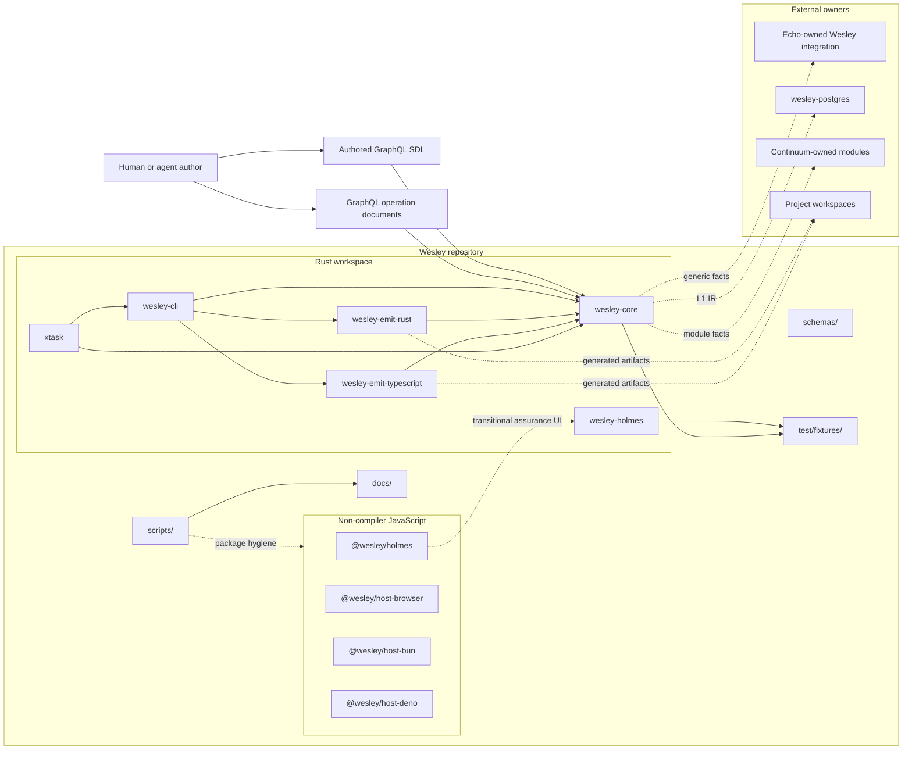
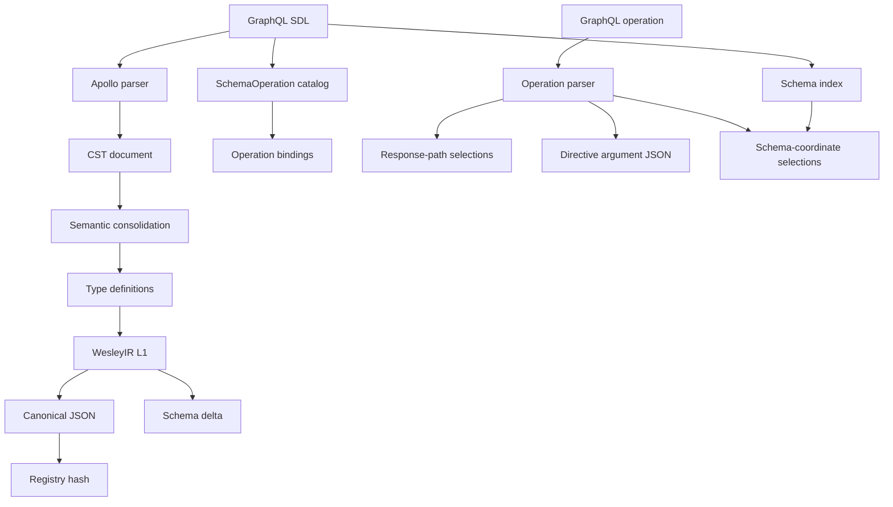
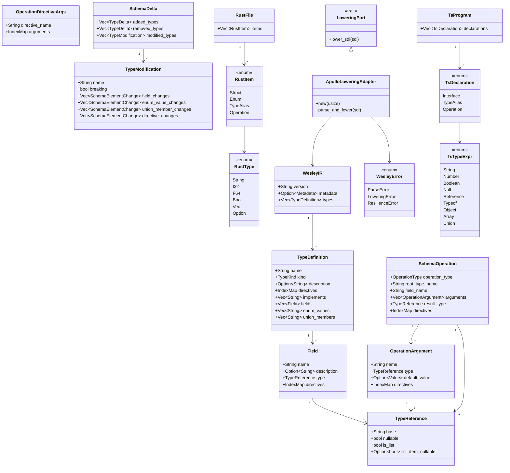
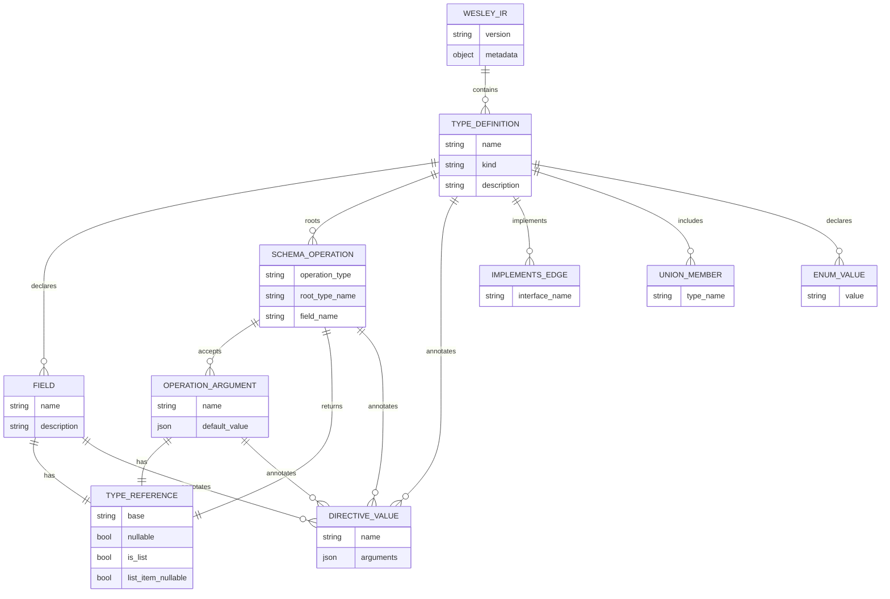
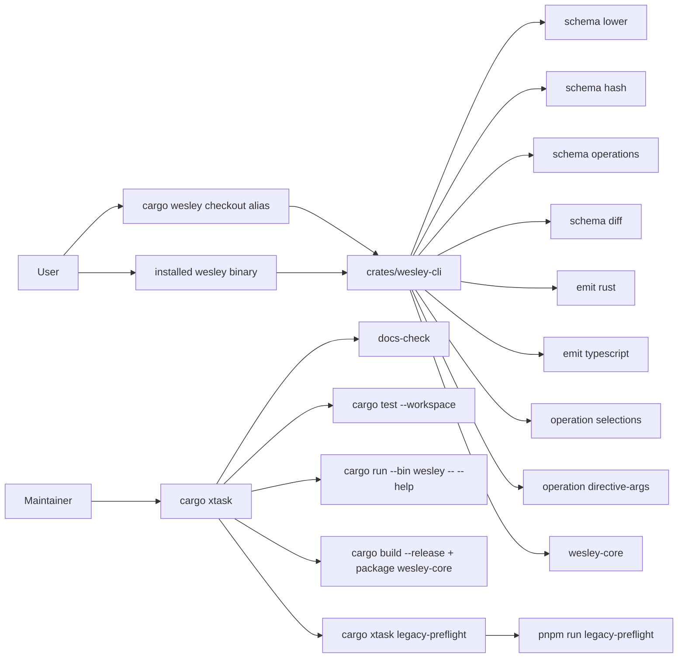
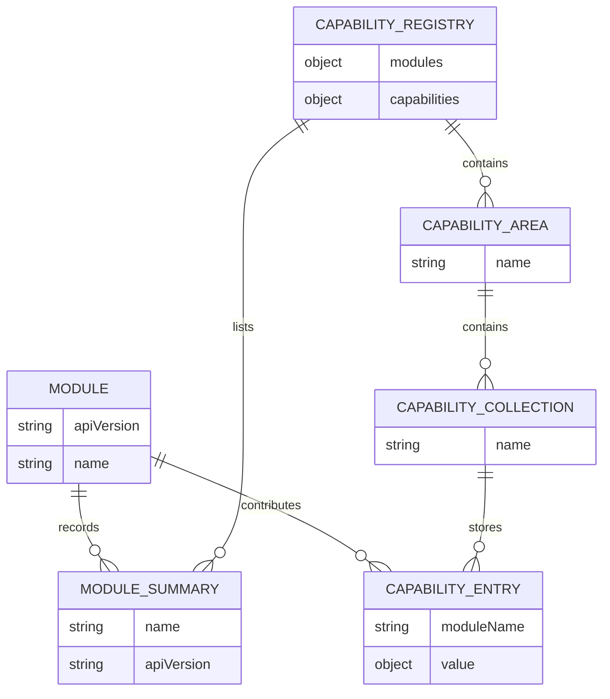
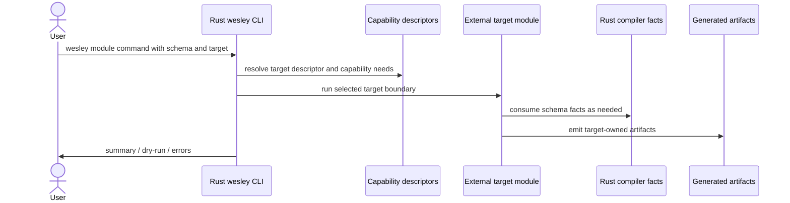
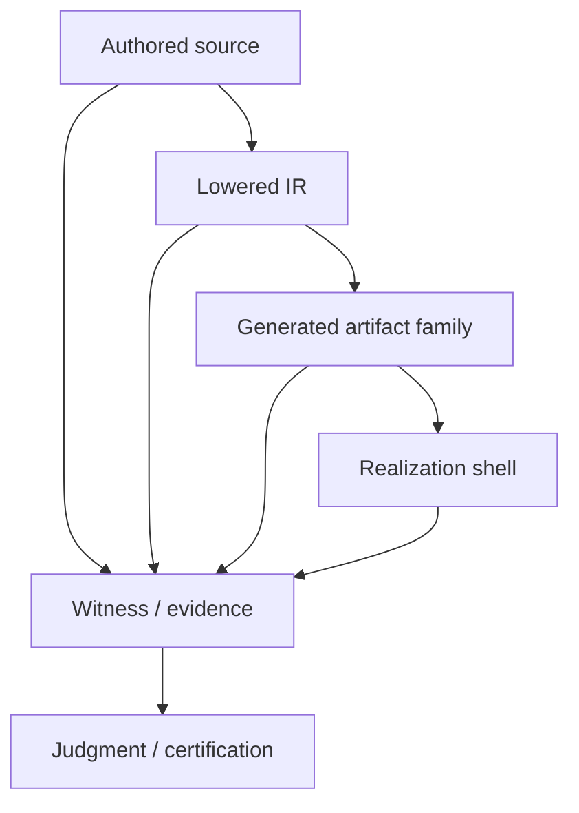
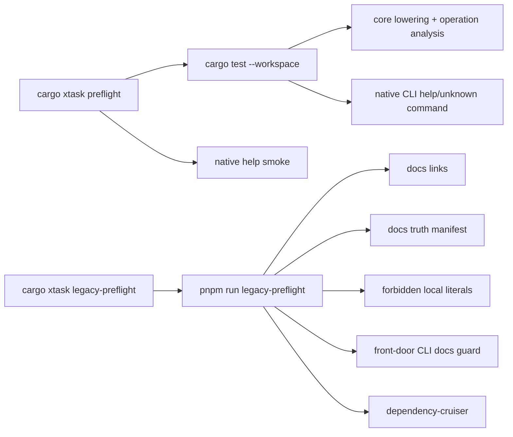

# ARCHITECTURE

<!-- docs-truth: status=experimental owner=@flyingrobots -->

Wesley is a schema-first compiler kernel and assurance toolchain.

The current architecture is intentionally narrower than older product-era docs:

```text
authored GraphQL -> Wesley core facts -> module-owned targets / evidence / hosts
```

Wesley owns compiler truth. External modules and sibling repos own target
semantics, runtime policy, database behavior, Echo behavior, and deployment.
The active ownership doctrine is
[Domain-Empty Core Boundary](./design/0014-domain-empty-core-boundary/domain-empty-core-boundary.md).

If you are trying to figure out where to start, read
[ENTRYPOINTS.md](./ENTRYPOINTS.md) first. This document is the deeper structural
map; the entrypoint map is the short answer to "which Wesley do I run or edit?"

For the noun-by-noun reference, use [WESLEY_GLOSSARY.md](./WESLEY_GLOSSARY.md).
For current direction and active tensions, use [BEARING.md](./BEARING.md).
For work doctrine, use [METHOD.md](./METHOD.md).

## Where This Leaves Us

The repo is now split into three practical layers:

1. **Rust kernel / brain**: `crates/wesley-core` is the emerging authoritative
   compiler library. It lowers GraphQL SDL into L1 IR, diffs L1 schema
   structure, lists schema root operations, and exposes generic operation facts.
2. **Native CLI / body**: `crates/wesley-cli` is the Rust product command. It
   exposes schema lowering, schema hashing, schema operation listing, schema
   diffing, Rust/TypeScript emission, operation selection analysis, and
   directive argument extraction from Rust crates.
3. **Rust Holmes assurance foundation**: `crates/wesley-holmes` is the new
   law-assurance foundation for Holmes evidence, versioning, ports, and future
   reports. It consumes Wesley-published artifacts and does not expose product
   CLI commands yet.
4. **Non-compiler JavaScript surfaces**: `packages/` now contains Holmes
   assurance tooling and browser/Bun/Deno host smoke experiments only. These
   packages are not release authority, compiler authority, or product
   entrypoints.

The most recent boundary cleanup removed root-level footprint checking from
Wesley. `wesley-core` now exposes generic operation selection and directive
argument extraction. Echo-specific footprint honesty belongs in Echo-owned
tooling, not in generic Wesley.

## System Context



The dashed arrows are intentional boundaries. Wesley can produce facts and
artifacts that external systems consume, but it should not absorb their runtime
semantics.

## Repo Tour

| Path                                                                     | Role                                                                                                                                                                     |
| ------------------------------------------------------------------------ | ------------------------------------------------------------------------------------------------------------------------------------------------------------------------ |
| `crates/wesley-core/`                                                    | Rust compiler kernel. Parses/lower SDL to domain-empty L1 IR, diffs L1 schema structure, lists schema root operations, and analyzes operation documents.                 |
| `crates/wesley-cli/`                                                     | Native Rust `wesley` binary for schema deltas, schema hashes, Rust/TypeScript artifacts, and operation facts.                                                            |
| `crates/wesley-emit-rust/`                                               | Rust projection crate. Builds a Rust item/type AST from L1 IR and `SchemaOperation` data, then prints deterministic model and operation declarations.                    |
| `crates/wesley-emit-typescript/`                                         | Rust TypeScript projection crate. Builds a TypeScript declaration AST from L1 IR and `SchemaOperation` data, then prints deterministic model and operation declarations. |
| `crates/wesley-holmes/`                                                  | Rust Holmes law-assurance foundation. Defines pure domain models, deterministic ports/fakes, evidence bundle validation, artifact path resolution, and version diagnostics without exposing public CLI commands yet. |
| `xtask/`                                                                 | Rust repository automation: docs checks, tests, native preflight, release check, and package hygiene bridge.                                                             |
| `packages/wesley-holmes/`                                                | Existing JavaScript Holmes surface outside compiler authority while the Rust assurance foundation grows behind it.                                                        |
| `packages/wesley-host-browser/`, `wesley-host-bun/`, `wesley-host-deno/` | External host smoke experiments pending deletion or externalization.                                                                                                     |
| `schemas/`                                                               | JSON schemas and generic directive/schema assets used by tooling and tests.                                                                                              |
| `test/fixtures/`                                                         | GraphQL fixtures, Rust L1 goldens, package examples, and reference schemas.                                                                                              |
| `scripts/`                                                               | Preflight, docs truth, docs link, fixture generation, smoke, and CI helper scripts.                                                                                      |
| `docs/`                                                                  | Operator docs, architecture, design packets, audits, specs, method docs, and archived backlog migration evidence.                                                        |
| `.github/workflows/`                                                     | CI workflows for Rust, packages, docs, hosts, security, and progress badges.                                                                                             |

Some directories still contain extraction residue. In particular,
`packages/wesley-generator-echo/` exists on disk but is not an active tracked
source package in this architecture. Echo-owned work should happen in Echo.
The former `packages/wesley-generator-vue/` and `packages/wesley-generator-js/`
packages have been deleted; target-specific generators should return only
through external target owners or Rust-native emitters.
The former `packages/wesley-scaffold-multitenant/`,
`packages/wesley-test-fixtures/`, and `packages/wesley-tasks/` packages are
also deleted. Product scaffolds belong to product repos, fixture helpers belong
as plain `test/fixtures` or Rust test assets, and generic task execution remains
descriptor-only until Rust planning proves a runtime need.

## Rust Kernel

`crates/wesley-core` is the cleanest current source of compiler truth.

It has three internal areas:

| Area     | Files            | Responsibility                                                    |
| -------- | ---------------- | ----------------------------------------------------------------- |
| Domain   | `src/domain/*`   | IR structs, operation-analysis structs, error types, hashes.      |
| Ports    | `src/ports/*`    | Host-neutral traits such as `LoweringPort`.                       |
| Adapters | `src/adapters/*` | Concrete parser/lowering implementation, currently Apollo Parser. |

Public Rust APIs currently include:

- `lower_schema_sdl(sdl) -> WesleyIR`
- `list_schema_operations_sdl(schema_sdl) -> Vec<SchemaOperation>`
- `diff_schema_sdl(old_sdl, new_sdl) -> SchemaDelta`
- `diff_schema_ir(old_ir, new_ir) -> SchemaDelta`
- `resolve_operation_selections(operation_sdl) -> Vec<String>`
- `resolve_operation_selections_with_schema(schema_sdl, operation_sdl) -> Vec<String>`
- `extract_operation_directive_args(operation_sdl, directive_name) -> Vec<OperationDirectiveArgs>`
- `compute_registry_hash(ir) -> String`
- `compute_content_hash(content) -> String`
- `to_canonical_json(value) -> String`

### Rust Flow



L1 IR is domain-empty. It knows GraphQL types, fields, directives, interfaces,
unions, enum values, input objects, nullability, lists, and source-level
directive data. It does not know tables, Echo graph nodes, migrations, routes,
deployments, or runtime policy.

## Rust Emitters

`crates/wesley-emit-rust` and `crates/wesley-emit-typescript` are the first Rust
projection crates. They do not parse or rewrite existing source files. They take
`WesleyIR` for models and, when available, `SchemaOperation` data for root
operation bindings. Each crate builds structured language-specific ASTs and
prints deterministic artifacts.

This generation path does not need tree-sitter. Tree-sitter, SWC, oxc, or a
similar parser becomes relevant when Wesley needs to inspect or edit existing
source files. Pure generation starts from an AST owned by the emitter. The Rust
emitter tests validate generated Rust syntax with `syn`.

Operation binding emission is still domain-empty. It connects operation kind,
root field name, argument object types, result type, and preserved directive
metadata. It does not interpret Echo footprint directives or bind operations to
Postgres, Continuum, or any other target runtime.

### Rust Class Diagram



### L1 IR Entity Relationship



## Native CLI And Xtask

The native CLI exposes Rust-backed compiler facts:



`schema diff` has two input modes. The explicit mode compares two schema files.
The Git-aware mode compares the working-tree schema against the same path at a
Git revision:

```bash
wesley schema diff --old old.graphql --new new.graphql
wesley schema diff --schema schema.graphql --against HEAD
wesley schema diff --schema schema.graphql --base origin/main
```

`cargo xtask preflight` is the ordinary product health check. It runs
Rust-native docs hygiene checks, Rust workspace tests, and verifies the native
CLI help surface. `cargo xtask legacy-preflight` intentionally crosses into
JavaScript package tooling only for retained package or pnpm-workspace changes.

## Non-Compiler JavaScript Tooling

The legacy Node compiler packages are gone. JavaScript remains for Holmes-era
assurance tooling, website/docs tooling, repository scripts, and browser/Bun/Deno
host smoke experiments. These are not the preferred home for new compiler-kernel
truth.

The retained JS split is:

- `@wesley/holmes`: self-contained assurance, verification, counterfactual, and
  reporting tooling.
- `@wesley/host-browser`, `@wesley/host-bun`, `@wesley/host-deno`: external host
  smoke experiments with local parser/hash adapters.
- website/docs/repository scripts: supporting automation, not compiler
  authority.

### Module Capability Model

External modules are the JS-side extension seam. A module has an API version,
a name, optional initialization, optional CLI command registration, and optional
structured capabilities.

Capability areas are currently:

- `wesley`: directives, targets, generators, bundle profiles, realization verifiers.
- `holmes`: scopes, checks, evidence collectors, counterfactual providers.
- `watson`: verifiers, audit profiles.
- `moriarty`: policy profiles, judgment profiles, predictors.
- `blade`: scenarios, fixtures, environment setup, tests, gates, certification profiles.
- `cli`: commands.



### Module-Aware Compile Flow



This is still a useful surface. The architectural rule is that target meaning
comes from the module, not from generic Wesley.

## Assurance And Evidence

Wesley keeps separate layers for authored source, compiler facts, generated
artifacts, and bounded evidence:



The key invariant is not "the generated files are true." The invariant is:

```text
generated files are derived from named authored source through a recorded tool path
```

Witness and evidence outputs are bounded claims. They should say exactly what
was checked and should not pretend to be runtime observation unless that is the
explicit witness scope.

## What Wesley Does Today

Wesley currently does these things in this repo:

- Lowers GraphQL SDL into a Rust L1 IR with consolidated type definitions.
- Preserves generic directives as JSON values in type and field IR.
- Computes canonical JSON and SHA-256 registry/content hashes.
- Lists schema root operations with argument types, result types, and
  directives.
- Resolves operation selection paths in response-path mode.
- Resolves operation selection paths in schema-coordinate mode.
- Extracts operation directive arguments by directive name.
- Provides a native Rust workspace preflight and release check.
- Maintains non-compiler JavaScript tooling only where it has an explicit owner.
- Maintains docs, schemas, fixtures, CI scripts, and design packets around the
  broader compiler-and-assurance system.

## What Wesley Does Not Own

Wesley does not own these semantics:

- Echo rewrite scheduling or footprint honesty enforcement.
- PostgreSQL migrations, SQL lowering, RLS policy, or database deployment.
- Continuum product/runtime behavior.
- Project-specific deployment.
- Agent repository aperture policy.
- Host-specific runtime trust decisions beyond its own module-loading guards.

Those systems may consume Wesley facts. They should not become Wesley core.

## Test And Evidence Surfaces



Use native checks for Rust-core work. Use `cargo xtask docs-check` for docs
only. Use legacy preflight when changing retained JS packages, pnpm workspace
files, or JavaScript tooling behavior.

## Ownership Rules

1. If it changes GraphQL parsing, L1 IR, operation analysis, canonical JSON, or
   compiler hashes, it belongs in `crates/wesley-core`.
2. If it is a native user command, add it only when it is backed by pure
   `wesley-core` behavior and documented as current.
3. If it is repository automation, put it in `xtask` or a script called by
   `xtask`.
4. If it is target semantics, make it a module or put it in the owning external
   repo.
5. If it is Echo, PostgreSQL, Continuum, or app runtime meaning, keep it outside
   generic Wesley.
6. If docs describe old product surfaces, mark them as historical/extraction
   context or remove the current-surface wording.

## North Star

Wesley is becoming a Rust library that can be embedded by other systems while
still preserving package-era module workflows during the transition.

The durable shape is:

```text
Rust core: deterministic compiler facts
Native CLI: small local executable surface
WASM / bindings: future portable capability boundary
JavaScript packages: assurance and host experiments outside compiler authority
External modules: target and domain meaning
Project workspaces: authored schemas, policy, runtime, deployment
```

That shape keeps the compiler honest. Wesley says what the schema and operation
mean. Other systems decide what those facts imply for their runtime.

---

**The goal is inevitably. Wesley owns compiler truth; target worlds own their own meaning.**
