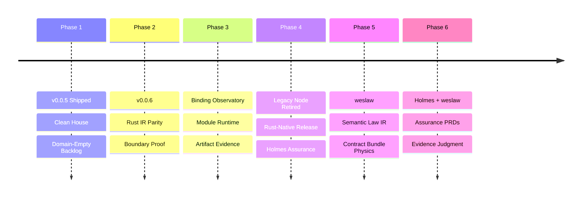

# BEARING

<!-- docs-truth: status=experimental owner=@flyingrobots -->

Current direction and active tensions. Historical ship data is in
`CHANGELOG.md`.

## Active Gravity

### 1. Rust-Native Compiler Spine

The legacy Node compiler surface is retired. The current Wesley product spine is
the Rust workspace: `crates/wesley-core`, `crates/wesley-cli`, retained emitters,
Rust L1 fixtures, and `cargo xtask` verification.

Wesley should now behave like a normal Rust-native compiler project with
JavaScript only where it has an explicit non-compiler owner: Holmes assurance,
website/docs tooling, and browser/Bun/Deno host experiments.

### 2. Domain-Empty Core

- Wesley's identity is the core `GraphQL -> whatever` compiler and assurance
  toolchain.
- The `whatever` must come from explicitly loaded external modules, not
  built-in product or database semantics.
- [0014-domain-empty-core-boundary](./design/0014-domain-empty-core-boundary/domain-empty-core-boundary.md)
  is now the active ownership doctrine, not a pending cleanup card.
- Echo, jedit, Continuum, WARPspace, and `warp-ttd` behavior belongs in the
  owning repos or owning modules.
- PostgreSQL/Supabase behavior belongs in `wesley-postgres`, not in
  `wesley-core`, Wesley generators, generic host packages, or generic task
  execution packages.

### 3. Rust L1 Fixture Truth

- Treat the Rust workspace as the primary compiler surface.
- Expand the canonical fixture corpus before broad rewrites.
- Keep nondeterministic metadata out of parity-sensitive IR bytes.
- Preserve directive spelling, alias normalization, extension folding, and
  invalid-SDL diagnostics as explicit tests instead of tribal knowledge.
- Keep jedit-shaped consumer fixtures as compiler coverage, not as jedit
  product ownership.

### 4. Parity Sentinel Archive

`pnpm fixtures:ir` regenerates Rust L1 golden files. Rust fixture truth and
native self-consistency are now the product release gate.

The JS/Rust parity sentinel work remains useful as historical migration
evidence, but it is no longer the release oracle and the parity scripts are
gone. Current authority lives in Rust tests, Rust L1 goldens, native CLI
behavior, and
[the `0017` parity sentinel archive](./design/0017-rust-native-front-door-and-node-retirement/PARITY_SENTINEL_ARCHIVE.md).

### 5. Resilience Policy Boundary

- Use `ninelives` for Rust compiler and capability seams when a boundary needs
  explicit cooperative resilience policy.
- Use `@git-stunts/alfred` for JavaScript tooling and child-process boundaries
  when a command can hang or emit unbounded output.
- Keep deterministic compiler errors as compiler errors; do not retry semantic
  parse/lowering failures.
- Do not imply hard preemption for synchronous in-process parser work; use a
  process, thread, or runtime boundary when a lowerer needs a hard deadline.
- [0015-resilience-policy-boundary](./design/0015-resilience-policy-boundary/resilience-policy-boundary.md)
  is now the active resilience doctrine.

### 6. Module Capability Boundary

- Use the module capability registry as the seam between loaded modules and
  Wesley base verbs.
- Keep `wesley compile` dispatching only through module-owned `wesley.targets`.
- Keep Wesley core CI independent of external product and database repos by
  exercising hermetic fixture modules across supported capability collections.
- Move product/runtime/database semantics to owning repos or modules before
  deleting generic compatibility evidence that external consumers still need.

### 7. Rust Core Binding Observatory Archive

- The binding observatory remains design evidence, not an active release gate.
- Do not resurrect the legacy JS lowerer just to compare timings. Future N-API,
  WASM, or external process bindings need fresh Rust-native evidence.
- Keep Rust CLI, Node binding, and WASM binding as separate adapter dimensions
  instead of collapsing them into one timing number.
- [0016-rust-core-binding-observatory](./design/0016-rust-core-binding-observatory/rust-core-binding-observatory.md)
  is archived runway context.

### 8. Wesley-Postgres Preservation

`wesley-postgres` is the PostgreSQL-family extraction home. It is active and
must not be abandoned while Wesley tightens its domain-empty boundary.

That repo remains the home for PostgreSQL/Supabase generation, PostgreSQL
execution adapters, and database safety primitives. Wesley should coordinate
by preserving generic module seams and avoiding new database semantics in the
base platform.

### 9. Legacy Node Retirement Campaign Closeout

The long-term target is met: no legacy Node authority remains in Wesley's
compiler, runtime, product entrypoint, tests, CI posture, or active release
plan. JavaScript remains only where a surface is explicitly classified outside
compiler authority: Holmes assurance, external host smoke experiments, website
tooling, docs tooling, and small repository automation.

Working budget: **96 slices**. The first ten slices establish the Rust-native
front door and retirement ledger. Later slices should retire Node by capability,
not by deleting files before equivalent Rust truth or explicit extraction
exists.

Status: **96 / 96 slices closed**. `packages/wesley-core`,
`packages/wesley-cli`, `packages/wesley-host-node`, and
`packages/wesley-runtime-node` are deleted. Holmes is self-contained. Browser,
Bun, and Deno host packages no longer import the retired JS core or runtime.
The closeout lives in
[FINAL_CLOSEOUT.md](./design/0017-rust-native-front-door-and-node-retirement/FINAL_CLOSEOUT.md).

- [x] NR-001 Reset `BEARING` around the 96-slice legacy Node retirement
      campaign.
- [x] NR-002 Open design packet `0017` for the Rust-native front door and Node
      retirement doctrine.
- [x] NR-003 Promote the Node retirement ledger as the authoritative inventory
      for product, runtime, tooling, and shadow surfaces.
- [x] NR-004 Record `apollo-parser` as the Rust parser choice for the retirement
      runway.
- [x] NR-005 Classify current Node packages and command surfaces by port,
      extract, delete, or defer disposition.
- [x] NR-006 Add a Rust-core SDL normalization API that renders consolidated
      compiler facts.
- [x] NR-007 Expose `wesley normalize-sdl --schema <path>` from the native CLI.
- [x] NR-008 Add golden normalized-SDL fixtures for extension folding, sorting,
      argument defaults, unions, and nested list references.
- [x] NR-009 Update front-door docs so Rust normalization is visible from the
      native command map.
- [x] NR-010 Reconcile pulled backlog cards into packet `0017`, docs, and
      changelog.
- [x] NR-011 Add a machine-readable Node retirement ledger export for CI and
      review automation.
- [x] NR-012 Add a drift check that fails when a new Node package appears
      without a ledger disposition.
- [x] NR-013 Add a drift check that fails when docs introduce `pnpm wesley` as a
      primary product front door.
- [x] NR-014 Add a drift check that fails when `packages/wesley-core` gains new
      compiler authority without a Rust counterpart.
- [x] NR-015 Add Rust normalizer coverage for directive aliases and repeated
      custom directives.
- [x] NR-016 Add Rust normalizer coverage for descriptions and escaped string
      values.
- [x] NR-017 Add Rust normalizer coverage for input object defaults and nested
      object directive arguments.
- [x] NR-018 Publish normalized SDL hash evidence beside L1 IR hash evidence.
- [x] NR-019 Add a Rust parser diagnostics fixture corpus for syntax,
      duplicate-directive, and semantic lowering failures.
- [x] NR-020 Update parser parity output to reference Rust normalized SDL where
      useful.
- [x] NR-021 Port the remaining useful generic TypeScript emitter parity cases
      into `crates/wesley-emit-typescript`.
- [x] NR-022 Add TypeScript emitter golden fixtures for operation request and
      response bindings.
- [x] NR-023 Decide whether Zod emission remains generic Wesley or moves to an
      external module.
- [x] NR-024 If retained, add a Rust Zod emitter crate or module boundary
      (closed by the non-retention decision; no core Zod crate added).
- [x] NR-025 If extracted, move Zod retirement to the owning module/package
      plan and stop presenting it as core Wesley.
- [x] NR-026 Replace legacy `generate` docs with explicit Rust `emit` command
      docs where parity exists.
- [x] NR-027 Add native `wesley emit` metadata that records schema hash,
      generator version, and execution mode.
- [x] NR-028 Add Rust emitter fixtures proving no domain-specific Postgres,
      Echo, or jedit semantics leak into generic output.
- [x] NR-029 Port or retire legacy `models` command behavior.
- [x] NR-030 Port or retire legacy `init` command behavior.
- [x] NR-031 Port a narrow Rust `doctor` command only for Rust-native health
      checks.
- [x] NR-032 Extract certificate creation/signing/verification commands from the
      compiler front door.
- [x] NR-033 Extract Holmes/Moriarty evidence commands or re-home them under an
      explicit assurance package boundary.
- [x] NR-034 Decide whether runtime run ledger inspection remains in Wesley or
      exits with assurance tooling.
- [x] NR-035 Move package-level evidence tooling out of `packages/wesley-cli`
      or mark it compatibility-only.
- [x] NR-036 Replace Node dynamic module loading with a Rust-native target
      registry or external-process protocol design.
- [x] NR-037 Add Rust module target registry fixtures for no-module, default
      target, explicit target, and duplicate target behavior.
- [x] NR-038 Add Rust module capability metadata for execution mode and
      portability floor.
- [x] NR-039 Add a Rust capability report that names requested, granted, and
      denied capabilities.
- [x] NR-040 Add deny-by-default host-function governance for WASM module
      execution.
- [x] NR-041 Add WASM fixture rejection before execution when a module requests
      unavailable host imports.
- [x] NR-042 Add capability versioning diagnostics for incompatible module
      contracts.
- [x] NR-043 Define the stateless default runtime model and future resource
      handle boundary.
- [x] NR-044 Add Rust-native fixture modules for hermetic cross-host capability
      tests.
- [x] NR-045 Move browser/Bun/Deno host experiments out of the core retirement
      path or classify them as external ecosystem packages.
- [x] NR-046 Delete or externalize `packages/wesley-host-bun` after its
      compatibility evidence is obsolete.
- [x] NR-047 Delete or externalize `packages/wesley-host-deno` after its
      compatibility evidence is obsolete.
- [x] NR-048 Delete or externalize `packages/wesley-host-browser` after its
      compatibility evidence is obsolete.
- [x] NR-049 Replace `packages/wesley-host-node/bin/wesley.mjs` test invocations
      with native CLI invocations wherever tests are not explicitly legacy tests.
- [x] NR-050 Move remaining Node-host tests into a compatibility-only lane.
- [x] NR-051 Add CI labels or job names that distinguish Rust product checks
      from external host experiment checks.
- [x] NR-052 Make `cargo xtask preflight` the ordinary product health check.
- [x] NR-053 Make `cargo xtask legacy-preflight` optional for legacy package
      changes only.
- [x] NR-054 Remove docs command drift checks that treat Node CLI commands as
      primary truth.
- [x] NR-055 Replace Node-based schema diff references with native `wesley
schema diff` references.
- [x] NR-056 Replace Node-based schema hash references with native `wesley
schema hash` references.
- [x] NR-057 Replace Node-based lowerer references with native `wesley schema
lower` references.
- [x] NR-058 Replace Node generator examples with Rust emitter examples where
      parity exists.
- [x] NR-059 Add migration notes for users still calling `pnpm wesley`.
- [x] NR-060 Add deprecation warnings to legacy Node commands that have Rust
      replacements.
- [x] NR-061 Add package metadata warnings for legacy Node packages.
- [x] NR-062 Stop publishing or presenting legacy packages as product-front-door
      artifacts.
- [x] NR-063 Add release checklist entries for Rust crate/package publication
      without npm authority.
- [x] NR-064 Add a compatibility matrix that names each remaining legacy package
      and its retirement gate.
- [x] NR-065 Remove stale `runtime-node` product claims from README and package
      docs.
- [x] NR-066 Remove stale `host-node` product claims from README and package
      docs.
- [x] NR-067 Remove stale generator product claims from README and package docs
      once Rust emitters cover the useful generic surface.
- [x] NR-068 Remove stale Holmes-as-core claims from docs once assurance is
      extracted or isolated.
- [x] NR-069 Update `docs/END_TO_END.md` so the Rust-native pipeline is the
      first and only product spine.
- [x] NR-070 Update `docs/ARCHITECTURE.md` so packages are compatibility
      appendices, not system center.
- [x] NR-071 Update `docs/GUIDE.md` so `cargo wesley` and `cargo xtask` are the
      normal path.
- [x] NR-072 Update `docs/ENTRYPOINTS.md` after each command retirement.
- [x] NR-073 Remove closed-gate legacy Node command references from public docs.
- [x] NR-074 Replace JS lowerer parity as a release gate with Rust
      self-consistency and fixture truth while retaining parity scripts as
      migration-only evidence.
- [x] NR-075 Archive JS/Rust parity sentinel reports as historical evidence
      instead of active authority.
- [x] NR-076 Delete `packages/wesley-core` after generic useful behavior is
      ported, extracted, or explicitly rejected.
- [x] NR-077 Delete `packages/wesley-cli` after commands are ported, extracted,
      or explicitly rejected.
- [x] NR-078 Delete `packages/wesley-host-node` after no product/test path uses
      the Node executable wrapper.
- [x] NR-079 Delete `packages/wesley-runtime-node` after module loading and
      runtime evidence no longer depend on it.
- [x] NR-080 Delete or externalize `packages/wesley-generator-js`.
- [x] NR-081 Delete or externalize `packages/wesley-generator-vue`.
- [x] NR-082 Delete or externalize `packages/wesley-scaffold-multitenant`.
- [x] NR-083 Delete or replace `packages/wesley-test-fixtures`.
- [x] NR-084 Delete or externalize `packages/wesley-tasks`.
- [x] NR-085 Remove package workspace entries for deleted legacy packages.
- [x] NR-086 Remove package scripts that only support deleted legacy packages.
- [x] NR-087 Remove lockfile dependency families that exist only for deleted
      legacy packages.
- [x] NR-088 Remove GitHub Actions jobs that exist only for deleted legacy
      packages.
- [x] NR-089 Preserve website/docs tooling separately if JavaScript remains
      useful outside product authority.
- [x] NR-090 Preserve `@git-stunts/alfred` only for JavaScript tooling seams
      that still need bounded child-process behavior.
- [x] NR-091 Preserve `ninelives` as the Rust resilience policy primitive for
      compiler and capability seams.
- [x] NR-092 Run a repo-wide stale Node shadow audit after deletions.
- [x] NR-093 Run a docs link/truth audit after deletions.
- [x] NR-094 Run a CI/release dry-run proving Rust-only product release does not
      require legacy Node packages.
- [x] NR-095 Publish the final legacy Node retirement closeout with migrated,
      extracted, deleted, deferred, and rejected surfaces.
- [x] NR-096 Remove the campaign from active `BEARING` once the closeout is
      merged and only normal maintenance remains.

### 10. Holmes Assurance Hexagon

Holmes should be redesigned as a Rust-native assurance hexagon, not ported as a
JavaScript-shaped crate. The new design lives in
[0018-holmes-assurance-hexagon](./design/0018-holmes-assurance-hexagon/holmes-assurance-hexagon.md).

The target shape is one assurance core with three interfaces: CLI, API, and
MCP. Reporting is an abstraction over a structured `ReportDocument`; GitHub PR
comments are one publisher, not the architecture. The JavaScript Holmes package
no longer blocks legacy core/runtime deletion, but it is still a transitional
assurance surface.

### 11. weslaw Semantic Law IR

The next architectural move is `weslaw`: a first-class semantic law layer for
Wesley contract bundles. GraphQL SDL remains sovereign over structural shape.
`weslaw` becomes sovereign over semantic law. The combined, bound, canonical
contract bundle is the unit Wesley hashes, diffs, emits, explains, validates,
and hands to assurance tools.

The formal design lives in
[0019-weslaw-semantic-law-ir](./design/0019-weslaw-semantic-law-ir/weslaw-semantic-law-ir.md).

The non-negotiables are narrow:

- Law IR is the product; YAML, directives, and future SDL+ are frontends.
- Active law binds strictly to schema coordinates and explicit law registries.
- Law documents anchor to canonical schema hashes.
- Law IR and authoring documents publish versioned machine-readable schemas.
- Semantic hashes are computed from normalized Law IR, not authored bytes.
- Machine-readable law diffs are first-class outputs.
- Policy, evidence, and judgment remain separate from semantic law.
- Wesley SDL+ is deferred until Law IR, binding, canonicalization, and diffs
  are stable.

Working budget: **75 slices**. The first scope checkpoint was `WLAW-050`; it
kept the runway intact. The second checkpoint at `WLAW-069` confirmed adoption
tooling was usable enough to start the first consumer payoff pull. The v1
runway is now closed.

Status: **75 / 75 slices closed**. `WLAW-001` through `WLAW-010` lock the v1
substrate docs, coordinate and registry grammar, canonicalization and
diagnostic rules, fixture corpus, and first accepted/rejected `weslaw/v1`
examples. `WLAW-011` through `WLAW-020` add the Rust Law IR v1 types, the
`weslaw/v1` YAML structure loader, stable structure diagnostics, fixture
lowering tests, and versioned canonical JSON Schema artifacts for the authored
and normalized law surfaces. `WLAW-021` through `WLAW-035` add strict
schema-hash anchoring, schema and operation subject binding, kind-specific
variant/footprint/channel/invariant reference binding, conflict diagnostics,
closest-match subject hints, and the explicit `wesley law validate` command.
`WLAW-036` through `WLAW-045` add canonical semantic Law IR serialization,
`lawHash`, provenance-bearing `lawDocumentHash`, empty-profile `profileHash`,
contract `bundleHash`, a versioned contract bundle manifest schema, manifest
output from `wesley law validate --json`, `--law`-backed emit metadata, and Rust
generated hash constants. `WLAW-046` through `WLAW-050` add
`wesley.law-diff/v1`, Rust-core semantic diff reports, added/removed law
events, scalar semantic change events, variant case change events, footprint
expansion/contraction/mixed-change events, and the first checkpoint on the
remaining runway. `WLAW-051` through `WLAW-059` add channel law and typed
invariant diff events, strengthened/weakened law classifications,
binding-break and schema-hash rebound reporting, `wesley law diff --json`,
Markdown summaries, CI-ready semantic diff fixtures, Holmes/BLADE-facing
fixtures, and the matching docs/changelog update. `WLAW-060` through
`WLAW-069` add `@wes_channel` directive lowering, directive/YAML canonical
equivalence tests, `wesley law lint`, `wesley init-law`, description-derived
draft suggestions, `wesley law explain` for scalar and operation subjects,
explicit `wesley law rebind` reporting and acceptance, and updated adoption
docs. `WLAW-070` through `WLAW-075` add Rust law-backed scalar and variant
validator helpers, report-only footprint capability summaries,
profile/category-aware law coverage reports, an explicit Law Matrix v1.1
deferral, and v1 playback/retrospective closeout evidence.

## Tensions

- **Rust Native Discipline**: The easy mistake after deletion is to recreate
  the old JavaScript surface through scripts, docs, or compatibility shortcuts.
  New compiler behavior belongs in Rust crates unless there is an explicit
  non-compiler owner.
- **Fixture Churn**: IR, hash, directive, or generated-artifact changes can
  affect Echo and jedit fixtures. Those changes need explicit compatibility
  notes rather than accidental hash churn.
- **Alias Semantics**: Legacy directive aliases are compatibility input, not a
  license to preserve arbitrary spelling in semantic Rust L1 output.
- **Invalid Diagnostics**: The Rust lowerer now exposes stable diagnostic
  codes and parser spans, but semantic lowering spans are still absent and
  should not be implied by tests or release notes.
- **External Module Gap**: Wesley has named the domain-empty boundary, but the
  module seam still needs hermetic target-dispatch fixtures, runtime boundary
  evidence, and artifact evidence before external modules can consume it
  cleanly.
- **Sibling Repo Coordination**: Wesley should reference `wesley-postgres` as
  the database authority without editing or overwriting sibling work from this
  repo.
- **Law Versus Runtime Meaning**: `weslaw` lets Wesley preserve and reason
  about semantic law, but Echo, Continuum, jedit, warp-ttd, and
  `wesley-postgres` still own target meaning and runtime behavior.
- **Law IR Scope Control**: The first `weslaw` implementation must stay typed,
  deterministic, and boring. It must not become an expression language, policy
  engine, or YAML programming language.

### 12. Holmes `weslaw` Assurance Planning

This completed 50-slice PRD and test-plan campaign turns the merged `weslaw`
v1 outputs into Holmes-facing assurance requirements before implementation
begins.

The completed packet is
[0020-holmes-weslaw-assurance-prd-test-plan](./design/0020-holmes-weslaw-assurance-prd-test-plan/holmes-weslaw-assurance-prd-test-plan.md).

Working budget: **50 slices**.

Status: **50 / 50 slices closed**. The plan allocates `HLAW-001` through
`HLAW-050` across evidence intake, typed domain contracts, report models, CLI
flows, GitHub publishing, MCP surfaces, policy, QA fixtures, determinism,
performance budgets, migration, release gates, operator docs, and campaign
closeout. Each slice must produce a PRD/test-plan artifact with explicit
objectives, scope, user stories, BDD acceptance criteria, and test scenarios.

Closed slices now cover `HLAW-001` through `HLAW-050`: evidence intake, typed
domain contracts, report sections, CLI operator flows, local artifact writing,
exit-code policy, GitHub publishing surfaces, MCP tools/resources, agent-safe
summaries, policy/audit contracts, QA fixture corpora, deterministic clock and
port seams, concurrency/idempotence requirements, performance budgets, legacy
Holmes migration mapping, workflow integration, Rust crate scaffold boundaries,
transitional CLI aliases, operator documentation, schema-version compatibility,
artifact retention, end-to-end workflow, release-gate rollout, and campaign
closeout.

## Next Target

The immediate focus is **Rust Holmes `weslaw` assurance implementation**: the
50-slice PRD/test-plan campaign is complete, and this branch is now building
the evidence and validation core before publishers or branch-protection gates.

Current evidence still includes complete v0.0.5 publication proof, Rust L1
fixtures for directive-heavy SDL, schema extensions, nested list type
references, legacy aliases, invalid duplicate-directive coverage, parser parity
acceptance evidence, IR parity projections, Rust CLI performance baselines,
module-target dispatch coverage, the `0014` domain-empty boundary, the `0015`
resilience boundary, and the `0016` binding observatory archive. Those remain
historical proof floor. The `0017` packet now closes the retirement campaign.
The `0018` packet names the assurance architecture that lets Holmes mature
without pinning Wesley to legacy Node. The `0019` packet names the semantic law
architecture that lets Wesley compile meaning alongside shape without smuggling
runtime ownership into the base compiler.

The implementation budget is **90 slices**. Status: **25 / 90 slices closed**.
Closed implementation slices now cover `HIMP-001` through `HIMP-025`: the
workspace-local Rust Holmes assurance crate shell, domain dependency-boundary
tests, deterministic port traits and fakes, the first diagnostic taxonomy, the
workspace preflight hook, implementation-boundary docs, the typed
`HolmesLawEvidenceBundle`, safe artifact path normalization, accepted
artifact-family version registry, schema-version diagnostics, collected bundle
structure validation, canonical provenance validation, artifact availability and
size diagnostics, versioning fixture coverage, and the first local evidence
validation gate, plus a `LawDiffIngestPort` parser for `wesley.law-diff/v1`
JSON artifacts, stable normalized law diff event records, and negative handling
for malformed law diff JSON, unsupported versions, unknown event kinds, and
duplicate law-id event identities, plus a `LawCoverageIngestPort` parser for
current `wesley.law-coverage/v1` profile/category JSON artifacts, normalized
coverage subjects/counts/omitted-missing-subject accounting, a
`LawCapabilityIngestPort` parser for current report-only footprint capability
summaries, a `ContractBundleManifestIngestPort` parser with evidence-bundle
provenance cross-checks, stable `SemanticChangeFinding` records derived from
law diff events without reclassifying Wesley's event kinds, and
`LawCoverageGateDecision` evaluation for profile/category thresholds.

The current implementation branch has taken `HIMP-016` through `HIMP-025`.
Stop here for a drift check before starting `HIMP-026`: Holmes can now ingest
Wesley-published law diff, coverage, capability, and manifest artifacts into
typed findings and coverage gate decisions before any publisher or
branch-protection surface exists.

Every implementation slice below references the completed `0020` PRD/test-plan
artifact it implements.

| Slice | Work | Design refs |
| --- | --- | --- |
| HIMP-001 | Create the Rust Holmes assurance crate or module shell with domain, application, reporting, and adapter namespaces. | [HLAW-043], [HLAW-050] |
| HIMP-002 | Add dependency-boundary tests proving the domain layer cannot import GitHub, filesystem, network, or process adapters. | [HLAW-043], [HLAW-038] |
| HIMP-003 | Define shared clock, filesystem, artifact, GitHub, and MCP port traits with fake implementations for tests. | [HLAW-038], [HLAW-043] |
| HIMP-004 | Add the first deterministic diagnostic-code taxonomy and error envelope shared by validation and ingest. | [HLAW-007], [HLAW-037] |
| HIMP-005 | Wire the new crate/module into workspace preflight without exposing public CLI commands yet. | [HLAW-043], [HLAW-042] |
| HIMP-006 | Document the implementation boundary and update local design navigation for the new Rust Holmes assurance work. | [HLAW-045], [HLAW-050] |
| HIMP-007 | Implement the typed `HolmesLawEvidenceBundle` model and required artifact-family fields. | [HLAW-001], [HLAW-046] |
| HIMP-008 | Implement `WeslawArtifactLocator` path resolution with relative-path normalization and path traversal rejection. | [HLAW-006], [HLAW-047] |
| HIMP-009 | Add the schema-version registry and accepted family/version table for bundle, policy, report, witness, MCP, and GitHub payloads. | [HLAW-046] |
| HIMP-010 | Implement semantic-version parsing and malformed, missing, unsupported-major, and unsupported-minor diagnostics. | [HLAW-046], [HLAW-037] |
| HIMP-011 | Implement bundle structural validation before artifact parsing, including required versus optional artifact references. | [HLAW-001], [HLAW-007] |
| HIMP-012 | Implement bundle provenance validation for schema hash, law hash, policy hash, bundle hash, and source identity fields. | [HLAW-005], [HLAW-010], [HLAW-015] |
| HIMP-013 | Implement missing, unavailable, oversized, and unreadable artifact diagnostics without panics. | [HLAW-006], [HLAW-007], [HLAW-047] |
| HIMP-014 | Add versioning fixtures for current, deprecated, malformed, unsupported, and mixed-generation artifacts. | [HLAW-046], [HLAW-037] |
| HIMP-015 | Add bundle validation golden and negative tests for the first local preflight gate. | [HLAW-001], [HLAW-036], [HLAW-037] |
| HIMP-016 | Implement the `LawDiffIngestPort` parser for `wesley law diff` JSON. | [HLAW-002] |
| HIMP-017 | Normalize law diff events into stable internal event records without reclassifying Wesley semantics. | [HLAW-002], [HLAW-008] |
| HIMP-018 | Add law diff negative handling for duplicate law ids, unknown event kinds, malformed JSON, and unsupported versions. | [HLAW-002], [HLAW-037] |
| HIMP-019 | Implement the `LawCoverageIngestPort` parser for category/profile-aware coverage artifacts. | [HLAW-003], [HLAW-033] |
| HIMP-020 | Normalize law coverage subjects, category totals, threshold inputs, and omitted-category accounting. | [HLAW-003], [HLAW-013], [HLAW-033] |
| HIMP-021 | Implement the `LawCapabilityIngestPort` parser for report-only capability summaries. | [HLAW-004], [HLAW-014] |
| HIMP-022 | Implement the `ContractBundleManifestIngestPort` parser and cross-check manifest hashes against bundle metadata. | [HLAW-005], [HLAW-015] |
| HIMP-023 | Create `SemanticChangeFinding` with stable finding ids, source coordinates, event refs, and remediation fields. | [HLAW-008], [HLAW-012] |
| HIMP-024 | Map law diff events to findings while preserving Wesley's original event classification. | [HLAW-002], [HLAW-008], [HLAW-032] |
| HIMP-025 | Implement `LawCoverageGateDecision` with profile/category threshold evaluation and boundary-value rounding. | [HLAW-009], [HLAW-033] |
| HIMP-026 | Implement `BundleTraceabilityGateDecision` for schema, law, policy, manifest, and artifact hash agreement. | [HLAW-010], [HLAW-015] |
| HIMP-027 | Add provenance report data structures for bundle source, artifact hashes, generator metadata, and evidence links. | [HLAW-015], [HLAW-047] |
| HIMP-028 | Add gate aggregation rules that produce one assessment outcome from validation, findings, coverage, and provenance gates. | [HLAW-009], [HLAW-010], [HLAW-020] |
| HIMP-029 | Add omitted-detail accounting for large finding sets and summaries. | [HLAW-030], [HLAW-040] |
| HIMP-030 | Add domain-level snapshot tests for findings, gate decisions, validation results, and provenance decisions. | [HLAW-007], [HLAW-008], [HLAW-009], [HLAW-010] |
| HIMP-031 | Implement `LawAssurancePolicySchema` loading and JSON/schema validation. | [HLAW-031], [HLAW-046] |
| HIMP-032 | Implement profile selection, profile inheritance, defaults, and unknown-profile diagnostics. | [HLAW-029], [HLAW-031], [HLAW-033] |
| HIMP-033 | Implement severity mapping from law diff event kind and coverage gap to Holmes severity. | [HLAW-032], [HLAW-008] |
| HIMP-034 | Implement coverage threshold policy with category absence, pass/warn/fail thresholds, and boundary rounding. | [HLAW-033], [HLAW-009] |
| HIMP-035 | Implement suppression policy with ids, owner, reason text, expiration, and audit fields. | [HLAW-034], [HLAW-035] |
| HIMP-036 | Enforce suppression abuse prevention for invalid evidence, failed binding, and non-overridable required gates. | [HLAW-034], [HLAW-049] |
| HIMP-037 | Implement rollout phase policy for local-preview, advisory, required, and non-overridable modes. | [HLAW-049], [HLAW-020] |
| HIMP-038 | Add policy fixture matrix and negative tests for malformed policy, expired suppression, and attempted invalid-evidence override. | [HLAW-031], [HLAW-034], [HLAW-037], [HLAW-049] |
| HIMP-039 | Implement `LawAssuranceAuditWitness` schema and deterministic witness construction. | [HLAW-035], [HLAW-046] |
| HIMP-040 | Record bundle, policy, report, finding, gate, hash, clock, and adapter evidence in the audit witness. | [HLAW-035], [HLAW-047] |
| HIMP-041 | Implement `LawAssuranceArtifactWriter` for local validation, assessment, report, summary, and witness artifacts. | [HLAW-019], [HLAW-047] |
| HIMP-042 | Implement retention metadata, deterministic artifact names, pinned evidence markers, and overwrite policy. | [HLAW-047], [HLAW-035] |
| HIMP-043 | Implement cleanup behavior for expired unpinned Holmes-owned local artifacts. | [HLAW-047], [HLAW-019] |
| HIMP-044 | Add writer and witness replay tests proving deterministic output across repeated runs. | [HLAW-019], [HLAW-035], [HLAW-039] |
| HIMP-045 | Build the golden fixture corpus for clean, warning, failing, malformed, stale, and missing evidence bundles. | [HLAW-036] |
| HIMP-046 | Build the negative fixture corpus for invalid JSON, unsupported versions, hash mismatches, unknown profiles, and malformed policies. | [HLAW-037] |
| HIMP-047 | Add fake clock and no-wall-clock assertions across validation, assessment, artifact writing, and publishing tests. | [HLAW-038], [HLAW-035] |
| HIMP-048 | Add in-memory ports for filesystem, artifact repository, GitHub publisher, MCP adapter, and workflow context. | [HLAW-038], [HLAW-039] |
| HIMP-049 | Add concurrency and idempotence tests for repeated assessment, repeated artifact writing, and retried publication. | [HLAW-039], [HLAW-021] |
| HIMP-050 | Add large-fixture performance budget harness for validation, assessment, rendering, artifact writing, and summaries. | [HLAW-040], [HLAW-030] |
| HIMP-051 | Add snapshot regeneration policy and fixture documentation for maintainers. | [HLAW-036], [HLAW-037], [HLAW-045] |
| HIMP-052 | Add fixture coverage checks so required scenario classes cannot disappear silently. | [HLAW-036], [HLAW-037], [HLAW-050] |
| HIMP-053 | Add hidden or internal CLI command routing for `holmes weslaw` without publishing GitHub behavior yet. | [HLAW-016], [HLAW-043] |
| HIMP-054 | Implement `holmes weslaw validate` using the evidence bundle, locator, version, and structural validation core. | [HLAW-016], [HLAW-001], [HLAW-007] |
| HIMP-055 | Implement `holmes weslaw assess` using ingest ports, policy, findings, and gate decisions. | [HLAW-017], [HLAW-008], [HLAW-009], [HLAW-031] |
| HIMP-056 | Implement `holmes weslaw report` for JSON and Markdown report outputs. | [HLAW-018], [HLAW-011] |
| HIMP-057 | Add artifact output flags, output-directory policy, and report/witness writer integration. | [HLAW-019], [HLAW-047] |
| HIMP-058 | Implement exit-code policy for success, advisory findings, required failure, invalid evidence, unavailable dependency, and internal error. | [HLAW-020], [HLAW-007] |
| HIMP-059 | Implement transitional CLI aliases and deprecation messages without reviving Node authority. | [HLAW-044], [HLAW-041] |
| HIMP-060 | Add CLI help, examples, and operator-path tests. | [HLAW-016], [HLAW-017], [HLAW-018], [HLAW-045] |
| HIMP-061 | Implement `LawAssuranceReportDocument` JSON model with metadata, findings, gates, sections, and artifact refs. | [HLAW-011], [HLAW-046] |
| HIMP-062 | Implement law diff report section grouped by event kind, severity, subject, and remediation. | [HLAW-012], [HLAW-008] |
| HIMP-063 | Implement law coverage report section with profile, category, threshold, and omitted-detail accounting. | [HLAW-013], [HLAW-033] |
| HIMP-064 | Implement law capability and bundle provenance report sections. | [HLAW-014], [HLAW-015] |
| HIMP-065 | Implement Markdown renderer with truncation, omitted counts, and no color-only status semantics. | [HLAW-011], [HLAW-030], [HLAW-045] |
| HIMP-066 | Implement agent-safe summary output with token budgets and artifact refs. | [HLAW-030], [HLAW-027] |
| HIMP-067 | Add report rendering snapshots for clean, warning, failing, invalid, and large fixtures. | [HLAW-011], [HLAW-036], [HLAW-040] |
| HIMP-068 | Implement GitHub law assurance PR comment renderer from the report model. | [HLAW-021], [HLAW-011] |
| HIMP-069 | Implement GitHub check summary/status payloads for advisory, required, invalid, and unavailable states. | [HLAW-022], [HLAW-049] |
| HIMP-070 | Implement GitHub finding annotations with file, line, subject, severity, and stable finding ids. | [HLAW-023], [HLAW-008] |
| HIMP-071 | Implement evidence link rendering with stale, unavailable, fork-safe, and retention-aware states. | [HLAW-024], [HLAW-047] |
| HIMP-072 | Implement override controls and suppression handoff without allowing invalid evidence or non-overridable gates to pass. | [HLAW-025], [HLAW-034], [HLAW-049] |
| HIMP-073 | Implement idempotent comment update and retry behavior against the fake GitHub publisher. | [HLAW-021], [HLAW-039] |
| HIMP-074 | Add GitHub adapter tests for permissions, fork contexts, publisher timeouts, and stale check conclusions. | [HLAW-021], [HLAW-022], [HLAW-047], [HLAW-049] |
| HIMP-075 | Implement MCP `assessWeslawBundle` tool using the same application service as CLI assessment. | [HLAW-026], [HLAW-017] |
| HIMP-076 | Implement MCP law evidence resources with redaction and artifact availability handling. | [HLAW-027], [HLAW-047] |
| HIMP-077 | Implement MCP `explainLawFinding` tool for finding ids, source event refs, gates, and remediation. | [HLAW-028], [HLAW-008] |
| HIMP-078 | Implement MCP law policy tool for active profile, thresholds, suppression posture, and rollout phase. | [HLAW-029], [HLAW-031], [HLAW-049] |
| HIMP-079 | Add MCP/CLI/GitHub parity tests for shared finding ids, gate decisions, and summaries. | [HLAW-026], [HLAW-030], [HLAW-048] |
| HIMP-080 | Build the end-to-end golden workflow from SDL and `weslaw` authoring through Wesley artifacts to Holmes report output. | [HLAW-048], [HLAW-001] |
| HIMP-081 | Add end-to-end required-failure, invalid-evidence, stale-hash, and publisher-unavailable workflows. | [HLAW-048], [HLAW-037] |
| HIMP-082 | Add CI workflow integration that assembles Wesley law artifacts and invokes Holmes law assurance. | [HLAW-042], [HLAW-048] |
| HIMP-083 | Add workflow artifact upload, retention, and fork-permission tests. | [HLAW-042], [HLAW-047] |
| HIMP-084 | Add end-to-end release-gate assertions for advisory, required, and non-overridable rollout phases. | [HLAW-048], [HLAW-049] |
| HIMP-085 | Write operator docs for local generation, validation, assessment, reporting, troubleshooting, and fixture maintenance. | [HLAW-045], [HLAW-050] |
| HIMP-086 | Update changelog and design docs for shipped Rust Holmes assurance behavior. | [HLAW-045], [HLAW-050] |
| HIMP-087 | Add command-snippet and docs parity checks for the new CLI and workflow surfaces. | [HLAW-045], [HLAW-016], [HLAW-042] |
| HIMP-088 | Run Code Lawyer self-review and resolve discovered implementation/documentation issues. | [HLAW-050], [HLAW-040] |
| HIMP-089 | Harden performance, timeout, and memory budgets after full adapter integration. | [HLAW-040], [HLAW-039] |
| HIMP-090 | Close the implementation campaign with final retrospective, backlog suggestions, and next-BEARING update. | [HLAW-050], [HLAW-049] |

[HLAW-001]: ./design/0020-holmes-weslaw-assurance-prd-test-plan/prds/HLAW-001-holmes-law-evidence-bundle.md
[HLAW-002]: ./design/0020-holmes-weslaw-assurance-prd-test-plan/prds/HLAW-002-law-diff-ingest-port.md
[HLAW-003]: ./design/0020-holmes-weslaw-assurance-prd-test-plan/prds/HLAW-003-law-coverage-ingest-port.md
[HLAW-004]: ./design/0020-holmes-weslaw-assurance-prd-test-plan/prds/HLAW-004-law-capability-ingest-port.md
[HLAW-005]: ./design/0020-holmes-weslaw-assurance-prd-test-plan/prds/HLAW-005-contract-bundle-manifest-ingest-port.md
[HLAW-006]: ./design/0020-holmes-weslaw-assurance-prd-test-plan/prds/HLAW-006-weslaw-artifact-locator.md
[HLAW-007]: ./design/0020-holmes-weslaw-assurance-prd-test-plan/prds/HLAW-007-law-evidence-validation-result.md
[HLAW-008]: ./design/0020-holmes-weslaw-assurance-prd-test-plan/prds/HLAW-008-semantic-change-finding.md
[HLAW-009]: ./design/0020-holmes-weslaw-assurance-prd-test-plan/prds/HLAW-009-law-coverage-gate-decision.md
[HLAW-010]: ./design/0020-holmes-weslaw-assurance-prd-test-plan/prds/HLAW-010-bundle-traceability-gate-decision.md
[HLAW-011]: ./design/0020-holmes-weslaw-assurance-prd-test-plan/prds/HLAW-011-law-assurance-report-document.md
[HLAW-012]: ./design/0020-holmes-weslaw-assurance-prd-test-plan/prds/HLAW-012-law-diff-report-section.md
[HLAW-013]: ./design/0020-holmes-weslaw-assurance-prd-test-plan/prds/HLAW-013-law-coverage-report-section.md
[HLAW-014]: ./design/0020-holmes-weslaw-assurance-prd-test-plan/prds/HLAW-014-law-capability-report-section.md
[HLAW-015]: ./design/0020-holmes-weslaw-assurance-prd-test-plan/prds/HLAW-015-bundle-provenance-report-section.md
[HLAW-016]: ./design/0020-holmes-weslaw-assurance-prd-test-plan/prds/HLAW-016-holmes-weslaw-validate-cli.md
[HLAW-017]: ./design/0020-holmes-weslaw-assurance-prd-test-plan/prds/HLAW-017-holmes-weslaw-assess-cli.md
[HLAW-018]: ./design/0020-holmes-weslaw-assurance-prd-test-plan/prds/HLAW-018-holmes-weslaw-report-cli.md
[HLAW-019]: ./design/0020-holmes-weslaw-assurance-prd-test-plan/prds/HLAW-019-law-assurance-artifact-writer.md
[HLAW-020]: ./design/0020-holmes-weslaw-assurance-prd-test-plan/prds/HLAW-020-law-assurance-exit-code-policy.md
[HLAW-021]: ./design/0020-holmes-weslaw-assurance-prd-test-plan/prds/HLAW-021-github-law-assurance-comment.md
[HLAW-022]: ./design/0020-holmes-weslaw-assurance-prd-test-plan/prds/HLAW-022-github-law-gate-check-summary.md
[HLAW-023]: ./design/0020-holmes-weslaw-assurance-prd-test-plan/prds/HLAW-023-github-law-finding-annotations.md
[HLAW-024]: ./design/0020-holmes-weslaw-assurance-prd-test-plan/prds/HLAW-024-github-law-evidence-links.md
[HLAW-025]: ./design/0020-holmes-weslaw-assurance-prd-test-plan/prds/HLAW-025-github-law-override-controls.md
[HLAW-026]: ./design/0020-holmes-weslaw-assurance-prd-test-plan/prds/HLAW-026-mcp-assess-weslaw-bundle-tool.md
[HLAW-027]: ./design/0020-holmes-weslaw-assurance-prd-test-plan/prds/HLAW-027-mcp-law-evidence-resources.md
[HLAW-028]: ./design/0020-holmes-weslaw-assurance-prd-test-plan/prds/HLAW-028-mcp-explain-law-finding-tool.md
[HLAW-029]: ./design/0020-holmes-weslaw-assurance-prd-test-plan/prds/HLAW-029-mcp-law-policy-tool.md
[HLAW-030]: ./design/0020-holmes-weslaw-assurance-prd-test-plan/prds/HLAW-030-agent-safe-law-summary.md
[HLAW-031]: ./design/0020-holmes-weslaw-assurance-prd-test-plan/prds/HLAW-031-law-assurance-policy-schema.md
[HLAW-032]: ./design/0020-holmes-weslaw-assurance-prd-test-plan/prds/HLAW-032-law-severity-mapping-policy.md
[HLAW-033]: ./design/0020-holmes-weslaw-assurance-prd-test-plan/prds/HLAW-033-law-coverage-threshold-policy.md
[HLAW-034]: ./design/0020-holmes-weslaw-assurance-prd-test-plan/prds/HLAW-034-law-assurance-suppression-policy.md
[HLAW-035]: ./design/0020-holmes-weslaw-assurance-prd-test-plan/prds/HLAW-035-law-assurance-audit-witness.md
[HLAW-036]: ./design/0020-holmes-weslaw-assurance-prd-test-plan/prds/HLAW-036-law-assurance-golden-fixture-corpus.md
[HLAW-037]: ./design/0020-holmes-weslaw-assurance-prd-test-plan/prds/HLAW-037-law-assurance-negative-fixture-corpus.md
[HLAW-038]: ./design/0020-holmes-weslaw-assurance-prd-test-plan/prds/HLAW-038-law-assurance-fake-clock-and-ports.md
[HLAW-039]: ./design/0020-holmes-weslaw-assurance-prd-test-plan/prds/HLAW-039-law-assurance-concurrency-and-idempotence.md
[HLAW-040]: ./design/0020-holmes-weslaw-assurance-prd-test-plan/prds/HLAW-040-law-assurance-performance-budget.md
[HLAW-041]: ./design/0020-holmes-weslaw-assurance-prd-test-plan/prds/HLAW-041-legacy-holmes-law-evidence-mapping.md
[HLAW-042]: ./design/0020-holmes-weslaw-assurance-prd-test-plan/prds/HLAW-042-holmes-workflow-weslaw-integration.md
[HLAW-043]: ./design/0020-holmes-weslaw-assurance-prd-test-plan/prds/HLAW-043-rust-holmes-crate-scaffold.md
[HLAW-044]: ./design/0020-holmes-weslaw-assurance-prd-test-plan/prds/HLAW-044-transitional-holmes-cli-aliases.md
[HLAW-045]: ./design/0020-holmes-weslaw-assurance-prd-test-plan/prds/HLAW-045-law-assurance-operator-docs.md
[HLAW-046]: ./design/0020-holmes-weslaw-assurance-prd-test-plan/prds/HLAW-046-law-assurance-schema-versioning.md
[HLAW-047]: ./design/0020-holmes-weslaw-assurance-prd-test-plan/prds/HLAW-047-law-assurance-artifact-retention.md
[HLAW-048]: ./design/0020-holmes-weslaw-assurance-prd-test-plan/prds/HLAW-048-law-assurance-end-to-end-workflow.md
[HLAW-049]: ./design/0020-holmes-weslaw-assurance-prd-test-plan/prds/HLAW-049-law-assurance-release-gate-rollout.md
[HLAW-050]: ./design/0020-holmes-weslaw-assurance-prd-test-plan/prds/HLAW-050-holmes-weslaw-assurance-closeout.md

## Post-Retirement Freestyle Slice Log

These celebration slices are not a new campaign. They are cleanup ballast after
the 96-slice retirement closeout.

- [x] PF-001 Remove the remaining `HOST=node` host-contract entrypoint and make
      retained host-contract runs opt into `browser`, `deno`, or `bun`.
- [x] PF-002 Rename live host-check doctrine from `Legacy Compatibility` to
      `External Host Experiment`.
- [x] PF-003 Add a Rust `xtask` guard that fails when a package listed in
      `retiredPackages` quietly reappears with a `package.json`.
- [x] PF-004 Refresh CI, host, and script docs so post-retirement operators see
      product checks, repo hygiene, and external host experiments as separate
      lanes.
- [x] PF-005 Record the post-retirement cleanup in the changelog so the branch
      tells the whole story after merge.

The `ninelives` decision is made: use `ninelives` for Rust resilience seams and
Alfred for JavaScript tooling seams. Keep the scope narrow: resilience policy
wraps execution boundaries; it does not import product, database, scheduler, or
runtime semantics into Wesley.

The Node binding decision is intentionally not made yet. The current posture is
Rust CLI as the authoritative native compiler path and fresh observatory
evidence before any N-API or WASM production binding choice.

Echo and jedit do not need more Wesley feature gravity for their current work.
Wesley should coordinate on compatibility only when a concrete artifact, hash,
or generated-surface change requires it.
