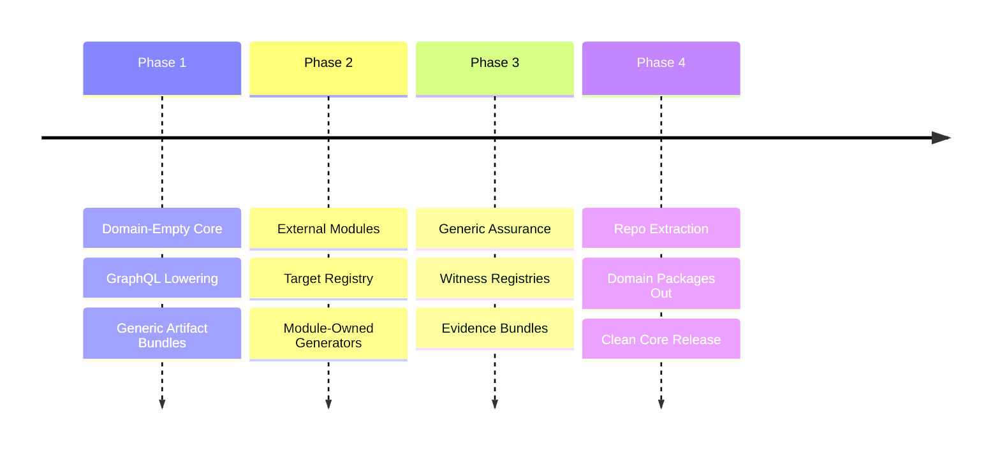

# BEARING
<!-- docs-truth: status=experimental owner=@flyingrobots -->

Current direction and active tensions. Historical ship data is in `CHANGELOG.md`.

## Active Gravity

### 1. Domain-Empty Core
- Wesley's identity is the core `GraphQL -> whatever` compiler and assurance
  toolchain.
- The `whatever` must come from explicitly loaded external modules, not
  built-in product or database semantics.
- Continuum-specific behavior belongs in Continuum or a Continuum-owned module
  repo.
- PostgreSQL/Supabase behavior belongs in `wesley-postgres`, not in
  `wesley-core`, Wesley generators, generic host packages, or generic task
  execution packages.

### 2. Module Capability Runtime
- Using the basic module capability registry as the default seam between
  loaded modules and Wesley base verbs.
- Keeping `wesley compile` dispatching only through module-owned
  `wesley.targets`.
- Keeping Wesley core CI independent of external product and database repos by
  exercising a hermetic fixture module across every supported capability
  collection.

### 3. Extraction Rigor
- Treating the current Continuum, WARPspace, PostgreSQL, Supabase, Echo, TTD,
  and product-backend references as wrong-repo residue unless they are explicit
  historical docs, extraction notes, or already-relocated module surfaces.
- Moving product/domain generators, witnesses, policies, and workspace tools to
  their owning repos.
- Updating docs as behavior moves so no stale surface looks authoritative.

### 4. Rust-Native Front Door
- Treating the Rust workspace as the primary surface for core compiler work.
- Keeping the native `wesley` binary pointed at pure `wesley-core` library
  behavior. It now exposes schema lowering, schema hashing, schema diffing,
  operation selections, and directive argument extraction before any host
  adapters, MCP, or runtime embedding.
- Using `cargo xtask` for repository automation so Rust-native checks keep
  moving away from npm scripts. Native preflight now includes Rust docs checks,
  Rust tests, and native CLI help.
- Keeping native install/release checks on the Cargo path with
  `cargo install --locked --path crates/wesley-cli` and
  `cargo xtask release-check`.
- Treating `pnpm wesley` as legacy package tooling until its remaining useful
  surfaces are extracted, retired, or deliberately reimplemented in Rust.
- Maintaining [ENTRYPOINTS.md](./ENTRYPOINTS.md) as the short repo map so the
  Rust kernel, native CLI, xtask automation, and legacy Node tooling are not
  presented as competing Wesley products.
- Maintaining [LEGACY_NODE_MIGRATION.md](./LEGACY_NODE_MIGRATION.md) as the
  command/package disposition map for the move to a pure Rust Wesley.
- Treating `wesley schema diff` as the first native port of a legacy Node
  command: it compares L1 schema structure now, supports Git-aware old-schema
  lookup through `--schema <path> --against <rev>`, and leaves argument-aware
  operation deltas waiting on an explicit IR/API decision.

## Tensions

- **Wrong-Repo Residue**: Active implementation residue is now mostly handled;
  remaining risk is stale historical or audit wording that looks like current
  Wesley product doctrine.
- **Capability Gap**: The module registry, compile target dispatch, and Holmes
  counterfactual provider dispatch exist, but Watson, Moriarty, and BLADE still
  need broader runtime dispatch over module-owned capability collections.
- **Documentation Drag**: Older historical/audit docs still mention old product
  and database lanes; active docs should describe Wesley as domain-empty unless
  they are explicit extraction notes.
- **Verification Split**: Generic witness/evidence machinery needs to stay
  independent from module-owned proof scopes and domain policy.
- **Legacy NPM Front Door**: README and guide now point core work at Cargo, but
  package scripts, docs drift checks, and old generator commands still assume
  `pnpm wesley` is a first-class entry point.
- **Two-Brain Confusion**: Rust and Node surfaces still coexist in the same
  checkout. The intended shape is one compiler brain (`crates/wesley-core`), one
  native command body (`crates/wesley-cli`), and legacy Node support surfaces
  under `packages/` until they are ported, extracted, or deleted.

## Next Target

The immediate focus is **Rust-native core boundary cleanup**: keep the native
`wesley` binary small, keep `wesley-core` focused on generic GraphQL lowering
and operation analysis, and leave Echo-specific footprint honesty to Echo-owned
tooling.
