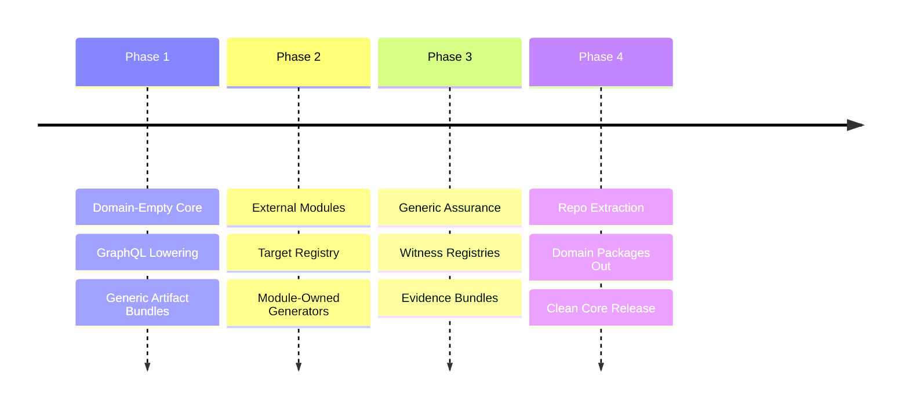

# BEARING
<!-- docs-truth: status=experimental owner=@flyingrobots -->

Current direction and active tensions. Historical ship data is in `CHANGELOG.md`.

## Active Gravity

### 1. Domain-Empty Core
- Wesley's identity is the core `GraphQL -> whatever` compiler and assurance
  toolchain.
- The `whatever` must come from explicitly loaded external modules, not
  built-in product or database semantics.
- Continuum-specific behavior belongs in Continuum or a Continuum-owned module
  repo.
- PostgreSQL/Supabase behavior belongs in `wesley-postgres`, not in
  `wesley-core`, Wesley generators, generic host packages, or generic task
  execution packages.

### 2. Module Capability Runtime
- Using the basic module capability registry as the default seam between
  loaded modules and Wesley base verbs.
- Keeping `wesley compile` dispatching only through module-owned
  `wesley.targets`.
- Keeping Wesley core CI independent of external product and database repos by
  exercising a hermetic fixture module across every supported capability
  collection.

### 3. Extraction Rigor
- Treating the current Continuum, WARPspace, PostgreSQL, Supabase, Echo, TTD,
  and product-backend references as wrong-repo residue unless they are explicit
  historical docs, extraction notes, or already-relocated module surfaces.
- Moving product/domain generators, witnesses, policies, and workspace tools to
  their owning repos.
- Updating docs as behavior moves so no stale surface looks authoritative.

## Tensions

- **Wrong-Repo Residue**: Active implementation residue is now mostly handled;
  remaining risk is stale historical or audit wording that looks like current
  Wesley product doctrine.
- **Capability Gap**: The module registry, compile target dispatch, and Holmes
  counterfactual provider dispatch exist, but Watson, Moriarty, and BLADE still
  need broader runtime dispatch over module-owned capability collections.
- **Documentation Drag**: Older historical/audit docs still mention old product
  and database lanes; active docs should describe Wesley as domain-empty unless
  they are explicit extraction notes.
- **Verification Split**: Generic witness/evidence machinery needs to stay
  independent from module-owned proof scopes and domain policy.

## Next Target

The immediate focus is **Module Capability Runtime**: keep domain behavior
behind module-owned capability collections and extend the runtime dispatch
pattern beyond compile targets and Holmes counterfactual providers.
