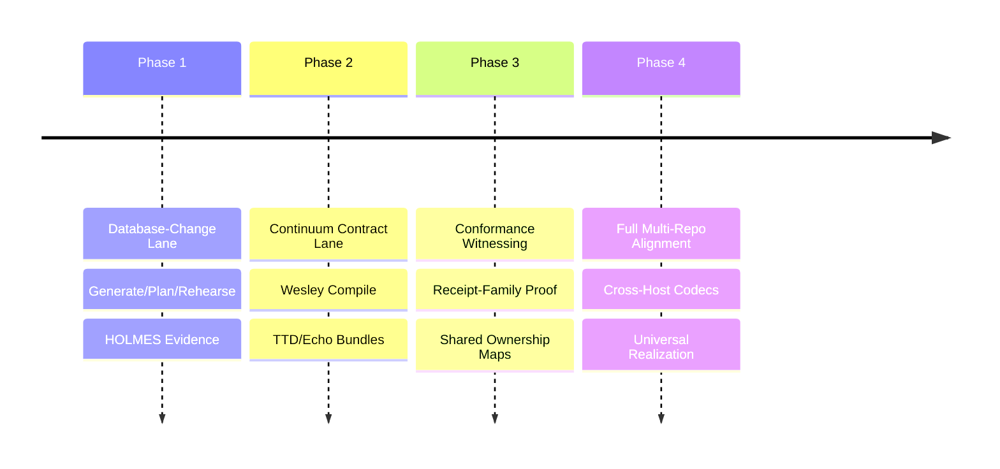

# BEARING
<!-- docs-truth: status=experimental owner=@flyingrobots -->

Current direction and active tensions. Historical ship data is in `CHANGELOG.md`.

## Active Gravity

### 1. Continuum Alignment
- Freezing the `receipt-family` shared contract with one authored home and one ownership map.
- Strengthening anti-shadow rules so mirrored contracts do not become accidental peer authorities.
- Strengthening the `realization` manifest so it acts as a packaging shell with build traceability and artifact integrity across monorepo boundaries.
- Defining one versioned contract-bundle release and sync story so Continuum, Wesley, Echo, `git-warp`, and `warp-ttd` can interoperate without importing compiler internals across repo boundaries.

### 2. Evidence Maturity
- Maturing the `wesley witness` command to support generalized realization manifests without confusing shell metadata for proof.
- Porting all browser-TTD data structures to the Wesley schema to remove handwritten mirrors.
- Making bounded property certification explicit so a witness pass means traceability, coherence, and fixture conformance rather than implied runtime truth.
- Refining the HOLMES policy engine for more granular database-change certification.

### 3. Procedural Rigor
- Adopting the **METHOD** work doctrine across all packages.
- Maturing the Cycle Retro and Witness directory habits to increase repo-visible truth.

## Tensions

- **Identity Split**: Wesley's public identity is still split between the PostgreSQL-first story and the newer Continuum contract-compiler hill.
- **Evidence Gap**: The current receipt-family witness is bounded to compile-time artifact coherence; it still needs a cleaner split between witness-certified properties and neighboring runtime or debugger semantics.
- **Experimental Debt**: Many older doc claims regarding platform ownership need to be retired or rewritten to match current implementation reality.
- **Directive Churn**: Support for custom GraphQL directives is broader in the registry than on the current happy path.

## Next Target

The immediate focus is **Continuum Bundle Publication**: turn the current
receipt-family compile and witness lane into one boring release-and-sync model,
then keep extending the proving lane without overstating what the current
witness actually proves.
