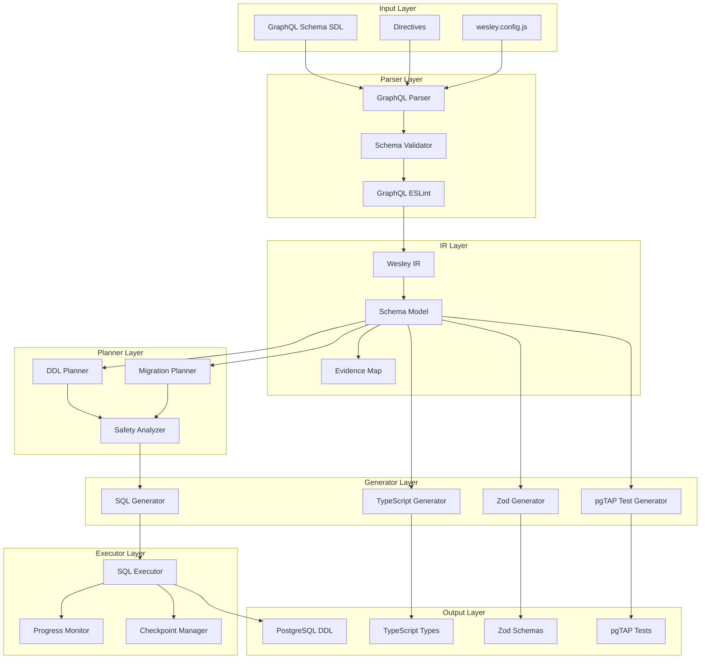
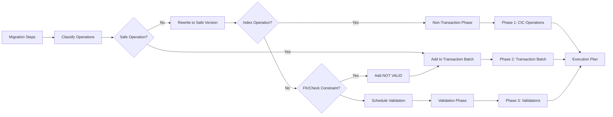
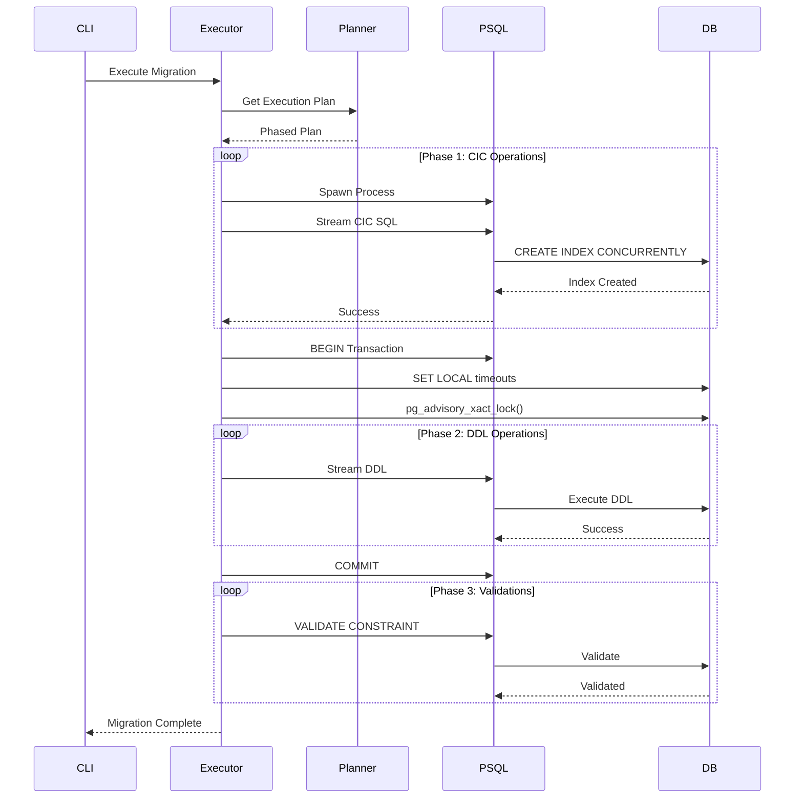
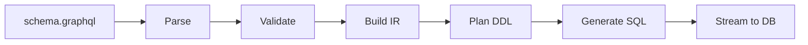
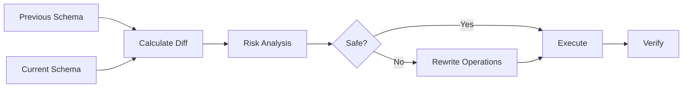
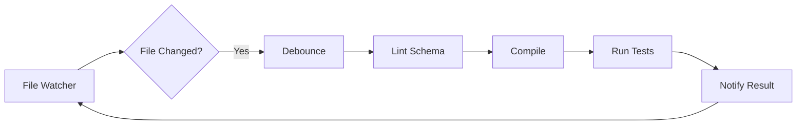
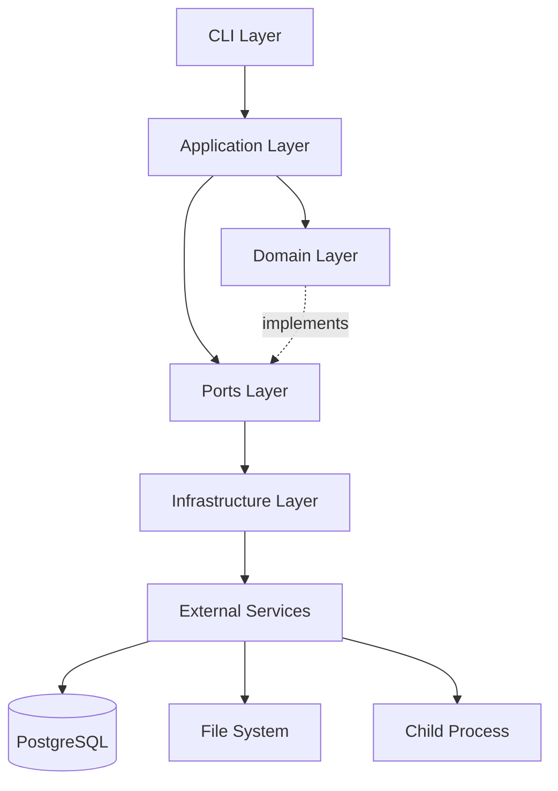

# Architecture Overview

## System Architecture



## Component Details

### Input Layer

#### GraphQL Schema SDL
- **Purpose**: Single source of truth for data model
- **Format**: Standard GraphQL SDL with custom directives
- **Location**: `schema/**/*.graphql`
- **Example**:
```graphql
type User @table @tenant(column: "org_id") {
  id: ID! @primaryKey
  email: String! @unique
  org_id: ID! @index
  created_at: DateTime! @default(expr: "NOW()")
}
```

#### Custom Directives
- `@table` - Marks type for table generation
- `@tenant` - Multi-tenant configuration
- `@rls` - Row-level security policies
- `@index` - Index generation
- `@check` - Check constraints
- `@computed` - Computed columns

### Parser Layer

#### GraphQL Parser
- **Library**: graphql-js
- **Function**: Parse SDL into AST
- **Validation**: Schema validity, directive usage
- **Output**: GraphQLSchema object

#### Schema Validator
- **Purpose**: Validate Wesley-specific rules
- **Checks**:
  - Valid directive combinations
  - Type safety
  - Naming conventions
  - Circular reference detection

#### GraphQL ESLint
- **Purpose**: Enforce best practices
- **Rules**:
  - PascalCase types
  - camelCase fields
  - Required descriptions
  - No deprecated patterns

### IR Layer (Intermediate Representation)

#### Wesley IR Structure
```javascript
{
  tables: Map<string, Table>,
  operations: Map<string, Operation>,
  evidence: EvidenceMap,
  metadata: {
    version: string,
    hash: string,
    timestamp: Date
  }
}
```

#### Schema Model
- **Table**: Name, fields, constraints, policies
- **Field**: Type, nullability, directives
- **Constraint**: Primary key, foreign key, unique, check
- **Policy**: RLS rules per operation

#### Evidence Map
- **Purpose**: Track source locations for errors
- **Content**: File, line, column for each element
- **Usage**: Error reporting, debugging

### Planner Layer

#### DDL Planner Flow



#### Migration Planner
- **Diff Calculation**: Compare old vs new schema
- **Risk Assessment**: Calculate operation risk scores
- **Snapshot Generation**: Pre-flight snapshots for rollback
- **Dependency Ordering**: Ensure correct execution order

#### Safety Analyzer
- **Lock Analysis**: Determine lock levels for each operation
- **Resource Conflicts**: Identify exclusive resource needs
- **Time Estimation**: Calculate expected duration
- **Rollback Planning**: Generate compensating operations

### Generator Layer

#### SQL Generator
- **AST Building**: Create PostgreSQL AST nodes
- **Deparsing**: Convert AST to SQL strings
- **Features**:
  - Table DDL with all constraints
  - Index generation with CONCURRENTLY
  - RLS policy creation
  - Trigger generation for computed columns

#### TypeScript Generator
- **Source**: GraphQL schema
- **Output**: Type definitions
- **Integration**: GraphQL Code Generator
- **Features**:
  - Exact type mapping
  - Enum generation
  - Interface exports

#### Zod Generator
- **Purpose**: Runtime validation
- **Source**: GraphQL schema
- **Plugin**: @use-pico/graphql-codegen-zod
- **Features**:
  - Input validation schemas
  - Custom scalar handling
  - Composable validators

#### pgTAP Test Generator
- **Purpose**: Database testing
- **Coverage**:
  - Table existence
  - Column properties
  - Constraint validation
  - RLS policy testing
  - Performance checks

### Executor Layer

#### SQL Executor Design



#### Progress Monitor
- **Heartbeat**: Every 30 seconds
- **Checkpoints**: At 25%, 50%, 75%
- **Metrics**: Operations completed, time elapsed
- **Logging**: Structured JSON logs

#### Checkpoint Manager
- **State Capture**: Serialize execution state
- **Storage**: Local filesystem
- **Recovery**: Resume from checkpoint
- **Cleanup**: Remove after completion

## Data Flow

### Compilation Flow



### Migration Flow



### Watch Mode Flow



## Module Structure

```
packages/wesley-core/
├── src/
│   ├── cli/                    # CLI entry points
│   │   └── wesley.mjs          # Main CLI
│   ├── domain/                 # Core domain logic
│   │   ├── Schema.mjs          # Schema model
│   │   ├── DDLPlanner.mjs      # DDL planning
│   │   ├── MigrationSafety.mjs # Safety analysis
│   │   └── generators/         # Code generators
│   │       ├── PostgreSQLGenerator.mjs
│   │       ├── TypeScriptGenerator.mjs
│   │       └── PgTAPTestGenerator.mjs
│   ├── infrastructure/         # External integrations
│   │   ├── SQLExecutor.mjs     # Database execution
│   │   ├── FileWatcher.mjs     # Watch mode
│   │   └── CheckpointStore.mjs # State persistence
│   ├── application/            # Use cases
│   │   ├── Commands.mjs        # Command handlers
│   │   └── UseCases.mjs        # Business logic
│   └── ports/                  # Interfaces
│       └── Ports.mjs           # Port definitions
├── test/                       # Test files
├── docs/                       # Documentation
└── package.json
```

## Dependency Graph



## Technology Choices

### Core Technologies

| Component | Technology | Rationale |
|-----------|------------|-----------|
| Runtime | Node.js 18+ | ESM support, stable |
| Language | JavaScript | Simple, fast iteration |
| Schema | GraphQL | Industry standard |
| Database | PostgreSQL 11+ | Online DDL features |
| Parser | graphql-js | Reference implementation |
| SQL Parser | pgsql-parser | libpg_query accuracy |
| File Watch | chokidar | Reliable, configurable |
| Validation | Zod | Runtime type safety |

### Design Patterns

| Pattern | Usage | Benefit |
|---------|-------|---------|
| Command | CLI operations | Separation of concerns |
| Repository | Data access | Testability |
| Factory | Generator creation | Flexibility |
| Observer | Event handling | Loose coupling |
| Strategy | Execution models | Runtime selection |
| Template Method | Code generation | Consistency |

## Security Considerations

### Input Validation
- All SDL parsed and validated
- Directive arguments sanitized
- SQL injection prevention via AST

### Database Security
- Advisory locks prevent races
- Transaction isolation
- Timeout limits on all operations

### Secret Management
- No secrets in generated code
- Environment variables for credentials
- Redaction in logs

## Performance Characteristics

### Compilation Performance
- **Parse**: ~10ms per file
- **Validation**: ~5ms per table
- **Generation**: ~20ms per table
- **Total**: <1s for 50 tables

### Execution Performance
- **CIC**: 2-10x slower than regular index
- **NOT VALID FK**: Instant with later validation
- **ADD COLUMN DEFAULT**: Instant on PG11+
- **Streaming**: No memory limit on schema size

### Resource Usage
- **Memory**: ~100MB baseline
- **CPU**: Single core for planning
- **I/O**: Streaming minimizes disk usage
- **Network**: Single database connection

## Error Handling

### Error Categories
1. **Parse Errors**: Invalid SDL syntax
2. **Validation Errors**: Schema rule violations
3. **Planning Errors**: Impossible migrations
4. **Execution Errors**: Database failures
5. **Resource Errors**: Lock timeouts

### Error Recovery
- Checkpoint-based resume
- Transaction rollback
- Compensating operations
- Manual intervention guides

## Monitoring & Observability

### Metrics
- Migration duration
- Lock wait time
- Resource utilization
- Error rates
- Checkpoint success rate

### Logging
- Structured JSON
- Log levels: ERROR, WARN, INFO, DEBUG
- Correlation IDs
- Performance timing

### Health Checks
- Database connectivity
- Schema drift detection
- Resource availability
- Worker pool status

---

**Next: [DDL Safety Guide →](./02-ddl-safety.md)**

**[← Back to README](./README.md)**