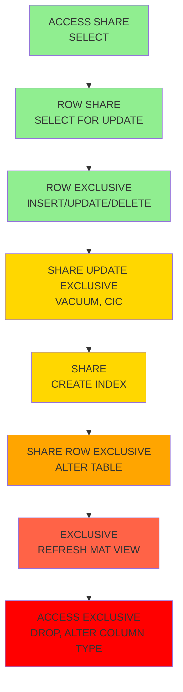
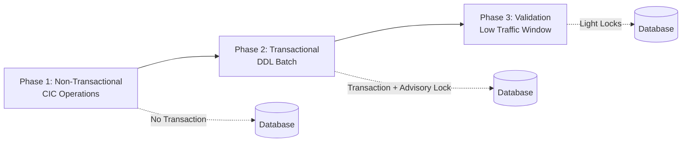

# DDL Safety Guide

## Lock Levels & Impact

### PostgreSQL Lock Hierarchy



### Lock Impact by Operation

| Operation | Lock Level | Blocks Reads? | Blocks Writes? | Safe Alternative |
|-----------|------------|---------------|----------------|------------------|
| SELECT | ACCESS SHARE | No | No | N/A |
| INSERT/UPDATE/DELETE | ROW EXCLUSIVE | No | No | N/A |
| CREATE INDEX | SHARE | No | Yes | CREATE INDEX CONCURRENTLY |
| CREATE INDEX CONCURRENTLY | SHARE UPDATE EXCLUSIVE | No | No | N/A (already safe) |
| ADD COLUMN | ACCESS EXCLUSIVE* | Yes | Yes | Use DEFAULT wisely |
| DROP COLUMN | ACCESS EXCLUSIVE | Yes | Yes | Consider hiding first |
| ALTER COLUMN TYPE | ACCESS EXCLUSIVE | Yes | Yes | Shadow column strategy |
| ADD CONSTRAINT | ACCESS EXCLUSIVE | Yes | Yes | NOT VALID + VALIDATE |
| VALIDATE CONSTRAINT | SHARE UPDATE EXCLUSIVE | No | No | N/A (already safe) |
| DROP TABLE | ACCESS EXCLUSIVE | Yes | Yes | No alternative |

*ADD COLUMN with constant DEFAULT is instant on PG11+

## Safe DDL Patterns

### Pattern 1: CREATE INDEX CONCURRENTLY

```sql
-- ❌ UNSAFE: Blocks writes
CREATE INDEX idx_users_email ON users(email);

-- ✅ SAFE: Allows reads and writes
CREATE INDEX CONCURRENTLY idx_users_email ON users(email);

-- CRITICAL: Must run outside transaction!
-- Only one CIC per table at a time
```

**Implementation in Wesley:**
```javascript
class DDLPlanner {
  planIndex(index) {
    return {
      phase: 'non_transactional',
      sql: `CREATE INDEX CONCURRENTLY ${index.name} ON ${index.table}(${index.columns})`,
      mustRunAlone: true,
      perTableLimit: 1
    };
  }
}
```

### Pattern 2: Safe Foreign Key Addition

```sql
-- ❌ UNSAFE: Full table scan under heavy lock
ALTER TABLE orders 
ADD CONSTRAINT orders_user_fk 
FOREIGN KEY (user_id) REFERENCES users(id);

-- ✅ SAFE: Two-phase approach
-- Phase 1: Add without validation (instant)
ALTER TABLE orders 
ADD CONSTRAINT orders_user_fk 
FOREIGN KEY (user_id) REFERENCES users(id) NOT VALID;

-- Phase 2: Validate later (allows reads/writes)
ALTER TABLE orders VALIDATE CONSTRAINT orders_user_fk;
```

**Implementation in Wesley:**
```javascript
class DDLPlanner {
  planForeignKey(fk) {
    return [
      {
        phase: 'transactional',
        sql: `ALTER TABLE ${fk.table} ADD CONSTRAINT ${fk.name} FOREIGN KEY (${fk.column}) REFERENCES ${fk.refTable}(${fk.refColumn}) NOT VALID`
      },
      {
        phase: 'validation',
        sql: `ALTER TABLE ${fk.table} VALIDATE CONSTRAINT ${fk.name}`,
        schedule: 'low_traffic_window'
      }
    ];
  }
}
```

### Pattern 3: Safe Unique Constraint

```sql
-- ❌ UNSAFE: Locks table while building index
ALTER TABLE users ADD CONSTRAINT users_email_unique UNIQUE (email);

-- ✅ SAFE: Build index first, then attach
-- Step 1: Build unique index without blocking
CREATE UNIQUE INDEX CONCURRENTLY users_email_unique_idx ON users(email);

-- Step 2: Attach as constraint (instant)
ALTER TABLE users 
ADD CONSTRAINT users_email_unique 
UNIQUE USING INDEX users_email_unique_idx;
```

### Pattern 4: Safe NOT NULL Addition

```sql
-- ❌ UNSAFE: Full table scan to verify
ALTER TABLE users ALTER COLUMN email SET NOT NULL;

-- ✅ SAFE: Add check constraint first
-- Step 1: Add check constraint without validation
ALTER TABLE users 
ADD CONSTRAINT users_email_not_null 
CHECK (email IS NOT NULL) NOT VALID;

-- Step 2: Validate constraint (lighter lock)
ALTER TABLE users VALIDATE CONSTRAINT users_email_not_null;

-- Step 3: Set NOT NULL using validated constraint
ALTER TABLE users ALTER COLUMN email SET NOT NULL;
```

### Pattern 5: Safe Column Addition with Default

```sql
-- PG11+ Optimization: Instant for constants
ALTER TABLE users 
ADD COLUMN status text NOT NULL DEFAULT 'active';
-- This is instant! No table rewrite!

-- For volatile defaults, use multiple steps:
-- Step 1: Add nullable column
ALTER TABLE users ADD COLUMN created_at timestamptz;

-- Step 2: Backfill in batches
UPDATE users SET created_at = NOW() 
WHERE id IN (SELECT id FROM users WHERE created_at IS NULL LIMIT 1000);

-- Step 3: Add default for new rows
ALTER TABLE users ALTER COLUMN created_at SET DEFAULT NOW();

-- Step 4: Add NOT NULL when ready
ALTER TABLE users ALTER COLUMN created_at SET NOT NULL;
```

## Partitioned Table Handling

### Special Rules for Partitioned Tables

```sql
-- ❌ CIC doesn't work on partitioned parent
CREATE INDEX CONCURRENTLY idx_events_created ON events(created_at);
-- ERROR: cannot create index on partitioned table concurrently

-- ✅ SAFE: Build on partitions, then attach
-- Step 1: Create index on parent (invalid)
CREATE INDEX idx_events_created ON ONLY events(created_at);

-- Step 2: Build on each partition concurrently
CREATE INDEX CONCURRENTLY idx_events_2024_01_created 
ON events_2024_01(created_at);

CREATE INDEX CONCURRENTLY idx_events_2024_02_created 
ON events_2024_02(created_at);

-- Step 3: Attach partition indexes
ALTER INDEX idx_events_created 
ATTACH PARTITION idx_events_2024_01_created;

ALTER INDEX idx_events_created 
ATTACH PARTITION idx_events_2024_02_created;

-- Parent index becomes valid automatically
```

**Implementation:**
```javascript
class DDLPlanner {
  planPartitionedIndex(index) {
    const steps = [];
    
    // Create parent index (invalid)
    steps.push({
      phase: 'transactional',
      sql: `CREATE INDEX ${index.name} ON ONLY ${index.parent}(${index.columns})`
    });
    
    // Build on each partition
    for (const partition of index.partitions) {
      steps.push({
        phase: 'non_transactional',
        sql: `CREATE INDEX CONCURRENTLY ${partition}_idx ON ${partition}(${index.columns})`
      });
    }
    
    // Attach partitions
    for (const partition of index.partitions) {
      steps.push({
        phase: 'transactional',
        sql: `ALTER INDEX ${index.name} ATTACH PARTITION ${partition}_idx`
      });
    }
    
    return steps;
  }
}
```

## Timeout Configuration

### Setting Timeouts Correctly

```sql
-- ❌ WRONG: psql variables don't set server GUCs
psql -v lock_timeout=5s  -- This doesn't work!

-- ✅ CORRECT: Use SET LOCAL in transaction
BEGIN;
SET LOCAL lock_timeout = '5s';
SET LOCAL statement_timeout = '30s';
-- Your DDL here
COMMIT;

-- The timeouts auto-reset after COMMIT
```

**Implementation:**
```javascript
class SQLExecutor {
  async executeTransactionalPhase(steps) {
    await this.stream('BEGIN;');
    
    // Set timeouts for this transaction
    await this.stream("SET LOCAL lock_timeout = '5s';");
    await this.stream("SET LOCAL statement_timeout = '30s';");
    
    // Acquire advisory lock
    const lockKey = this.getStableLockKey();
    await this.stream(`SELECT pg_advisory_xact_lock(${lockKey});`);
    
    // Execute DDL steps
    for (const step of steps) {
      await this.stream(step.sql);
    }
    
    await this.stream('COMMIT;');
  }
}
```

## Advisory Lock Management

### Transaction-Scoped Advisory Locks

```sql
-- ✅ SAFE: Auto-releases on commit/rollback
BEGIN;
-- Use SHA256 for stable key generation (not hashtext!)
SELECT pg_advisory_xact_lock(
  ('x' || substr(digest('wesley:migration:001', 'sha256')::text, 1, 16))::bit(64)::bigint
);

-- Do your DDL work
ALTER TABLE users ADD COLUMN age integer;

COMMIT; -- Lock automatically released

-- ❌ AVOID: Session locks require manual release
SELECT pg_advisory_lock(12345); -- Holds until pg_advisory_unlock()
```

## Circular Foreign Keys

### Handling Circular Dependencies

```sql
-- Problem: Tables reference each other
CREATE TABLE orgs (
  id uuid PRIMARY KEY,
  owner_id uuid REFERENCES users(id)  -- users doesn't exist yet!
);

CREATE TABLE users (
  id uuid PRIMARY KEY,
  org_id uuid REFERENCES orgs(id)  -- Circular!
);

-- ✅ SOLUTION: Deferrable constraints
-- Step 1: Create tables without FKs
CREATE TABLE orgs (id uuid PRIMARY KEY, owner_id uuid);
CREATE TABLE users (id uuid PRIMARY KEY, org_id uuid);

-- Step 2: Add deferrable FKs
ALTER TABLE orgs 
ADD CONSTRAINT orgs_owner_fk 
FOREIGN KEY (owner_id) REFERENCES users(id) 
DEFERRABLE INITIALLY DEFERRED;

ALTER TABLE users 
ADD CONSTRAINT users_org_fk 
FOREIGN KEY (org_id) REFERENCES orgs(id) 
DEFERRABLE INITIALLY DEFERRED;

-- Step 3: Insert data (constraints checked at commit)
BEGIN;
INSERT INTO orgs (id, owner_id) VALUES ('org1', 'user1');
INSERT INTO users (id, org_id) VALUES ('user1', 'org1');
COMMIT; -- Constraints validated here
```

## Column Type Changes

### Safe Type Migration Strategy

```sql
-- ❌ UNSAFE: Locks table for rewrite
ALTER TABLE users ALTER COLUMN age TYPE bigint;

-- ✅ SAFE: Shadow column strategy
-- Step 1: Add new column
ALTER TABLE users ADD COLUMN age_new bigint;

-- Step 2: Backfill in batches
UPDATE users SET age_new = age::bigint 
WHERE id IN (
  SELECT id FROM users 
  WHERE age_new IS NULL 
  LIMIT 1000
);

-- Step 3: Add trigger for dual writes
CREATE OR REPLACE FUNCTION sync_age() RETURNS TRIGGER AS $$
BEGIN
  NEW.age_new = NEW.age::bigint;
  RETURN NEW;
END;
$$ LANGUAGE plpgsql;

CREATE TRIGGER sync_age_trigger 
BEFORE INSERT OR UPDATE ON users 
FOR EACH ROW EXECUTE FUNCTION sync_age();

-- Step 4: Switch to new column
BEGIN;
ALTER TABLE users DROP COLUMN age;
ALTER TABLE users RENAME COLUMN age_new TO age;
DROP TRIGGER sync_age_trigger ON users;
DROP FUNCTION sync_age();
COMMIT;
```

## Computed Columns

### GENERATED vs Triggers

```sql
-- ✅ GENERATED: For same-row, immutable expressions
ALTER TABLE users 
ADD COLUMN full_name text 
GENERATED ALWAYS AS (first_name || ' ' || last_name) STORED;

-- ❌ GENERATED: Cannot reference other tables!
ALTER TABLE orders 
ADD COLUMN customer_name text 
GENERATED ALWAYS AS (
  (SELECT name FROM customers WHERE id = customer_id)
) STORED;
-- ERROR: cannot use subquery in column generation expression

-- ✅ TRIGGER: For cross-table computations
CREATE OR REPLACE FUNCTION compute_customer_name() 
RETURNS TRIGGER AS $$
BEGIN
  SELECT name INTO NEW.customer_name 
  FROM customers WHERE id = NEW.customer_id;
  RETURN NEW;
END;
$$ LANGUAGE plpgsql;

CREATE TRIGGER compute_customer_name_trigger
BEFORE INSERT OR UPDATE ON orders
FOR EACH ROW EXECUTE FUNCTION compute_customer_name();
```

## Migration Phases

### Three-Phase Execution Model



### Phase Characteristics

| Phase | Transaction? | Operations | Lock Impact | Timing |
|-------|-------------|------------|-------------|---------|
| 1 | No | CREATE INDEX CONCURRENTLY | SHARE UPDATE EXCLUSIVE | Anytime |
| 2 | Yes | ADD COLUMN, ADD CONSTRAINT NOT VALID | Various | Low traffic preferred |
| 3 | Optional | VALIDATE CONSTRAINT | SHARE UPDATE EXCLUSIVE | Low traffic window |

## Common Pitfalls

### Pitfall 1: CIC in Transaction

```sql
-- ❌ WRONG: CIC cannot run in transaction
BEGIN;
CREATE INDEX CONCURRENTLY idx_users_email ON users(email);
-- ERROR: CREATE INDEX CONCURRENTLY cannot run inside a transaction block
COMMIT;

-- ✅ CORRECT: Run outside transaction
CREATE INDEX CONCURRENTLY idx_users_email ON users(email);
```

### Pitfall 2: Multiple CIC on Same Table

```sql
-- ❌ WRONG: Second CIC will wait
-- Session 1
CREATE INDEX CONCURRENTLY idx1 ON users(email);

-- Session 2 (blocks!)
CREATE INDEX CONCURRENTLY idx2 ON users(created_at);

-- ✅ CORRECT: One at a time per table
```

### Pitfall 3: FK on Partitioned Tables

```sql
-- ❌ WRONG: Can't use NOT VALID on partitioned FK
ALTER TABLE events 
ADD CONSTRAINT events_user_fk 
FOREIGN KEY (user_id) REFERENCES users(id) NOT VALID;
-- ERROR: NOT VALID is not supported on partitioned tables

-- ✅ CORRECT: Add to each partition
ALTER TABLE events_2024_01 
ADD CONSTRAINT events_2024_01_user_fk 
FOREIGN KEY (user_id) REFERENCES users(id);
```

### Pitfall 4: Volatile Defaults

```sql
-- ❌ WRONG: Causes table rewrite
ALTER TABLE users 
ADD COLUMN uuid text NOT NULL DEFAULT gen_random_uuid()::text;

-- ✅ CORRECT: Add nullable, backfill, then default
ALTER TABLE users ADD COLUMN uuid text;
UPDATE users SET uuid = gen_random_uuid()::text WHERE uuid IS NULL;
ALTER TABLE users ALTER COLUMN uuid SET DEFAULT gen_random_uuid()::text;
ALTER TABLE users ALTER COLUMN uuid SET NOT NULL;
```

## Production Checklist

### Before Migration

- [ ] Analyze lock impact of each operation
- [ ] Identify operations requiring CIC
- [ ] Plan validation window for constraints
- [ ] Set appropriate timeouts
- [ ] Test on copy of production schema
- [ ] Prepare rollback scripts

### During Migration

- [ ] Monitor lock waits: `SELECT * FROM pg_locks WHERE NOT granted`
- [ ] Check long-running queries: `SELECT * FROM pg_stat_activity WHERE state != 'idle'`
- [ ] Watch for blocking: `SELECT * FROM pg_blocking_pids(pid)`
- [ ] Monitor checkpoint activity
- [ ] Track progress via custom logging

### After Migration

- [ ] Verify constraints active: `\d+ table_name`
- [ ] Check index usage: `SELECT * FROM pg_stat_user_indexes`
- [ ] Analyze tables if needed: `ANALYZE table_name`
- [ ] Update statistics: `SELECT * FROM pg_stats`
- [ ] Document completion time

## Emergency Procedures

### Killing Blocked Operations

```sql
-- Find blocking PID
SELECT pid, usename, query, state, wait_event_type, wait_event
FROM pg_stat_activity 
WHERE wait_event IS NOT NULL;

-- Terminate blocking session
SELECT pg_terminate_backend(blocking_pid);

-- Cancel specific statement
SELECT pg_cancel_backend(pid);
```

### Rolling Back

```sql
-- If in transaction, just ROLLBACK
ROLLBACK;

-- If CIC failed, drop partial index
DROP INDEX CONCURRENTLY IF EXISTS idx_partial;

-- If constraint added NOT VALID, drop it
ALTER TABLE users DROP CONSTRAINT constraint_name;
```

---

**Next: [Execution Models →](./03-execution-models.md)**

**[← Back to Architecture](./01-architecture.md)** | **[↑ Back to README](./README.md)**