# Execution Models

## Overview

Wesley supports two execution models for migration deployment: Wave-Based and Rolling Frontier. This document details both approaches, their trade-offs, and implementation considerations.

## Wave-Based Execution

### Concept

Wave-based execution organizes tasks into synchronized batches (waves) with barriers between each wave. All tasks in a wave must complete before the next wave begins.

```mermaid
gantt
    title Wave-Based Execution Timeline
    dateFormat HH:mm
    axisFormat %H:%M
    
    section Wave 1
    Foundation Tasks    :active, w1, 00:00, 14h
    
    section Barrier
    Synchronization     :crit, b1, after w1, 1h
    
    section Wave 2
    Core Implementation :active, w2, after b1, 16h
    
    section Barrier
    Synchronization     :crit, b2, after w2, 1h
    
    section Wave 3
    Safety Features     :active, w3, after b2, 18h
    
    section Barrier
    Synchronization     :crit, b3, after w3, 1h
    
    section Wave 4
    Finalization       :active, w4, after b3, 10h
```



### Characteristics

| Aspect | Value | Description |
|--------|-------|-------------|
| **Synchronization** | Barrier-based | Hard stops between waves |
| **Resource Utilization** | 40% | Idle time during barriers |
| **Recovery Complexity** | Low | Clear rollback points |
| **Scheduling Flexibility** | Rigid | Fixed wave assignments |
| **Monitoring Difficulty** | Simple | Predictable progress |

### Implementation

```javascript
class WaveBasedExecutor {
  async execute(waves) {
    for (const wave of waves) {
      console.log(`Starting Wave ${wave.id}: ${wave.name}`);
      
      // Start all tasks in parallel
      const promises = wave.tasks.map(task => 
        this.executeTask(task)
      );
      
      // Wait for all to complete
      const results = await Promise.allSettled(promises);
      
      // Check for failures
      const failures = results.filter(r => r.status === 'rejected');
      if (failures.length > 0) {
        await this.rollbackWave(wave);
        throw new Error(`Wave ${wave.id} failed`);
      }
      
      // Create checkpoint
      await this.checkpoint(wave.id);
      
      // Barrier synchronization
      await this.synchronize();
    }
  }
}
```

### Advantages

1. **Simple Recovery**: Clear rollback points at wave boundaries
2. **Predictable Progress**: Easy to estimate completion
3. **Resource Planning**: Known resource requirements per wave
4. **Testing**: Each wave independently testable
5. **Communication**: Simple status reporting

### Disadvantages

1. **Inefficient**: 60% idle time due to barriers
2. **Slower**: Takes 58 hours vs 45 for rolling frontier
3. **Rigid**: Cannot adapt to actual task durations
4. **Waste**: Fast tasks wait for slow tasks
5. **Frustrating**: Artificial delays

## Rolling Frontier Execution

### Concept

Rolling frontier continuously schedules tasks as dependencies are satisfied and resources become available, maintaining a frontier of executable tasks.


### Characteristics

| Aspect | Value | Description |
|--------|-------|-------------|
| **Synchronization** | Continuous | No artificial barriers |
| **Resource Utilization** | 65% | Minimal idle time |
| **Recovery Complexity** | Medium | Frequent checkpoints needed |
| **Scheduling Flexibility** | Dynamic | Adaptive to actual durations |
| **Monitoring Difficulty** | Complex | Non-linear progress |

### Implementation

```javascript
class RollingFrontierExecutor {
  constructor() {
    this.frontier = new Set();
    this.running = new Map();
    this.completed = new Set();
    this.workers = new WorkerPool(4);
  }
  
  async execute(tasks, dependencies) {
    // Initialize frontier with ready tasks
    this.initializeFrontier(tasks, dependencies);
    
    while (this.frontier.size > 0 || this.running.size > 0) {
      // Schedule ready tasks
      while (this.frontier.size > 0 && this.workers.available()) {
        const task = this.selectNextTask();
        this.scheduleTask(task);
      }
      
      // Wait for any task to complete
      const completed = await this.workers.waitForAny();
      this.handleCompletion(completed);
      
      // Update frontier with newly ready tasks
      this.updateFrontier(completed);
      
      // Checkpoint if needed
      if (this.shouldCheckpoint()) {
        await this.checkpoint();
      }
    }
  }
  
  selectNextTask() {
    // Priority: critical path > high value > low risk
    return Array.from(this.frontier)
      .sort((a, b) => this.priority(b) - this.priority(a))[0];
  }
  
  priority(task) {
    const value = task.businessValue / task.effort;
    const risk = 1 - task.riskScore;
    const critical = task.onCriticalPath ? 2 : 1;
    return value * risk * critical;
  }
}
```

### Advantages

1. **Efficient**: 65% resource utilization
2. **Fast**: 22% faster completion (45h vs 58h)
3. **Adaptive**: Responds to actual durations
4. **Continuous**: No artificial delays
5. **Optimal**: Maximizes throughput

### Disadvantages

1. **Complex**: Harder to understand and debug
2. **Monitoring**: Non-linear progress tracking
3. **Recovery**: More checkpoints needed
4. **Testing**: Harder to test thoroughly
5. **Cognitive Load**: Higher operator burden

## Scheduling Algorithms

### Critical Path Method (CPM)

Prioritizes tasks on the critical path to minimize total duration.

```javascript
function calculateCriticalPath(tasks, dependencies) {
  // Forward pass: earliest start times
  const earliest = new Map();
  for (const task of topologicalSort(tasks, dependencies)) {
    const deps = dependencies.get(task) || [];
    const maxDep = Math.max(0, ...deps.map(d => 
      earliest.get(d).end
    ));
    earliest.set(task, {
      start: maxDep,
      end: maxDep + task.duration
    });
  }
  
  // Backward pass: latest start times
  const latest = new Map();
  const projectEnd = Math.max(...Array.from(earliest.values())
    .map(e => e.end));
    
  for (const task of topologicalSort(tasks, dependencies).reverse()) {
    const dependents = findDependents(task, dependencies);
    const minDep = dependents.length > 0
      ? Math.min(...dependents.map(d => latest.get(d).start))
      : projectEnd;
    latest.set(task, {
      end: minDep,
      start: minDep - task.duration
    });
  }
  
  // Critical path: tasks with zero slack
  return tasks.filter(task => {
    const e = earliest.get(task);
    const l = latest.get(task);
    return e.start === l.start; // Zero slack
  });
}
```

### Resource-Constrained Scheduling

Considers resource availability when scheduling tasks.

```javascript
class ResourceConstrainedScheduler {
  schedule(tasks, resources) {
    const schedule = [];
    const ready = new PriorityQueue(this.compareTasks);
    const running = [];
    let time = 0;
    
    while (tasks.length > 0 || running.length > 0) {
      // Complete finished tasks
      const finished = running.filter(t => t.endTime <= time);
      for (const task of finished) {
        this.releaseResources(task);
        this.updateReady(ready, task.dependents);
        running.splice(running.indexOf(task), 1);
      }
      
      // Schedule ready tasks with available resources
      while (ready.size() > 0) {
        const task = ready.peek();
        if (this.canAllocate(task)) {
          ready.dequeue();
          this.allocateResources(task);
          task.startTime = time;
          task.endTime = time + task.duration;
          running.push(task);
          schedule.push(task);
        } else {
          break; // Wait for resources
        }
      }
      
      // Advance time
      if (running.length > 0) {
        time = Math.min(...running.map(t => t.endTime));
      }
    }
    
    return schedule;
  }
}
```

## Checkpoint Strategy

### Checkpoint Triggers

1. **Time-based**: Every 30 minutes
2. **Progress-based**: Every 25% completion
3. **Phase-based**: Major milestone completion
4. **Risk-based**: Before high-risk operations
5. **Manual**: On-demand via signal

### Checkpoint Content

```javascript
class Checkpoint {
  constructor() {
    this.timestamp = new Date();
    this.version = "1.0.0";
    this.state = {
      completed: [],      // Completed task IDs
      running: [],        // Currently running tasks
      frontier: [],       // Ready to run tasks
      outputs: {},        // Task output artifacts
      resources: {},      // Resource allocation state
      metrics: {}         // Performance metrics
    };
  }
  
  async save(path) {
    const temp = `${path}.tmp`;
    await fs.writeFile(temp, JSON.stringify(this, null, 2));
    await fs.rename(temp, path); // Atomic
  }
  
  static async load(path) {
    const data = await fs.readFile(path, 'utf8');
    const checkpoint = JSON.parse(data);
    return new Checkpoint().restore(checkpoint);
  }
}
```

## Failure Recovery

### Recovery Strategies

1. **Resume**: Continue from last checkpoint
2. **Retry**: Retry failed task with backoff
3. **Skip**: Mark as failed and continue
4. **Rollback**: Undo to last stable state
5. **Abort**: Stop execution cleanly

### Recovery Implementation

```javascript
class RecoveryManager {
  async recover(checkpoint, failure) {
    switch (failure.type) {
      case 'TRANSIENT':
        return await this.retryWithBackoff(failure.task);
        
      case 'RESOURCE':
        await this.waitForResource(failure.resource);
        return await this.resume(checkpoint);
        
      case 'PERMANENT':
        if (failure.task.critical) {
          return await this.rollback(checkpoint.previous);
        } else {
          return await this.skip(failure.task);
        }
        
      case 'UNKNOWN':
        await this.notify(failure);
        return await this.waitForIntervention();
    }
  }
  
  async retryWithBackoff(task, attempt = 1) {
    const delay = Math.min(1000 * Math.pow(2, attempt), 30000);
    await sleep(delay);
    
    try {
      return await this.executeTask(task);
    } catch (error) {
      if (attempt < 3) {
        return this.retryWithBackoff(task, attempt + 1);
      }
      throw error;
    }
  }
}
```

## Performance Comparison

### Metrics

| Metric | Wave-Based | Rolling Frontier | Winner |
|--------|------------|------------------|--------|
| **Total Duration** | 58 hours | 45 hours | Rolling Frontier (-22%) |
| **Resource Utilization** | 40% | 65% | Rolling Frontier (+62%) |
| **Idle Time** | 23 hours | 7 hours | Rolling Frontier (-70%) |
| **Checkpoint Count** | 4 | 11 | Wave-Based (simpler) |
| **Recovery Time** | 5 minutes | 15 minutes | Wave-Based (faster) |
| **Monitoring Complexity** | Low | High | Wave-Based (simpler) |

### Recommendation

**Use Rolling Frontier for:**
- Production deployments
- Time-critical migrations
- Resource-constrained environments
- Experienced operators

**Use Wave-Based for:**
- Development/testing
- Learning/training
- Risk-averse organizations
- Simple migrations

## Implementation Checklist

### Rolling Frontier Setup

- [ ] Configure worker pool (4 workers)
- [ ] Set checkpoint interval (30 minutes)
- [ ] Define priority function
- [ ] Implement resource constraints
- [ ] Setup monitoring dashboard
- [ ] Document recovery procedures
- [ ] Test failure scenarios
- [ ] Train operators

### Wave-Based Setup

- [ ] Define wave boundaries
- [ ] Assign tasks to waves
- [ ] Set synchronization points
- [ ] Create rollback scripts
- [ ] Document wave dependencies
- [ ] Test each wave independently
- [ ] Prepare status reporting
- [ ] Train operators

---

**Next: [Resource Management →](./04-resource-management.md)**

**[← Back to DDL Safety](./02-ddl-safety.md)** | **[↑ Back to README](./README.md)**