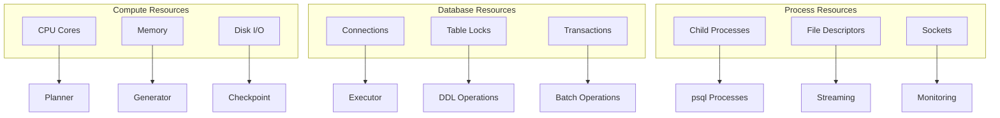

# Resource Management

## Overview

Resource management ensures efficient utilization of system resources while preventing conflicts and maintaining safety during migration execution.

## Resource Types

### System Resources



### Resource Characteristics

| Resource | Type | Limit | Sharing | Contention |
|----------|------|-------|---------|------------|
| **CPU Cores** | Compute | Hardware | Yes | Medium |
| **Memory** | Compute | System | Yes | Low |
| **Disk I/O** | Compute | Hardware | Yes | High |
| **DB Connections** | Database | Pool Size | No | High |
| **Table Locks** | Database | Per Table | No | Very High |
| **Transactions** | Database | Concurrent | No | High |
| **Child Processes** | Process | ulimit | Yes | Medium |
| **File Descriptors** | Process | ulimit | Yes | Low |
| **Network Sockets** | Process | System | Yes | Low |

## Resource Constraints

### Exclusive Resources

Resources that cannot be shared between operations:

```javascript
class ExclusiveResourceManager {
  constructor() {
    this.resources = new Map();
    this.waitQueues = new Map();
  }
  
  async acquire(resource, operation) {
    const key = this.getResourceKey(resource);
    
    if (this.resources.has(key)) {
      // Resource is busy, queue the operation
      if (!this.waitQueues.has(key)) {
        this.waitQueues.set(key, []);
      }
      
      return new Promise((resolve) => {
        this.waitQueues.get(key).push({
          operation,
          resolve,
          timestamp: Date.now()
        });
      });
    }
    
    // Acquire the resource
    this.resources.set(key, {
      operation,
      acquiredAt: Date.now()
    });
    
    return true;
  }
  
  release(resource, operation) {
    const key = this.getResourceKey(resource);
    const holder = this.resources.get(key);
    
    if (!holder || holder.operation !== operation) {
      throw new Error(`Operation ${operation} does not hold ${key}`);
    }
    
    // Release the resource
    this.resources.delete(key);
    
    // Wake up next waiter
    const queue = this.waitQueues.get(key);
    if (queue && queue.length > 0) {
      const next = queue.shift();
      this.resources.set(key, {
        operation: next.operation,
        acquiredAt: Date.now()
      });
      next.resolve(true);
    }
  }
  
  getResourceKey(resource) {
    switch (resource.type) {
      case 'TABLE_LOCK':
        return `table:${resource.table}`;
      case 'DATABASE_CONNECTION':
        return `connection:${resource.id}`;
      case 'CIC_SLOT':
        return `cic:${resource.table}`;
      default:
        return `${resource.type}:${resource.id}`;
    }
  }
}
```

### Shared Resources

Resources that can be shared with limits:

```javascript
class SharedResourcePool {
  constructor(config) {
    this.pools = new Map();
    this.config = config;
    this.metrics = new Map();
  }
  
  initialize() {
    // CPU pool
    this.pools.set('cpu', {
      total: os.cpus().length,
      available: os.cpus().length,
      allocated: new Map()
    });
    
    // Memory pool
    this.pools.set('memory', {
      total: os.totalmem(),
      available: os.totalmem() * 0.8, // 80% available
      allocated: new Map()
    });
    
    // Connection pool
    this.pools.set('connections', {
      total: this.config.database.poolSize || 10,
      available: this.config.database.poolSize || 10,
      allocated: new Map()
    });
    
    // Process pool
    this.pools.set('processes', {
      total: this.config.maxProcesses || 4,
      available: this.config.maxProcesses || 4,
      allocated: new Map()
    });
  }
  
  async allocate(type, amount, operation) {
    const pool = this.pools.get(type);
    if (!pool) {
      throw new Error(`Unknown resource type: ${type}`);
    }
    
    // Check availability
    if (pool.available < amount) {
      // Wait for resources to become available
      await this.waitForAvailability(type, amount);
    }
    
    // Allocate resources
    pool.available -= amount;
    pool.allocated.set(operation, {
      amount,
      allocatedAt: Date.now()
    });
    
    // Track metrics
    this.updateMetrics(type, 'allocate', amount);
    
    return {
      type,
      amount,
      operation,
      release: () => this.release(type, operation)
    };
  }
  
  release(type, operation) {
    const pool = this.pools.get(type);
    const allocation = pool.allocated.get(operation);
    
    if (!allocation) {
      return; // Already released
    }
    
    // Return resources to pool
    pool.available += allocation.amount;
    pool.allocated.delete(operation);
    
    // Track metrics
    this.updateMetrics(type, 'release', allocation.amount);
    
    // Notify waiters
    this.notifyWaiters(type);
  }
  
  async waitForAvailability(type, amount) {
    const pool = this.pools.get(type);
    const checkInterval = 100; // ms
    const maxWait = 30000; // 30 seconds
    const startTime = Date.now();
    
    while (pool.available < amount) {
      if (Date.now() - startTime > maxWait) {
        throw new Error(`Timeout waiting for ${amount} ${type} resources`);
      }
      
      await new Promise(resolve => setTimeout(resolve, checkInterval));
    }
  }
  
  getUtilization(type) {
    const pool = this.pools.get(type);
    if (!pool) return 0;
    
    return 1 - (pool.available / pool.total);
  }
}
```

## Resource Scheduling

### Priority-Based Scheduling

```javascript
class ResourceScheduler {
  constructor(resourceManager) {
    this.resourceManager = resourceManager;
    this.queue = new PriorityQueue((a, b) => 
      this.calculatePriority(b) - this.calculatePriority(a)
    );
    this.running = new Map();
    this.completed = new Set();
  }
  
  calculatePriority(task) {
    let priority = task.basePriority || 5;
    
    // Critical path tasks get boost
    if (task.onCriticalPath) {
      priority += 10;
    }
    
    // Low resource tasks get boost
    if (task.resourceRequirements.cpu < 2) {
      priority += 2;
    }
    
    // Long-waiting tasks get boost
    const waitTime = Date.now() - task.queuedAt;
    priority += Math.floor(waitTime / 5000); // +1 per 5 seconds
    
    // High-risk tasks get penalty
    if (task.riskLevel === 'HIGH') {
      priority -= 3;
    }
    
    return priority;
  }
  
  async schedule(task) {
    task.queuedAt = Date.now();
    
    // Check if resources are immediately available
    if (await this.canRunImmediately(task)) {
      return this.execute(task);
    }
    
    // Queue the task
    this.queue.enqueue(task);
    
    // Process queue
    await this.processQueue();
  }
  
  async canRunImmediately(task) {
    const requirements = task.resourceRequirements;
    
    // Check exclusive resources
    for (const exclusive of requirements.exclusive || []) {
      if (!this.resourceManager.isAvailable(exclusive)) {
        return false;
      }
    }
    
    // Check shared resources
    for (const [type, amount] of Object.entries(requirements.shared || {})) {
      if (!this.resourceManager.hasAvailable(type, amount)) {
        return false;
      }
    }
    
    return true;
  }
  
  async processQueue() {
    while (!this.queue.isEmpty()) {
      const task = this.queue.peek();
      
      if (await this.canRunImmediately(task)) {
        this.queue.dequeue();
        await this.execute(task);
      } else {
        // Can't run the highest priority task, wait
        await this.waitForResources();
      }
    }
  }
  
  async execute(task) {
    // Acquire resources
    const allocations = await this.acquireResources(task);
    
    // Track running task
    this.running.set(task.id, {
      task,
      allocations,
      startTime: Date.now()
    });
    
    try {
      // Execute the task
      const result = await task.execute();
      
      // Mark complete
      this.completed.add(task.id);
      
      return result;
      
    } finally {
      // Release resources
      await this.releaseResources(allocations);
      
      // Remove from running
      this.running.delete(task.id);
      
      // Process waiting tasks
      await this.processQueue();
    }
  }
  
  async acquireResources(task) {
    const allocations = [];
    const requirements = task.resourceRequirements;
    
    // Acquire exclusive resources
    for (const exclusive of requirements.exclusive || []) {
      await this.resourceManager.acquireExclusive(exclusive, task.id);
      allocations.push({
        type: 'exclusive',
        resource: exclusive
      });
    }
    
    // Acquire shared resources
    for (const [type, amount] of Object.entries(requirements.shared || {})) {
      const allocation = await this.resourceManager.allocateShared(
        type, 
        amount, 
        task.id
      );
      allocations.push({
        type: 'shared',
        allocation
      });
    }
    
    return allocations;
  }
  
  async releaseResources(allocations) {
    for (const allocation of allocations) {
      if (allocation.type === 'exclusive') {
        this.resourceManager.releaseExclusive(allocation.resource);
      } else {
        allocation.allocation.release();
      }
    }
  }
}
```

## Database Lock Management

### Lock Conflict Matrix

```javascript
const LOCK_CONFLICTS = {
  ACCESS_SHARE: [
    'ACCESS_EXCLUSIVE'
  ],
  ROW_SHARE: [
    'EXCLUSIVE',
    'ACCESS_EXCLUSIVE'
  ],
  ROW_EXCLUSIVE: [
    'SHARE',
    'SHARE_ROW_EXCLUSIVE',
    'EXCLUSIVE',
    'ACCESS_EXCLUSIVE'
  ],
  SHARE_UPDATE_EXCLUSIVE: [
    'SHARE_UPDATE_EXCLUSIVE',
    'SHARE',
    'SHARE_ROW_EXCLUSIVE',
    'EXCLUSIVE',
    'ACCESS_EXCLUSIVE'
  ],
  SHARE: [
    'ROW_EXCLUSIVE',
    'SHARE_UPDATE_EXCLUSIVE',
    'SHARE_ROW_EXCLUSIVE',
    'EXCLUSIVE',
    'ACCESS_EXCLUSIVE'
  ],
  SHARE_ROW_EXCLUSIVE: [
    'ROW_EXCLUSIVE',
    'SHARE_UPDATE_EXCLUSIVE',
    'SHARE',
    'SHARE_ROW_EXCLUSIVE',
    'EXCLUSIVE',
    'ACCESS_EXCLUSIVE'
  ],
  EXCLUSIVE: [
    'ROW_SHARE',
    'ROW_EXCLUSIVE',
    'SHARE_UPDATE_EXCLUSIVE',
    'SHARE',
    'SHARE_ROW_EXCLUSIVE',
    'EXCLUSIVE',
    'ACCESS_EXCLUSIVE'
  ],
  ACCESS_EXCLUSIVE: [
    'ACCESS_SHARE',
    'ROW_SHARE',
    'ROW_EXCLUSIVE',
    'SHARE_UPDATE_EXCLUSIVE',
    'SHARE',
    'SHARE_ROW_EXCLUSIVE',
    'EXCLUSIVE',
    'ACCESS_EXCLUSIVE'
  ]
};

class LockManager {
  constructor() {
    this.tableLocks = new Map();
    this.waitGraph = new Map();
  }
  
  canAcquire(table, lockType, operation) {
    const currentLocks = this.tableLocks.get(table) || [];
    const conflicts = LOCK_CONFLICTS[lockType] || [];
    
    for (const lock of currentLocks) {
      if (lock.operation === operation) {
        continue; // Same operation can hold multiple locks
      }
      
      if (conflicts.includes(lock.type)) {
        return false; // Conflict detected
      }
    }
    
    return true;
  }
  
  async acquire(table, lockType, operation, timeout = 5000) {
    const startTime = Date.now();
    
    while (!this.canAcquire(table, lockType, operation)) {
      if (Date.now() - startTime > timeout) {
        throw new Error(`Lock timeout acquiring ${lockType} on ${table}`);
      }
      
      // Check for deadlocks
      if (this.detectDeadlock(operation, table, lockType)) {
        throw new Error(`Deadlock detected for ${operation}`);
      }
      
      // Add to wait graph
      this.addToWaitGraph(operation, table, lockType);
      
      // Wait and retry
      await new Promise(resolve => setTimeout(resolve, 100));
    }
    
    // Acquire the lock
    if (!this.tableLocks.has(table)) {
      this.tableLocks.set(table, []);
    }
    
    this.tableLocks.get(table).push({
      type: lockType,
      operation,
      acquiredAt: Date.now()
    });
    
    // Remove from wait graph
    this.removeFromWaitGraph(operation);
    
    return {
      table,
      lockType,
      operation,
      release: () => this.release(table, lockType, operation)
    };
  }
  
  release(table, lockType, operation) {
    const locks = this.tableLocks.get(table);
    if (!locks) return;
    
    const index = locks.findIndex(
      l => l.type === lockType && l.operation === operation
    );
    
    if (index !== -1) {
      locks.splice(index, 1);
      
      if (locks.length === 0) {
        this.tableLocks.delete(table);
      }
      
      // Wake up waiters
      this.notifyWaiters(table);
    }
  }
  
  detectDeadlock(operation, table, lockType) {
    // Simple cycle detection in wait graph
    const visited = new Set();
    const recursionStack = new Set();
    
    const hasCycle = (node) => {
      if (recursionStack.has(node)) {
        return true;
      }
      
      if (visited.has(node)) {
        return false;
      }
      
      visited.add(node);
      recursionStack.add(node);
      
      const edges = this.waitGraph.get(node) || [];
      for (const edge of edges) {
        if (hasCycle(edge)) {
          return true;
        }
      }
      
      recursionStack.delete(node);
      return false;
    };
    
    return hasCycle(operation);
  }
}
```

## Connection Pool Management

### Database Connection Pool

```javascript
class ConnectionPool {
  constructor(config) {
    this.config = {
      min: config.min || 2,
      max: config.max || 10,
      idleTimeout: config.idleTimeout || 30000,
      acquireTimeout: config.acquireTimeout || 5000,
      ...config
    };
    
    this.connections = [];
    this.available = [];
    this.inUse = new Map();
    this.waitQueue = [];
  }
  
  async initialize() {
    // Create minimum connections
    for (let i = 0; i < this.config.min; i++) {
      const conn = await this.createConnection();
      this.connections.push(conn);
      this.available.push(conn);
    }
    
    // Start idle connection reaper
    this.startIdleReaper();
  }
  
  async acquire(purpose) {
    const startTime = Date.now();
    
    while (true) {
      // Try to get available connection
      if (this.available.length > 0) {
        const conn = this.available.pop();
        this.inUse.set(conn.id, {
          connection: conn,
          purpose,
          acquiredAt: Date.now()
        });
        return conn;
      }
      
      // Try to create new connection
      if (this.connections.length < this.config.max) {
        const conn = await this.createConnection();
        this.connections.push(conn);
        this.inUse.set(conn.id, {
          connection: conn,
          purpose,
          acquiredAt: Date.now()
        });
        return conn;
      }
      
      // Check timeout
      if (Date.now() - startTime > this.config.acquireTimeout) {
        throw new Error(`Connection acquire timeout after ${this.config.acquireTimeout}ms`);
      }
      
      // Wait for connection
      await new Promise(resolve => {
        this.waitQueue.push(resolve);
      });
    }
  }
  
  release(connection) {
    const usage = this.inUse.get(connection.id);
    if (!usage) {
      return; // Already released
    }
    
    // Remove from in-use
    this.inUse.delete(connection.id);
    
    // Check connection health
    if (connection.isHealthy()) {
      // Return to available pool
      this.available.push(connection);
      connection.lastUsed = Date.now();
      
      // Notify waiters
      if (this.waitQueue.length > 0) {
        const waiter = this.waitQueue.shift();
        waiter();
      }
    } else {
      // Remove unhealthy connection
      this.removeConnection(connection);
      
      // Create replacement if below minimum
      if (this.connections.length < this.config.min) {
        this.createConnection().then(conn => {
          this.connections.push(conn);
          this.available.push(conn);
          
          // Notify waiters
          if (this.waitQueue.length > 0) {
            const waiter = this.waitQueue.shift();
            waiter();
          }
        });
      }
    }
  }
  
  async createConnection() {
    const conn = new DatabaseConnection(this.config.database);
    await conn.connect();
    conn.id = uuidv4();
    conn.createdAt = Date.now();
    conn.lastUsed = Date.now();
    return conn;
  }
  
  removeConnection(connection) {
    const index = this.connections.indexOf(connection);
    if (index !== -1) {
      this.connections.splice(index, 1);
    }
    
    const availIndex = this.available.indexOf(connection);
    if (availIndex !== -1) {
      this.available.splice(availIndex, 1);
    }
    
    connection.disconnect();
  }
  
  startIdleReaper() {
    setInterval(() => {
      const now = Date.now();
      const toRemove = [];
      
      // Check idle connections
      for (const conn of this.available) {
        if (now - conn.lastUsed > this.config.idleTimeout) {
          // Keep minimum connections
          if (this.connections.length > this.config.min) {
            toRemove.push(conn);
          }
        }
      }
      
      // Remove idle connections
      for (const conn of toRemove) {
        this.removeConnection(conn);
      }
    }, this.config.idleTimeout / 2);
  }
  
  getMetrics() {
    return {
      total: this.connections.length,
      available: this.available.length,
      inUse: this.inUse.size,
      waiting: this.waitQueue.length,
      utilization: this.inUse.size / this.connections.length
    };
  }
}
```

## Memory Management

### Memory Budget Allocation

```javascript
class MemoryManager {
  constructor(config) {
    this.totalMemory = os.totalmem();
    this.maxUsage = config.maxMemoryUsage || this.totalMemory * 0.8;
    this.allocations = new Map();
    this.reserved = 0;
  }
  
  estimate(operation) {
    switch (operation.type) {
      case 'PARSE_SCHEMA':
        // ~1KB per table
        return operation.tableCount * 1024;
        
      case 'GENERATE_SQL':
        // ~10KB per table
        return operation.tableCount * 10240;
        
      case 'COMPILE_TYPES':
        // ~5KB per type
        return operation.typeCount * 5120;
        
      case 'STREAMING_BUFFER':
        // Fixed 64KB buffer
        return 65536;
        
      case 'CHECKPOINT':
        // ~100KB per checkpoint
        return 102400;
        
      default:
        // Default 1MB
        return 1048576;
    }
  }
  
  async allocate(operation, estimatedSize) {
    const size = estimatedSize || this.estimate(operation);
    
    // Check available memory
    const currentUsage = process.memoryUsage().heapUsed;
    if (currentUsage + size > this.maxUsage) {
      // Try garbage collection
      if (global.gc) {
        global.gc();
      }
      
      // Re-check after GC
      const afterGC = process.memoryUsage().heapUsed;
      if (afterGC + size > this.maxUsage) {
        throw new Error(`Insufficient memory for ${operation.type}: needs ${size}, available ${this.maxUsage - afterGC}`);
      }
    }
    
    // Track allocation
    this.allocations.set(operation.id, {
      operation,
      size,
      allocatedAt: Date.now()
    });
    
    this.reserved += size;
    
    return {
      operation,
      size,
      release: () => this.release(operation.id)
    };
  }
  
  release(operationId) {
    const allocation = this.allocations.get(operationId);
    if (!allocation) return;
    
    this.allocations.delete(operationId);
    this.reserved -= allocation.size;
  }
  
  getUsage() {
    const usage = process.memoryUsage();
    return {
      total: this.totalMemory,
      used: usage.heapUsed,
      reserved: this.reserved,
      available: this.maxUsage - usage.heapUsed,
      utilization: usage.heapUsed / this.maxUsage
    };
  }
  
  monitor() {
    setInterval(() => {
      const usage = this.getUsage();
      
      if (usage.utilization > 0.9) {
        console.warn('Memory usage critical:', usage);
        this.emit('memory:critical', usage);
      } else if (usage.utilization > 0.75) {
        console.warn('Memory usage high:', usage);
        this.emit('memory:high', usage);
      }
    }, 5000);
  }
}
```

## Process Management

### Child Process Pool

```javascript
class ProcessPool {
  constructor(config) {
    this.config = {
      max: config.maxProcesses || 4,
      timeout: config.processTimeout || 30000,
      ...config
    };
    
    this.processes = new Map();
    this.available = [];
    this.queue = [];
  }
  
  async spawn(command, args, options) {
    // Get available process slot
    const slot = await this.getSlot();
    
    const proc = spawn(command, args, {
      ...options,
      stdio: ['pipe', 'pipe', 'pipe']
    });
    
    const processInfo = {
      id: uuidv4(),
      command,
      args,
      process: proc,
      slot,
      startTime: Date.now(),
      timeout: setTimeout(() => {
        this.kill(processInfo.id, 'TIMEOUT');
      }, this.config.timeout)
    };
    
    this.processes.set(processInfo.id, processInfo);
    
    // Handle process exit
    proc.on('exit', (code, signal) => {
      clearTimeout(processInfo.timeout);
      this.handleExit(processInfo.id, code, signal);
    });
    
    // Handle errors
    proc.on('error', (error) => {
      clearTimeout(processInfo.timeout);
      this.handleError(processInfo.id, error);
    });
    
    return processInfo;
  }
  
  async getSlot() {
    if (this.available.length > 0) {
      return this.available.pop();
    }
    
    if (this.processes.size < this.config.max) {
      return this.processes.size;
    }
    
    // Wait for slot
    return new Promise(resolve => {
      this.queue.push(resolve);
    });
  }
  
  handleExit(id, code, signal) {
    const info = this.processes.get(id);
    if (!info) return;
    
    this.processes.delete(id);
    
    // Return slot
    if (this.queue.length > 0) {
      const waiter = this.queue.shift();
      waiter(info.slot);
    } else {
      this.available.push(info.slot);
    }
    
    // Emit event
    this.emit('process:exit', {
      id,
      code,
      signal,
      duration: Date.now() - info.startTime
    });
  }
  
  kill(id, reason) {
    const info = this.processes.get(id);
    if (!info) return;
    
    console.log(`Killing process ${id}: ${reason}`);
    
    // Try graceful shutdown
    info.process.kill('SIGTERM');
    
    // Force kill after 5 seconds
    setTimeout(() => {
      if (this.processes.has(id)) {
        info.process.kill('SIGKILL');
      }
    }, 5000);
  }
  
  killAll() {
    for (const [id] of this.processes) {
      this.kill(id, 'SHUTDOWN');
    }
  }
  
  getMetrics() {
    return {
      running: this.processes.size,
      available: this.available.length,
      queued: this.queue.length,
      utilization: this.processes.size / this.config.max
    };
  }
}
```

## Resource Monitoring

### Metrics Collection

```javascript
class ResourceMonitor {
  constructor() {
    this.metrics = {
      cpu: [],
      memory: [],
      connections: [],
      locks: [],
      processes: []
    };
    
    this.interval = null;
  }
  
  start(interval = 1000) {
    this.interval = setInterval(() => {
      this.collect();
    }, interval);
  }
  
  stop() {
    if (this.interval) {
      clearInterval(this.interval);
      this.interval = null;
    }
  }
  
  collect() {
    const timestamp = Date.now();
    
    // CPU metrics
    const cpuUsage = process.cpuUsage();
    this.metrics.cpu.push({
      timestamp,
      user: cpuUsage.user,
      system: cpuUsage.system,
      percent: this.getCPUPercent()
    });
    
    // Memory metrics
    const memUsage = process.memoryUsage();
    this.metrics.memory.push({
      timestamp,
      rss: memUsage.rss,
      heapTotal: memUsage.heapTotal,
      heapUsed: memUsage.heapUsed,
      external: memUsage.external
    });
    
    // Connection metrics
    if (this.connectionPool) {
      this.metrics.connections.push({
        timestamp,
        ...this.connectionPool.getMetrics()
      });
    }
    
    // Lock metrics
    if (this.lockManager) {
      this.metrics.locks.push({
        timestamp,
        tablesLocked: this.lockManager.tableLocks.size,
        waitingOperations: this.lockManager.waitGraph.size
      });
    }
    
    // Process metrics
    if (this.processPool) {
      this.metrics.processes.push({
        timestamp,
        ...this.processPool.getMetrics()
      });
    }
    
    // Trim old metrics (keep last 5 minutes)
    const cutoff = timestamp - 300000;
    for (const key of Object.keys(this.metrics)) {
      this.metrics[key] = this.metrics[key].filter(
        m => m.timestamp > cutoff
      );
    }
  }
  
  getReport() {
    const now = Date.now();
    const window = 60000; // Last minute
    
    const report = {};
    
    for (const [key, metrics] of Object.entries(this.metrics)) {
      const recent = metrics.filter(
        m => m.timestamp > now - window
      );
      
      if (recent.length === 0) continue;
      
      report[key] = {
        current: recent[recent.length - 1],
        average: this.calculateAverage(recent),
        peak: this.findPeak(recent)
      };
    }
    
    return report;
  }
  
  calculateAverage(metrics) {
    if (metrics.length === 0) return null;
    
    const avg = {};
    const keys = Object.keys(metrics[0]).filter(k => k !== 'timestamp');
    
    for (const key of keys) {
      const values = metrics.map(m => m[key]).filter(v => typeof v === 'number');
      avg[key] = values.reduce((a, b) => a + b, 0) / values.length;
    }
    
    return avg;
  }
  
  findPeak(metrics) {
    if (metrics.length === 0) return null;
    
    const peak = {};
    const keys = Object.keys(metrics[0]).filter(k => k !== 'timestamp');
    
    for (const key of keys) {
      const values = metrics.map(m => m[key]).filter(v => typeof v === 'number');
      peak[key] = Math.max(...values);
    }
    
    return peak;
  }
}
```

## Configuration

```javascript
const resourceConfig = {
  // Resource limits
  limits: {
    maxCPU: 0.8,              // 80% of available cores
    maxMemory: 0.8,           // 80% of system memory
    maxConnections: 10,       // Database connections
    maxProcesses: 4,          // Child processes
    maxConcurrentCIC: 1,      // CIC operations per table
    maxConcurrentDDL: 4       // Parallel DDL operations
  },
  
  // Timeouts
  timeouts: {
    lockAcquire: 5000,        // 5 seconds
    connectionAcquire: 5000,  // 5 seconds
    processTimeout: 30000,    // 30 seconds
    resourceWait: 30000       // 30 seconds
  },
  
  // Pool configuration
  pools: {
    connection: {
      min: 2,
      max: 10,
      idleTimeout: 30000,
      acquireTimeout: 5000
    },
    process: {
      max: 4,
      timeout: 30000
    }
  },
  
  // Monitoring
  monitoring: {
    enabled: true,
    interval: 1000,          // 1 second
    metricsWindow: 300000,   // 5 minutes
    alertThresholds: {
      cpu: 0.9,              // 90% CPU
      memory: 0.9,           // 90% memory
      connections: 0.9,      // 90% connections
      processes: 0.9         // 90% processes
    }
  }
};
```

---

**Next: [Testing Strategy →](./05-testing-strategy.md)**

**[← Back to Execution Models](./03-execution-models.md)** | **[↑ Back to README](./README.md)**