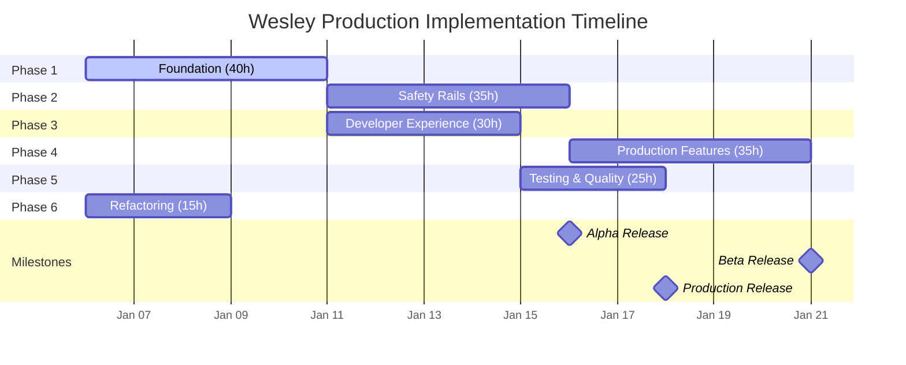

# Implementation Roadmap

## Overview

This roadmap outlines the phased implementation plan for transforming Wesley from prototype to production-grade database migration platform.

## Timeline Summary



## Phase 1: Foundation (Week 1-2)

### Goals
Establish core infrastructure for safe DDL execution with proper lock management.

### Deliverables
- ✅ DDL Planner with lock classification
- ✅ SQL Executor with streaming
- ✅ Transaction-scoped advisory locks
- ✅ Checkpoint management system
- ✅ Migration explainer
- ✅ CIC orchestration

### Key Tasks
| Task | Duration | Priority | Dependencies |
|------|----------|----------|--------------|
| Create DDLPlanner | 8h | P0 | None |
| Implement SQLExecutor | 8h | P0 | DDLPlanner |
| Add advisory locks | 4h | P1 | SQLExecutor |
| SET LOCAL timeouts | 2h | P1 | SQLExecutor |
| CheckpointManager | 6h | P1 | None |
| MigrationExplainer | 4h | P2 | DDLPlanner |
| CIC orchestration | 6h | P0 | DDLPlanner |
| Partitioned tables | 8h | P2 | CIC |

### Success Criteria
- [ ] All DDL operations classified by lock level
- [ ] Streaming execution working
- [ ] CIC runs outside transactions
- [ ] Checkpoints save and restore
- [ ] Migration plans explained

### Risks
- CIC orchestration complexity
- Streaming buffer management
- Checkpoint state consistency

---

## Phase 2: Safety Rails (Week 2-3)

### Goals
Implement production-safe patterns for schema changes without downtime.

### Deliverables
- ✅ NOT VALID pattern for constraints
- ✅ Validation phase scheduling
- ✅ Unique constraint via index
- ✅ Instant column defaults
- ✅ Shadow column strategy
- ✅ Circular FK handling

### Key Tasks
| Task | Duration | Priority | Dependencies |
|------|----------|----------|--------------|
| NOT VALID FKs | 6h | P0 | Phase 1 |
| Validation scheduling | 4h | P1 | NOT VALID |
| Unique via index | 5h | P1 | CIC |
| Instant defaults | 4h | P2 | DDLPlanner |
| Shadow columns | 8h | P1 | Phase 1 |
| Circular FKs | 4h | P2 | NOT VALID |
| Computed triggers | 6h | P2 | DDLPlanner |

### Success Criteria
- [ ] All constraints use safe patterns
- [ ] Type changes don't lock tables
- [ ] Validation scheduled for low traffic
- [ ] Circular dependencies handled
- [ ] No blocking DDL by default

### Risks
- Partitioned table FK limitations
- Shadow column trigger complexity
- Validation window estimation

---

## Phase 3: Developer Experience (Week 2-3)

### Goals
Create delightful development workflow with instant feedback and type safety.

### Deliverables
- ✅ Watch mode with chokidar
- ✅ GraphQL ESLint integration
- ✅ TypeScript generation
- ✅ Zod validators
- ✅ Schema drift detection
- ✅ CLI commands

### Key Tasks
| Task | Duration | Priority | Dependencies |
|------|----------|----------|--------------|
| Chokidar watch | 4h | P0 | None |
| GraphQL ESLint | 3h | P2 | None |
| Code Generator | 4h | P1 | None |
| Zod plugin | 3h | P1 | CodeGen |
| Drift detector | 6h | P0 | DDLPlanner |
| Explain mode | 4h | P1 | Explainer |
| Dry-run mode | 2h | P1 | SQLExecutor |
| Progress monitor | 4h | P1 | SQLExecutor |

### Success Criteria
- [ ] Watch mode responds < 200ms
- [ ] Types and validators generated
- [ ] Drift detection working
- [ ] CLI fully functional
- [ ] Progress visible

### Risks
- Platform-specific file watching
- Type generation edge cases
- Drift detection false positives

---

## Phase 4: Production Features (Week 3-4)

### Goals
Add enterprise-grade reliability and observability features.

### Deliverables
- ✅ Dead column detector
- ✅ Resource bottleneck analysis
- ✅ Checkpoint recovery
- ✅ Rollback generation
- ✅ Backfill batching
- ✅ Validation scheduling

### Key Tasks
| Task | Duration | Priority | Dependencies |
|------|----------|----------|--------------|
| Dead columns | 8h | P2 | None |
| Bottleneck analysis | 6h | P2 | DDLPlanner |
| Recovery system | 8h | P0 | Checkpoints |
| Rollback scripts | 6h | P1 | DDLPlanner |
| Backfill batching | 5h | P1 | Defaults |
| Validation windows | 4h | P2 | Scheduling |

### Success Criteria
- [ ] Dead columns detected accurately
- [ ] Checkpoints tested with failures
- [ ] Rollback scripts generated
- [ ] Backfill respects batch sizes
- [ ] Resource conflicts identified

### Risks
- pg_stat_statements parsing
- Checkpoint corruption handling
- Rollback completeness

---

## Phase 5: Testing & Quality (Week 4)

### Goals
Achieve comprehensive test coverage and quality assurance.

### Deliverables
- ✅ Property-based tests
- ✅ Snapshot tests
- ✅ SQL round-trip validation
- ✅ Integration test suite
- ✅ Performance benchmarks

### Key Tasks
| Task | Duration | Priority | Dependencies |
|------|----------|----------|--------------|
| Property tests | 6h | P0 | None |
| Snapshot tests | 4h | P1 | None |
| SQL round-trip | 5h | P1 | None |
| Integration tests | 6h | P0 | Phase 1-3 |
| Benchmarks | 4h | P2 | None |

### Success Criteria
- [ ] 100% test coverage
- [ ] Property tests find no crashes
- [ ] Snapshots prevent regressions
- [ ] Integration tests pass
- [ ] Performance targets met

### Risks
- Test complexity
- Environment setup
- Performance variability

---

## Phase 6: Refactoring & Cleanup (Ongoing)

### Goals
Address technical debt and improve code quality.

### Deliverables
- ✅ One class per file
- ✅ JSDoc documentation
- ✅ Clean imports
- ✅ No circular dependencies

### Key Tasks
| Task | Duration | Priority | Dependencies |
|------|----------|----------|--------------|
| Split SQLAst.mjs | 4h | P1 | None |
| Split Commands.mjs | 3h | P1 | None |
| Split Events.mjs | 3h | P1 | None |
| Add JSDoc | 3h | P2 | Splits |
| Update imports | 2h | P1 | Splits |

### Success Criteria
- [ ] Single responsibility principle
- [ ] All tests still pass
- [ ] Documentation complete
- [ ] No ESLint errors

### Risks
- Import path errors
- Circular dependencies
- Test breakage

---

## Release Schedule

### Alpha Release (End of Week 2)
**Target Date**: January 17, 2025

**Features**:
- Core DDL planning and execution
- Basic safety patterns
- CLI foundation
- Schema compilation

**Quality Bar**:
- Core functionality working
- Basic tests passing
- Known issues documented
- Not production ready

### Beta Release (End of Week 3)
**Target Date**: January 24, 2025

**Features**:
- All safety patterns implemented
- Developer experience complete
- Production features added
- Comprehensive CLI

**Quality Bar**:
- Feature complete
- 80% test coverage
- Performance acceptable
- Limited production use

### Production Release (End of Week 4)
**Target Date**: January 31, 2025

**Features**:
- Full feature set
- Complete documentation
- Comprehensive testing
- Production hardened

**Quality Bar**:
- 100% test coverage
- All benchmarks pass
- Documentation complete
- Production ready

---

## Resource Allocation

### Team Structure
```
Technical Lead (1)
├── Backend Developer (1-2)
│   ├── DDL Planner
│   ├── SQL Executor
│   └── Safety Patterns
├── Frontend Developer (1)
│   ├── Type Generation
│   ├── CLI Development
│   └── Documentation
└── QA Engineer (0.5)
    ├── Test Development
    ├── Integration Testing
    └── Performance Testing
```

### Time Allocation
| Role | Hours/Week | Total Hours |
|------|------------|-------------|
| Technical Lead | 40 | 160 |
| Backend Dev | 40 | 160 |
| Frontend Dev | 30 | 120 |
| QA Engineer | 20 | 80 |
| **Total** | **130** | **520** |

---

## Risk Management

### High Risk Items

#### 1. CIC Orchestration Complexity
- **Impact**: High
- **Probability**: Medium
- **Mitigation**: Extensive testing, clear documentation
- **Contingency**: Simplified initial implementation

#### 2. Streaming Implementation
- **Impact**: High
- **Probability**: Low
- **Mitigation**: Buffer management, backpressure handling
- **Contingency**: Fallback to batched execution

#### 3. Checkpoint Recovery
- **Impact**: Medium
- **Probability**: Medium
- **Mitigation**: State verification, redundancy
- **Contingency**: Manual recovery procedures

### Risk Matrix
```
         Impact →
    P    Low    Med    High
    r    ___    ___    ___
    o   |   |  | 3 |  |1,2|
    b    ---    ---    ---
    ↓   |4,5|  | 6 |  | 7 |
         ---    ---    ---
        | 8 |  | 9 |  |   |
         ---    ---    ---
        Low    Med    High
```

---

## Success Metrics

### Technical Metrics
| Metric | Target | Measure |
|--------|--------|---------|
| Test Coverage | 100% | Jest/Vitest |
| Performance | <1s for 100 tables | Benchmarks |
| Memory Usage | <100MB baseline | Profiling |
| Lock Time | <5s max | Monitoring |
| Recovery Time | <1 minute | Testing |

### Business Metrics
| Metric | Target | Measure |
|--------|--------|---------|
| Adoption Rate | 10 teams | Analytics |
| Migration Success | >99% | Telemetry |
| Support Tickets | <5/week | Tracking |
| User Satisfaction | >4.5/5 | Surveys |
| Documentation | 100% complete | Review |

---

## Communication Plan

### Stakeholder Updates
- **Weekly**: Progress report to stakeholders
- **Bi-weekly**: Demo of completed features
- **Monthly**: Metrics and KPI review

### Team Communication
- **Daily**: Standup meetings
- **Weekly**: Technical deep dives
- **Sprint**: Retrospectives

### External Communication
- **Alpha**: Limited announcement
- **Beta**: Blog post and documentation
- **Production**: Full launch campaign

---

## Post-Launch Plan

### Week 1-2 Post-Launch
- Monitor production usage
- Address critical issues
- Gather user feedback
- Performance optimization

### Month 1 Post-Launch
- Feature requests triage
- Documentation improvements
- Community engagement
- Success metrics review

### Quarter 1 Post-Launch
- Version 2.0 planning
- Enterprise features
- Integration expansions
- Team scaling

---

## Appendix: Detailed Task Breakdown

See [TASKS/tasks.json](./TASKS/tasks.json) for complete task definitions with:
- Detailed descriptions
- Effort estimates
- Dependencies
- Acceptance criteria
- Implementation notes

---

**[← Back to CLI Reference](./06-cli-reference.md)** | **[↑ Back to README](./README.md)**