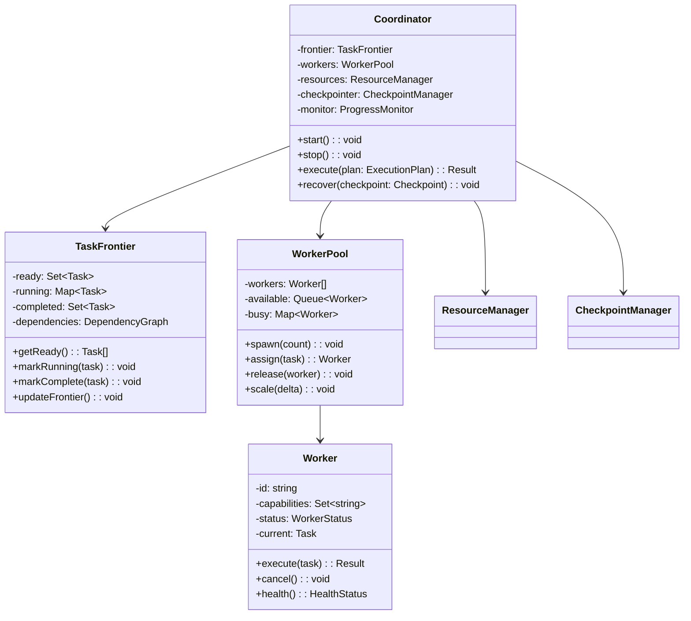

# Coordinator Specification

## Overview

The Coordinator orchestrates rolling frontier execution of migration tasks, managing worker pools, resource allocation, and checkpoint recovery for optimal throughput and reliability.

## Architecture



## Rolling Frontier Algorithm

### Core Implementation

```javascript
class RollingFrontierCoordinator {
  constructor(config) {
    this.config = {
      maxWorkers: config.maxWorkers || 4,
      adaptiveScaling: config.adaptiveScaling || true,
      checkpointInterval: config.checkpointInterval || 30 * 60 * 1000,
      priorityFunction: config.priorityFunction || this.defaultPriority,
      lookaheadDepth: config.lookaheadDepth || 3
    };
    
    this.frontier = new TaskFrontier();
    this.workers = new WorkerPool(this.config.maxWorkers);
    this.resources = new ResourceManager();
    this.checkpointer = new CheckpointManager();
    this.monitor = new ProgressMonitor();
    
    this.state = 'initialized';
    this.startTime = null;
    this.lastCheckpoint = null;
  }
  
  async execute(plan) {
    this.state = 'running';
    this.startTime = Date.now();
    
    // Initialize frontier with ready tasks
    this.frontier.initialize(plan.tasks, plan.dependencies);
    
    // Start monitoring
    this.monitor.start();
    
    // Main execution loop
    while (!this.frontier.isComplete()) {
      // Get ready tasks
      const ready = this.frontier.getReady();
      
      // Sort by priority
      const prioritized = this.prioritize(ready);
      
      // Schedule tasks
      for (const task of prioritized) {
        if (await this.canSchedule(task)) {
          await this.scheduleTask(task);
        }
      }
      
      // Wait for task completion
      await this.waitForCompletion();
      
      // Update frontier
      this.frontier.updateFrontier();
      
      // Checkpoint if needed
      if (this.shouldCheckpoint()) {
        await this.checkpoint();
      }
      
      // Adapt worker pool
      if (this.config.adaptiveScaling) {
        this.adaptWorkerPool();
      }
    }
    
    this.state = 'completed';
    return this.getResult();
  }
  
  prioritize(tasks) {
    return tasks.sort((a, b) => {
      const priorityA = this.calculatePriority(a);
      const priorityB = this.calculatePriority(b);
      return priorityB - priorityA;
    });
  }
  
  calculatePriority(task) {
    let priority = 0;
    
    // Critical path priority
    if (task.onCriticalPath) {
      priority += 1000;
    }
    
    // Business value
    priority += (task.businessValue || 0) * 10;
    
    // Urgency (inverse of slack time)
    const slack = task.latestStart - Date.now();
    priority += Math.max(0, 100 - slack / 1000);
    
    // Resource efficiency
    const resourceScore = this.calculateResourceScore(task);
    priority += resourceScore * 5;
    
    // Risk adjustment
    priority -= (task.riskScore || 0) * 20;
    
    // Lookahead bonus
    const lookaheadScore = this.calculateLookahead(task);
    priority += lookaheadScore * 10;
    
    return priority;
  }
  
  calculateLookahead(task) {
    // How many tasks does this unblock?
    const unblocks = this.frontier.getUnblockedBy(task);
    let score = unblocks.length;
    
    // Recursive lookahead
    for (let depth = 1; depth < this.config.lookaheadDepth; depth++) {
      const nextLevel = new Set();
      for (const unblocked of unblocks) {
        const furtherUnblocked = this.frontier.getUnblockedBy(unblocked);
        furtherUnblocked.forEach(t => nextLevel.add(t));
      }
      score += nextLevel.size / Math.pow(2, depth);
    }
    
    return score;
  }
  
  async canSchedule(task) {
    // Check worker availability
    if (!this.workers.hasAvailable()) {
      return false;
    }
    
    // Check resource availability
    const required = task.resourceRequirements;
    if (!await this.resources.canAllocate(required)) {
      return false;
    }
    
    // Check constraints
    if (!this.checkConstraints(task)) {
      return false;
    }
    
    return true;
  }
  
  async scheduleTask(task) {
    // Mark as running
    this.frontier.markRunning(task);
    
    // Allocate resources
    const resources = await this.resources.allocate(task.resourceRequirements);
    
    // Assign worker
    const worker = await this.workers.assign(task);
    
    // Start execution
    worker.execute(task).then(
      result => this.handleSuccess(task, result, resources, worker),
      error => this.handleFailure(task, error, resources, worker)
    );
    
    // Emit event
    this.emit('task:scheduled', { task, worker: worker.id });
  }
  
  async handleSuccess(task, result, resources, worker) {
    // Mark complete
    this.frontier.markComplete(task);
    
    // Store result
    task.result = result;
    
    // Release resources
    await this.resources.release(resources);
    
    // Release worker
    this.workers.release(worker);
    
    // Update metrics
    this.monitor.recordCompletion(task);
    
    // Emit event
    this.emit('task:completed', { task, result });
  }
  
  async handleFailure(task, error, resources, worker) {
    // Classify error
    const classification = this.classifyError(error);
    
    if (classification.retryable && task.retryCount < 3) {
      // Retry task
      task.retryCount = (task.retryCount || 0) + 1;
      this.frontier.markReady(task);
      
      this.emit('task:retry', { task, error, attempt: task.retryCount });
    } else {
      // Mark failed
      this.frontier.markFailed(task);
      task.error = error;
      
      // Determine impact
      if (task.critical) {
        await this.handleCriticalFailure(task, error);
      }
      
      this.emit('task:failed', { task, error });
    }
    
    // Release resources
    await this.resources.release(resources);
    
    // Release worker
    this.workers.release(worker);
  }
}
```

## Task Frontier Management

### Frontier State Machine

```javascript
class TaskFrontier {
  constructor() {
    this.tasks = new Map();
    this.dependencies = new Map();
    this.dependents = new Map();
    
    this.ready = new Set();
    this.running = new Map();
    this.completed = new Set();
    this.failed = new Set();
  }
  
  initialize(tasks, dependencies) {
    // Store tasks
    for (const task of tasks) {
      this.tasks.set(task.id, task);
      task.state = 'pending';
    }
    
    // Build dependency graph
    for (const [taskId, deps] of dependencies) {
      this.dependencies.set(taskId, new Set(deps));
      
      // Build reverse graph
      for (const dep of deps) {
        if (!this.dependents.has(dep)) {
          this.dependents.set(dep, new Set());
        }
        this.dependents.get(dep).add(taskId);
      }
    }
    
    // Initialize ready tasks (no dependencies)
    for (const task of tasks) {
      if (!this.dependencies.has(task.id) || 
          this.dependencies.get(task.id).size === 0) {
        this.ready.add(task.id);
        task.state = 'ready';
      }
    }
  }
  
  getReady() {
    return Array.from(this.ready).map(id => this.tasks.get(id));
  }
  
  markRunning(task) {
    this.ready.delete(task.id);
    this.running.set(task.id, {
      task,
      startTime: Date.now()
    });
    task.state = 'running';
  }
  
  markComplete(task) {
    this.running.delete(task.id);
    this.completed.add(task.id);
    task.state = 'completed';
    
    // Update frontier - check newly ready tasks
    const dependents = this.dependents.get(task.id) || new Set();
    for (const dependentId of dependents) {
      if (this.isReady(dependentId)) {
        const dependentTask = this.tasks.get(dependentId);
        this.ready.add(dependentId);
        dependentTask.state = 'ready';
      }
    }
  }
  
  markFailed(task) {
    this.running.delete(task.id);
    this.failed.add(task.id);
    task.state = 'failed';
    
    // Mark dependents as blocked
    const dependents = this.getAllDependents(task.id);
    for (const dependentId of dependents) {
      const dependent = this.tasks.get(dependentId);
      dependent.state = 'blocked';
    }
  }
  
  isReady(taskId) {
    // Already running or completed?
    if (this.running.has(taskId) || 
        this.completed.has(taskId) || 
        this.failed.has(taskId)) {
      return false;
    }
    
    // Check all dependencies completed
    const deps = this.dependencies.get(taskId) || new Set();
    for (const depId of deps) {
      if (!this.completed.has(depId)) {
        return false;
      }
    }
    
    return true;
  }
  
  getAllDependents(taskId) {
    const visited = new Set();
    const queue = [taskId];
    
    while (queue.length > 0) {
      const current = queue.shift();
      if (visited.has(current)) continue;
      
      visited.add(current);
      const deps = this.dependents.get(current) || new Set();
      queue.push(...deps);
    }
    
    visited.delete(taskId); // Don't include self
    return visited;
  }
  
  getUnblockedBy(task) {
    const unblocked = [];
    const dependents = this.dependents.get(task.id) || new Set();
    
    for (const dependentId of dependents) {
      const deps = this.dependencies.get(dependentId) || new Set();
      const remainingDeps = Array.from(deps).filter(
        d => !this.completed.has(d) && d !== task.id
      );
      
      if (remainingDeps.length === 0) {
        unblocked.push(this.tasks.get(dependentId));
      }
    }
    
    return unblocked;
  }
  
  isComplete() {
    return this.ready.size === 0 && 
           this.running.size === 0 && 
           this.failed.size === 0;
  }
  
  getProgress() {
    const total = this.tasks.size;
    const completed = this.completed.size;
    const failed = this.failed.size;
    const running = this.running.size;
    const ready = this.ready.size;
    const pending = total - completed - failed - running - ready;
    
    return {
      total,
      completed,
      failed,
      running,
      ready,
      pending,
      percentComplete: (completed / total) * 100,
      percentFailed: (failed / total) * 100
    };
  }
}
```

## Worker Pool Management

### Adaptive Worker Pool

```javascript
class WorkerPool {
  constructor(maxWorkers) {
    this.maxWorkers = maxWorkers;
    this.workers = [];
    this.available = [];
    this.busy = new Map();
    this.metrics = {
      tasksProcessed: 0,
      totalProcessingTime: 0,
      utilizationHistory: []
    };
  }
  
  async spawn(count = this.maxWorkers) {
    for (let i = 0; i < count; i++) {
      const worker = new Worker({
        id: `worker-${i}`,
        capabilities: this.determineCapabilities(i)
      });
      
      await worker.initialize();
      
      this.workers.push(worker);
      this.available.push(worker);
    }
  }
  
  determineCapabilities(index) {
    // Specialize workers based on index
    const capabilities = new Set(['basic']);
    
    if (index < 2) {
      // First two workers handle critical path
      capabilities.add('critical');
      capabilities.add('database');
    }
    
    if (index % 2 === 0) {
      capabilities.add('cpu_intensive');
    } else {
      capabilities.add('io_intensive');
    }
    
    return capabilities;
  }
  
  hasAvailable() {
    return this.available.length > 0;
  }
  
  async assign(task) {
    // Find best worker for task
    const worker = this.selectWorker(task);
    
    if (!worker) {
      throw new Error('No suitable worker available');
    }
    
    // Remove from available
    const index = this.available.indexOf(worker);
    this.available.splice(index, 1);
    
    // Mark as busy
    this.busy.set(worker.id, {
      worker,
      task,
      startTime: Date.now()
    });
    
    // Update metrics
    this.updateUtilization();
    
    return worker;
  }
  
  selectWorker(task) {
    // Prefer worker with matching capabilities
    const preferred = this.available.find(w => 
      task.requiredCapabilities?.every(c => w.capabilities.has(c))
    );
    
    if (preferred) return preferred;
    
    // Fall back to any available
    return this.available[0];
  }
  
  release(worker) {
    // Remove from busy
    const assignment = this.busy.get(worker.id);
    if (assignment) {
      this.busy.delete(worker.id);
      
      // Update metrics
      const duration = Date.now() - assignment.startTime;
      this.metrics.tasksProcessed++;
      this.metrics.totalProcessingTime += duration;
    }
    
    // Return to available
    this.available.push(worker);
    
    // Update utilization
    this.updateUtilization();
  }
  
  scale(delta) {
    if (delta > 0) {
      // Scale up
      const newCount = Math.min(
        this.workers.length + delta,
        this.maxWorkers
      );
      
      for (let i = this.workers.length; i < newCount; i++) {
        const worker = new Worker({
          id: `worker-${i}`,
          capabilities: this.determineCapabilities(i)
        });
        
        worker.initialize().then(() => {
          this.workers.push(worker);
          this.available.push(worker);
        });
      }
    } else if (delta < 0) {
      // Scale down
      const removeCount = Math.min(-delta, this.available.length);
      
      for (let i = 0; i < removeCount; i++) {
        const worker = this.available.pop();
        worker.terminate();
        
        const index = this.workers.indexOf(worker);
        this.workers.splice(index, 1);
      }
    }
  }
  
  updateUtilization() {
    const utilization = this.busy.size / this.workers.length;
    
    this.metrics.utilizationHistory.push({
      timestamp: Date.now(),
      utilization,
      busy: this.busy.size,
      available: this.available.length,
      total: this.workers.length
    });
    
    // Keep only last 5 minutes
    const cutoff = Date.now() - 5 * 60 * 1000;
    this.metrics.utilizationHistory = this.metrics.utilizationHistory.filter(
      m => m.timestamp > cutoff
    );
  }
  
  getMetrics() {
    const recent = this.metrics.utilizationHistory.slice(-60);
    const avgUtilization = recent.reduce((sum, m) => sum + m.utilization, 0) / recent.length;
    
    return {
      workers: this.workers.length,
      busy: this.busy.size,
      available: this.available.length,
      utilization: this.busy.size / this.workers.length,
      avgUtilization,
      tasksProcessed: this.metrics.tasksProcessed,
      avgProcessingTime: this.metrics.totalProcessingTime / this.metrics.tasksProcessed
    };
  }
}
```

## Worker Implementation

### Task Execution Worker

```javascript
class Worker {
  constructor(config) {
    this.id = config.id;
    this.capabilities = config.capabilities || new Set();
    this.status = 'idle';
    this.currentTask = null;
    this.executor = null;
    this.health = {
      lastHeartbeat: Date.now(),
      tasksCompleted: 0,
      tasksFailed: 0,
      totalExecutionTime: 0
    };
  }
  
  async initialize() {
    // Setup execution environment
    this.executor = new TaskExecutor();
    await this.executor.initialize();
    
    // Start heartbeat
    this.heartbeatInterval = setInterval(() => {
      this.health.lastHeartbeat = Date.now();
      this.emit('heartbeat', this.getHealth());
    }, 30000);
    
    this.status = 'ready';
  }
  
  async execute(task) {
    this.status = 'busy';
    this.currentTask = task;
    const startTime = Date.now();
    
    try {
      // Validate task compatibility
      if (!this.canExecute(task)) {
        throw new Error(`Worker ${this.id} cannot execute task ${task.id}`);
      }
      
      // Execute based on task type
      const result = await this.executeTask(task);
      
      // Update health metrics
      this.health.tasksCompleted++;
      this.health.totalExecutionTime += Date.now() - startTime;
      
      this.status = 'idle';
      this.currentTask = null;
      
      return result;
      
    } catch (error) {
      // Update health metrics
      this.health.tasksFailed++;
      
      this.status = 'idle';
      this.currentTask = null;
      
      throw error;
    }
  }
  
  async executeTask(task) {
    switch (task.type) {
      case 'DDL_OPERATION':
        return await this.executeDDL(task);
        
      case 'SQL_GENERATION':
        return await this.generateSQL(task);
        
      case 'TYPE_GENERATION':
        return await this.generateTypes(task);
        
      case 'VALIDATION':
        return await this.validate(task);
        
      case 'CHECKPOINT':
        return await this.checkpoint(task);
        
      default:
        return await this.executor.execute(task);
    }
  }
  
  async executeDDL(task) {
    const executor = new SQLExecutor();
    
    // Stream SQL execution
    const result = await executor.execute({
      sql: task.sql,
      timeout: task.timeout || 30000,
      transaction: task.transaction !== false
    });
    
    return {
      success: true,
      duration: result.duration,
      rowsAffected: result.rowsAffected
    };
  }
  
  canExecute(task) {
    // Check required capabilities
    if (task.requiredCapabilities) {
      for (const required of task.requiredCapabilities) {
        if (!this.capabilities.has(required)) {
          return false;
        }
      }
    }
    
    return true;
  }
  
  cancel() {
    if (this.currentTask && this.executor) {
      this.executor.cancel();
    }
    
    this.status = 'cancelled';
  }
  
  terminate() {
    clearInterval(this.heartbeatInterval);
    
    if (this.executor) {
      this.executor.shutdown();
    }
    
    this.status = 'terminated';
  }
  
  getHealth() {
    return {
      id: this.id,
      status: this.status,
      capabilities: Array.from(this.capabilities),
      currentTask: this.currentTask?.id,
      lastHeartbeat: this.health.lastHeartbeat,
      tasksCompleted: this.health.tasksCompleted,
      tasksFailed: this.health.tasksFailed,
      avgExecutionTime: this.health.totalExecutionTime / 
                        (this.health.tasksCompleted || 1),
      uptime: Date.now() - this.createdAt
    };
  }
}
```

## Adaptive Scaling

### Dynamic Worker Adjustment

```javascript
class AdaptiveScaler {
  constructor(coordinator) {
    this.coordinator = coordinator;
    this.config = {
      minWorkers: 1,
      maxWorkers: 8,
      scaleUpThreshold: 0.8,    // 80% utilization
      scaleDownThreshold: 0.3,  // 30% utilization
      scaleInterval: 60000,     // Check every minute
      cooldownPeriod: 300000    // 5 minute cooldown
    };
    
    this.lastScaleAction = 0;
    this.scalingHistory = [];
  }
  
  start() {
    this.interval = setInterval(() => {
      this.evaluate();
    }, this.config.scaleInterval);
  }
  
  stop() {
    clearInterval(this.interval);
  }
  
  evaluate() {
    // Check cooldown
    if (Date.now() - this.lastScaleAction < this.config.cooldownPeriod) {
      return;
    }
    
    const metrics = this.coordinator.workers.getMetrics();
    const frontier = this.coordinator.frontier.getProgress();
    
    // Calculate scaling decision
    const decision = this.calculateScalingDecision(metrics, frontier);
    
    if (decision !== 0) {
      this.scale(decision);
    }
  }
  
  calculateScalingDecision(metrics, frontier) {
    // Current state
    const utilization = metrics.avgUtilization;
    const queueDepth = frontier.ready;
    const workersCount = metrics.workers;
    
    // Scale up conditions
    if (utilization > this.config.scaleUpThreshold && 
        queueDepth > workersCount &&
        workersCount < this.config.maxWorkers) {
      
      // Calculate how many workers to add
      const targetWorkers = Math.min(
        Math.ceil(queueDepth / 2),
        this.config.maxWorkers - workersCount
      );
      
      return targetWorkers;
    }
    
    // Scale down conditions
    if (utilization < this.config.scaleDownThreshold &&
        workersCount > this.config.minWorkers) {
      
      // Calculate how many workers to remove
      const targetWorkers = Math.max(
        Math.floor(workersCount * utilization),
        this.config.minWorkers
      );
      
      return targetWorkers - workersCount;
    }
    
    return 0;
  }
  
  scale(delta) {
    console.log(`Scaling workers by ${delta > 0 ? '+' : ''}${delta}`);
    
    this.coordinator.workers.scale(delta);
    this.lastScaleAction = Date.now();
    
    // Record history
    this.scalingHistory.push({
      timestamp: Date.now(),
      action: delta > 0 ? 'scale_up' : 'scale_down',
      delta,
      reason: this.getScalingReason(delta)
    });
    
    // Emit event
    this.coordinator.emit('scaling', {
      delta,
      newWorkerCount: this.coordinator.workers.workers.length
    });
  }
  
  getScalingReason(delta) {
    const metrics = this.coordinator.workers.getMetrics();
    const frontier = this.coordinator.frontier.getProgress();
    
    if (delta > 0) {
      return `High utilization (${(metrics.avgUtilization * 100).toFixed(1)}%) with ${frontier.ready} tasks queued`;
    } else {
      return `Low utilization (${(metrics.avgUtilization * 100).toFixed(1)}%) with ${frontier.ready} tasks queued`;
    }
  }
}
```

## Checkpoint and Recovery

### State Persistence

```javascript
class CoordinatorCheckpoint {
  constructor(coordinator) {
    this.coordinator = coordinator;
    this.storageDir = '.wesley/coordinator/checkpoints';
  }
  
  async save() {
    const state = {
      version: '1.0.0',
      timestamp: new Date().toISOString(),
      coordinator: {
        startTime: this.coordinator.startTime,
        state: this.coordinator.state
      },
      frontier: {
        completed: Array.from(this.coordinator.frontier.completed),
        failed: Array.from(this.coordinator.frontier.failed),
        running: Array.from(this.coordinator.frontier.running.entries()).map(
          ([id, info]) => ({
            id,
            startTime: info.startTime
          })
        ),
        ready: Array.from(this.coordinator.frontier.ready)
      },
      workers: {
        count: this.coordinator.workers.workers.length,
        metrics: this.coordinator.workers.getMetrics()
      },
      tasks: this.serializeTasks(),
      results: this.serializeResults()
    };
    
    const checkpointId = uuidv4();
    const filePath = path.join(this.storageDir, `${checkpointId}.json`);
    
    // Atomic write
    const tempPath = `${filePath}.tmp`;
    await fs.writeFile(tempPath, JSON.stringify(state, null, 2));
    await fs.rename(tempPath, filePath);
    
    return checkpointId;
  }
  
  async restore(checkpointId) {
    const filePath = path.join(this.storageDir, `${checkpointId}.json`);
    const content = await fs.readFile(filePath, 'utf8');
    const state = JSON.parse(content);
    
    // Validate version
    if (state.version !== '1.0.0') {
      throw new Error(`Unsupported checkpoint version: ${state.version}`);
    }
    
    // Restore coordinator state
    this.coordinator.startTime = state.coordinator.startTime;
    this.coordinator.state = 'recovering';
    
    // Restore frontier
    this.coordinator.frontier.completed = new Set(state.frontier.completed);
    this.coordinator.frontier.failed = new Set(state.frontier.failed);
    this.coordinator.frontier.ready = new Set(state.frontier.ready);
    
    // Restore task states
    for (const taskData of state.tasks) {
      const task = this.coordinator.frontier.tasks.get(taskData.id);
      if (task) {
        Object.assign(task, taskData);
      }
    }
    
    // Spawn workers
    await this.coordinator.workers.spawn(state.workers.count);
    
    // Update frontier for incomplete tasks
    for (const runningInfo of state.frontier.running) {
      const task = this.coordinator.frontier.tasks.get(runningInfo.id);
      if (task) {
        // Check if task actually completed
        if (await this.verifyTaskCompletion(task)) {
          this.coordinator.frontier.markComplete(task);
        } else {
          // Re-add to ready queue
          this.coordinator.frontier.ready.add(task.id);
          task.state = 'ready';
          task.retryCount = (task.retryCount || 0) + 1;
        }
      }
    }
    
    this.coordinator.state = 'running';
    
    return {
      checkpointId,
      recovered: {
        completed: state.frontier.completed.length,
        ready: this.coordinator.frontier.ready.size,
        failed: state.frontier.failed.length
      }
    };
  }
  
  serializeTasks() {
    const tasks = [];
    
    for (const [id, task] of this.coordinator.frontier.tasks) {
      tasks.push({
        id: task.id,
        state: task.state,
        result: task.result,
        error: task.error ? {
          message: task.error.message,
          stack: task.error.stack
        } : null,
        retryCount: task.retryCount || 0
      });
    }
    
    return tasks;
  }
  
  serializeResults() {
    const results = {};
    
    for (const taskId of this.coordinator.frontier.completed) {
      const task = this.coordinator.frontier.tasks.get(taskId);
      if (task && task.result) {
        results[taskId] = task.result;
      }
    }
    
    return results;
  }
  
  async verifyTaskCompletion(task) {
    // Implement task-specific verification
    switch (task.type) {
      case 'DDL_OPERATION':
        return await this.verifyDDLOperation(task);
      case 'FILE_GENERATION':
        return await this.verifyFileGeneration(task);
      default:
        return false;
    }
  }
}
```

## Configuration

```javascript
const coordinatorConfig = {
  // Execution model
  mode: 'rolling_frontier',
  
  // Worker configuration
  workers: {
    min: 1,
    max: 4,
    initial: 2,
    adaptive: true,
    capabilities: {
      primary: ['critical', 'database'],
      secondary: ['cpu_intensive', 'io_intensive']
    }
  },
  
  // Resource limits
  resources: {
    maxConcurrentDDL: 4,
    maxConcurrentCIC: 1,
    maxMemoryGB: 16,
    maxCPUPercent: 80
  },
  
  // Scheduling
  scheduling: {
    algorithm: 'priority_with_lookahead',
    lookaheadDepth: 3,
    priorityWeights: {
      criticalPath: 1000,
      businessValue: 10,
      urgency: 100,
      resourceEfficiency: 5,
      risk: -20,
      lookahead: 10
    }
  },
  
  // Checkpointing
  checkpoint: {
    enabled: true,
    interval: 30 * 60 * 1000, // 30 minutes
    retention: 10,
    storage: '.wesley/coordinator/checkpoints'
  },
  
  // Scaling
  scaling: {
    enabled: true,
    minWorkers: 1,
    maxWorkers: 8,
    scaleUpThreshold: 0.8,
    scaleDownThreshold: 0.3,
    scaleInterval: 60000,
    cooldownPeriod: 300000
  },
  
  // Monitoring
  monitoring: {
    enabled: true,
    metricsInterval: 1000,
    reportInterval: 60000,
    alerting: {
      utilizationHigh: 0.9,
      utilizationLow: 0.2,
      taskFailureRate: 0.1,
      queueDepthHigh: 20
    }
  },
  
  // Failure handling
  failure: {
    maxRetries: 3,
    retryBackoff: 'exponential',
    criticalFailureAction: 'pause',
    nonCriticalFailureAction: 'continue'
  }
};
```

---

**[← Back to SQL Executor](./sql-executor.md)** | **[↑ Up to Specs](./)