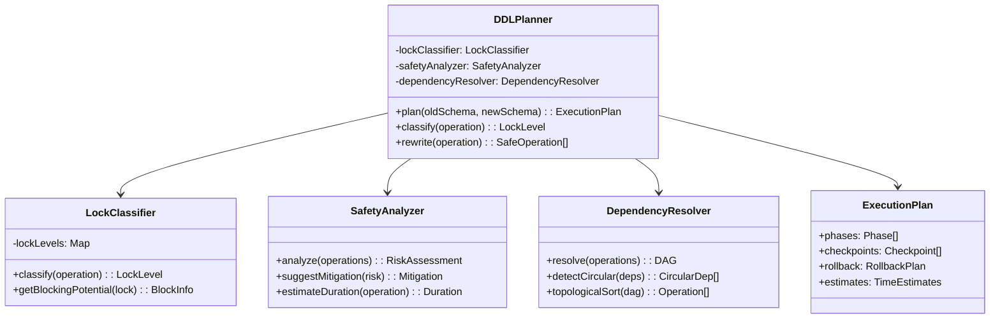

# DDL Planner Specification

## Overview

The DDL Planner is responsible for analyzing GraphQL schema changes and producing a safe, lock-aware execution plan for PostgreSQL DDL operations.

## Component Architecture



## Lock Classification

### PostgreSQL Lock Levels

```javascript
const LOCK_LEVELS = {
  ACCESS_SHARE: 1,           // SELECT
  ROW_SHARE: 2,              // SELECT FOR UPDATE
  ROW_EXCLUSIVE: 3,          // INSERT, UPDATE, DELETE
  SHARE_UPDATE_EXCLUSIVE: 4, // VACUUM, CIC, VALIDATE
  SHARE: 5,                  // CREATE INDEX
  SHARE_ROW_EXCLUSIVE: 6,    // ALTER TABLE, DROP INDEX
  EXCLUSIVE: 7,              // REFRESH MATERIALIZED VIEW
  ACCESS_EXCLUSIVE: 8        // DROP, ALTER COLUMN, TRUNCATE
};

class LockClassifier {
  classify(operation) {
    switch (operation.type) {
      case 'CREATE_INDEX':
        return operation.concurrently 
          ? LOCK_LEVELS.SHARE_UPDATE_EXCLUSIVE 
          : LOCK_LEVELS.SHARE;
          
      case 'ADD_COLUMN':
        return operation.hasDefault && !this.isConstantDefault(operation.default)
          ? LOCK_LEVELS.ACCESS_EXCLUSIVE
          : LOCK_LEVELS.ACCESS_EXCLUSIVE; // Still exclusive but instant on PG11+
          
      case 'ADD_CONSTRAINT':
        return operation.notValid
          ? LOCK_LEVELS.SHARE_ROW_EXCLUSIVE
          : LOCK_LEVELS.ACCESS_EXCLUSIVE;
          
      case 'VALIDATE_CONSTRAINT':
        return LOCK_LEVELS.SHARE_UPDATE_EXCLUSIVE;
        
      case 'DROP_COLUMN':
      case 'ALTER_COLUMN_TYPE':
        return LOCK_LEVELS.ACCESS_EXCLUSIVE;
        
      default:
        return LOCK_LEVELS.ACCESS_EXCLUSIVE; // Safe default
    }
  }
  
  getBlockingPotential(lockLevel) {
    return {
      blocksReads: lockLevel >= LOCK_LEVELS.ACCESS_EXCLUSIVE,
      blocksWrites: lockLevel >= LOCK_LEVELS.SHARE,
      blocksDDL: lockLevel >= LOCK_LEVELS.SHARE_UPDATE_EXCLUSIVE,
      conflictsWith: this.getConflictingLocks(lockLevel)
    };
  }
}
```

## Operation Rewriting

### Safe Pattern Transformations

```javascript
class OperationRewriter {
  rewrite(operation) {
    switch (operation.type) {
      case 'CREATE_INDEX':
        return this.rewriteCreateIndex(operation);
      case 'ADD_FOREIGN_KEY':
        return this.rewriteForeignKey(operation);
      case 'ADD_UNIQUE':
        return this.rewriteUniqueConstraint(operation);
      case 'ADD_NOT_NULL':
        return this.rewriteNotNull(operation);
      case 'ALTER_COLUMN_TYPE':
        return this.rewriteTypeChange(operation);
      default:
        return [operation];
    }
  }
  
  rewriteCreateIndex(op) {
    if (op.table.isPartitioned) {
      return this.rewritePartitionedIndex(op);
    }
    
    return [{
      ...op,
      type: 'CREATE_INDEX_CONCURRENTLY',
      phase: 'non_transactional',
      requiresExclusiveExecution: true
    }];
  }
  
  rewriteForeignKey(op) {
    if (op.table.isPartitioned) {
      // Partitioned tables can't use NOT VALID
      return [op];
    }
    
    return [
      {
        ...op,
        type: 'ADD_FOREIGN_KEY_NOT_VALID',
        phase: 'transactional'
      },
      {
        type: 'VALIDATE_CONSTRAINT',
        constraint: op.name,
        table: op.table,
        phase: 'validation',
        scheduleWindow: 'low_traffic'
      }
    ];
  }
  
  rewritePartitionedIndex(op) {
    const operations = [];
    
    // Create parent index (invalid)
    operations.push({
      type: 'CREATE_INDEX',
      table: op.table,
      columns: op.columns,
      name: op.name,
      only: true,
      phase: 'transactional'
    });
    
    // Create on each partition concurrently
    for (const partition of op.table.partitions) {
      operations.push({
        type: 'CREATE_INDEX_CONCURRENTLY',
        table: partition,
        columns: op.columns,
        name: `${op.name}_${partition.name}`,
        phase: 'non_transactional'
      });
    }
    
    // Attach partition indexes
    for (const partition of op.table.partitions) {
      operations.push({
        type: 'ALTER_INDEX_ATTACH',
        parent: op.name,
        child: `${op.name}_${partition.name}`,
        phase: 'transactional'
      });
    }
    
    return operations;
  }
}
```

## Execution Planning

### Phase Assignment

```javascript
class ExecutionPlanner {
  plan(operations) {
    const phases = {
      non_transactional: [],  // CIC operations
      transactional: [],      // Main DDL batch
      validation: []          // Constraint validations
    };
    
    // Classify operations into phases
    for (const op of operations) {
      phases[op.phase || 'transactional'].push(op);
    }
    
    // Order operations within phases
    phases.non_transactional = this.orderCICOperations(
      phases.non_transactional
    );
    phases.transactional = this.orderByDependencies(
      phases.transactional
    );
    phases.validation = this.orderByPriority(
      phases.validation
    );
    
    return new ExecutionPlan(phases);
  }
  
  orderCICOperations(operations) {
    // Group by table to enforce one-per-table limit
    const byTable = new Map();
    for (const op of operations) {
      if (!byTable.has(op.table.name)) {
        byTable.set(op.table.name, []);
      }
      byTable.get(op.table.name).push(op);
    }
    
    // Serialize operations on same table
    const ordered = [];
    for (const [table, ops] of byTable) {
      ordered.push(...ops);
    }
    
    return ordered;
  }
}
```

## Dependency Resolution

### Dependency Graph Construction

```javascript
class DependencyResolver {
  buildGraph(operations) {
    const graph = new Map();
    
    for (const op of operations) {
      graph.set(op.id, {
        operation: op,
        dependencies: this.findDependencies(op, operations),
        dependents: []
      });
    }
    
    // Build reverse edges
    for (const [id, node] of graph) {
      for (const depId of node.dependencies) {
        graph.get(depId).dependents.push(id);
      }
    }
    
    return graph;
  }
  
  findDependencies(op, allOps) {
    const deps = [];
    
    switch (op.type) {
      case 'ADD_FOREIGN_KEY':
        // Depends on referenced table existing
        deps.push(...this.findTableCreation(op.referencedTable, allOps));
        break;
        
      case 'CREATE_INDEX':
        // Depends on columns existing
        deps.push(...this.findColumnCreation(op.columns, allOps));
        break;
        
      case 'VALIDATE_CONSTRAINT':
        // Depends on constraint creation
        deps.push(...this.findConstraintCreation(op.constraint, allOps));
        break;
    }
    
    return deps;
  }
  
  topologicalSort(graph) {
    const sorted = [];
    const visited = new Set();
    const visiting = new Set();
    
    const visit = (nodeId) => {
      if (visited.has(nodeId)) return;
      if (visiting.has(nodeId)) {
        throw new Error(`Circular dependency detected at ${nodeId}`);
      }
      
      visiting.add(nodeId);
      const node = graph.get(nodeId);
      
      for (const depId of node.dependencies) {
        visit(depId);
      }
      
      visiting.delete(nodeId);
      visited.add(nodeId);
      sorted.push(node.operation);
    };
    
    for (const nodeId of graph.keys()) {
      visit(nodeId);
    }
    
    return sorted;
  }
}
```

## Risk Assessment

### Safety Analysis

```javascript
class SafetyAnalyzer {
  analyze(plan) {
    const assessment = {
      overallRisk: 'LOW',
      risks: [],
      mitigations: [],
      estimates: {}
    };
    
    for (const phase of plan.phases) {
      for (const op of phase.operations) {
        const risk = this.assessOperation(op);
        if (risk.level !== 'LOW') {
          assessment.risks.push(risk);
          assessment.mitigations.push(
            this.suggestMitigation(risk)
          );
        }
        assessment.estimates[op.id] = this.estimateDuration(op);
      }
    }
    
    assessment.overallRisk = this.calculateOverallRisk(
      assessment.risks
    );
    
    return assessment;
  }
  
  assessOperation(op) {
    const risk = {
      operation: op,
      level: 'LOW',
      factors: []
    };
    
    // Lock impact
    const lockLevel = this.lockClassifier.classify(op);
    if (lockLevel >= LOCK_LEVELS.ACCESS_EXCLUSIVE) {
      risk.level = 'HIGH';
      risk.factors.push('Blocks all access');
    } else if (lockLevel >= LOCK_LEVELS.SHARE) {
      risk.level = 'MEDIUM';
      risk.factors.push('Blocks writes');
    }
    
    // Table size impact
    if (op.table && op.table.estimatedRows > 1000000) {
      risk.level = this.escalateRisk(risk.level);
      risk.factors.push('Large table');
    }
    
    // Operation type risks
    if (op.type === 'ALTER_COLUMN_TYPE') {
      risk.level = 'HIGH';
      risk.factors.push('Table rewrite required');
    }
    
    return risk;
  }
  
  estimateDuration(op) {
    const baseTime = this.getBaseTime(op.type);
    const tableFactor = op.table 
      ? Math.log10(op.table.estimatedRows || 1000) 
      : 1;
    const lockFactor = op.type.includes('CONCURRENTLY') ? 2 : 1;
    
    return {
      optimistic: baseTime * tableFactor * lockFactor * 0.5,
      expected: baseTime * tableFactor * lockFactor,
      pessimistic: baseTime * tableFactor * lockFactor * 2
    };
  }
}
```

## Rollback Planning

### Compensating Operations

```javascript
class RollbackPlanner {
  generateRollback(plan) {
    const rollback = {
      operations: [],
      warnings: [],
      dataLossRisk: false
    };
    
    // Reverse operation order
    const allOps = plan.getAllOperations().reverse();
    
    for (const op of allOps) {
      const compensating = this.generateCompensating(op);
      if (compensating) {
        rollback.operations.push(compensating);
        if (compensating.dataLoss) {
          rollback.dataLossRisk = true;
          rollback.warnings.push(
            `Rolling back ${op.type} may cause data loss`
          );
        }
      } else {
        rollback.warnings.push(
          `Cannot automatically rollback ${op.type}`
        );
      }
    }
    
    return rollback;
  }
  
  generateCompensating(op) {
    switch (op.type) {
      case 'CREATE_TABLE':
        return {
          type: 'DROP_TABLE',
          table: op.table,
          cascade: false,
          dataLoss: true
        };
        
      case 'ADD_COLUMN':
        return {
          type: 'DROP_COLUMN',
          table: op.table,
          column: op.column,
          dataLoss: true
        };
        
      case 'CREATE_INDEX':
      case 'CREATE_INDEX_CONCURRENTLY':
        return {
          type: 'DROP_INDEX',
          index: op.name,
          concurrently: true,
          dataLoss: false
        };
        
      case 'ADD_CONSTRAINT':
        return {
          type: 'DROP_CONSTRAINT',
          table: op.table,
          constraint: op.name,
          dataLoss: false
        };
        
      case 'ALTER_COLUMN_TYPE':
        // Cannot automatically rollback
        return null;
        
      default:
        return null;
    }
  }
}
```

## Usage Example

```javascript
// Initialize planner
const planner = new DDLPlanner({
  lockClassifier: new LockClassifier(),
  safetyAnalyzer: new SafetyAnalyzer(),
  dependencyResolver: new DependencyResolver(),
  rewriter: new OperationRewriter(),
  rollbackPlanner: new RollbackPlanner()
});

// Generate plan
const oldSchema = await introspectSchema();
const newSchema = parseGraphQL(sdl);
const changes = calculateDiff(oldSchema, newSchema);

const plan = await planner.plan(changes);

// Review plan
console.log('Execution Plan:');
console.log(`Phase 1 (Non-transactional): ${plan.phases[0].length} operations`);
console.log(`Phase 2 (Transactional): ${plan.phases[1].length} operations`);
console.log(`Phase 3 (Validation): ${plan.phases[2].length} operations`);

console.log('\nRisk Assessment:');
console.log(`Overall Risk: ${plan.assessment.overallRisk}`);
console.log(`Estimated Duration: ${plan.estimates.total}`);

console.log('\nRollback Available:', plan.rollback.isComplete);

// Execute with confirmation
if (await confirm('Proceed with migration?')) {
  const executor = new SQLExecutor();
  await executor.execute(plan);
}
```

## Configuration

```javascript
const config = {
  // Safety settings
  safety: {
    requireExplicitUnsafe: true,
    blockingOperationsAllowed: false,
    maxLockDuration: '5s',
    maxStatementDuration: '30s'
  },
  
  // Planning preferences
  planning: {
    preferConcurrent: true,
    batchTransactional: true,
    validationWindow: 'low_traffic',
    checkpointFrequency: '25%'
  },
  
  // Resource limits
  resources: {
    maxConcurrentCIC: 1,
    maxParallelOperations: 4,
    maxMemoryUsage: '1GB'
  },
  
  // Rollback settings
  rollback: {
    generateAlways: true,
    testRollback: false,
    preserveData: true
  }
};
```

---

**Next: [SQL Executor Spec →](./sql-executor.md)**

**[← Back to README](../README.md)** | **[↑ Up to Specs](./)