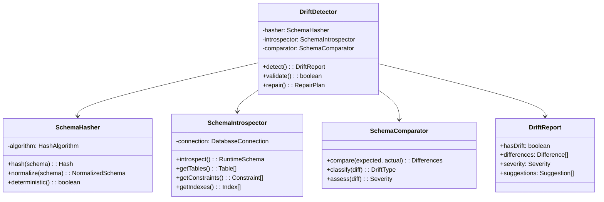

# Schema Drift Detection Specification

## Overview

Schema drift detection ensures runtime database state matches the compiled schema, catching configuration drift and preventing "works on my machine" issues.

## Architecture



## Hash Generation

### Deterministic Schema Hashing

```javascript
class SchemaHasher {
  constructor() {
    this.algorithm = 'sha256';
    this.version = '1.0.0';
  }
  
  hash(schema) {
    // Normalize schema for deterministic hashing
    const normalized = this.normalize(schema);
    
    // Create hash input
    const input = {
      version: this.version,
      tables: this.hashTables(normalized.tables),
      constraints: this.hashConstraints(normalized.constraints),
      indexes: this.hashIndexes(normalized.indexes),
      policies: this.hashPolicies(normalized.policies)
    };
    
    // Generate hash
    const content = JSON.stringify(input, null, 0);
    return crypto
      .createHash(this.algorithm)
      .update(content)
      .digest('hex');
  }
  
  normalize(schema) {
    return {
      tables: this.normalizeTables(schema.tables),
      constraints: this.normalizeConstraints(schema.constraints),
      indexes: this.normalizeIndexes(schema.indexes),
      policies: this.normalizePolicies(schema.policies)
    };
  }
  
  normalizeTables(tables) {
    // Sort tables by name
    const sorted = [...tables].sort((a, b) => 
      a.name.localeCompare(b.name)
    );
    
    return sorted.map(table => ({
      name: table.name,
      columns: this.normalizeColumns(table.columns),
      primaryKey: table.primaryKey,
      checks: this.normalizeChecks(table.checks)
    }));
  }
  
  normalizeColumns(columns) {
    // Sort columns by ordinal position
    const sorted = [...columns].sort((a, b) => 
      a.ordinal - b.ordinal
    );
    
    return sorted.map(col => ({
      name: col.name,
      type: this.normalizeType(col.type),
      nullable: col.nullable,
      default: this.normalizeDefault(col.default),
      generated: col.generated
    }));
  }
  
  normalizeType(type) {
    // Normalize type aliases
    const aliases = {
      'int': 'integer',
      'int4': 'integer',
      'int8': 'bigint',
      'bool': 'boolean',
      'varchar': 'character varying',
      'timestamp': 'timestamp without time zone'
    };
    
    const base = type.toLowerCase().split('(')[0];
    return aliases[base] || base;
  }
  
  normalizeDefault(defaultValue) {
    if (!defaultValue) return null;
    
    // Strip type casts
    let normalized = defaultValue.replace(/::\w+/g, '');
    
    // Normalize common functions
    normalized = normalized
      .replace(/current_timestamp/gi, 'CURRENT_TIMESTAMP')
      .replace(/now\(\)/gi, 'CURRENT_TIMESTAMP')
      .replace(/uuid_generate_v4\(\)/gi, 'gen_random_uuid()');
    
    return normalized;
  }
}
```

## Schema Introspection

### Runtime Schema Discovery

```javascript
class SchemaIntrospector {
  constructor(connection) {
    this.connection = connection;
  }
  
  async introspect() {
    const schema = {
      tables: await this.getTables(),
      constraints: await this.getConstraints(),
      indexes: await this.getIndexes(),
      policies: await this.getPolicies(),
      triggers: await this.getTriggers()
    };
    
    // Link relationships
    this.linkRelationships(schema);
    
    return schema;
  }
  
  async getTables() {
    const query = `
      SELECT 
        c.oid,
        c.relname AS name,
        n.nspname AS schema,
        c.relkind AS kind,
        obj_description(c.oid) AS comment
      FROM pg_class c
      JOIN pg_namespace n ON n.oid = c.relnamespace
      WHERE c.relkind IN ('r', 'p')  -- regular and partitioned
        AND n.nspname NOT IN ('pg_catalog', 'information_schema')
        AND n.nspname NOT LIKE 'pg_%'
      ORDER BY n.nspname, c.relname
    `;
    
    const tables = await this.connection.query(query);
    
    // Get columns for each table
    for (const table of tables) {
      table.columns = await this.getColumns(table.oid);
      table.isPartitioned = table.kind === 'p';
    }
    
    return tables;
  }
  
  async getColumns(tableOid) {
    const query = `
      SELECT 
        a.attname AS name,
        a.attnum AS ordinal,
        t.typname AS type,
        a.atttypmod AS type_modifier,
        a.attnotnull AS not_null,
        a.atthasdef AS has_default,
        a.attgenerated AS generated,
        a.attidentity AS identity,
        pg_get_expr(d.adbin, d.adrelid) AS default_expr,
        col_description(a.attrelid, a.attnum) AS comment
      FROM pg_attribute a
      JOIN pg_type t ON t.oid = a.atttypid
      LEFT JOIN pg_attrdef d ON d.adrelid = a.attrelid 
        AND d.adnum = a.attnum
      WHERE a.attrelid = $1
        AND a.attnum > 0
        AND NOT a.attisdropped
      ORDER BY a.attnum
    `;
    
    const columns = await this.connection.query(query, [tableOid]);
    
    return columns.map(col => ({
      name: col.name,
      ordinal: col.ordinal,
      type: this.formatType(col.type, col.type_modifier),
      nullable: !col.not_null,
      default: col.default_expr,
      generated: col.generated,
      identity: col.identity,
      comment: col.comment
    }));
  }
  
  async getConstraints() {
    const query = `
      SELECT 
        c.conname AS name,
        c.contype AS type,
        c.condeferrable AS deferrable,
        c.condeferred AS deferred,
        c.convalidated AS validated,
        r.relname AS table_name,
        n.nspname AS schema_name,
        pg_get_constraintdef(c.oid) AS definition,
        ARRAY(
          SELECT a.attname
          FROM pg_attribute a
          WHERE a.attrelid = c.conrelid
            AND a.attnum = ANY(c.conkey)
          ORDER BY array_position(c.conkey, a.attnum)
        ) AS columns,
        fr.relname AS foreign_table,
        ARRAY(
          SELECT a.attname
          FROM pg_attribute a
          WHERE a.attrelid = c.confrelid
            AND a.attnum = ANY(c.confkey)
          ORDER BY array_position(c.confkey, a.attnum)
        ) AS foreign_columns
      FROM pg_constraint c
      JOIN pg_class r ON r.oid = c.conrelid
      JOIN pg_namespace n ON n.oid = r.relnamespace
      LEFT JOIN pg_class fr ON fr.oid = c.confrelid
      WHERE n.nspname NOT IN ('pg_catalog', 'information_schema')
      ORDER BY n.nspname, r.relname, c.conname
    `;
    
    const constraints = await this.connection.query(query);
    
    return constraints.map(con => ({
      name: con.name,
      type: this.mapConstraintType(con.type),
      table: con.table_name,
      schema: con.schema_name,
      columns: con.columns,
      deferrable: con.deferrable,
      deferred: con.deferred,
      validated: con.validated,
      definition: con.definition,
      foreignTable: con.foreign_table,
      foreignColumns: con.foreign_columns
    }));
  }
  
  async getIndexes() {
    const query = `
      SELECT 
        i.indexrelid::regclass AS name,
        i.indrelid::regclass AS table,
        i.indisunique AS is_unique,
        i.indisprimary AS is_primary,
        i.indisvalid AS is_valid,
        i.indisclustered AS is_clustered,
        am.amname AS method,
        ARRAY(
          SELECT a.attname
          FROM pg_attribute a
          WHERE a.attrelid = i.indrelid
            AND a.attnum = ANY(i.indkey)
          ORDER BY array_position(i.indkey, a.attnum)
        ) AS columns,
        pg_get_indexdef(i.indexrelid) AS definition,
        pg_get_expr(i.indpred, i.indrelid) AS predicate,
        c.reloptions AS options
      FROM pg_index i
      JOIN pg_class c ON c.oid = i.indexrelid
      JOIN pg_am am ON am.oid = c.relam
      JOIN pg_namespace n ON n.oid = c.relnamespace
      WHERE n.nspname NOT IN ('pg_catalog', 'information_schema')
        AND NOT i.indisprimary  -- Exclude primary key indexes
      ORDER BY i.indrelid::regclass::text, c.relname
    `;
    
    const indexes = await this.connection.query(query);
    
    return indexes.map(idx => ({
      name: this.parseIndexName(idx.name),
      table: this.parseTableName(idx.table),
      columns: idx.columns,
      unique: idx.is_unique,
      valid: idx.is_valid,
      method: idx.method,
      predicate: idx.predicate,
      definition: idx.definition,
      options: idx.options
    }));
  }
}
```

## Drift Detection

### Comparison Logic

```javascript
class SchemaComparator {
  compare(expected, actual) {
    const differences = [];
    
    // Compare tables
    differences.push(...this.compareTables(
      expected.tables,
      actual.tables
    ));
    
    // Compare constraints
    differences.push(...this.compareConstraints(
      expected.constraints,
      actual.constraints
    ));
    
    // Compare indexes
    differences.push(...this.compareIndexes(
      expected.indexes,
      actual.indexes
    ));
    
    // Compare policies
    differences.push(...this.comparePolicies(
      expected.policies,
      actual.policies
    ));
    
    return differences;
  }
  
  compareTables(expected, actual) {
    const differences = [];
    const actualMap = new Map(actual.map(t => [t.name, t]));
    const expectedMap = new Map(expected.map(t => [t.name, t]));
    
    // Find missing tables
    for (const [name, table] of expectedMap) {
      if (!actualMap.has(name)) {
        differences.push({
          type: 'TABLE_MISSING',
          severity: 'HIGH',
          table: name,
          expected: table,
          actual: null,
          message: `Table '${name}' exists in schema but not in database`
        });
      }
    }
    
    // Find extra tables
    for (const [name, table] of actualMap) {
      if (!expectedMap.has(name)) {
        differences.push({
          type: 'TABLE_EXTRA',
          severity: 'MEDIUM',
          table: name,
          expected: null,
          actual: table,
          message: `Table '${name}' exists in database but not in schema`
        });
      }
    }
    
    // Compare table structure
    for (const [name, expectedTable] of expectedMap) {
      const actualTable = actualMap.get(name);
      if (actualTable) {
        differences.push(...this.compareTableStructure(
          expectedTable,
          actualTable
        ));
      }
    }
    
    return differences;
  }
  
  compareTableStructure(expected, actual) {
    const differences = [];
    
    // Compare columns
    const columnDiffs = this.compareColumns(
      expected.columns,
      actual.columns
    );
    
    for (const diff of columnDiffs) {
      differences.push({
        ...diff,
        table: expected.name
      });
    }
    
    return differences;
  }
  
  compareColumns(expected, actual) {
    const differences = [];
    const actualMap = new Map(actual.map(c => [c.name, c]));
    const expectedMap = new Map(expected.map(c => [c.name, c]));
    
    // Missing columns
    for (const [name, col] of expectedMap) {
      if (!actualMap.has(name)) {
        differences.push({
          type: 'COLUMN_MISSING',
          severity: 'HIGH',
          column: name,
          expected: col,
          actual: null,
          message: `Column '${name}' missing from database`
        });
      }
    }
    
    // Extra columns
    for (const [name, col] of actualMap) {
      if (!expectedMap.has(name)) {
        differences.push({
          type: 'COLUMN_EXTRA',
          severity: 'LOW',
          column: name,
          expected: null,
          actual: col,
          message: `Column '${name}' exists in database but not in schema`
        });
      }
    }
    
    // Compare column properties
    for (const [name, expectedCol] of expectedMap) {
      const actualCol = actualMap.get(name);
      if (actualCol) {
        // Type mismatch
        if (expectedCol.type !== actualCol.type) {
          differences.push({
            type: 'COLUMN_TYPE_MISMATCH',
            severity: 'HIGH',
            column: name,
            expected: expectedCol.type,
            actual: actualCol.type,
            message: `Column '${name}' type mismatch`
          });
        }
        
        // Nullability mismatch
        if (expectedCol.nullable !== actualCol.nullable) {
          differences.push({
            type: 'COLUMN_NULLABILITY_MISMATCH',
            severity: 'MEDIUM',
            column: name,
            expected: expectedCol.nullable,
            actual: actualCol.nullable,
            message: `Column '${name}' nullability mismatch`
          });
        }
        
        // Default mismatch
        if (this.normalizeDefault(expectedCol.default) !== 
            this.normalizeDefault(actualCol.default)) {
          differences.push({
            type: 'COLUMN_DEFAULT_MISMATCH',
            severity: 'LOW',
            column: name,
            expected: expectedCol.default,
            actual: actualCol.default,
            message: `Column '${name}' default value mismatch`
          });
        }
      }
    }
    
    return differences;
  }
}
```

## Drift Classification

### Severity Assessment

```javascript
class DriftClassifier {
  classify(differences) {
    const classification = {
      critical: [],
      high: [],
      medium: [],
      low: [],
      info: []
    };
    
    for (const diff of differences) {
      const severity = this.assessSeverity(diff);
      classification[severity].push(diff);
    }
    
    return classification;
  }
  
  assessSeverity(diff) {
    // Critical: Data loss risk
    if (this.isDataLossRisk(diff)) {
      return 'critical';
    }
    
    // High: Functionality broken
    if (this.isFunctionalityBroken(diff)) {
      return 'high';
    }
    
    // Medium: Performance impact
    if (this.isPerformanceImpact(diff)) {
      return 'medium';
    }
    
    // Low: Cosmetic issues
    if (this.isCosmeticIssue(diff)) {
      return 'low';
    }
    
    // Info: Extra resources
    return 'info';
  }
  
  isDataLossRisk(diff) {
    return [
      'TABLE_MISSING',
      'COLUMN_MISSING',
      'COLUMN_TYPE_MISMATCH'
    ].includes(diff.type);
  }
  
  isFunctionalityBroken(diff) {
    return [
      'CONSTRAINT_MISSING',
      'INDEX_MISSING',
      'POLICY_MISSING',
      'COLUMN_NULLABILITY_MISMATCH'
    ].includes(diff.type);
  }
  
  isPerformanceImpact(diff) {
    return [
      'INDEX_DEFINITION_MISMATCH',
      'INDEX_INVALID'
    ].includes(diff.type);
  }
  
  isCosmeticIssue(diff) {
    return [
      'COLUMN_DEFAULT_MISMATCH',
      'CONSTRAINT_NAME_MISMATCH',
      'INDEX_NAME_MISMATCH'
    ].includes(diff.type);
  }
}
```

## Repair Planning

### Automatic Repair Generation

```javascript
class RepairPlanner {
  generateRepair(differences) {
    const plan = {
      operations: [],
      risks: [],
      requiresDowntime: false
    };
    
    // Sort differences by dependency order
    const sorted = this.sortByDependencies(differences);
    
    for (const diff of sorted) {
      const repair = this.generateRepairOperation(diff);
      if (repair) {
        plan.operations.push(repair);
        
        // Assess risk
        if (repair.risk === 'HIGH') {
          plan.risks.push(repair);
        }
        
        // Check downtime requirement
        if (repair.requiresDowntime) {
          plan.requiresDowntime = true;
        }
      }
    }
    
    return plan;
  }
  
  generateRepairOperation(diff) {
    switch (diff.type) {
      case 'TABLE_MISSING':
        return {
          type: 'CREATE_TABLE',
          sql: this.generateCreateTable(diff.expected),
          risk: 'LOW',
          requiresDowntime: false
        };
        
      case 'COLUMN_MISSING':
        return {
          type: 'ADD_COLUMN',
          sql: this.generateAddColumn(diff.table, diff.expected),
          risk: 'MEDIUM',
          requiresDowntime: false
        };
        
      case 'COLUMN_TYPE_MISMATCH':
        return {
          type: 'ALTER_COLUMN_TYPE',
          sql: this.generateAlterColumnType(
            diff.table,
            diff.column,
            diff.expected
          ),
          risk: 'HIGH',
          requiresDowntime: true,
          warning: 'May cause data loss or table rewrite'
        };
        
      case 'INDEX_MISSING':
        return {
          type: 'CREATE_INDEX',
          sql: this.generateCreateIndex(diff.expected),
          risk: 'LOW',
          requiresDowntime: false,
          note: 'Will use CREATE INDEX CONCURRENTLY'
        };
        
      case 'CONSTRAINT_MISSING':
        return {
          type: 'ADD_CONSTRAINT',
          sql: this.generateAddConstraint(diff.expected),
          risk: 'MEDIUM',
          requiresDowntime: false,
          note: 'Will use NOT VALID pattern'
        };
        
      default:
        return null;
    }
  }
}
```

## Integration

### CLI Integration

```javascript
class DriftCommand {
  async execute(options) {
    // Load compiled schema
    const compiledSchema = await this.loadCompiledSchema();
    const expectedHash = compiledSchema.hash;
    
    // Introspect runtime schema
    const detector = new DriftDetector(this.connection);
    const runtimeSchema = await detector.introspect();
    const actualHash = detector.hash(runtimeSchema);
    
    // Quick hash comparison
    if (expectedHash === actualHash && !options.force) {
      console.log('✅ No schema drift detected');
      return 0;
    }
    
    // Detailed comparison
    const report = await detector.detectDrift(
      compiledSchema,
      runtimeSchema
    );
    
    // Output report
    if (options.format === 'json') {
      console.log(JSON.stringify(report, null, 2));
    } else {
      this.printReport(report);
    }
    
    // Generate repair plan if requested
    if (options.repair) {
      const repair = await detector.generateRepair(report);
      if (options.execute) {
        await this.executeRepair(repair);
      } else {
        this.printRepair(repair);
      }
    }
    
    return report.hasDrift ? 1 : 0;
  }
  
  printReport(report) {
    console.log('\n📊 Schema Drift Report');
    console.log('='.repeat(50));
    
    if (!report.hasDrift) {
      console.log('✅ No drift detected');
      return;
    }
    
    console.log(`\n⚠️  ${report.differences.length} differences found\n`);
    
    // Group by severity
    const grouped = this.groupBySeverity(report.differences);
    
    if (grouped.critical.length > 0) {
      console.log('🔴 CRITICAL Issues:');
      for (const diff of grouped.critical) {
        console.log(`   - ${diff.message}`);
      }
    }
    
    if (grouped.high.length > 0) {
      console.log('\n🟠 HIGH Priority Issues:');
      for (const diff of grouped.high) {
        console.log(`   - ${diff.message}`);
      }
    }
    
    if (grouped.medium.length > 0) {
      console.log('\n🟡 MEDIUM Priority Issues:');
      for (const diff of grouped.medium) {
        console.log(`   - ${diff.message}`);
      }
    }
    
    if (grouped.low.length > 0) {
      console.log('\n🟢 LOW Priority Issues:');
      for (const diff of grouped.low) {
        console.log(`   - ${diff.message}`);
      }
    }
    
    console.log('\n💡 Suggested Actions:');
    for (const suggestion of report.suggestions) {
      console.log(`   - ${suggestion}`);
    }
  }
}
```

## Configuration

```javascript
const config = {
  drift: {
    // Detection settings
    detection: {
      enabled: true,
      runOnStartup: true,
      failOnDrift: true,
      ignoreExtra: false
    },
    
    // Hash settings
    hash: {
      algorithm: 'sha256',
      includeComments: false,
      includePermissions: false,
      normalizeTypes: true
    },
    
    // Comparison settings
    comparison: {
      ignoreCasing: true,
      ignoreWhitespace: true,
      ignoreDefaults: false,
      ignoreOrder: true
    },
    
    // Repair settings
    repair: {
      autoGenerate: true,
      requireConfirmation: true,
      useSafePatterns: true,
      testMode: false
    },
    
    // Ignored patterns
    ignore: {
      tables: ['schema_migrations', '_prisma_migrations'],
      schemas: ['pg_catalog', 'information_schema'],
      columns: ['updated_at'],
      indexes: ['*_pkey']
    }
  }
};
```

---

**[← Back to SQL Executor](./sql-executor.md)** | **[↑ Up to Specs](./)