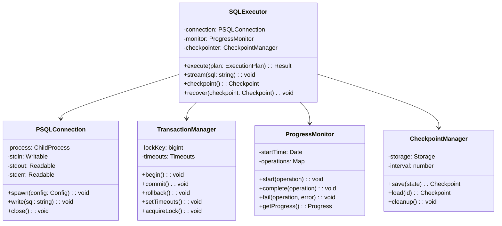

# SQL Executor Specification

## Overview

The SQL Executor manages the streaming execution of SQL operations to PostgreSQL, handling transactions, advisory locks, timeouts, and checkpoint recovery.

## Architecture



## Streaming Implementation

### Connection Management

```javascript
class PSQLConnection {
  constructor(config) {
    this.config = {
      host: config.host || 'localhost',
      port: config.port || 5432,
      database: config.database,
      user: config.user,
      password: config.password
    };
    this.process = null;
    this.buffer = [];
    this.streaming = false;
  }
  
  async connect() {
    const env = {
      ...process.env,
      PGPASSWORD: this.config.password,
      PGHOST: this.config.host,
      PGPORT: this.config.port,
      PGUSER: this.config.user,
      PGDATABASE: this.config.database
    };
    
    this.process = spawn('psql', [
      '--no-psqlrc',
      '--quiet',
      '--no-align',
      '--tuples-only',
      '--set', 'ON_ERROR_STOP=1',
      '--set', 'VERBOSITY=verbose'
    ], {
      env,
      stdio: ['pipe', 'pipe', 'pipe']
    });
    
    this.setupStreams();
    await this.waitForReady();
  }
  
  setupStreams() {
    // Handle stdout
    this.process.stdout.on('data', (chunk) => {
      this.handleOutput(chunk.toString());
    });
    
    // Handle stderr
    this.process.stderr.on('data', (chunk) => {
      this.handleError(chunk.toString());
    });
    
    // Handle process exit
    this.process.on('exit', (code, signal) => {
      if (code !== 0 && code !== null) {
        this.handleExit(code, signal);
      }
    });
  }
  
  async write(sql) {
    return new Promise((resolve, reject) => {
      // Ensure SQL ends with semicolon and newline
      const formatted = sql.trim();
      const terminated = formatted.endsWith(';') 
        ? formatted 
        : `${formatted};`;
      
      this.process.stdin.write(`${terminated}\n`, (err) => {
        if (err) {
          reject(err);
        } else {
          resolve();
        }
      });
    });
  }
  
  async stream(sql) {
    // For large SQL, stream in chunks
    const CHUNK_SIZE = 65536; // 64KB chunks
    
    for (let i = 0; i < sql.length; i += CHUNK_SIZE) {
      const chunk = sql.slice(i, i + CHUNK_SIZE);
      await this.write(chunk);
      
      // Allow event loop to process
      await new Promise(resolve => setImmediate(resolve));
    }
  }
}
```

### Transaction Management

```javascript
class TransactionManager {
  constructor(executor) {
    this.executor = executor;
    this.inTransaction = false;
    this.lockKey = null;
  }
  
  async begin() {
    if (this.inTransaction) {
      throw new Error('Already in transaction');
    }
    
    await this.executor.stream('BEGIN;');
    this.inTransaction = true;
    
    // Set transaction-local timeouts
    await this.setTimeouts();
    
    // Acquire advisory lock
    await this.acquireAdvisoryLock();
  }
  
  async setTimeouts() {
    const timeouts = [
      "SET LOCAL lock_timeout = '5s';",
      "SET LOCAL statement_timeout = '30s';",
      "SET LOCAL idle_in_transaction_session_timeout = '60s';"
    ];
    
    for (const timeout of timeouts) {
      await this.executor.stream(timeout);
    }
  }
  
  async acquireAdvisoryLock() {
    // Generate stable lock key using SHA256
    const identifier = `wesley:migration:${Date.now()}`;
    const sql = `
      SELECT pg_advisory_xact_lock(
        ('x' || substr(
          digest('${identifier}', 'sha256')::text, 
          1, 16
        ))::bit(64)::bigint
      );
    `;
    
    await this.executor.stream(sql);
    this.lockKey = identifier;
  }
  
  async commit() {
    if (!this.inTransaction) {
      throw new Error('Not in transaction');
    }
    
    await this.executor.stream('COMMIT;');
    this.inTransaction = false;
    this.lockKey = null;
  }
  
  async rollback() {
    if (!this.inTransaction) {
      return; // Already rolled back
    }
    
    try {
      await this.executor.stream('ROLLBACK;');
    } finally {
      this.inTransaction = false;
      this.lockKey = null;
    }
  }
}
```

### Phase Execution

```javascript
class PhaseExecutor {
  constructor(executor) {
    this.executor = executor;
    this.txManager = new TransactionManager(executor);
  }
  
  async executePhase(phase) {
    switch (phase.type) {
      case 'non_transactional':
        return await this.executeNonTransactional(phase);
      case 'transactional':
        return await this.executeTransactional(phase);
      case 'validation':
        return await this.executeValidation(phase);
      default:
        throw new Error(`Unknown phase type: ${phase.type}`);
    }
  }
  
  async executeNonTransactional(phase) {
    // CIC operations must run outside transactions
    const results = [];
    
    for (const operation of phase.operations) {
      if (operation.type === 'CREATE_INDEX_CONCURRENTLY') {
        // Ensure no transaction active
        if (this.txManager.inTransaction) {
          throw new Error('CIC cannot run in transaction');
        }
        
        // Check for other CIC on same table
        await this.waitForTableLock(operation.table);
        
        // Execute CIC
        const sql = this.generateCIC(operation);
        await this.executor.stream(sql);
        
        results.push({
          operation,
          status: 'completed',
          duration: Date.now() - start
        });
      }
    }
    
    return results;
  }
  
  async executeTransactional(phase) {
    const results = [];
    
    try {
      // Start transaction
      await this.txManager.begin();
      
      // Execute all operations in transaction
      for (const operation of phase.operations) {
        const sql = this.generateSQL(operation);
        await this.executor.stream(sql);
        
        results.push({
          operation,
          status: 'completed'
        });
        
        // Checkpoint periodically
        if (results.length % 10 === 0) {
          await this.executor.checkpoint();
        }
      }
      
      // Commit transaction
      await this.txManager.commit();
      
    } catch (error) {
      // Rollback on error
      await this.txManager.rollback();
      throw error;
    }
    
    return results;
  }
  
  async executeValidation(phase) {
    // Validations can run with lighter locks
    const results = [];
    
    for (const operation of phase.operations) {
      if (operation.scheduleWindow === 'low_traffic') {
        await this.waitForLowTraffic();
      }
      
      const sql = `ALTER TABLE ${operation.table} VALIDATE CONSTRAINT ${operation.constraint};`;
      await this.executor.stream(sql);
      
      results.push({
        operation,
        status: 'validated'
      });
    }
    
    return results;
  }
}
```

## Progress Monitoring

### Real-time Progress Tracking

```javascript
class ProgressMonitor extends EventEmitter {
  constructor() {
    super();
    this.startTime = Date.now();
    this.operations = new Map();
    this.phases = [];
    this.currentPhase = null;
  }
  
  startPhase(phase) {
    this.currentPhase = {
      name: phase.name,
      type: phase.type,
      startTime: Date.now(),
      totalOperations: phase.operations.length,
      completedOperations: 0,
      failedOperations: 0
    };
    
    this.phases.push(this.currentPhase);
    this.emit('phase:start', this.currentPhase);
  }
  
  startOperation(operation) {
    const op = {
      id: operation.id,
      type: operation.type,
      table: operation.table?.name,
      startTime: Date.now(),
      status: 'running'
    };
    
    this.operations.set(operation.id, op);
    this.emit('operation:start', op);
    
    // Update phase progress
    if (this.currentPhase) {
      this.updateProgress();
    }
  }
  
  completeOperation(operation, result) {
    const op = this.operations.get(operation.id);
    if (op) {
      op.status = 'completed';
      op.endTime = Date.now();
      op.duration = op.endTime - op.startTime;
      op.result = result;
      
      this.emit('operation:complete', op);
      
      if (this.currentPhase) {
        this.currentPhase.completedOperations++;
        this.updateProgress();
      }
    }
  }
  
  failOperation(operation, error) {
    const op = this.operations.get(operation.id);
    if (op) {
      op.status = 'failed';
      op.endTime = Date.now();
      op.duration = op.endTime - op.startTime;
      op.error = error;
      
      this.emit('operation:fail', op);
      
      if (this.currentPhase) {
        this.currentPhase.failedOperations++;
        this.updateProgress();
      }
    }
  }
  
  updateProgress() {
    const progress = this.getProgress();
    this.emit('progress', progress);
  }
  
  getProgress() {
    const elapsed = Date.now() - this.startTime;
    const totalOps = Array.from(this.operations.values());
    const completed = totalOps.filter(op => op.status === 'completed');
    const failed = totalOps.filter(op => op.status === 'failed');
    const running = totalOps.filter(op => op.status === 'running');
    
    const phaseProgress = this.currentPhase ? {
      phase: this.currentPhase.name,
      percent: (this.currentPhase.completedOperations / 
                this.currentPhase.totalOperations) * 100,
      remaining: this.currentPhase.totalOperations - 
                 this.currentPhase.completedOperations
    } : null;
    
    return {
      elapsed,
      totalOperations: totalOps.length,
      completedOperations: completed.length,
      failedOperations: failed.length,
      runningOperations: running.length,
      percentComplete: (completed.length / totalOps.length) * 100,
      currentPhase: phaseProgress,
      estimatedTimeRemaining: this.estimateTimeRemaining()
    };
  }
  
  estimateTimeRemaining() {
    const completed = this.currentPhase?.completedOperations || 0;
    const total = this.currentPhase?.totalOperations || 1;
    const elapsed = Date.now() - (this.currentPhase?.startTime || Date.now());
    
    if (completed === 0) return null;
    
    const avgTime = elapsed / completed;
    const remaining = total - completed;
    return avgTime * remaining;
  }
}
```

## Checkpoint Management

### State Persistence

```javascript
class CheckpointManager {
  constructor(config) {
    this.storageDir = config.storageDir || '.wesley/checkpoints';
    this.retentionCount = config.retentionCount || 10;
    this.interval = config.interval || 30 * 60 * 1000; // 30 minutes
    this.lastCheckpoint = null;
  }
  
  async save(state) {
    const checkpoint = {
      id: uuidv4(),
      timestamp: new Date().toISOString(),
      version: '1.0.0',
      state: {
        completedPhases: state.completedPhases,
        currentPhase: state.currentPhase,
        completedOperations: state.completedOperations,
        inProgressOperations: state.inProgressOperations,
        pendingOperations: state.pendingOperations,
        outputs: state.outputs,
        metrics: state.metrics
      },
      metadata: {
        totalOperations: state.totalOperations,
        percentComplete: state.percentComplete,
        elapsedTime: state.elapsedTime
      }
    };
    
    // Save atomically
    const filePath = path.join(this.storageDir, `${checkpoint.id}.json`);
    const tempPath = `${filePath}.tmp`;
    
    await fs.writeFile(tempPath, JSON.stringify(checkpoint, null, 2));
    await fs.rename(tempPath, filePath);
    
    this.lastCheckpoint = checkpoint;
    
    // Cleanup old checkpoints
    await this.cleanup();
    
    return checkpoint;
  }
  
  async load(checkpointId) {
    const filePath = path.join(this.storageDir, `${checkpointId}.json`);
    const content = await fs.readFile(filePath, 'utf8');
    return JSON.parse(content);
  }
  
  async findLatest() {
    const files = await fs.readdir(this.storageDir);
    const checkpoints = files
      .filter(f => f.endsWith('.json'))
      .map(f => ({
        file: f,
        path: path.join(this.storageDir, f)
      }));
    
    if (checkpoints.length === 0) return null;
    
    // Get file stats and sort by creation time
    const withStats = await Promise.all(
      checkpoints.map(async (cp) => ({
        ...cp,
        stats: await fs.stat(cp.path)
      }))
    );
    
    withStats.sort((a, b) => b.stats.mtime - a.stats.mtime);
    
    return await this.load(
      path.basename(withStats[0].file, '.json')
    );
  }
  
  async cleanup() {
    const files = await fs.readdir(this.storageDir);
    const checkpoints = files
      .filter(f => f.endsWith('.json'))
      .map(f => path.join(this.storageDir, f));
    
    if (checkpoints.length <= this.retentionCount) return;
    
    // Get stats and sort by modification time
    const withStats = await Promise.all(
      checkpoints.map(async (path) => ({
        path,
        stats: await fs.stat(path)
      }))
    );
    
    withStats.sort((a, b) => b.stats.mtime - a.stats.mtime);
    
    // Delete old checkpoints
    const toDelete = withStats.slice(this.retentionCount);
    await Promise.all(
      toDelete.map(item => fs.unlink(item.path))
    );
  }
  
  shouldCheckpoint(lastTime) {
    if (!lastTime) return true;
    return Date.now() - lastTime > this.interval;
  }
}
```

## Recovery Implementation

### Checkpoint Recovery

```javascript
class RecoveryManager {
  constructor(executor, checkpointManager) {
    this.executor = executor;
    this.checkpointManager = checkpointManager;
  }
  
  async recover(checkpointId) {
    // Load checkpoint
    const checkpoint = checkpointId
      ? await this.checkpointManager.load(checkpointId)
      : await this.checkpointManager.findLatest();
    
    if (!checkpoint) {
      throw new Error('No checkpoint found');
    }
    
    console.log(`Recovering from checkpoint ${checkpoint.id}`);
    console.log(`Created: ${checkpoint.timestamp}`);
    console.log(`Progress: ${checkpoint.metadata.percentComplete}%`);
    
    // Verify state consistency
    await this.verifyState(checkpoint);
    
    // Restore executor state
    this.executor.setState({
      completedOperations: new Set(checkpoint.state.completedOperations),
      outputs: new Map(Object.entries(checkpoint.state.outputs))
    });
    
    // Resume execution
    const remaining = checkpoint.state.pendingOperations;
    console.log(`Resuming with ${remaining.length} operations`);
    
    return {
      checkpoint,
      remainingOperations: remaining
    };
  }
  
  async verifyState(checkpoint) {
    // Verify completed operations are actually complete
    for (const opId of checkpoint.state.completedOperations) {
      const verified = await this.verifyOperation(opId);
      if (!verified) {
        throw new Error(`Operation ${opId} not actually completed`);
      }
    }
    
    // Check for partial operations
    for (const opId of checkpoint.state.inProgressOperations) {
      const status = await this.checkOperationStatus(opId);
      console.log(`In-progress operation ${opId}: ${status}`);
    }
  }
}
```

## Error Handling

### Error Classification and Recovery

```javascript
class ErrorHandler {
  handle(error, context) {
    const classified = this.classify(error);
    
    switch (classified.type) {
      case 'LOCK_TIMEOUT':
        return this.handleLockTimeout(error, context);
      case 'STATEMENT_TIMEOUT':
        return this.handleStatementTimeout(error, context);
      case 'SERIALIZATION_FAILURE':
        return this.handleSerializationFailure(error, context);
      case 'SYNTAX_ERROR':
        return this.handleSyntaxError(error, context);
      case 'CONNECTION_LOST':
        return this.handleConnectionLost(error, context);
      default:
        return this.handleUnknown(error, context);
    }
  }
  
  classify(error) {
    const message = error.message || '';
    const code = error.code || '';
    
    if (message.includes('lock timeout') || code === '55P03') {
      return { type: 'LOCK_TIMEOUT', retryable: true };
    }
    
    if (message.includes('statement timeout') || code === '57014') {
      return { type: 'STATEMENT_TIMEOUT', retryable: true };
    }
    
    if (code === '40001' || code === '40P01') {
      return { type: 'SERIALIZATION_FAILURE', retryable: true };
    }
    
    if (code.startsWith('42')) {
      return { type: 'SYNTAX_ERROR', retryable: false };
    }
    
    if (message.includes('connection') || code === '57P01') {
      return { type: 'CONNECTION_LOST', retryable: true };
    }
    
    return { type: 'UNKNOWN', retryable: false };
  }
  
  async handleLockTimeout(error, context) {
    console.log('Lock timeout detected, waiting and retrying...');
    await sleep(5000);
    return { action: 'RETRY', delay: 5000 };
  }
  
  async handleConnectionLost(error, context) {
    console.log('Connection lost, reconnecting...');
    await context.executor.reconnect();
    return { action: 'RETRY', immediate: true };
  }
}
```

---

**Next: [Schema Drift Spec →](./schema-drift.md)**

**[← Back to DDL Planner](./ddl-planner.md)** | **[↑ Up to Specs](./)