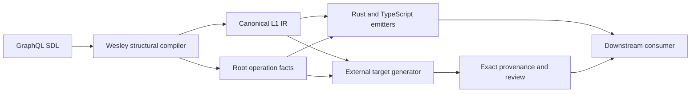

# Wesley End To End

<!-- docs-truth: status=experimental owner=@flyingrobots -->

Wesley is a domain-empty GraphQL compiler kernel. It turns authored GraphQL
structure into deterministic intermediate representation, operation facts,
generated declarations, and exact generation evidence.

Wesley is not an application language, runtime, database migration engine, or
policy authority. Edict owns executable application semantics. External targets
and sibling runtimes own the behavior of the artifacts they consume.

## The Boundary



The arrows have deliberately different authority:

- GraphQL SDL is authoritative for the structure Wesley compiles.
- L1 IR and operation catalogs are derived compiler facts.
- generated Rust and TypeScript are projections, not peer authorities.
- target generators own target-specific declarations and semantics.
- provenance binds exact inputs and outputs; it does not prove runtime behavior.

## Stage 1: Author GraphQL Structure

An authored SDL file declares types, fields, arguments, root operations,
nullability, lists, and directives:

```graphql
type Greeting {
  id: ID!
  message: String!
}

type Query {
  greeting(id: ID!): Greeting
}
```

GraphQL is a useful structural source because it is compact, inspectable, and
portable. It is not expected to encode application laws that the language
cannot express honestly.

## Stage 2: Lower And Identify

The native CLI parses and lowers SDL through `wesley-core`:

```text
wesley schema lower --schema schema.graphql --json
wesley schema hash --schema schema.graphql
wesley schema operations --schema schema.graphql --json
```

Lowering produces canonical L1 IR. Registry hashes are computed from canonical
semantic structure rather than source paths, timestamps, or formatting.

Structural schema changes can be compared directly or against a Git revision:

```text
wesley schema diff --schema schema.graphql --against origin/main --format json
```

## Stage 3: Emit Generic Projections

Wesley can emit deterministic Rust and TypeScript declarations:

```text
wesley emit rust \
  --schema schema.graphql \
  --out generated/model.rs \
  --metadata-out generated/model.metadata.json

wesley emit typescript \
  --schema schema.graphql \
  --out generated/model.ts \
  --metadata-out generated/model.metadata.json
```

The emitters consume structural IR and normalized operation facts. Metadata
sidecars record the schema identity, generator identity, version, and emission
mode. They do not assert that a runtime enforces application behavior.

Little-endian binary codec projections are available for supported operation
variable shapes:

```text
wesley emit le-binary-rust --schema schema.graphql --out generated/codec.rs
wesley emit le-binary-typescript --schema schema.graphql --out generated/codec.ts
```

## Stage 4: Cross An External Target Boundary

Target-specific generation belongs outside generic Wesley. The retained Rust
contract makes that crossing explicit:

```text
ExtensionGenerationInputV2
        |
        v
external owner generator
        |
        v
GenerationProvenanceManifestV2
        |
        v
GenerationReviewV2
```

`ExtensionGenerationInputV2` contains:

- canonical Shape IR;
- normalized root operations;
- exact owner-declaration references;
- an exact settings digest; and
- requested projection roles.

The external generator interprets its own declarations and produces its own
artifacts. Wesley records exact source, generator, input, settings, and output
digests without claiming semantic authority over them.

See [Extension Generation Contract](./reference/extension-generation.md).

## Stage 5: Verify Evidence

Generation verification is deterministic and closed over supplied bytes. It
recomputes:

- the generator digest;
- every declared source digest;
- the canonical generation-input digest;
- every emitted artifact digest; and
- the provenance-manifest digest used by the review projection.

Verification does not read the filesystem, clock, environment, network,
registry, or process state. Missing, unexpected, or mismatched bytes fail with
structured diagnostics.

`GenerationReviewV2` is explicitly non-authoritative. It is useful for review,
but it cannot become a replacement source.

## Stage 6: Consume Outside Wesley

A sibling project may compile or load generated artifacts only after its own
target-specific verification. That project remains responsible for:

- application-language semantics;
- runtime capabilities and admission;
- data-model and migration behavior;
- target ABI and package validation;
- generated-output schemas; and
- live execution, durability, and recovery.

For the Graft-on-Echo mission, this means:

- Graft application behavior is authored in Edict;
- Edict compiles executable semantics;
- Echo owns Echo-specific capability and execution semantics; and
- Wesley is involved only where GraphQL structural projection remains useful.

## What Wesley Ships

The current Rust product surface includes:

- GraphQL SDL parsing and normalized output;
- deterministic L1 lowering and registry hashing;
- structural schema diffs;
- root operation catalogs and selection facts;
- generic directive-argument extraction;
- Rust and TypeScript declaration emission;
- supported little-endian codec emission;
- project-manifest inspection and changed-schema selection;
- external target-descriptor verification without target execution; and
- canonical extension-generation provenance and review contracts.

The retained JavaScript Holmes package is a non-compiler evidence and reporting
surface. It does not extend the compiler's semantic authority.

## What Wesley Does Not Ship

Wesley does not:

- execute application code;
- define Edict semantics;
- interpret target or runtime capabilities;
- enforce Echo footprints;
- perform database migrations;
- authorize runtime actions;
- certify deployments merely because an artifact is schema-valid; or
- turn GraphQL directives into a second application language.

## Verification

The repository-level gate is:

```text
cargo xtask preflight
```

Focused compiler and external-generation evidence can be checked with:

```text
cargo test -p wesley-core
cargo test -p wesley-cli
cargo test -p wesley-emit-rust
```

Use [ARCHITECTURE.md](./ARCHITECTURE.md) for the current component map,
[ENTRYPOINTS.md](./ENTRYPOINTS.md) for command discovery, and
[BEARING.md](./BEARING.md) for current direction.
