# Wesley End To End

<!-- docs-truth: status=experimental owner=@flyingrobots -->

This document explains Wesley from first principles.

Assume you have never heard of Wesley. The shortest honest description is:

> Wesley is a schema-first compiler kernel and assurance toolchain.

That sentence has a lot packed into it.

- **Schema-first** means the authored GraphQL Schema Definition Language file is
  the source of truth.
- **Compiler kernel** means Wesley parses that source, lowers it into semantic
  facts, computes hashes and deltas, and emits target artifacts.
- **Assurance toolchain** means Wesley also carries tools for packaging,
  witnessing, checking, and judging whether derived artifacts still trace back
  to the authored source.

Wesley is not an application runtime. It is not a database migration engine. It
is not Echo, Continuum, jedit, WARPspace, or PostgreSQL. Wesley owns compiler
truth. External modules and sibling projects own target meaning.

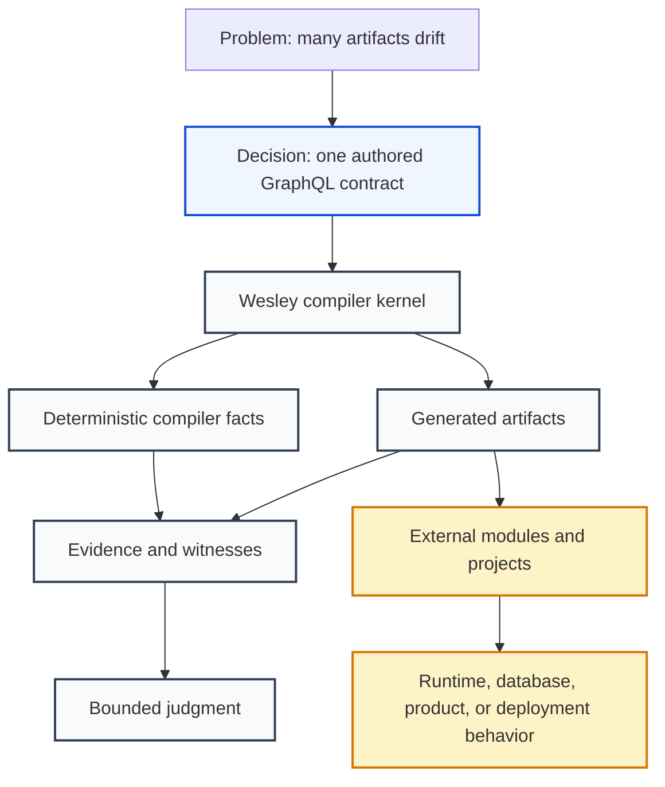

## The Problem Wesley Solves

Most systems have several copies of the same truth.

A database has tables. A backend has models. A frontend has TypeScript types. A
runtime has handlers. Tests have fixtures. Documentation has examples. A
deployment pipeline has policy. Over time those copies drift. One field is
renamed in the API but not in the test. One migration changes a shape without
updating generated bindings. One runtime learns a domain rule that nobody wrote
down in the contract.

Wesley attacks that drift by insisting on an authored contract and a repeatable
compile path:

```text
authored GraphQL SDL -> compiler facts -> generated artifacts -> bounded evidence
```

The design goal is not "more code generation." Code generation is a tactic. The
goal is trustworthy change: when a contract changes, every derived artifact and
every proof surface should be regenerated, checked, and explained from the same
source.

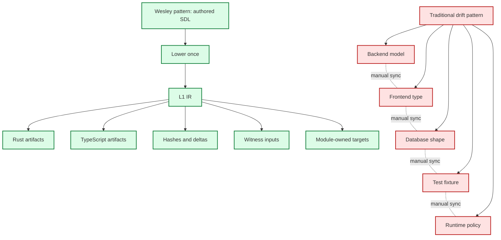

## Why GraphQL SDL

Wesley starts with GraphQL SDL because SDL is a compact, inspectable contract
language. It describes shape without forcing a storage engine, transport, or
runtime architecture.

GraphQL gives Wesley several useful compiler properties:

- Types, fields, arguments, interfaces, unions, enums, input objects, nullability,
  and lists are all explicit.
- Root operations name the public operation boundary.
- Directives attach law-shaped metadata at known schema coordinates.
- The language is additive enough to support long-lived contract evolution.
- The same source can feed many targets without making one target the authority.

This distinction matters:

| Layer              | Question                                               | Wesley posture                                  |
| ------------------ | ------------------------------------------------------ | ----------------------------------------------- |
| Shape              | What exists?                                           | Wesley core can lower, hash, diff, and emit it. |
| Law-shaped data    | What is declared as required, permitted, or forbidden? | Wesley core can preserve it.                    |
| Law interpretation | Is the declaration honest or admissible?               | A domain module or runtime must decide.         |

For example, a GraphQL field can carry a footprint directive:

```graphql
type Query {
  textWindow(input: TextWindowInput!): TextWindowReading!
    @wes_op(name: "textWindow")
    @wes_footprint(
      reads: ["Buffer", "Tick", "Receipt"]
      writes: []
      forbids: ["AstState", "Diagnostics", "GitWitness", "UiState"]
    )
}
```

Generic Wesley can preserve the operation name, argument type, result type,
directive name, and directive arguments. It should not decide whether that
footprint is honest for Echo, correct for jedit, or meaningful for a database.
Those are domain decisions.

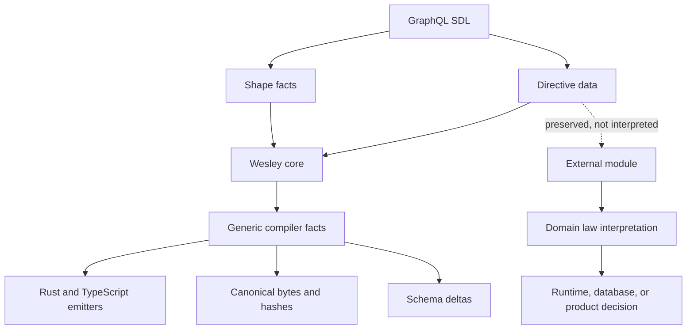

The "why" is simple: if generic Wesley interprets Echo law, PostgreSQL law, or
Continuum law, it stops being a reusable compiler and becomes a hidden product
runtime. The current architecture keeps Wesley narrow so it can remain useful
to many target worlds.

## The End-To-End Shape

At the highest level, a Wesley cycle looks like this:

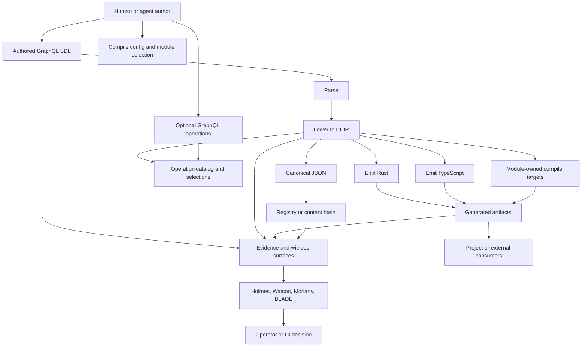

That picture used to hide an important migration detail: Wesley once had two
implementation surfaces. The retired surface is now gone from compiler
authority.

1. The **Rust workspace** is the current compiler center. New compiler truth
   belongs in `crates/wesley-core` and the native `wesley` CLI.
2. The **JavaScript workspace** is explicitly non-compiler: Holmes assurance,
   website/docs tooling, and small browser/Bun/Deno host smoke experiments.

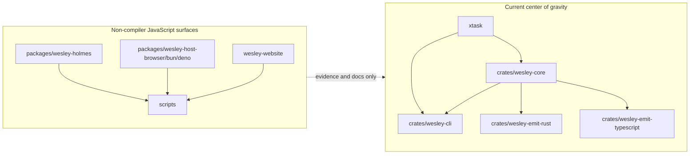

The current post-retirement work is about keeping that boundary honest: expand Rust IR
fixtures, compare selected JS and Rust lowering projections, and preserve module
boundaries before retiring legacy behavior.

## Stage 1: Author The Contract

The starting point is an authored GraphQL schema.

The schema is not treated as an API afterthought. It is the sovereign source
for contract shape. A project, module, or product may own the schema, but
Wesley treats the file as the thing to compile.

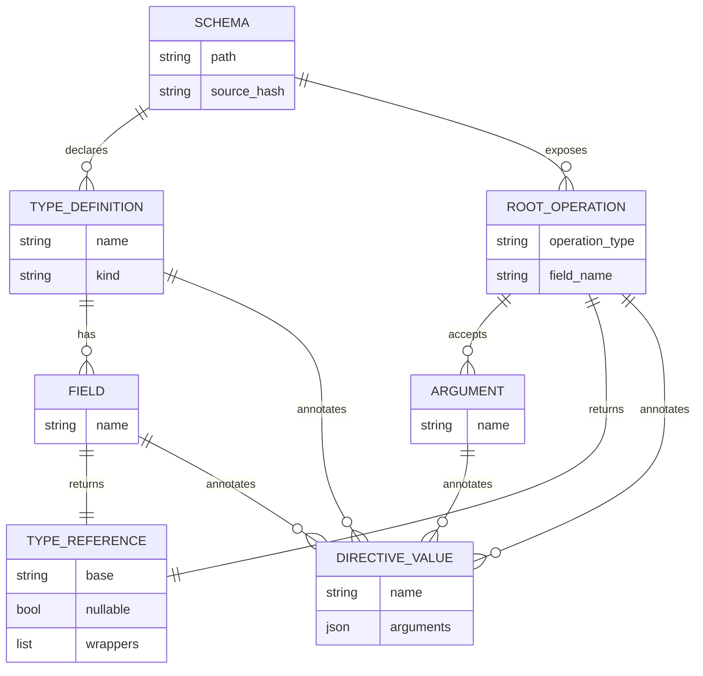

The main design choice is that authored SDL stays above every emitted artifact.
Generated Rust, TypeScript, SQL, codecs, manifests, reports, and tests are not
peer authorities. If they drift, regenerate them or fail the check.

## Stage 2: Parse And Lower To L1 IR

The Rust compiler kernel lives in `crates/wesley-core`.

Its central job is to lower GraphQL SDL into Wesley's L1 IR. L1 IR is
domain-empty. It captures GraphQL facts: definitions, fields, directives,
interfaces, unions, enum values, input objects, nullability, list wrappers, root
operations, and hashes. It does not capture database migrations, Echo
scheduling, Continuum product policy, or deployment rules.

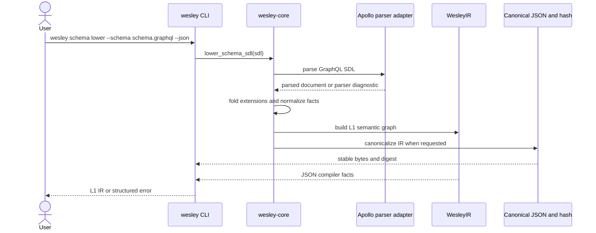

The lowering path is deliberately deterministic. Determinism is what makes
hashes, golden fixtures, parity checks, and release evidence meaningful.

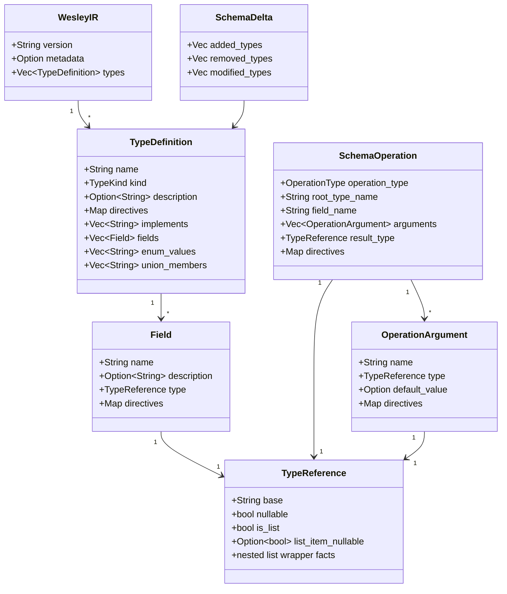

The "why" behind L1 is portability. Once a schema is lowered into a stable,
domain-empty graph, many target worlds can consume it without each target
re-parsing GraphQL and inventing its own meaning for basic shape.

## Stage 3: Compute Hashes, Deltas, And Operation Facts

After lowering, Wesley can compute facts that help humans and tools reason
about change.

The native CLI exposes commands such as:

```bash
wesley schema lower --schema <path> --json
wesley schema hash --schema <path>
wesley schema operations --schema <path> --json
wesley schema diff --old <path> --new <path> --format summary --exit-code
wesley init-law --schema <schema.graphql> --family <family> --out <law.weslaw.yaml>
wesley law lint --law <law.weslaw.yaml> --json
wesley law validate --schema <schema.graphql> --law <law.weslaw.yaml> --json
wesley law diff --old <old.weslaw.yaml> --new <new.weslaw.yaml> --json
wesley law diff --old <old.weslaw.yaml> --new <new.weslaw.yaml> --format markdown
wesley law explain --law <law.weslaw.yaml> scalar:PositiveInt
wesley law explain --law <law.weslaw.yaml> operation:Mutation.replaceRangeAsTick
wesley law rebind --schema <schema.graphql> --law <law.weslaw.yaml> --accept --out <rebound.weslaw.yaml>
wesley law capabilities --law <law.weslaw.yaml> --json
wesley law coverage --schema <schema.graphql> --law <law.weslaw.yaml> --profile release --json
wesley operation selections --operation <path> --schema <path> --json
wesley operation directive-args --operation <path> --directive <name> --json
```

These commands are boring on purpose. They answer compiler questions:

- What does this schema lower to?
- What is its stable identity?
- Which root operations exist?
- What changed between two schema versions?
- Which semantic law entries bind to this schema, and which `lawHash`,
  `lawDocumentHash`, `profileHash`, and `bundleHash` identify the bound
  contract bundle?
- Which known formal directives can be scaffolded into active `weslaw/v1`, and
  which comments are only draft suggestions that require human promotion?
- Which semantic law changed between two law versions, and is the change a
  strengthening, weakening, footprint expansion/contraction, channel version
  change, predicate change, schema-hash rebound, or binding break?
- Which laws govern a particular scalar, operation, or other subject?
- Does a law file need an explicit schema-hash rebind before it can validate?
- Which footprint laws can be rendered as report-only capability summaries?
- Which profile/category coverage gaps remain before release?
- Which response paths or schema-coordinate selections does an operation use?
- Which directive arguments are present on an operation?

```mermaid
flowchart TD
    IR[L1 IR] --> Canonical[Canonical JSON]
    Canonical --> Hash[Schema hash]
    IR --> Delta[Schema diff]
    IR --> RootOps[Root operation catalog]
    IR --> InitLaw[init-law directive lowering]
    IR --> LawBind[Strict law binding]
    InitLaw --> LawDrafts[Active law plus draft suggestions]
    LawDoc[weslaw/v1 document] --> LawBind
    LawDoc --> LawLint[Structure-only law lint]
    LawDoc --> LawExplain[Law explain]
    LawDoc --> LawRebind[Explicit schema-hash rebind]
    LawDoc --> CapabilityReport[Report-only capability summary]
    LawDoc --> CoverageReport[Profile/category coverage]
    LawBind --> LawManifest[Contract bundle manifest]
    LawDoc --> LawDiff[Semantic law diff]
    LawDiff --> LawDiffJson[JSON diff report]
    LawDiff --> LawDiffMarkdown[Markdown review summary]

    Operation[GraphQL operation document] --> OpParse[Operation parser]
    OpParse --> ResponsePaths[Response-path selections]
    IR --> SchemaIndex[Schema index]
    SchemaIndex --> SchemaCoords[Schema-coordinate selections]
    OpParse --> SchemaCoords
    OpParse --> DirectiveArgs[Directive argument extraction]

    Hash --> CI[CI and fixture evidence]
    LawLint --> CI
    LawManifest --> CI
    LawExplain --> Operator[Operator inspection]
    LawRebind --> Operator
    CapabilityReport --> Operator
    CoverageReport --> CI
    CoverageReport --> Operator
    LawDiffJson --> CI
    LawDiffJson --> Assurance[Holmes/BLADE]
    LawDiffMarkdown --> Review
    Delta --> Review[Human review]
    RootOps --> Emitters[Operation binding emitters]
    ResponsePaths --> Witness[Witness inputs]
    SchemaCoords --> Witness
    DirectiveArgs --> Module[Module or runtime interpretation]
```

The design choice here is to keep facts separately inspectable. A schema hash,
a diff, an operation catalog, and a generated file should not be a single
opaque blob. They should each be visible so a reviewer can understand where a
claim came from.

## Stage 4: Emit Generic Artifacts

Wesley can emit artifacts from compiler facts.

The current Rust-native projection crates are:

- `crates/wesley-emit-rust`
- `crates/wesley-emit-typescript`

They take `WesleyIR` plus operation data and build language-specific ASTs before
printing deterministic files.

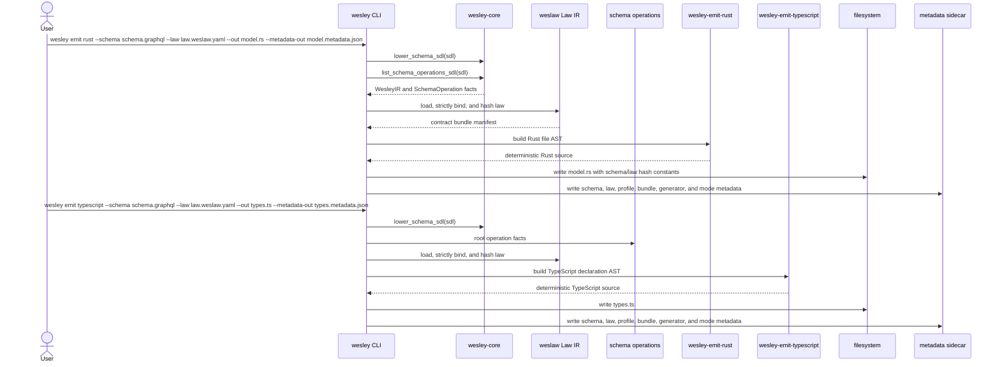

The important design choice is that pure generation does not need to inspect or
mutate existing source files. Wesley owns an emitter AST, then prints. Tools
such as tree-sitter, SWC, or oxc become relevant only when Wesley needs to
understand existing code and edit it safely.

When `--law <path>` is supplied, emitters first build the same validated
contract bundle manifest that `wesley law validate --json` reports. Rust output
embeds `WESLEY_SCHEMA_HASH` and `WESLAW_HASH` constants so a generated artifact
can identify the exact shape and semantic law that produced it. Metadata
sidecars also include `schemaHashQualified`, `lawHash`, `lawDocumentHash`,
`profileHash`, `bundleHash`, and the Law IR codec. The legacy bare
`schemaHash` remains in metadata for compatibility. TypeScript currently
records the law facts in metadata only; executable or declaration-level
TypeScript hash constants can be added when that artifact path needs them.

Rust is also the first retained emitter to consume active scalar and variant
law for helper generation. Integer scalar semantics produce standalone
`validate_<scalar>` helpers, and discriminated input variant law produces
`validate_<input>_variant` helpers. These helpers are generated evidence and
developer affordances; they do not mutate GraphQL shape, replace strict law
binding, or claim runtime enforcement for footprints.

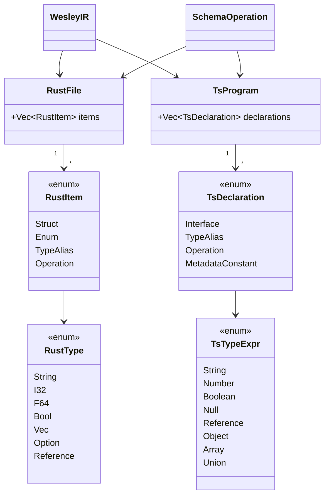

Generic emitters stay domain-empty. They can emit types and operation bindings.
They should not decide what an Echo footprint means, how a PostgreSQL migration
should be locked, or how Continuum should publish a family.

## Stage 5: Load External Modules For Target Meaning

Wesley is intentionally a `GraphQL -> whatever` compiler.

Wesley brings the `GraphQL ->` part. External modules bring `whatever`.

That module boundary is one of the most important design choices in the system.
Without it, every useful target would pressure the base compiler to absorb
product meaning. With it, Wesley can stay small and generic while modules supply
domain-specific directives, generators, witness scopes, release profiles, and
commands.

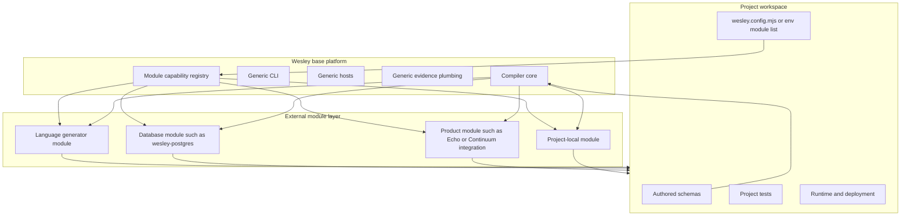

The module capability model can represent several capability areas:

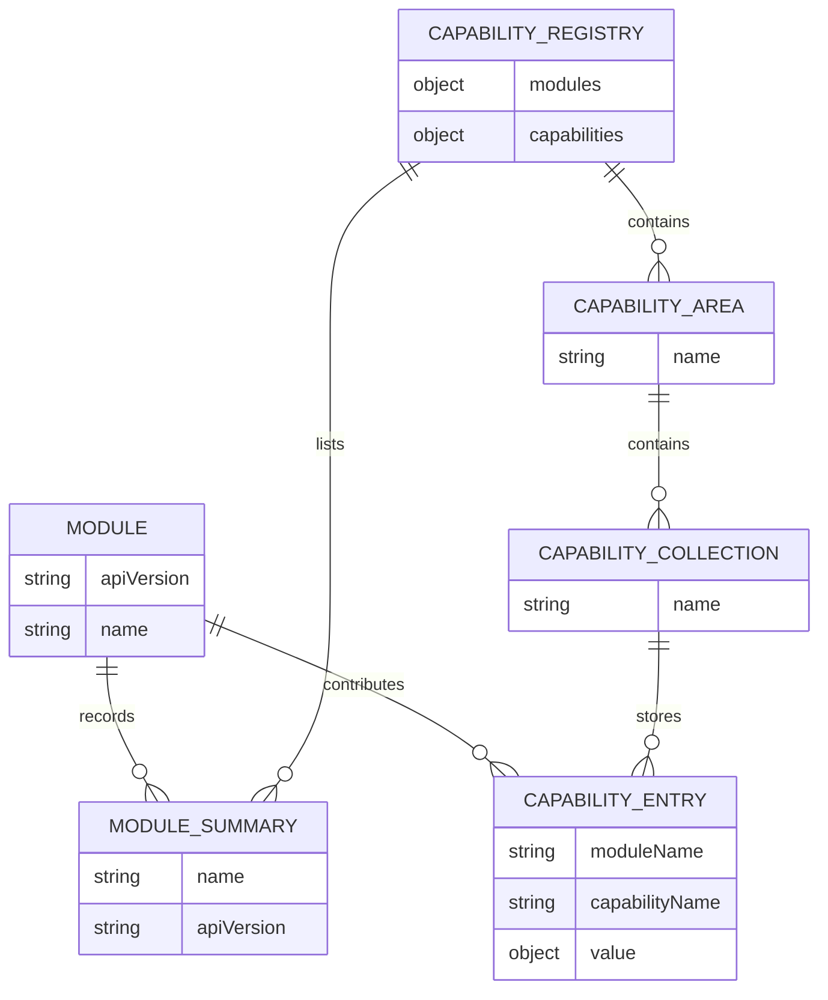

Current JavaScript-side module capability areas include `wesley`, `holmes`,
`watson`, `moriarty`, `blade`, and `cli`. A module can contribute target
descriptors, commands, witness scopes, verification profiles, judgment
profiles, or certification hooks. The sequence below is historical legacy
compatibility, not the product front door Wesley is moving toward.

The Rust-side capability model now records ABI compatibility and runtime state
before execution. A target declares its capability ABI range, execution mode,
portability floor, host imports, and resource-handle needs. The host evaluates
that metadata first; unsupported ABI ranges produce typed diagnostics such as
`WASM_ABI_UNSUPPORTED`, denied host functions are rejected before execution, and
the default runtime model is stateless unless a future policy explicitly grants
resource handles.

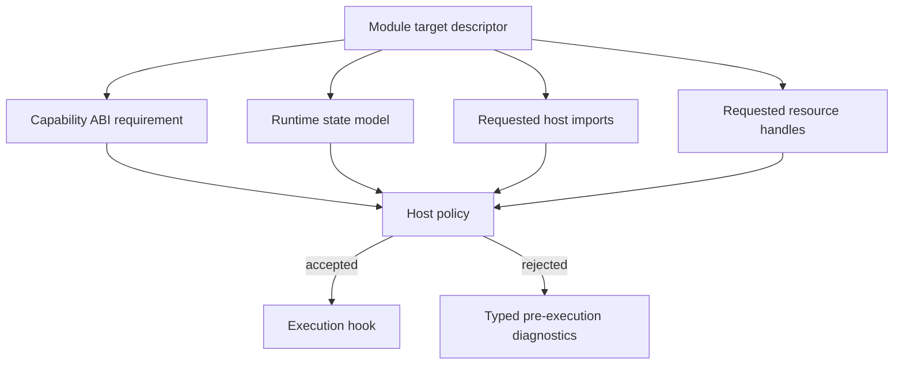

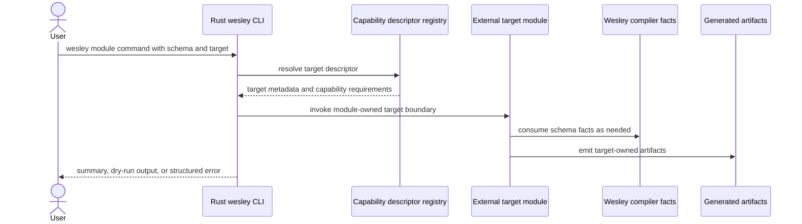

The "why" is ownership clarity. PostgreSQL semantics belong in
`wesley-postgres`. Echo runtime semantics belong in Echo-owned tooling.
Continuum product policy belongs in Continuum-owned modules. Wesley should make
those modules easier to load, check, and witness. It should not become them.

## Stage 6: Package, Witness, And Judge

Wesley is a compiler, but the repository also contains a wider assurance
toolchain.

The core compile act answers:

> What artifacts follow from this authored contract and selected targets?

The toolchain asks further questions:

- Are the generated artifacts traceable to the source?
- Are realization manifests coherent?
- What bounded property did a witness actually check?
- Is the evidence cited and mathematically coherent?
- Given evidence plus history plus policy, should this be considered ready?

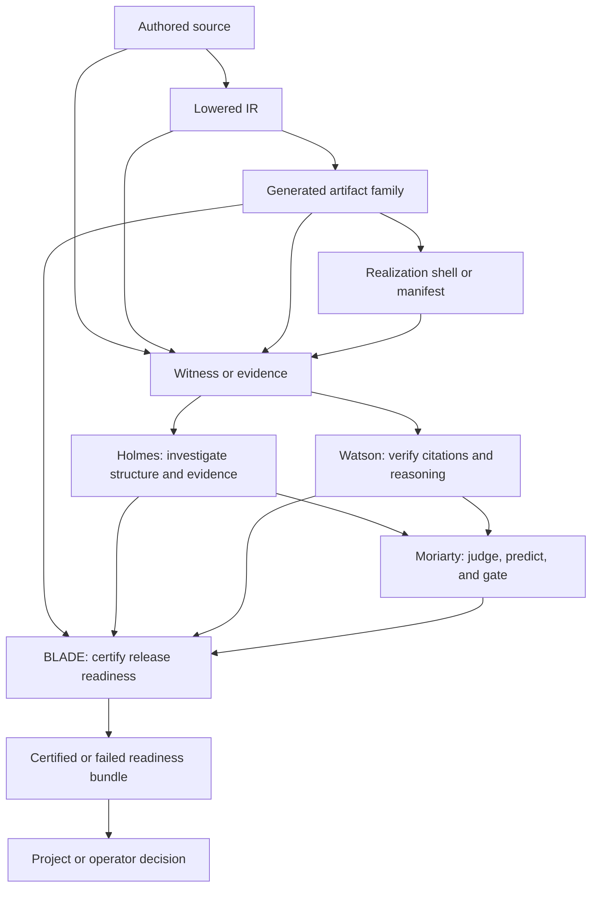

Read that picture carefully. Wesley does not prove everything by compiling.
Compilation proves a derived artifact path. Witnesses prove bounded properties.
Holmes investigates evidence. Watson audits the evidence chain. Moriarty judges
with policy and context. BLADE certifies readiness. Deployment remains a project
or operator job.

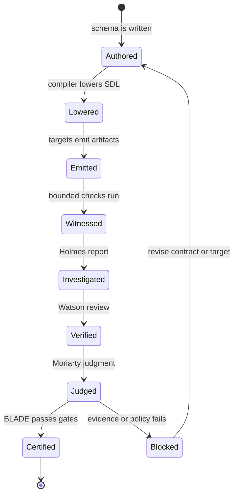

The design choice is honesty. A generated file is not automatically true just
because it exists. The stronger invariant is:

```text
generated files are derived from named authored source through a recorded tool path
```

## Stage 7: Consume Artifacts Outside Wesley

The end of Wesley's compile path is the beginning of another system's path.

A project or external module may consume Wesley outputs to register runtime
contracts, load generated types, run database migrations, publish projection
bundles, or stage tests. Those consumers can rely on the fact that Wesley gave
them compiler facts and artifacts. They still own what happens at runtime.

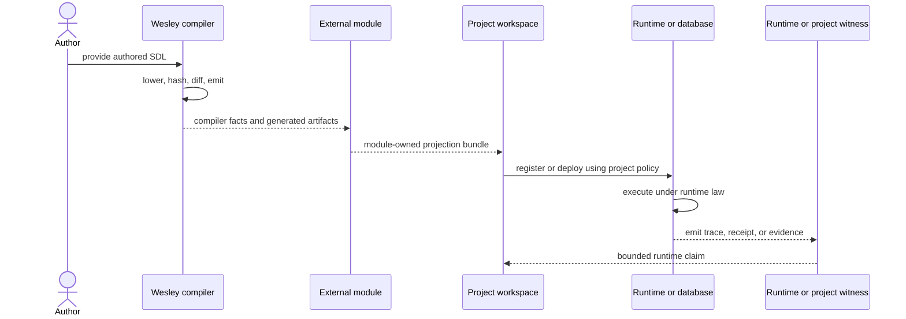

This is why Wesley's domain-empty boundary matters. A reusable compiler can
serve many consumers. A compiler that owns every consumer's runtime becomes
unreviewable and brittle.

## Runtime Optic North Star

The long-term direction is bounded, lawful autonomy.

In that target shape, an agent or application declares a GraphQL operation that
names the reading or rewrite it needs. Wesley compiles the operation into a
typed, inspectable contract artifact. A host or runtime checks authority,
support, budget, and law. The runtime admits, obstructs, schedules, witnesses,
or rejects the request.

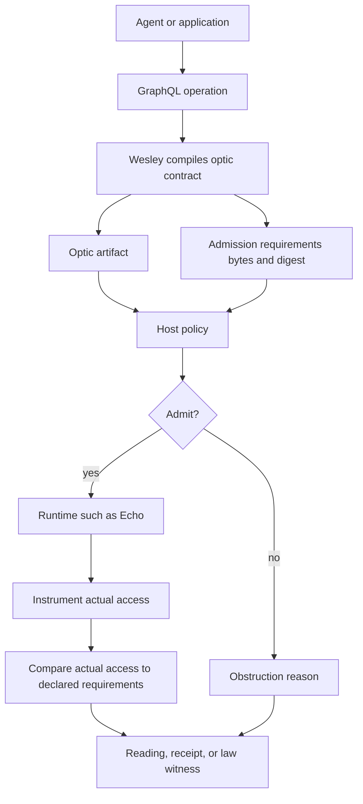

Wesley's role in that story is powerful but bounded:

- compile the operation shape
- preserve law-shaped declarations
- emit canonical bytes and digests for requirements
- produce artifacts a runtime can register and verify

Wesley still does not grant authority, execute the world, or decide every
domain law. The runtime and host policy own admission and enforcement.

## Current Repository Map

If you open the repository today, the important paths are:

| Path                             | Role                                                                          |
| -------------------------------- | ----------------------------------------------------------------------------- |
| `crates/wesley-core/`            | Rust compiler kernel: parse, lower, diff, hash, and analyze operations.       |
| `crates/wesley-cli/`             | Native `wesley` command surface.                                              |
| `crates/wesley-emit-rust/`       | Rust projection crate.                                                        |
| `crates/wesley-emit-typescript/` | TypeScript projection crate.                                                  |
| `xtask/`                         | Rust repository automation, docs checks, preflight, release checks.           |
| `packages/wesley-holmes/`        | Self-contained assurance, evidence, verification, and judgment tooling.       |
| `packages/wesley-host-browser/`  | Browser host smoke experiment outside compiler authority.                     |
| `packages/wesley-host-bun/`      | Bun host smoke experiment outside compiler authority.                         |
| `packages/wesley-host-deno/`     | Deno host smoke experiment outside compiler authority.                        |
| `docs/`                          | Architecture, method, design packets, release packets, and current direction. |
| `test/fixtures/`                 | GraphQL fixtures, Rust L1 golden files, and parity inputs.                    |
| `scripts/`                       | Fixture, docs, CI, and repository support scripts.                            |

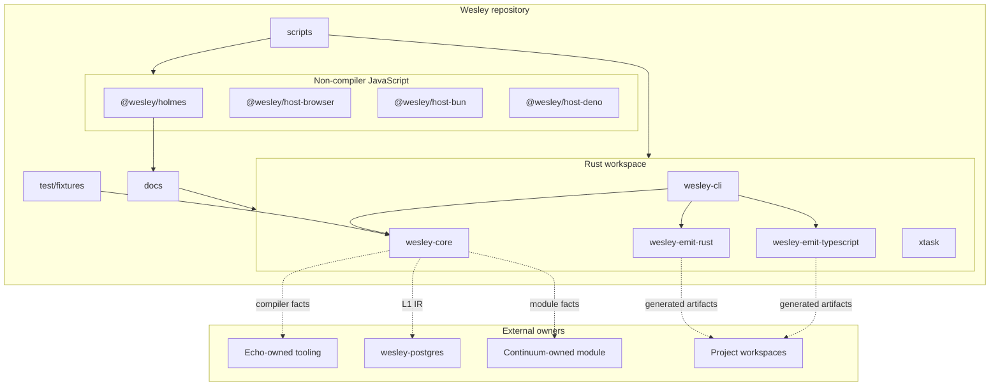

## Validation And Release Evidence

Wesley treats tests and generated evidence as part of the product.

The current validation surface includes Rust tests, native CLI checks, docs
truth checks, docs link checks, retained package checks, fixture generation,
and retirement guards.

```mermaid
flowchart TD
    Change[Proposed change] --> RustPreflight[cargo xtask preflight]
    Change --> LegacyPreflight[cargo xtask legacy-preflight]
    Change --> Fixtures[pnpm fixtures:ir]

    RustPreflight --> RustTests[cargo test --workspace]
    RustPreflight --> NativeHelp[native CLI help smoke]
    LegacyPreflight --> PnpmLegacy[pnpm run legacy-preflight]
    PnpmLegacy --> DocsLinks[legacy docs links]
    PnpmLegacy --> DocsTruth[legacy docs truth manifest]
    RustPreflight --> NodeRetirement[Node retirement ledger guard]
    PnpmLegacy --> Lint[lint and format]
    PnpmLegacy --> PackageTests[package tests]

    Fixtures --> Golden[L1 golden files]

    RustTests --> PR[Pull request]
    NativeHelp --> PR
    DocsLinks --> PR
    DocsTruth --> PR
    NodeRetirement --> PR
    Lint --> PR
    PackageTests --> PR
    Golden --> PR
```

The v0.0.6 release lane tightened Rust IR parity before deletion. That evidence
is now historical. The release oracle is Rust fixture truth and Rust-native
preflight.

The closed Node retirement campaign leaves another proof surface: a
machine-readable ledger and drift guard that fails if retired package manifests
or imports return.

## What Wesley Does Today

Today, Wesley can:

- lower GraphQL SDL into Rust L1 IR
- preserve generic directive data
- fold schema extensions into consolidated type facts
- print normalized SDL and normalized SDL hashes from Rust compiler facts
- compute canonical JSON and hashes
- compute structural schema deltas
- list root operations with argument and result types
- resolve operation selections with or without schema coordinates
- extract operation directive arguments
- emit Rust models and operation bindings
- emit TypeScript declarations and operation bindings
- write deterministic native emit metadata sidecars
- keep JavaScript outside compiler authority except for Holmes assurance,
  website/docs tooling, and host smoke experiments
- model external module targets through Rust capability descriptors, ABI
  compatibility reports, stateless runtime policy, and hermetic fixture checks
- run docs, lint, package, Rust, fixture, and preflight checks
- maintain evidence and design packets around releases and architectural
  boundaries

```mermaid
mindmap
    root((Wesley today))
        Rust core
            Lower SDL
            Hash IR
            Diff schemas
            List operations
            Analyze operations
        Native CLI
            normalize-sdl
            schema lower
            schema hash
            schema diff
            emit rust
            emit typescript
            law validate
        Contract bundle law
            Strict binding
            lawHash
            lawDocumentHash
            profileHash
            bundleHash
        Non-compiler JavaScript
            Holmes tooling
            Host experiments
            Website and docs tooling
        Evidence
            Fixtures
            Docs truth
        Boundaries
            External modules
            wesley-postgres
            Echo owned runtime law
            Continuum owned product policy
```

## What Wesley Does Not Do

Wesley does not own:

- Echo rewrite scheduling
- Echo footprint honesty enforcement
- PostgreSQL migrations or RLS policy
- Supabase behavior
- Continuum runtime policy
- jedit product behavior
- project deployment
- host authority decisions outside Wesley's own loading guards
- runtime values emitted by products using Wesley artifacts

This is not a weakness. It is the reason the compiler can stay useful.

```mermaid
flowchart TD
    Wesley[Wesley owns compiler truth] --> Facts[IR, hashes, diffs, artifacts, evidence inputs]

    Echo[Echo owns runtime law] --> EchoRuntime[scheduling, admission, witnesses]
    Postgres[wesley-postgres owns database semantics] --> DB[migrations, SQL, RLS, adapters]
    Continuum[Continuum owns product policy] --> ContinuumRuntime[workspace and release policy]
    Project[Project owns deployment] --> Deploy[production rollout]

    Facts -. consumed by .-> Echo
    Facts -. consumed by .-> Postgres
    Facts -. consumed by .-> Continuum
    Facts -. consumed by .-> Project
```

## A Full Example In Words

Imagine a project has a schema that declares a `Buffer`, a `TextWindowInput`,
and a `textWindow` query.

1. A human or agent edits the GraphQL SDL.
2. Wesley parses the SDL.
3. Wesley lowers the SDL into L1 IR with type definitions, fields, directives,
   operation roots, type references, and metadata.
4. Wesley canonicalizes the IR and computes a stable hash.
5. Wesley lists the root query operation and its argument/result types.
6. Wesley emits Rust and TypeScript bindings.
7. A module may emit additional target-specific artifacts.
8. Fixture tests compare the result against expected compiler behavior.
9. Witness or evidence tooling can record what was checked.
10. A project or runtime consumes the generated artifacts under its own policy.

```mermaid
sequenceDiagram
    actor Author
    participant SDL as schema.graphql
    participant Core as wesley-core
    participant Hash as canonical hash
    participant Rust as Rust emitter
    participant TS as TypeScript emitter
    participant Module as External module
    participant Tests as Fixtures and Rust checks
    participant Project as Project runtime

    Author->>SDL: edit contract
    SDL->>Core: parse and lower
    Core-->>Hash: canonical bytes
    Core-->>Rust: L1 IR and operation facts
    Core-->>TS: L1 IR and operation facts
    Core-->>Module: generic compiler facts
    Rust-->>Tests: generated Rust artifact
    TS-->>Tests: generated TypeScript artifact
    Module-->>Tests: module-owned artifacts
    Tests-->>Author: pass, fail, or explain drift
    Tests-->>Project: artifacts are ready to consume
    Project->>Project: runtime behavior remains project-owned
```

The key thing to notice is that the source of truth never moves. The schema is
authored. Everything else is derived, witnessed, or consumed.

## Design Choices That Matter Most

### One Source, Many Projections

Wesley rejects the idea that every layer should maintain its own contract copy.
One GraphQL schema can drive Rust, TypeScript, hashes, operation facts, witness
inputs, and module-owned targets.

### Domain-Empty Core

The compiler core stays generic so it can serve many domains. Product,
database, and runtime meanings come through external modules or sibling repos.

### Deterministic Bytes

Hashes and parity checks only matter if the bytes are deterministic. That is
why canonical JSON, fixture goldens, sorted projections, explicit metadata
rules, and stable diagnostic codes matter.

### Evidence Before Deletion

Legacy Node behavior was retired carefully. The v0.0.6 and 0017 lanes built
fixture, parity, and migration evidence before deleting the remaining package
surfaces. That avoided replacing one unproved truth with another.

### Witnesses Are Bounded Claims

A witness should say exactly what it checked. A compiler witness is not runtime
observation. A generated artifact is not deployment proof. A release-readiness
bundle is not production health.

### Explicit External Ownership

`wesley-postgres` should own PostgreSQL semantics. Echo should own Echo runtime
law. Continuum should own Continuum product policy. Wesley should preserve the
facts those owners need without absorbing their worlds.

## The Short Version

If you only remember one end-to-end path, remember this:

```text
Author GraphQL SDL.
Wesley lowers it into deterministic compiler facts.
Wesley emits generic artifacts or hands facts to external modules.
Evidence tools prove bounded properties about the source and artifacts.
External systems consume the outputs and own their runtime meaning.
```

And if you only remember one boundary, remember this:

```text
Wesley owns compiler truth.
Modules and projects own target meaning.
```
