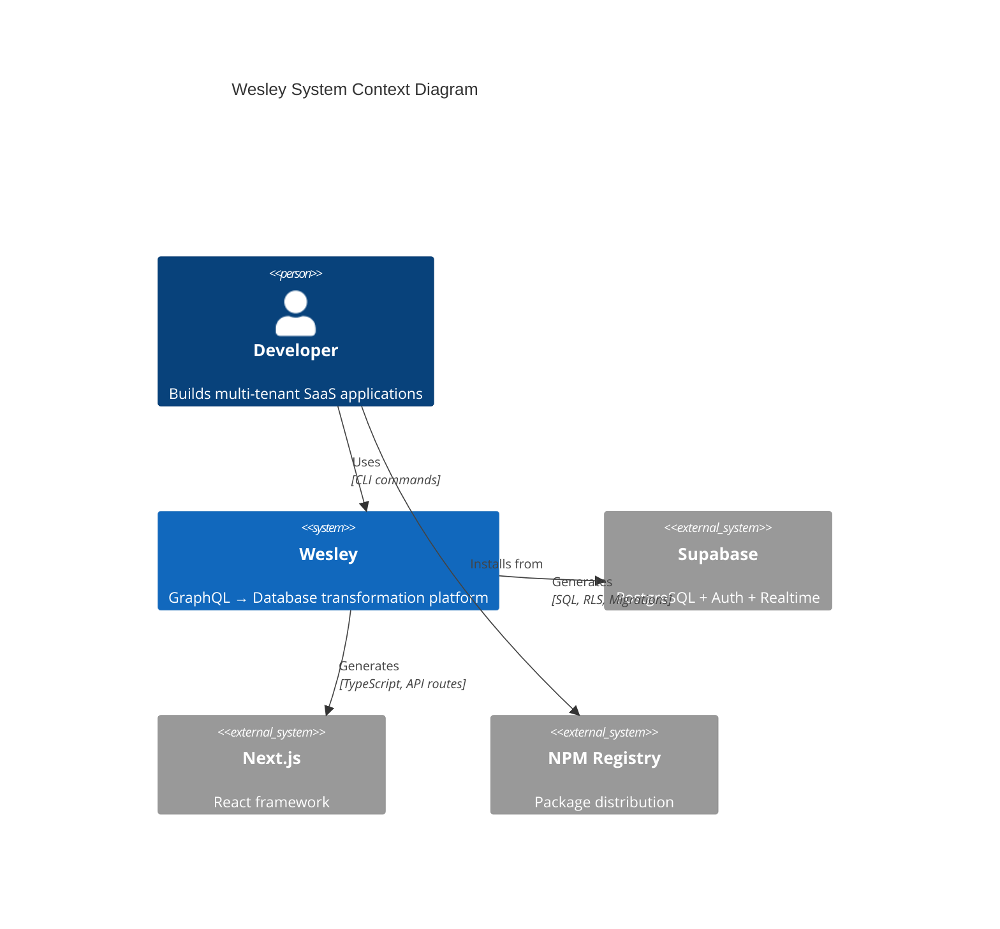
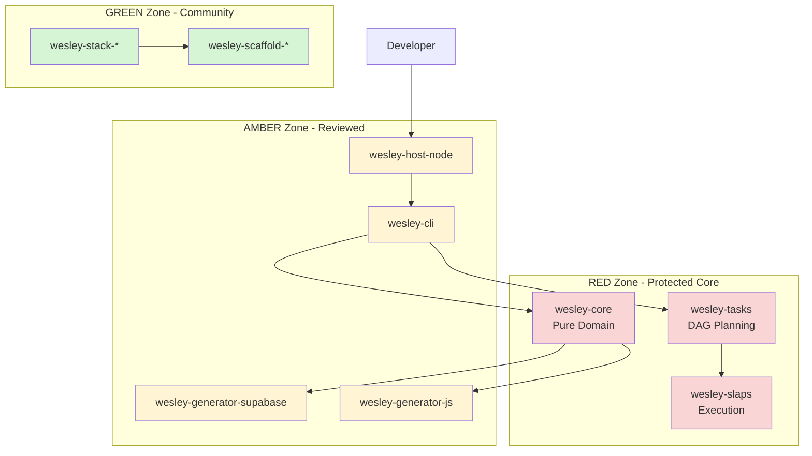
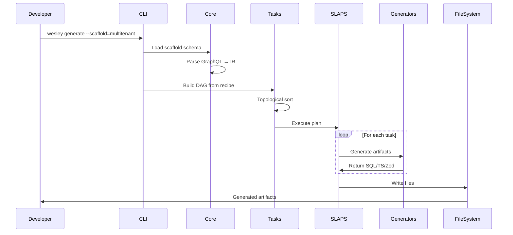
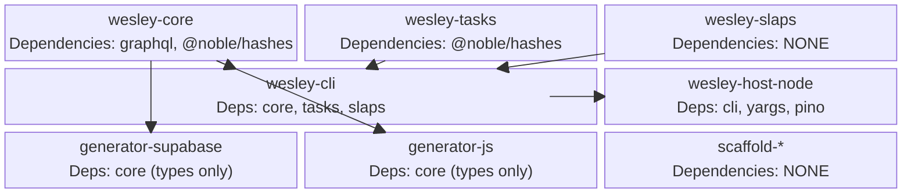
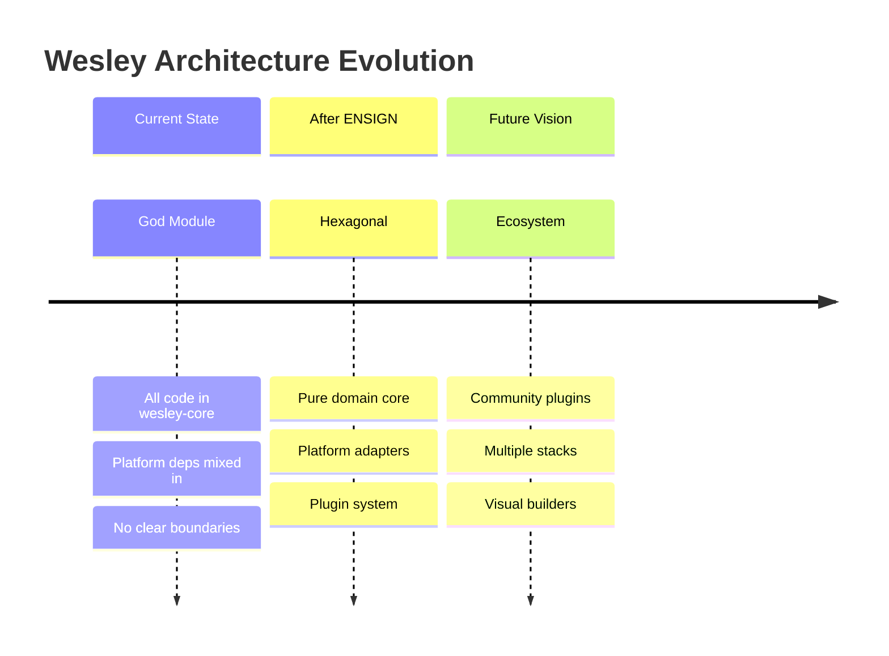

# ENSIGN - Target Architecture

This document defines the final package structure and boundaries for Wesley after the ENSIGN reorganization.

---

## Architecture Overview

Wesley follows **hexagonal architecture** (ports and adapters pattern) with three distinct layers:



```
┌─────────────────────────────────────────────────────────┐
│                    CORE DOMAIN                          │
│  ┌─────────────────────────────────────────────────┐   │
│  │              wesley-core                        │   │
│  │  • GraphQL SDL → IR transformation             │   │
│  │  • Wesley directive semantics                  │   │
│  │  • Domain models (Schema, Table, Field)        │   │
│  │  • Zero platform dependencies                  │   │
│  └─────────────────────────────────────────────────┘   │
│  ┌─────────────────────────────────────────────────┐   │
│  │              Ports Layer                        │   │
│  │  • LoggerPort, FileSystemPort interfaces       │   │
│  │  • GeneratorPort, ExecutorPort contracts       │   │
│  └─────────────────────────────────────────────────┘   │
└─────────────────────────────────────────────────────────┘
              ↑                           ↑
              │                           │
┌─────────────────────┐         ┌─────────────────────┐
│   ORCHESTRATION     │         │     GENERATION      │
│                     │         │                     │
│  wesley-tasks       │         │ wesley-generator-*  │
│  (DAG planning)     │         │ (SQL, TypeScript,   │
│                     │         │  Zod, Next.js)     │
│  wesley-slaps       │         │                     │
│  (execution engine) │         │                     │
└─────────────────────┘         └─────────────────────┘
              ↑                           ↑
              │                           │
┌─────────────────────┐         ┌─────────────────────┐
│    USER INTERFACE   │         │    CONTENT/RECIPES  │
│                     │         │                     │
│  wesley-cli         │         │ wesley-scaffold-*   │
│  (commands, pure)   │         │ (GraphQL templates) │
│                     │         │                     │
│  wesley-host-node   │         │ wesley-stack-*      │
│  (Node.js adapters) │         │ (generator recipes) │
└─────────────────────┘         └─────────────────────┘
```

---

## Package Layer Architecture



---

## Package Definitions

### **Core Domain (RED Zone - Protected)**

#### **@wesley/core** - GraphQL → IR (PURE, RED)
```
packages/wesley-core/
├── package.json         # exports: { ".": "./src/index.mjs" }
├── src/
│   ├── index.mjs        # Public API: parseSchema, buildIR, types, ports
│   ├── domain/
│   │   ├── Schema.mjs   # GraphQL schema domain models
│   │   ├── Table.mjs    # Table entity with fields, directives
│   │   ├── Field.mjs    # Field with type, constraints
│   │   └── WesleyIR.mjs # Intermediate representation types
│   ├── directives/
│   │   ├── tenant.mjs   # @tenant directive semantics
│   │   ├── rls.mjs      # @rls directive processing
│   │   └── index.mjs    # All directive handlers
│   ├── parsers/
│   │   ├── sdl.mjs      # GraphQL SDL → AST
│   │   └── ir.mjs       # AST → Wesley IR
│   ├── ports/
│   │   ├── Logger.mjs   # interface LoggerPort
│   │   ├── FileSystem.mjs # interface FileSystemPort
│   │   ├── Generator.mjs  # interface GeneratorPort
│   │   └── Executor.mjs   # interface ExecutorPort
│   └── errors/
│       └── index.mjs    # Wesley error types
└── test/
    ├── domain/          # Unit tests for domain models
    ├── parsers/         # Parser tests with fixtures
    └── integration/     # SDL → IR → outputs
```

**Dependencies:** `graphql` (AST only), `@noble/hashes` (pure hashing)  
**Forbidden:** `node:*`, `fs`, `path`, `process`, DB drivers, logging libs

---

### **Orchestration (RED Zone - Protected)**

#### **@wesley/tasks** - DAG Planning (PURE, RED)
```
packages/wesley-tasks/
├── src/
│   ├── index.mjs        # buildPlan, order, diff
│   ├── plan.mjs         # Plan types and builders
│   ├── hash.mjs         # Stable node hashing
│   ├── validate.mjs     # DAG validation
│   └── topo.mjs         # Topological sort + resource gates
└── test/
    ├── plan.test.mjs    # Plan building
    └── topo.test.mjs    # Ordering algorithms
```

**Dependencies:** `@noble/hashes`  
**Job:** Build execution plans, validate DAGs, compute stable hashes

#### **@wesley/slaps** - Execution Engine (PURE, RED)
```
packages/wesley-slaps/
├── src/
│   ├── index.mjs        # run(plan, handlers, journal)
│   ├── run.mjs          # Main execution loop
│   ├── stages.mjs       # Stage-by-stage execution
│   ├── journal.mjs      # Journal interface docs
│   └── policy.mjs       # Retry/backoff policies
└── test/
    ├── run.test.mjs     # Execution scenarios
    └── journal.test.mjs # Journal implementations
```

**Dependencies:** None  
**Job:** Execute plans with journaling, retries, resource gating

---

### **Generation (AMBER Zone - Reviewed)**

#### **@wesley/generator-supabase** - SQL/RLS/Migrations (PURE, AMBER)
```
packages/wesley-generator-supabase/
├── src/
│   ├── index.mjs        # emitDDL, emitRLS, emitMigrations, emitPgTap
│   ├── emitters/
│   │   ├── ddl.mjs      # CREATE TABLE, indexes, constraints
│   │   ├── rls.mjs      # Row Level Security policies
│   │   ├── migrations.mjs # Zero-downtime migration fragments
│   │   └── pgtap.mjs    # pgTAP test generation
│   └── templates/       # SQL template strings
└── test/
    ├── ddl.test.mjs     # DDL generation tests
    ├── rls.test.mjs     # RLS policy tests
    └── snapshots/       # Golden file comparisons
```

**Dependencies:** None (prefer template strings)  
**Job:** Transform Wesley IR into Supabase-compatible SQL, RLS, migrations, tests

#### **@wesley/generator-js** - JavaScript/TypeScript (PURE, AMBER/GREEN)
```
packages/wesley-generator-js/
├── src/
│   ├── index.mjs        # emitModels, emitZod, emitNextApi
│   ├── models.mjs       # TypeScript interfaces
│   ├── zod.mjs          # Zod validation schemas
│   ├── next-api.mjs     # Next.js API route stubs
│   └── templates/       # Code templates
└── test/
    ├── models.test.mjs  # TypeScript generation
    ├── zod.test.mjs     # Zod schema validation
    └── snapshots/       # Generated code comparisons
```

**Dependencies:** None  
**Job:** Generate TypeScript types, Zod schemas, Next.js API stubs

---

### **User Interface (AMBER Zone - Reviewed)**

#### **@wesley/cli** - Commands (PURE, AMBER)
```
packages/wesley-cli/
├── src/
│   ├── index.mjs        # Framework exports
│   ├── main.mjs         # main(argv, adapters) entry point
│   ├── program.mjs      # Command registration
│   ├── commands/
│   │   ├── generate.mjs # Generate artifacts
│   │   ├── plan.mjs     # Show migration plan
│   │   ├── migrate.mjs  # Execute migrations
│   │   └── analyze.mjs  # Analyze schema
│   └── framework/
│       ├── Command.mjs  # Base command class
│       └── utils.mjs    # Pure utility functions
└── test/
    ├── commands/        # Command unit tests
    └── integration/     # CLI integration tests
```

**Dependencies:** None (all I/O via injected adapters)  
**Job:** Platform-agnostic command interface

#### **@wesley/host-node** - Node.js Platform (NODE, AMBER)
```
packages/wesley-host-node/
├── bin/
│   └── wesley.mjs       # #!/usr/bin/env node entry point
├── src/
│   ├── index.mjs        # Adapter exports
│   ├── adapters/
│   │   ├── args.mjs     # Process argv parsing
│   │   ├── logger.mjs   # Pino logger implementation
│   │   ├── fs.mjs       # File system operations
│   │   ├── env.mjs      # Environment variables
│   │   └── stdin.mjs    # Standard input reading
│   └── pg-adapter.mjs   # PostgreSQL connection (future)
└── test/
    ├── adapters/        # Adapter unit tests
    └── integration/     # Full CLI tests
```

**Dependencies:** `yargs-parser`, `pino`, `fast-glob`, `pg` (future)  
**Job:** Node.js-specific implementations and CLI binary

---

### **Content & Recipes (GREEN Zone - Community)**

#### **@wesley/scaffold-multitenant** - SaaS Schema (PURE, GREEN)
```
packages/wesley-scaffold-multitenant/
├── schema.graphql       # Complete multi-tenant SaaS schema
├── README.md           # Usage instructions and customization
├── CHANGELOG.md        # Schema evolution history
└── test/
    ├── generate.test.mjs # Test generation from this scaffold
    └── snapshots/       # Expected outputs
```

**Dependencies:** None  
**Job:** Production-ready multi-tenant SaaS GraphQL schema

#### **@wesley/stack-supabase-nextjs** - Generator Recipe (PURE, AMBER)
```
packages/wesley-stack-supabase-nextjs/
├── recipe.json         # Generator orchestration manifest
├── README.md           # Stack documentation
└── examples/
    └── multitenant/    # Example output structure
```

**Recipe Format:**
```json
{
  "name": "@wesley/stack-supabase-nextjs",
  "recipes": {
    "multitenant": [
      { 
        "use": "@wesley/generator-supabase", 
        "with": ["ddl", "rls", "migrations", "pgtap"] 
      },
      { 
        "use": "@wesley/generator-js", 
        "with": ["models", "zod", "next-api:/api/*"] 
      }
    ]
  }
}
```

---

## Package Interaction Flow



### **Generation Pipeline**
```
1. CLI receives: wesley generate --scaffold=multitenant --stack=supabase-nextjs
2. CLI loads scaffold schema + stack recipe
3. Core parses GraphQL → Wesley IR
4. Tasks builds DAG from recipe + IR
5. SLAPS executes DAG with generator handlers
6. Generators emit artifacts (SQL, TypeScript, etc.)
7. Host adapters write files to disk
```

### **Migration Pipeline** (Future)
```
1. CLI receives: wesley migrate up
2. Core compares current vs. target schema
3. Tasks builds migration DAG
4. SLAPS executes with postgres runner handlers
5. Runner applies DDL with advisory locks
6. pgTAP validates migration success
```

---

## Dependency Flow



---

## Dependency Rules (Enforced by CI)

### **Allowed Dependencies**
```
wesley-core         → graphql, @noble/hashes
wesley-tasks        → @noble/hashes
wesley-slaps        → (none)
wesley-cli          → @wesley/core, @wesley/tasks, @wesley/slaps
wesley-host-node    → @wesley/cli, yargs-parser, pino, fast-glob
wesley-generator-*  → @wesley/core (for types only)
wesley-scaffold-*   → (none - data only)
wesley-stack-*      → (none - data only)
```

### **Forbidden Dependencies**
```javascript
// .dependency-cruiser.js
module.exports = {
  forbidden: [
    {
      name: "no-node-in-core",
      from: { path: "^packages/wesley-core/src" },
      to: { path: "node_modules/(fs|path|url)|^node:" },
      severity: "error"
    },
    {
      name: "no-platform-in-generators", 
      from: { path: "^packages/wesley-generator-.*/src" },
      to: { path: "node_modules/(fs|path)|^node:" },
      severity: "error"
    },
    {
      name: "no-deep-imports",
      from: { path: "^packages/" },
      to: { path: "/src/" },
      severity: "error"
    }
  ]
}
```

---

## Public API Contracts

Each package exposes only its intended interface via `package.json` exports:

```json
{
  "name": "@wesley/core",
  "exports": {
    ".": "./src/index.mjs",
    "./types": "./src/domain/index.mjs",
    "./ports": "./src/ports/index.mjs"
  }
}
```

**No `/src/*` imports allowed between packages.** All communication through explicit exports only.

---

## Architecture Evolution



```mermaid
radar
    title Architecture Quality Metrics
    x-axis "Low" --> "High"
    y-axis "Current" --> "Target"
    quadrant-1 "Achieved"
    quadrant-2 "In Progress"  
    quadrant-3 "Planned"
    quadrant-4 "Future"
    "Domain Purity": [0.3, 0.9]
    "Package Boundaries": [0.2, 0.95]
    "Plugin System": [0.1, 0.85]
    "Test Coverage": [0.4, 0.9]
    "Community Ready": [0.15, 0.8]
```

---

**Next**: See ENSIGN-Migration-Plan.md for step-by-step execution roadmap.