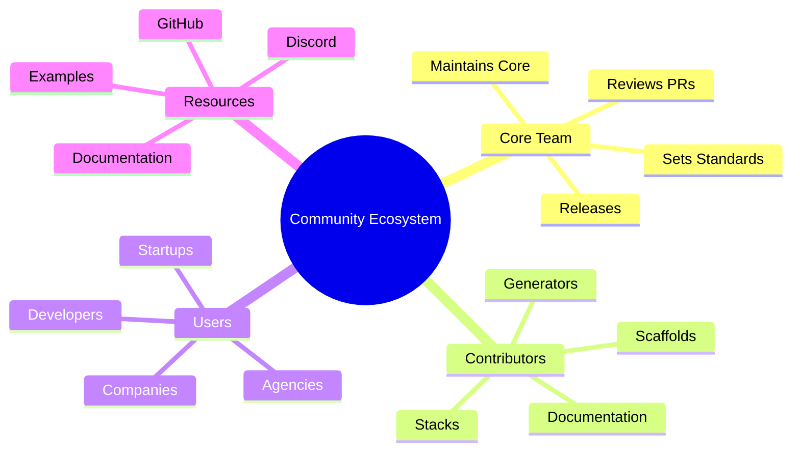
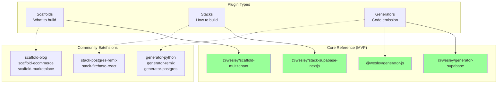
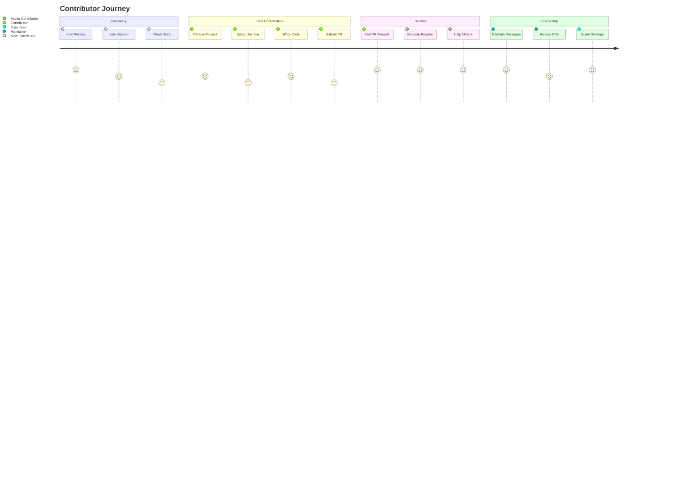
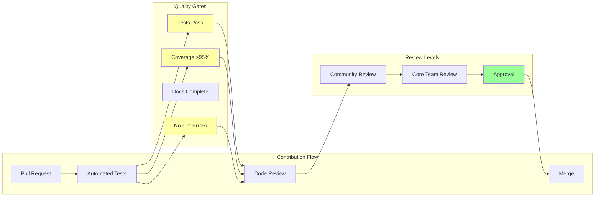
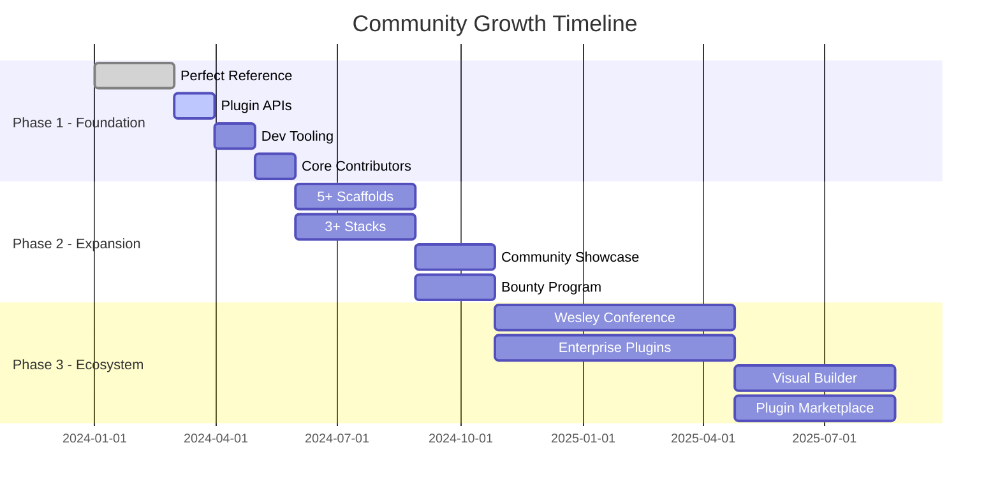
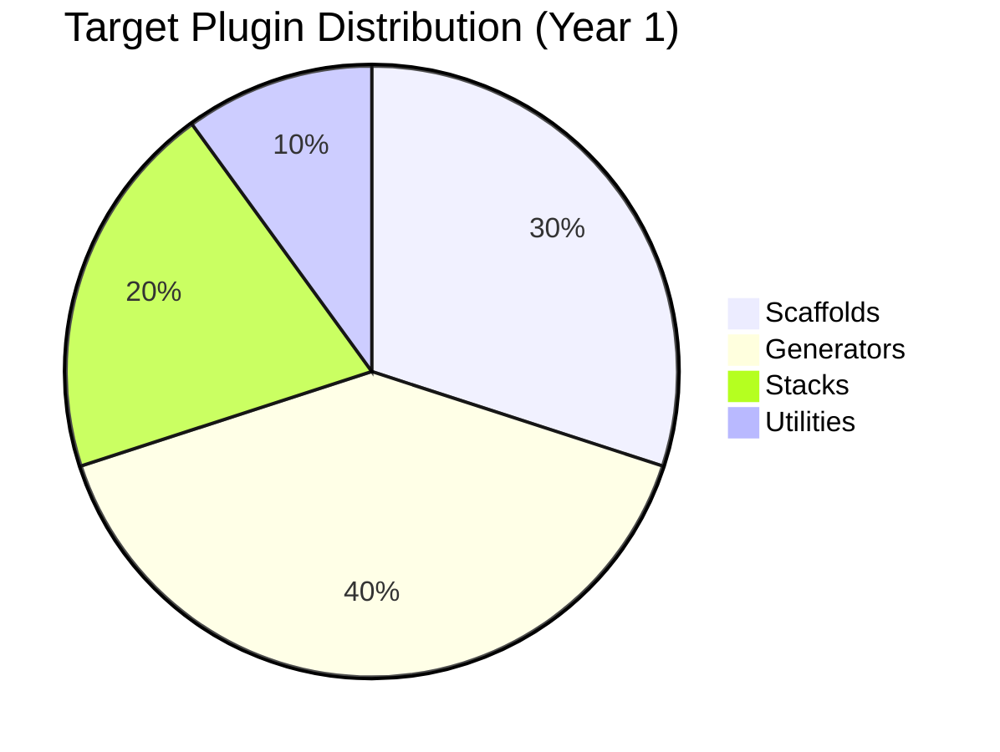
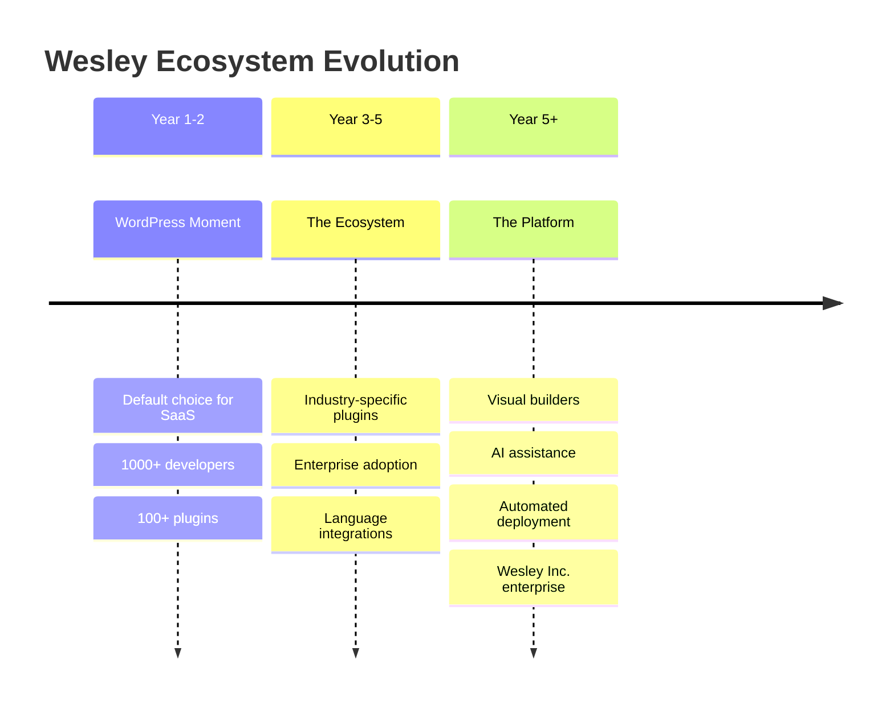

# ENSIGN - Community Readiness

This document outlines Wesley's extensibility architecture and community contribution strategy.

---

## Community Vision

**"Make Wesley the Rails/Next.js of full-stack development - one perfect reference implementation that inspires an ecosystem."**

Wesley will succeed through a controlled expansion model:
1. **Perfect the Core** - One stack (Supabase + Next.js) that works flawlessly
2. **Open Safe Extension Points** - Clear plugin APIs for scaffolds, generators, stacks  
3. **Guide Community Growth** - Documentation, examples, and guardrails for contributors
4. **Maintain Quality** - Rigorous standards and automated testing for all extensions



---

## Extension Architecture



### **Three Extension Types**

#### **1. Scaffolds** - "What kind of app am I building?"
```
@wesley/scaffold-multitenant     ← MVP (perfect reference)
@wesley/scaffold-blog           ← Community
@wesley/scaffold-ecommerce      ← Community  
@wesley/scaffold-marketplace    ← Community
@wesley/scaffold-analytics      ← Community
```

#### **2. Stacks** - "What technologies power my app?"
```
@wesley/stack-supabase-nextjs   ← MVP (perfect reference)
@wesley/stack-postgres-remix    ← Community
@wesley/stack-planetscale-astro ← Community
@wesley/stack-firebase-react    ← Community
```

#### **3. Generators** - "How do I emit code for technology X?"
```
@wesley/generator-supabase      ← MVP (perfect reference)  
@wesley/generator-js            ← MVP (perfect reference)
@wesley/generator-postgres      ← Community
@wesley/generator-python        ← Community
@wesley/generator-remix         ← Community
@wesley/generator-astro         ← Community
```

---

## Plugin API Design

### **Scaffold Plugin Interface**

```typescript
// @wesley/scaffold-plugin interface
export interface ScaffoldPlugin {
  name: string;
  version: string;
  description: string;
  schema: string;              // GraphQL schema content
  metadata: ScaffoldMetadata;  // Tags, categories, complexity
  
  // Optional customization hooks
  customize?(options: ScaffoldOptions): string;
  validate?(schema: string): ValidationResult;
}

// Example scaffold plugin
export const BlogScaffold: ScaffoldPlugin = {
  name: '@wesley/scaffold-blog',
  version: '1.0.0',
  description: 'Complete blog with posts, comments, and categories',
  schema: readFileSync('./blog.graphql', 'utf8'),
  metadata: {
    tags: ['content', 'cms', 'blog'],
    complexity: 'simple',
    entities: ['Post', 'Comment', 'Category', 'Author']
  },
  
  customize(options) {
    // Allow users to customize the base schema
    return this.schema.replace('{{BLOG_TITLE}}', options.title || 'My Blog');
  }
};
```

### **Generator Plugin Interface**

```typescript
// @wesley/generator-plugin interface  
export interface GeneratorPlugin {
  name: string;
  version: string;
  targetTechnology: string;     // 'postgres', 'typescript', 'python'
  
  // Core generation functions
  emit(ir: WesleyIR, options: GeneratorOptions): ArtifactSet;
  
  // Metadata for orchestration
  getDependencies(): string[];  // Other generators this depends on
  getResourceRequirements(): string[]; // ['db:write', 'fs:write']
  
  // Validation
  validateIR?(ir: WesleyIR): ValidationResult;
  validateOutput?(artifacts: ArtifactSet): ValidationResult;
}

// Example generator plugin
export const PostgreSQLGenerator: GeneratorPlugin = {
  name: '@wesley/generator-postgres',
  version: '1.0.0', 
  targetTechnology: 'postgresql',
  
  emit(ir, options) {
    return {
      'schema.sql': generateDDL(ir),
      'indexes.sql': generateIndexes(ir),
      'constraints.sql': generateConstraints(ir)
    };
  },
  
  getDependencies() {
    return []; // No dependencies
  },
  
  getResourceRequirements() {
    return ['db:write']; // Requires exclusive database access
  }
};
```

### **Stack Plugin Interface**

```typescript
// @wesley/stack-plugin interface
export interface StackPlugin {
  name: string;
  version: string;
  description: string;
  
  // Generator orchestration recipes
  recipes: Record<string, StackRecipe>;
  
  // Stack-specific validation
  validateScaffold?(scaffold: ScaffoldPlugin): ValidationResult;
  getRequiredGenerators(): string[];
}

// Example stack plugin  
export const SupabaseNextjsStack: StackPlugin = {
  name: '@wesley/stack-supabase-nextjs',
  version: '1.0.0',
  description: 'Supabase database + Next.js frontend + TypeScript',
  
  recipes: {
    default: [
      { use: '@wesley/generator-supabase', with: ['ddl', 'rls', 'pgtap'] },
      { use: '@wesley/generator-js', with: ['types', 'zod', 'next-api'] }
    ],
    
    minimal: [
      { use: '@wesley/generator-supabase', with: ['ddl'] },
      { use: '@wesley/generator-js', with: ['types'] }
    ]
  },
  
  getRequiredGenerators() {
    return ['@wesley/generator-supabase', '@wesley/generator-js'];
  }
};
```

---

## Community Contribution Paths



### **GREEN Zone - Community Welcome**

#### **Scaffold Contributions**
**Difficulty:** Low to Medium  
**Requirements:** GraphQL knowledge, domain expertise

```bash
# Create new scaffold
npx create-wesley-scaffold my-marketplace
cd wesley-scaffold-marketplace

# Development workflow
npm run validate-schema  # Ensure schema is valid Wesley GraphQL
npm run test-generation  # Test against reference stacks  
npm run build           # Package for publishing
```

**Contribution Process:**
1. Use scaffold template generator
2. Write comprehensive GraphQL schema with Wesley directives
3. Add extensive documentation and examples
4. Test against multiple stacks
5. Submit PR with schema validation passing

#### **Generator Contributions**  
**Difficulty:** Medium to High
**Requirements:** Target technology expertise, Wesley IR understanding

```bash
# Create new generator
npx create-wesley-generator python-fastapi
cd wesley-generator-python-fastapi

# Development workflow  
npm run test           # Unit tests for generation logic
npm run test:golden    # Golden file tests for output consistency
npm run test:stack     # Integration tests with stack recipes
```

**Quality Standards:**
- 100% test coverage for generation logic
- Golden file tests for output consistency
- Documentation with examples for all generated artifacts
- Performance benchmarks (generation time, output size)

### **AMBER Zone - Core Team Review**

#### **Stack Contributions**
**Difficulty:** Medium
**Requirements:** Multi-technology expertise, orchestration understanding

**Review Criteria:**
- Recipe completeness (all necessary generators)
- Technology compatibility matrix
- Performance characteristics
- Documentation quality

#### **Core Feature Extensions**
**Difficulty:** High  
**Requirements:** Deep Wesley architecture knowledge

Examples:
- New Wesley directive types (`@index`, `@check`, `@trigger`)
- IR format extensions
- Advanced RLS policy patterns
- Migration generation improvements

### **RED Zone - Core Team Only**

Protected areas that maintain Wesley's architectural integrity:

- **wesley-core** - GraphQL parsing, IR generation
- **wesley-tasks** - DAG planning and orchestration  
- **wesley-slaps** - Execution engine and journaling
- **CLI framework** - Command architecture and host adapters

---

## Onboarding & Developer Experience

### **Getting Started Guide**

#### **For Scaffold Authors**
```markdown
# Creating a Wesley Scaffold

## 1. Initialize Project
npx create-wesley-scaffold my-awesome-app
cd wesley-scaffold-awesome-app

## 2. Design Your Schema
Edit `schema.graphql` with your domain model:
- Use Wesley directives (@table, @tenant, @rls)
- Follow multi-tenant patterns from reference
- Add comprehensive comments

## 3. Test & Validate
npm run validate    # Schema syntax and directive usage
npm run test       # Generation with reference stacks
npm run docs       # Generate documentation

## 4. Publish & Share
npm publish        # Publish to npm
wesley showcase    # Add to community showcase
```

#### **For Generator Authors**
```markdown
# Creating a Wesley Generator  

## 1. Study the IR Format
- Read IR_SPEC.md for complete IR structure
- Examine reference generator implementations
- Understand dependency relationships

## 2. Implement Core Functions
- emit(ir): Transform IR to your target artifacts
- getDependencies(): Declare generator dependencies
- validateIR(ir): Ensure IR compatibility

## 3. Add Comprehensive Tests
- Unit tests for all generation logic
- Golden file tests for output consistency
- Integration tests with multiple scaffolds

## 4. Performance & Quality
- Benchmark generation performance
- Add error handling and validation
- Write extensive documentation with examples
```

### **Community Resources**

#### **Documentation Website**
```
https://wesley.dev/
├── /docs/getting-started     # Quick start guide
├── /docs/scaffolds           # Scaffold development  
├── /docs/generators          # Generator development
├── /docs/stacks              # Stack orchestration
├── /docs/api                 # Plugin API reference
├── /showcase                 # Community showcases
└── /examples                 # Code examples
```

#### **Development Tools**

```bash
# Wesley CLI extensions for plugin development
wesley scaffold validate ./my-scaffold.graphql
wesley scaffold test --stack=supabase-nextjs
wesley generator test ./my-generator --scaffold=multitenant
wesley stack validate ./my-stack.json
```

#### **Community Channels**
- **Discord Server:** Real-time chat, help, and collaboration
- **GitHub Discussions:** Feature requests, architectural discussions
- **Weekly Community Calls:** Demo new plugins, discuss roadmap
- **Contribution Bounty Program:** Reward high-quality contributions

---

## Quality & Governance



### **Plugin Quality Standards**

#### **Scaffold Requirements**
- ✅ Valid Wesley GraphQL schema
- ✅ Comprehensive README with examples
- ✅ Works with at least one reference stack
- ✅ Includes sample data and use cases
- ✅ Follows multi-tenant patterns (if applicable)

#### **Generator Requirements**
- ✅ 95%+ test coverage  
- ✅ Golden file tests for all outputs
- ✅ Performance benchmarks documented
- ✅ Error handling and validation
- ✅ API documentation with examples
- ✅ Compatible with Wesley orchestration

#### **Stack Requirements**
- ✅ Complete technology integration  
- ✅ Works with multiple scaffolds
- ✅ Performance characteristics documented
- ✅ Deployment guide and examples
- ✅ Troubleshooting documentation

### **Review Process**

#### **Community Plugins (GREEN)**
1. **Automated Testing:** All tests pass, quality gates met
2. **Community Review:** Open PR review process
3. **Documentation Check:** Comprehensive docs and examples
4. **Integration Testing:** Works with reference implementations

#### **Core Integration (AMBER)**
1. **Architecture Review:** Fits Wesley design principles
2. **Performance Review:** No significant regressions
3. **Security Review:** Follows security best practices  
4. **Maintainability Review:** Code quality and documentation

### **Plugin Registry**

```typescript
// Wesley plugin registry
interface PluginRegistry {
  scaffolds: ScaffoldPlugin[];
  generators: GeneratorPlugin[];
  stacks: StackPlugin[];
  
  // Quality metrics
  ratings: Record<string, PluginRating>;
  downloads: Record<string, number>;
  compatibility: CompatibilityMatrix;
}

// Plugin discovery and installation
wesley search scaffolds --tag=ecommerce
wesley install @community/scaffold-shopify
wesley list generators --technology=python
```

---

## Ecosystem Growth Strategy





### **Phase 1: Foundation (MVP)**
- **Perfect reference implementation** (multitenant + supabase-nextjs)
- **Plugin API stabilization** with comprehensive documentation
- **Developer tooling** for scaffold/generator creation
- **Core community** of 10-20 expert contributors

### **Phase 2: Expansion (6 months post-MVP)**
- **5+ community scaffolds** (blog, ecommerce, docs, analytics, marketplace)
- **3+ additional stacks** (postgres-remix, firebase-react, planetscale-astro)
- **Community showcase** with real applications
- **Plugin bounty program** to incentivize quality contributions

### **Phase 3: Ecosystem (12 months post-MVP)**
- **Wesley Conference/Meetups** for community building
- **Enterprise plugins** for complex industry use cases
- **Visual plugin builder** for non-technical users
- **Plugin marketplace** with ratings and reviews
- **Wesley certification program** for expert developers

### **Success Metrics**

#### **Community Health**
- **100+ published plugins** across scaffolds/generators/stacks
- **1000+ GitHub stars** and growing contributor base
- **10+ companies** using Wesley in production
- **Active Discord** with daily conversations and help

#### **Technical Quality**
- **<2% plugin failure rate** in production usage
- **<1 day median** response time for plugin issues
- **100% compatibility** between major Wesley versions
- **Zero security incidents** in community plugins

---

## Risk Management

### **Plugin Security**

```typescript
// Plugin sandboxing and validation
interface PluginSecurity {
  // Code analysis for malicious patterns
  analyzeCode(pluginSource: string): SecurityReport;
  
  // Runtime sandboxing  
  sandbox(plugin: Plugin): SandboxedPlugin;
  
  // Permission system
  checkPermissions(plugin: Plugin, operation: string): boolean;
}

// Automated security scanning
wesley security-scan ./my-generator
wesley security-audit --all-plugins
```

### **Breaking Changes**

```typescript
// Semantic versioning and compatibility
interface CompatibilityMatrix {
  wesley: {
    '1.0.0': { compatible: ['plugin@1.x', 'plugin@2.x'] },
    '1.1.0': { compatible: ['plugin@1.x', 'plugin@2.x', 'plugin@3.x'] },
    '2.0.0': { compatible: ['plugin@2.x', 'plugin@3.x'] }
  };
}

// Plugin migration assistance
wesley migrate-plugin --from=1.0 --to=2.0 ./my-generator
wesley compatibility-check --wesley-version=2.0.0
```

### **Quality Degradation**

**Prevention:**
- Automated testing for all plugin combinations
- Performance regression detection
- Community review process with multiple approvers
- Staged rollout system for plugin updates

**Response:**
- Automated rollback for failing plugins  
- Circuit breaker pattern for problematic plugins
- Community alert system for quality issues
- Fast track process for critical fixes

---

## Future Vision



**Years 1-2: The WordPress Moment**  
Wesley becomes the default choice for multi-tenant SaaS development. Thousands of developers use community plugins to build applications faster than ever before.

**Years 3-5: The Ecosystem**  
Wesley powers entire industries with specialized plugins. Enterprise companies contribute domain-specific scaffolds. New programming languages and databases integrate seamlessly.

**Years 5+: The Platform**  
Wesley evolves into a full development platform with visual builders, AI-assisted code generation, and automated deployment pipelines. The community maintains the core while Wesley Inc. focuses on enterprise features.

---

**The End Goal:** Wesley democratizes full-stack development by making complex architectural patterns accessible through simple, composable plugins. Every developer can build production-ready applications by combining battle-tested community components.

---

**Phase 1 Complete!** 🎉 The ENSIGN documentation suite provides a comprehensive roadmap for transforming Wesley into a clean, extensible, community-ready platform. Time to execute the reorganization!