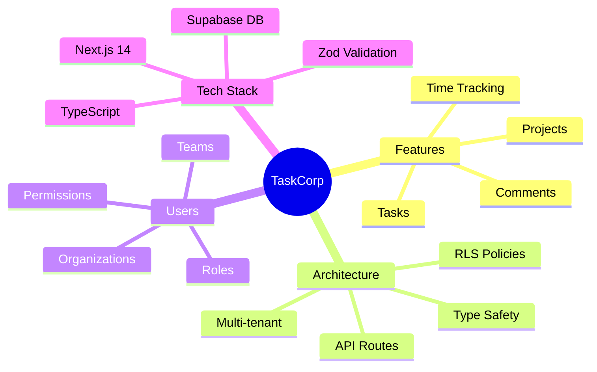
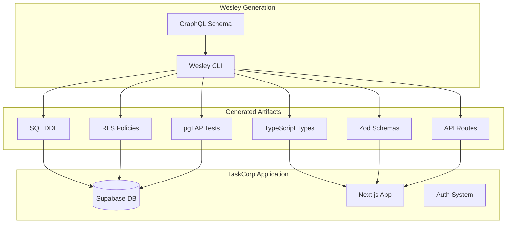
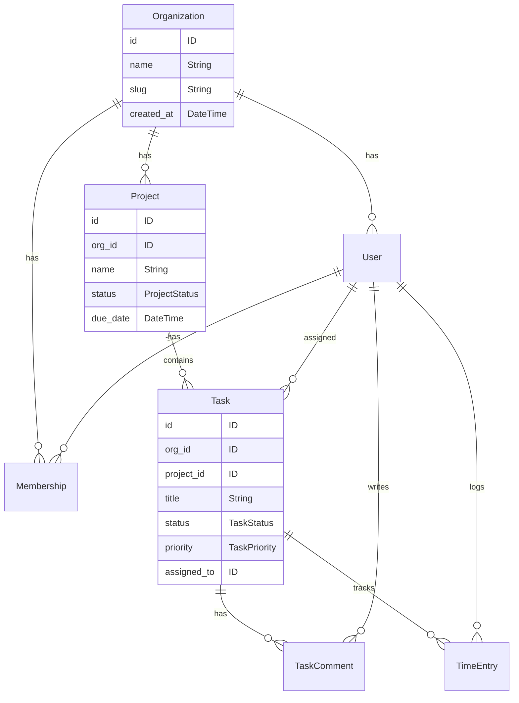
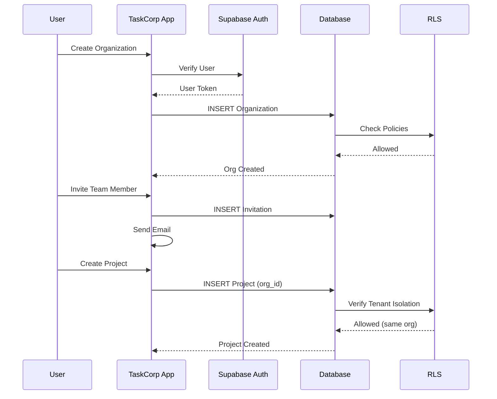
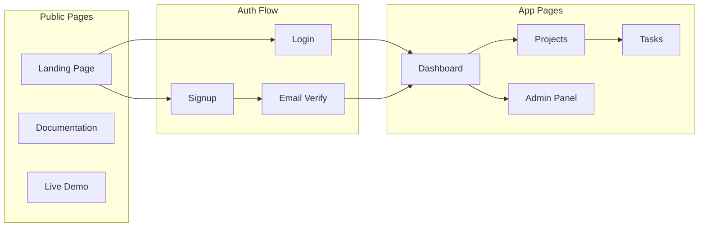
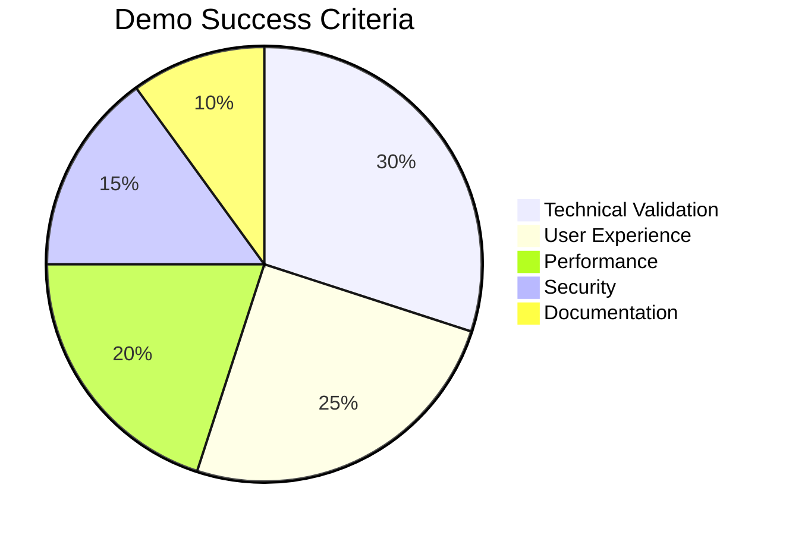

# ENSIGN - Demo Application Specification

This document specifies the reference demo application that showcases Wesley's MVP capabilities.

---

## Demo Application Overview

**Name:** TaskCorp - Multi-Tenant Task Management SaaS  
**Purpose:** Demonstrate Wesley's complete multi-tenant SaaS generation pipeline  
**Stack:** Wesley + Supabase + Next.js 14 + TypeScript  
**Target:** Production-ready application that could be deployed commercially



---

## Business Requirements

### **Core Functionality**
TaskCorp allows organizations to manage tasks, projects, and team collaboration with complete tenant isolation.

### **User Roles**
- **Organization Owner:** Full admin access, billing, user management
- **Project Manager:** Manage projects, assign tasks, view reports  
- **Team Member:** Create/edit own tasks, comment, collaborate
- **Viewer:** Read-only access to assigned projects

### **Key Features**
1. **Multi-Tenant Architecture:** Complete organization isolation
2. **Project Management:** Projects with tasks, milestones, deadlines
3. **Team Collaboration:** Comments, notifications, file attachments
4. **Access Control:** Role-based permissions with RLS enforcement
5. **Activity Audit:** Complete audit trail for compliance
6. **API Management:** API keys for integrations with external tools

---

## Technical Architecture



### **Generated by Wesley**
```
wesley generate --scaffold=multitenant --stack=supabase-nextjs
```

### **Wesley Artifacts Used**
- **GraphQL Schema:** Multi-tenant scaffold with customizations
- **PostgreSQL DDL:** Tables, indexes, constraints, RLS policies
- **TypeScript Types:** End-to-end type safety
- **Zod Schemas:** Runtime validation for all inputs
- **pgTAP Tests:** Comprehensive schema and RLS testing
- **Next.js API Routes:** Basic CRUD operations

### **Application Structure**
```
taskcorp/
├── schema/
│   └── taskcorp.graphql         # Wesley schema (customized from scaffold)
├── generated/                   # Wesley output (never edit directly)
│   ├── sql/
│   │   ├── schema.sql          # Generated DDL
│   │   ├── rls-policies.sql    # Generated RLS
│   │   └── tests.sql           # Generated pgTAP
│   ├── types/
│   │   ├── database.ts         # Generated TypeScript types
│   │   └── zod.ts              # Generated Zod schemas
│   └── api/
│       └── routes/             # Generated Next.js API stubs
├── src/
│   ├── app/                    # Next.js App Router
│   ├── components/             # React components
│   ├── hooks/                  # Data fetching hooks
│   └── lib/                    # Utilities, Supabase client
├── migrations/                 # Applied to Supabase
└── tests/
    ├── e2e/                    # Playwright tests
    └── rls/                    # RLS policy tests
```

---

## Wesley Schema Customization



### **Base Schema:** Multi-tenant scaffold
**Customizations for TaskCorp:**

```graphql
# TaskCorp-specific extensions to multi-tenant scaffold

type Project @table 
  @tenant(by: "org_id")
  @rls(enabled: true) {
  id: ID! @primaryKey
  org_id: ID! @foreignKey(ref: "Organization.id") @index
  name: String!
  description: String
  status: ProjectStatus! @default(value: "ACTIVE")
  due_date: DateTime @index
  created_by: ID! @foreignKey(ref: "User.id")
  created_at: DateTime! @default(value: "NOW()")
  updated_at: DateTime! @default(value: "NOW()")
  
  @@index(fields: ["org_id", "status", "due_date"])
}

enum ProjectStatus {
  ACTIVE
  ON_HOLD
  COMPLETED  
  CANCELLED
}

type Task @table
  @tenant(by: "org_id") 
  @owner(column: "assigned_to")
  @rls(
    enabled: true,
    select: "tenant_and_visible_to_user",
    insert: "tenant_and_project_member", 
    update: "owner_or_project_manager",
    delete: "owner_or_admin"
  ) {
  id: ID! @primaryKey
  org_id: ID! @foreignKey(ref: "Organization.id") @index
  project_id: ID! @foreignKey(ref: "Project.id") @index
  title: String!
  description: String
  status: TaskStatus! @default(value: "TODO") @index
  priority: TaskPriority! @default(value: "MEDIUM") @index
  due_date: DateTime @index
  assigned_to: ID @foreignKey(ref: "User.id") @index
  created_by: ID! @foreignKey(ref: "User.id")
  created_at: DateTime! @default(value: "NOW()")
  updated_at: DateTime! @default(value: "NOW()")
  
  @@index(fields: ["org_id", "assigned_to", "status"])
  @@index(fields: ["project_id", "status", "due_date"])
}

enum TaskStatus {
  TODO
  IN_PROGRESS
  IN_REVIEW
  COMPLETED
}

enum TaskPriority {
  LOW
  MEDIUM
  HIGH
  URGENT
}

type TaskComment @table
  @tenant(by: "org_id")
  @owner(column: "created_by")
  @rls(
    enabled: true,
    select: "tenant_and_task_visible",
    insert: "tenant_and_task_member",
    update: "owner_only",
    delete: "owner_or_admin"
  ) {
  id: ID! @primaryKey
  org_id: ID! @foreignKey(ref: "Organization.id") @index  
  task_id: ID! @foreignKey(ref: "Task.id") @index
  content: String!
  created_by: ID! @foreignKey(ref: "User.id")
  created_at: DateTime! @default(value: "NOW()")
  updated_at: DateTime! @default(value: "NOW()")
  
  @@index(fields: ["task_id", "created_at"])
}

type TimeEntry @table
  @tenant(by: "org_id")
  @owner(column: "user_id")
  @rls(
    enabled: true,
    select: "tenant_and_own_or_admin",
    insert: "owner_only",
    update: "owner_only", 
    delete: "owner_or_admin"
  ) {
  id: ID! @primaryKey
  org_id: ID! @foreignKey(ref: "Organization.id") @index
  task_id: ID! @foreignKey(ref: "Task.id") @index
  user_id: ID! @foreignKey(ref: "User.id") @index
  description: String
  hours: Float!
  started_at: DateTime! @index
  ended_at: DateTime
  created_at: DateTime! @default(value: "NOW()")
  
  @@index(fields: ["org_id", "user_id", "started_at"])
}
```

---

## Key Demo Scenarios



### **1. Organization Setup**
**Flow:** New user creates organization → invites team → sets up first project

**Demonstrates:**
- Multi-tenant organization creation
- User invitation system with email tokens
- Role-based access control setup
- RLS policy enforcement from day 1

### **2. Project & Task Management**  
**Flow:** Project manager creates project → adds tasks → assigns to team → tracks progress

**Demonstrates:**
- Complex multi-table relationships
- Tenant isolation across all operations
- Generated TypeScript types prevent errors
- Real-time updates with proper permissions

### **3. Cross-Tenant Isolation**
**Flow:** Two different organizations using same app → verify complete data isolation

**Demonstrates:**
- RLS policies prevent data leaks
- Tenant switching works correctly
- API keys scoped to organizations
- Audit logs track all access

### **4. Team Collaboration**
**Flow:** Team members comment on tasks → receive notifications → log time

**Demonstrates:**
- Permission-based features (comments, time tracking)
- Notification system respects tenant boundaries  
- Activity audit trail
- Complex RLS policies (task visibility, comment permissions)

### **5. API Integration**
**Flow:** External tool uses API keys → creates tasks → respects tenant boundaries

**Demonstrates:**
- Generated API routes work correctly
- API key authentication and scoping
- Zod validation prevents bad data
- Rate limiting and security

---

## User Interface Highlights



### **Landing Page**
- Hero section explaining multi-tenant SaaS capabilities
- Live demo link with sample data
- Architecture diagram showing Wesley generation pipeline

### **Dashboard**
- Organization switcher (for users in multiple orgs)
- Project overview with task statistics
- Recent activity feed (tenant-scoped)
- Quick task creation

### **Project View**
- Kanban board with drag-and-drop
- Task filtering by assignee, status, priority
- Gantt chart for project timeline
- Team member list with permissions

### **Task Detail**
- Full task information with rich text description
- Comment thread with real-time updates
- Time tracking with start/stop timer
- File attachments (if implemented)

### **Admin Panel**
- User management with role assignments
- Organization settings and preferences
- API key management
- Audit log viewer with search/filtering
- Usage analytics and reporting

---

## Generated Code Integration

### **Database Layer**
```typescript
// Generated types ensure type safety
import { Database } from '@/generated/types/database';
import { TaskInsert, TaskUpdate } from '@/generated/types/zod';

// Type-safe database operations
const createTask = async (orgId: string, taskData: TaskInsert) => {
  // Zod validation happens automatically
  const validated = TaskInsert.parse(taskData);
  
  // TypeScript ensures correct table/column names
  return await supabase
    .from('task')
    .insert({ ...validated, org_id: orgId })
    .select();
};
```

### **API Routes**
```typescript
// Generated Next.js API route (customized)
// /api/tasks/[id]/route.ts
import { TaskUpdate } from '@/generated/types/zod';
import { getServerSession } from '@/lib/auth';

export async function PUT(request: Request) {
  const session = await getServerSession();
  if (!session?.user) return Response.json({ error: 'Unauthorized' }, { status: 401 });

  // Zod validation
  const body = await request.json();
  const taskData = TaskUpdate.parse(body);

  // RLS automatically enforces tenant isolation
  const { data, error } = await supabase
    .from('task')
    .update(taskData)
    .eq('id', params.id)
    .eq('org_id', session.user.org_id) // Explicit tenant check
    .select()
    .single();

  return Response.json({ data, error });
}
```

### **React Hooks**
```typescript
// Custom hooks using generated types
import { Task, Project } from '@/generated/types/database';

export function useTasks(projectId: string) {
  return useSWR<Task[]>(`/api/projects/${projectId}/tasks`, fetcher);
}

export function useCreateTask() {
  const { mutate } = useSWRConfig();
  
  return async (taskData: TaskInsert) => {
    const response = await fetch('/api/tasks', {
      method: 'POST',
      headers: { 'Content-Type': 'application/json' },
      body: JSON.stringify(taskData),
    });
    
    if (response.ok) {
      // Revalidate related queries
      mutate(key => typeof key === 'string' && key.includes('/api/tasks'));
    }
    
    return response.json();
  };
}
```

---

## Deployment & DevOps

### **Supabase Setup**
```sql
-- Apply generated schema
\i generated/sql/schema.sql

-- Apply generated RLS policies  
\i generated/sql/rls-policies.sql

-- Run generated tests
\i generated/sql/tests.sql
```

### **Vercel Deployment**
```json
{
  "name": "taskcorp-demo",
  "version": 2,
  "builds": [{ "src": "next.config.js", "use": "@vercel/next" }],
  "env": {
    "NEXT_PUBLIC_SUPABASE_URL": "@supabase-url",
    "NEXT_PUBLIC_SUPABASE_ANON_KEY": "@supabase-anon-key",
    "SUPABASE_SERVICE_ROLE_KEY": "@supabase-service-key"
  }
}
```

### **CI/CD Pipeline**
```yaml
# .github/workflows/deploy.yml
name: Deploy TaskCorp Demo
on:
  push:
    branches: [main]

jobs:
  test-and-deploy:
    runs-on: ubuntu-latest
    steps:
      - uses: actions/checkout@v4
      - uses: actions/setup-node@v4
        with:
          node-version: '18'
      
      # Test generated SQL
      - name: Run pgTAP tests
        run: docker run --rm -v $(pwd)/generated/sql:/sql supabase/pg_prove /sql/tests.sql
      
      # Deploy to Vercel
      - uses: vercel/action@latest
        with:
          vercel-token: ${{ secrets.VERCEL_TOKEN }}
```

---

## Success Metrics



### **Technical Validation**
- ✅ All generated SQL applies without errors
- ✅ All pgTAP tests pass (100% schema coverage)
- ✅ TypeScript compilation with zero errors
- ✅ All Zod schemas validate correctly
- ✅ RLS policies prevent cross-tenant data access

### **User Experience**
- ✅ Complete task management workflow works end-to-end
- ✅ Organization switching maintains proper isolation
- ✅ API integrations respect tenant boundaries
- ✅ Real-time features work with proper permissions
- ✅ Mobile-responsive design

### **Performance**
- ✅ Page load times <2 seconds
- ✅ API responses <500ms average
- ✅ Database queries optimized with proper indexes
- ✅ RLS policies don't impact performance significantly
- ✅ Handles 100+ concurrent users per organization

---

## Public Demo Strategy

### **Demo Environment**
- **URL:** https://taskcorp.wesley.dev
- **Sample Organizations:** "Acme Corp", "Beta Inc", "Gamma LLC"  
- **Sample Data:** Realistic projects, tasks, users, comments
- **Reset Schedule:** Daily cleanup and regeneration

### **Demo Script**
1. **Landing Page:** Explain Wesley's value proposition
2. **Login:** Use pre-created demo accounts
3. **Dashboard:** Show multi-tenant organization switching
4. **Create Task:** Demonstrate type-safe form validation
5. **Team Collaboration:** Show comments, notifications, permissions
6. **Admin Panel:** Display audit logs, user management, API keys
7. **Developer View:** Show generated code, schema, tests

### **Source Code**
- **Repository:** https://github.com/wesleydev/taskcorp-demo
- **License:** MIT (open source)
- **Documentation:** Comprehensive README with setup instructions
- **Video Walkthrough:** 10-minute demo on YouTube

---

**Next:** See ENSIGN-Testing-Strategy.md for comprehensive testing approach.