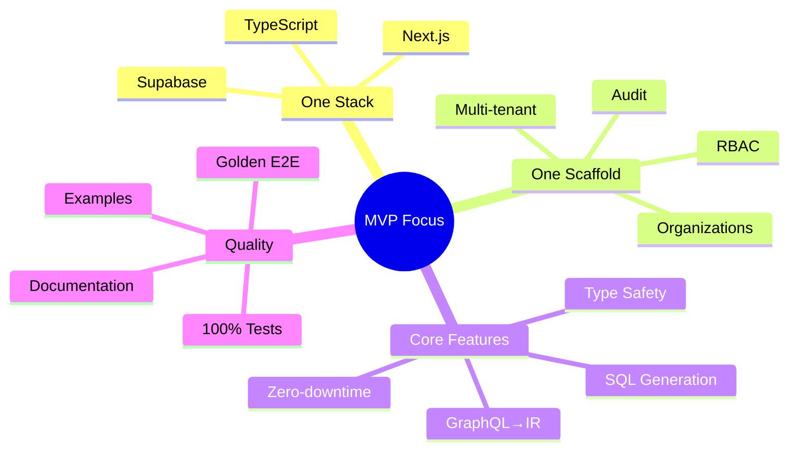
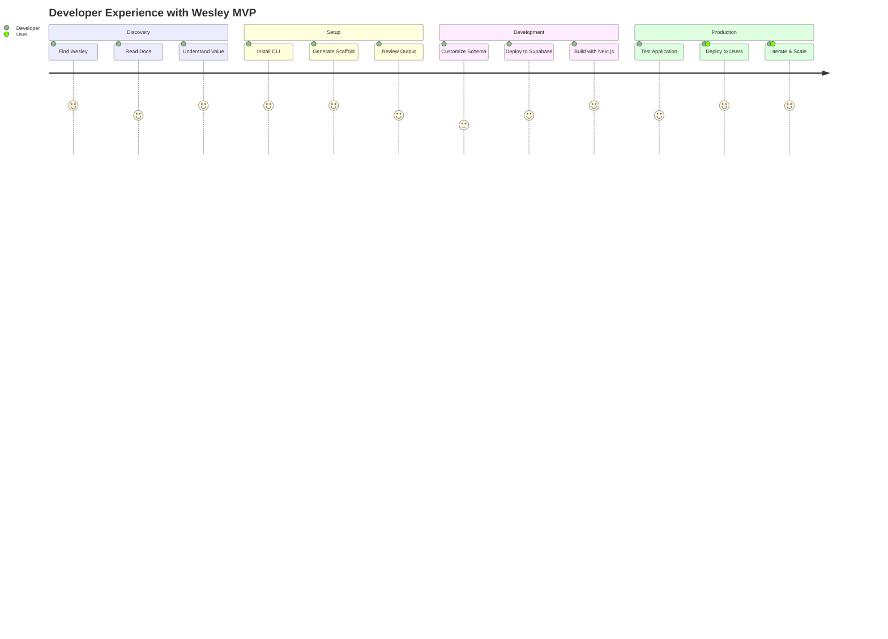
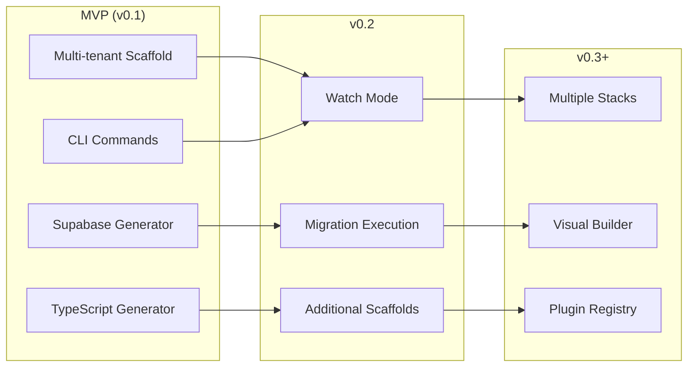
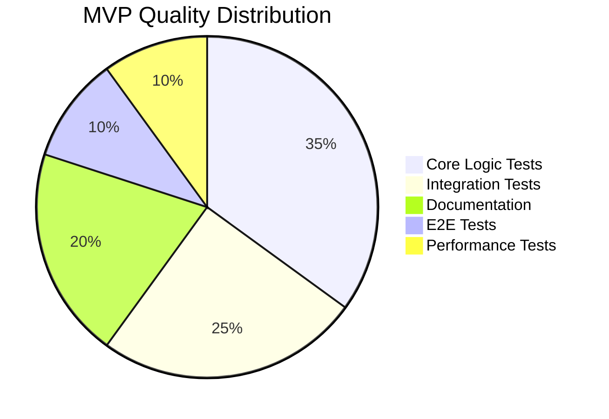
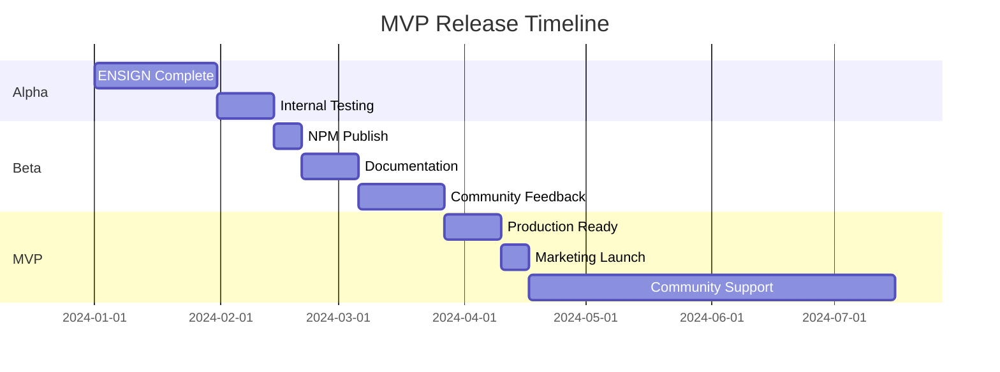

# ENSIGN - MVP Definition

This document defines the **Minimum Viable Product** scope for Wesley post-ENSIGN reorganization.

---

## MVP Mission

**"If you're building SaaS on Supabase, you use Wesley."**

The MVP focuses ruthlessly on ONE perfect use case: **multi-tenant SaaS applications on Supabase + Next.js**. Everything else is deferred to future releases.



---

## Core MVP Components

### **1. wesley-core (Pure Domain)**
**Scope:** GraphQL SDL → Wesley IR transformation
- ✅ Parse GraphQL schema with Wesley directives
- ✅ Convert to intermediate representation (IR)
- ✅ Support all multi-tenant directives: `@tenant`, `@rls`, `@owner`
- ✅ Validate directive usage and schema consistency
- ✅ Zero platform dependencies (pure functions only)

**Success Criteria:**
```javascript
const ir = wesley.buildIR(multiTenantSchema);
assert(ir.tables.length > 0);
assert(ir.tables.some(t => t.directives.tenant));
```

### **2. wesley-generator-supabase (SQL Generation)**
**Scope:** Wesley IR → Supabase-compatible artifacts
- ✅ Generate PostgreSQL DDL with proper constraints
- ✅ Generate Row Level Security (RLS) policies for multi-tenancy
- ✅ Generate zero-downtime migration SQL
- ✅ Generate pgTAP tests for schema validation
- ✅ Support complex multi-tenant patterns (org isolation, RBAC)

**Success Criteria:**
```sql
-- Generated DDL includes tenant isolation
CREATE POLICY "tenant_isolation" ON documents 
  FOR ALL TO authenticated 
  USING (org_id = auth.jwt() ->> 'org_id');
```

### **3. wesley-generator-js (TypeScript Generation)**
**Scope:** Wesley IR → TypeScript/JavaScript artifacts
- ✅ Generate TypeScript interfaces for all tables
- ✅ Generate Zod validation schemas
- ✅ Generate Next.js API route stubs
- ✅ Generate React hooks for data fetching (basic)
- ✅ Type safety for multi-tenant queries

**Success Criteria:**
```typescript
// Generated types support tenant-aware queries
const documents = await getDocuments({ orgId: user.orgId });
// TypeScript enforces tenant isolation at compile time
```

### **4. wesley-scaffold-multitenant (Reference Schema)**
**Scope:** Production-ready multi-tenant SaaS schema
- ✅ Complete multi-tenant SaaS foundation
- ✅ Organizations, users, memberships with RBAC
- ✅ Document management with permissions
- ✅ Audit logging and API key management
- ✅ User preferences and org settings
- ✅ Invitation and notification systems

**Success Criteria:**
- Schema compiles without errors
- Generates 15+ database tables
- RLS policies cover all tenant scenarios
- pgTAP tests validate all constraints

### **5. wesley-cli (Developer Interface)**
**Scope:** Command-line interface for Wesley operations
- ✅ `wesley generate` - Generate all artifacts from schema
- ✅ `wesley analyze` - Analyze schema for issues
- ✅ Error handling with helpful messages
- ✅ JSON output mode for tooling integration
- ✅ Progress feedback for long operations

**Success Criteria:**
```bash
wesley generate --scaffold=multitenant --stack=supabase-nextjs
# Generates: SQL DDL, RLS policies, TypeScript types, Zod schemas, API stubs
```

### **6. wesley-tasks + wesley-slaps (Orchestration)**
**Scope:** DAG planning and execution engine
- ✅ Build dependency graphs for generation tasks
- ✅ Execute tasks with proper ordering
- ✅ Journaling for idempotent re-runs
- ✅ Resource gating (prevent concurrent operations)
- ✅ Error recovery and retry logic

**Success Criteria:**
- Generate runs twice → identical output
- Second run skips completed steps
- Failed generation can be resumed

---

## MVP User Journey



### **Target User:** Full-stack developer building multi-tenant SaaS

### **Primary Flow:**
1. **Setup:** `npm install -g @wesley/host-node`
2. **Initialize:** `wesley generate --scaffold=multitenant --stack=supabase-nextjs`
3. **Customize:** Edit generated schema for specific business needs
4. **Deploy:** Apply generated SQL to Supabase project
5. **Develop:** Use generated TypeScript types in Next.js application
6. **Iterate:** Modify schema → re-generate → deploy changes

### **Key Value Props:**
- **Zero-config**: Multi-tenant SaaS setup in minutes, not weeks
- **Production-ready**: RLS policies, audit logs, proper constraints
- **Type-safe**: End-to-end TypeScript from database to frontend
- **Zero-downtime**: Schema changes without breaking production

---

## Feature Roadmap



## Out of Scope (MVP)

### **Deferred to v0.2+**
- ❌ Multiple stacks (postgres-django, planetscale-astro)
- ❌ Additional scaffolds (blog, ecommerce, marketplace)
- ❌ Migration execution (`wesley migrate up`)
- ❌ Watch mode (`wesley watch`)
- ❌ Browser/Deno host adapters
- ❌ GUI/web interface
- ❌ Advanced advisor features
- ❌ Signed package registry

### **Never In Scope**
- ❌ Generic ORM functionality
- ❌ Database connection management
- ❌ Authentication/authorization implementation
- ❌ Payment processing integration
- ❌ Alternative schema languages (YAML, JSON)
- ❌ Visual schema builders

---

## Quality Standards



### **Code Quality**
- **100%** test coverage for core domain logic
- **Zero** Node.js imports in wesley-core (CI enforced)
- **Zero** dependency-cruiser violations
- **<10** ESLint warnings across codebase
- **All** public APIs documented with JSDoc

### **Output Quality**
- **Generated SQL** follows PostgreSQL best practices
- **RLS policies** prevent tenant data leaks
- **TypeScript types** are accurate and complete
- **Zod schemas** validate all edge cases
- **pgTAP tests** achieve 100% schema coverage

### **Developer Experience**
- **<30 seconds** for complete multi-tenant SaaS generation
- **<5 commands** to go from zero to deployed schema
- **Zero configuration** required for basic usage
- **Clear error messages** with suggested fixes
- **Comprehensive documentation** with examples

---

## Success Metrics

### **Technical Metrics**
- ✅ Golden E2E test passes (generate twice → identical output)
- ✅ Full multi-tenant scaffold generates without errors
- ✅ Generated SQL deploys successfully to Supabase
- ✅ Generated TypeScript compiles without errors
- ✅ All generated pgTAP tests pass

### **Performance Metrics**
- **<10 seconds** to generate complete multi-tenant SaaS
- **<1 MB** total generated artifact size
- **<100 MB** memory usage during generation
- **<50** dependencies across all packages
- **100%** deterministic output (same input → same output)

### **User Experience Metrics**
- **<5 minutes** from install to working multi-tenant schema
- **<10 lines** of configuration for custom business logic
- **Zero** breaking changes between patch releases
- **24/7** CI/CD pipeline health
- **<1 day** response time for critical bug reports

---

## Definition of Done

### **For MVP Release**
- [ ] All core packages pass dependency-cruiser rules
- [ ] Golden E2E test runs in CI and passes consistently
- [ ] Multi-tenant scaffold generates complete SaaS foundation
- [ ] Generated artifacts deploy successfully to Supabase
- [ ] TypeScript integration works with Next.js 14+
- [ ] Comprehensive README with getting started guide
- [ ] Architecture documentation matches implementation
- [ ] At least one complete demo application

### **Demo Application Requirements**
- [ ] Next.js application using generated types
- [ ] Supabase integration with generated RLS policies
- [ ] Multi-tenant authentication and organization switching
- [ ] CRUD operations respecting tenant isolation
- [ ] Real-world business logic (document management)
- [ ] Deployed publicly with source code available

---

## Release Strategy



### **Alpha (Internal)**
- Complete ENSIGN reorganization
- All packages working locally
- Golden E2E test established
- Internal demo application

### **Beta (Limited)**
- Public npm packages published
- Documentation website live
- Community demo applications
- Feedback collection and iteration

### **MVP (Public v0.1)**
- Production-ready stability
- Comprehensive documentation
- Video tutorials and examples
- Community support channels
- Migration path to v0.2+

---

**Next:** See ENSIGN-Demo-App.md for the reference application specification.