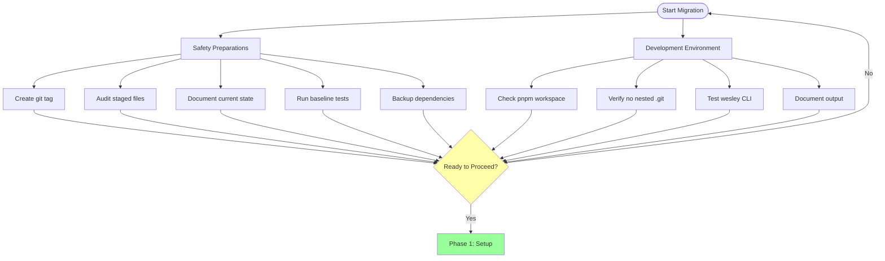
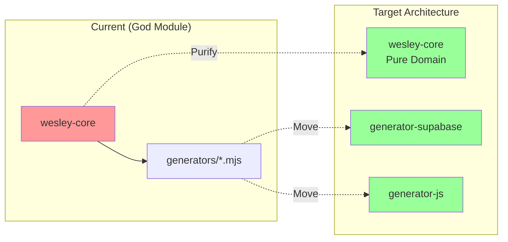
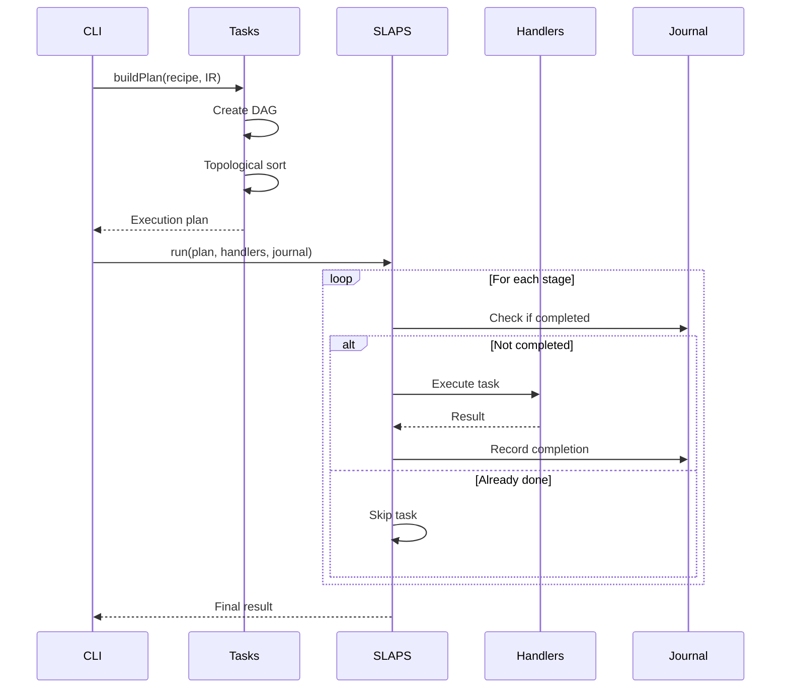
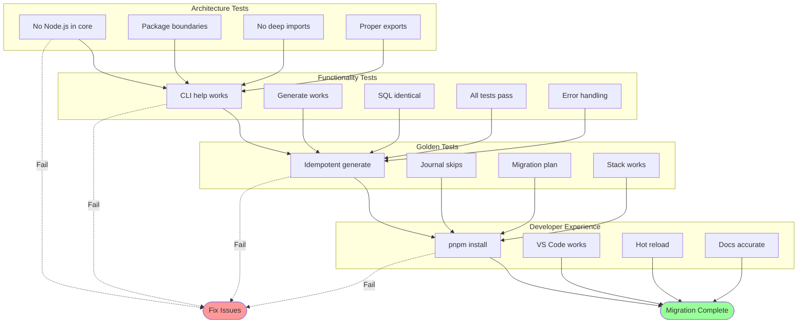
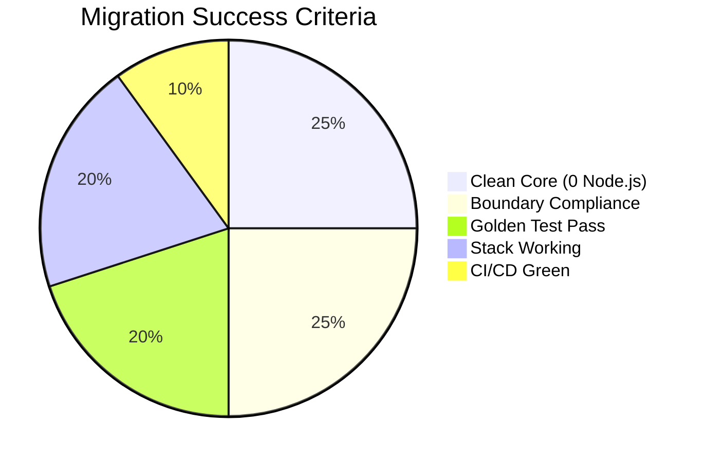
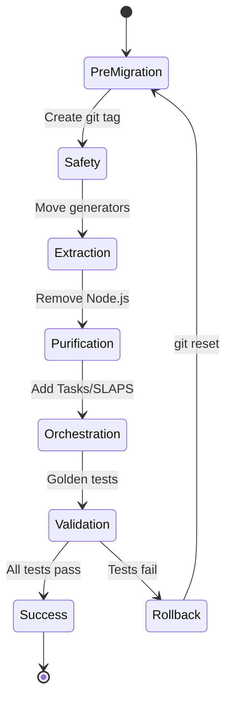

# ENSIGN - Migration Plan

This document provides the step-by-step execution roadmap for reorganizing Wesley's architecture.

---

## Pre-Migration Checklist



### **Safety Preparations**
- [ ] Create `pre-rewrite` git tag for rollback safety
- [ ] Audit all staged files from nested git cleanup
- [ ] Document current CLI commands that work
- [ ] Run existing tests to establish baseline
- [ ] Backup current package.json dependencies

### **Development Environment**
- [ ] Ensure pnpm workspace is healthy (`pnpm install`)
- [ ] Verify no nested .git directories remain
- [ ] Check that wesley CLI currently functions
- [ ] Document current generate command output for comparison

---

## Migration Phases Overview

```mermaid
gantt
    title ENSIGN Migration Execution
    dateFormat DD
    
    section Phase 1
    Setup & Safety       :done, p1, 01, 2d
    
    section Phase 2
    Extract Generators   :active, p2, 03, 3d
    
    section Phase 3
    Evict CLI & Node    :p3, 06, 4d
    
    section Phase 4
    Extract Scaffold    :p4, 10, 3d
    
    section Phase 5
    Add Orchestration   :p5, 13, 4d
    
    section Phase 6
    Enforce Boundaries  :p6, 17, 3d
    
    section Phase 7
    Testing & Validation :p7, 20, 3d
    
    section Phase 8
    Cleanup             :crit, p8, 23, 2d
```



## Phase 1: Setup & Safety (Days 1-2)

### **Step 1.1: Create Safety Net**
```bash
# Tag current state for rollback
git tag -a pre-rewrite -m "Before ENSIGN boundary rewrite"

# Verify tag creation
git tag -l pre-rewrite

# Document rollback procedure
echo "Rollback: git reset --hard pre-rewrite" > ROLLBACK.md
```

### **Step 1.2: Audit Staging Area**
```bash
# Check all staged files from nested git cleanup
git status --porcelain

# Verify no nested git directories
find . -type d -name ".git" ! -path "./.git" || echo "Clean"

# Document current dependencies
cp package.json package.json.pre-rewrite
```

### **Step 1.3: Create Target Package Directories**
```bash
# Create all target package directories
mkdir -p packages/wesley-tasks/src packages/wesley-tasks/test
mkdir -p packages/wesley-slaps/src packages/wesley-slaps/test  
mkdir -p packages/wesley-generator-supabase/src packages/wesley-generator-supabase/test
mkdir -p packages/wesley-generator-js/src packages/wesley-generator-js/test
mkdir -p packages/wesley-scaffold-multitenant/test
mkdir -p packages/wesley-stack-supabase-nextjs/examples

# Create package.json files for each
echo "Creating package.json stubs for all new packages..."
```

---

## Phase 2: Extract Generators (Days 3-5)



### **Step 2.1: Move Supabase Generator**
**Source:** `packages/wesley-core/src/domain/generators/`  
**Target:** `packages/wesley-generator-supabase/src/`

**Files to Move:**
- `PostgreSQLGenerator.mjs` → `src/emitters/ddl.mjs`
- `SupabaseGenerator.mjs` → `src/emitters/rls.mjs`
- `PgTAPTestGenerator.mjs` → `src/emitters/pgtap.mjs`
- `MigrationDiffEngine.mjs` → `src/emitters/migrations.mjs`

**Actions:**
```bash
# Move and restructure generator files
git mv packages/wesley-core/src/domain/generators/PostgreSQLGenerator.mjs \
       packages/wesley-generator-supabase/src/emitters/ddl.mjs

# Update imports in moved files
# Create consolidated index.mjs with clean exports
# Write package.json with proper exports
```

### **Step 2.2: Move JavaScript Generator**
**Files to Move:**
- `ModelGenerator.mjs` → `wesley-generator-js/src/models.mjs`
- `TypeScriptGenerator.mjs` → `wesley-generator-js/src/typescript.mjs`
- `ZodGenerator.mjs` → `wesley-generator-js/src/zod.mjs`

### **Step 2.3: Update All Imports**
**Search and replace throughout codebase:**
```bash
# Find all imports of moved generators
rg "from.*generators/" packages/

# Update imports to new package locations
# Example: '@wesley/core' → '@wesley/generator-supabase'
```

### **Step 2.4: Remove Non-MVP Generators**
**Move to /labs or delete:**
- `DocumentationGenerator.mjs`
- `TriggerGenerator.mjs`
- `RepairGenerator.mjs`
- `RollbackGenerator.mjs`
- Any Django/non-Supabase generators

---

## Phase 3: Evict CLI & Node from Core (Days 5-8)

### **Step 3.1: Move CLI Commands**
**Source:** `packages/wesley-core/src/cli/`  
**Target:** `packages/wesley-cli/src/commands/`

**Files to Move:**
- `WatchCommand.mjs` → `wesley-cli/src/commands/watch.mjs`
- `formatters/` → `wesley-cli/src/framework/formatters/`

### **Step 3.2: Move Node.js Platform Code**
**Source:** Various locations in wesley-core  
**Target:** `packages/wesley-host-node/src/adapters/`

**Files to Move:**
- Any filesystem operations → `adapters/fs.mjs`
- Process/environment code → `adapters/env.mjs`
- Stdin reading → `adapters/stdin.mjs`

### **Step 3.3: Create Pure CLI Main Function**
**Create:** `packages/wesley-cli/src/main.mjs`
```javascript
// Pure main function accepting injected adapters
export async function main(argv, adapters) {
  const { logger, fileSystem, process } = adapters;
  // Platform-agnostic CLI logic
}
```

### **Step 3.4: Update Host Binary**
**Update:** `packages/wesley-host-node/bin/wesley.mjs`
```javascript
#!/usr/bin/env node
import { main } from '@wesley/cli/main';
import { createAdapters } from '../src/adapters/index.mjs';

await main(process.argv, createAdapters());
```

### **Step 3.5: Purge Node.js from Core**
**Remove from wesley-core:**
- All `import fs from 'fs'` statements
- All `import path from 'path'` statements  
- All `process.` references
- All `#!/usr/bin/env node` shebangs
- `src/commands/scaffold.mjs` (move to CLI)

---

## Phase 4: Extract Scaffold & Stack (Days 8-10)

### **Step 4.1: Move Multi-Tenant Scaffold**
**Source:** `packages/wesley-core/src/scaffolds/multi-tenant.graphql`  
**Target:** `packages/wesley-scaffold-multitenant/schema.graphql`

**Actions:**
```bash
# Move scaffold file
git mv packages/wesley-core/src/scaffolds/multi-tenant.graphql \
       packages/wesley-scaffold-multitenant/schema.graphql

# Create package.json
# Write comprehensive README.md
# Add usage examples and customization guide
```

### **Step 4.2: Create Stack Recipe**
**Create:** `packages/wesley-stack-supabase-nextjs/recipe.json`
```json
{
  "name": "@wesley/stack-supabase-nextjs",
  "recipes": {
    "multitenant": [
      { 
        "use": "@wesley/generator-supabase", 
        "with": ["ddl", "rls", "migrations", "pgtap"] 
      },
      { 
        "use": "@wesley/generator-js", 
        "with": ["models", "zod", "next-api:/api/*"] 
      }
    ]
  }
}
```

### **Step 4.3: Remove Scaffold References from Core**
- Remove `src/scaffolds/` directory
- Update any scaffold loading logic to use external packages

---

## Phase 5: Add Orchestration (Days 10-13)



### **Step 5.1: Implement Tasks Package**
**Create:** `packages/wesley-tasks/`

**Key Files:**
- `src/index.mjs` - Public API exports
- `src/plan.mjs` - Plan types and builders
- `src/hash.mjs` - Stable node hashing with @noble/hashes
- `src/validate.mjs` - DAG validation logic
- `src/topo.mjs` - Topological sort + resource gates

**Dependencies:** `@noble/hashes` only

### **Step 5.2: Implement SLAPS Package**
**Create:** `packages/wesley-slaps/`

**Key Files:**
- `src/index.mjs` - `run(plan, handlers, journal)` API
- `src/run.mjs` - Main execution loop
- `src/stages.mjs` - Stage-by-stage execution
- `src/journal.mjs` - Journal interface documentation
- `src/policy.mjs` - Retry/backoff policies

**Dependencies:** None (pure)

### **Step 5.3: Convert Generate Command to DAG**
**Update:** `packages/wesley-cli/src/commands/generate.mjs`

**Before:**
```javascript
// Direct generator calls
const result = await compiler.compile(...)
```

**After:**
```javascript
// DAG execution
const plan = await tasks.buildPlan(stackRecipe, ir);
const result = await slaps.run(plan, handlers, journal);
```

---

## Phase 6: Enforce Boundaries (Days 13-15)

### **Step 6.1: Add Package Export Restrictions**
**Update all package.json files:**
```json
{
  "exports": {
    ".": "./src/index.mjs",
    "./types": "./src/types/index.mjs"
  }
}
```

**No `/src/*` imports allowed between packages.**

### **Step 6.2: Enable Dependency Guards**
**Create:** `.dependency-cruiser.js`
```javascript
module.exports = {
  forbidden: [
    {
      name: "no-node-in-core",
      from: { path: "^packages/wesley-core/src" },
      to: { path: "node_modules/(fs|path|url)|^node:" },
      severity: "error"
    },
    {
      name: "no-cli-in-core", 
      from: { path: "^packages/wesley-core" },
      to: { path: "^packages/wesley-(cli|host-node)" },
      severity: "error"
    },
    {
      name: "no-deep-imports",
      from: { path: "^packages/" },
      to: { path: "/src/" }, 
      severity: "error"
    }
  ]
};
```

### **Step 6.3: Add ESLint Restrictions**
**Update:** `.eslintrc.cjs`
```javascript
module.exports = {
  overrides: [
    {
      files: ["packages/wesley-core/src/**/*"],
      rules: {
        "no-restricted-imports": ["error", {
          patterns: [{
            group: ["node:*", "fs", "path", "url", "process"],
            message: "No Node.js APIs in core domain"
          }]
        }]
      }
    }
  ]
};
```

### **Step 6.4: Add CI Enforcement**
**Update:** `.github/workflows/` 
```yaml
- name: Check Dependencies
  run: npx dependency-cruiser packages/

- name: Lint Boundaries  
  run: npx eslint packages/wesley-core/src/
```

---

## Phase 7: Testing & Validation (Days 15-17)

### **Step 7.1: Establish Golden E2E Test**
**Create:** `test/golden-e2e.test.mjs`
```javascript
// Generate twice → identical output test
test('generate is idempotent', async () => {
  const result1 = await generate(scaffold, stack);
  const result2 = await generate(scaffold, stack);
  assert.deepEqual(result1, result2);
});
```

### **Step 7.2: Verify Journal Idempotency**
```javascript
// Second run should skip via journal
test('second generate skips completed steps', async () => {
  await generate(scaffold, stack);
  const journal = mockJournal();
  await generate(scaffold, stack, { journal });
  assert(journal.skippedCount > 0);
});
```

### **Step 7.3: Comprehensive Regression Testing**
- Run all existing tests
- Compare output with pre-rewrite baseline
- Test CLI commands manually
- Verify generate produces expected files
- Check that removed generators don't break anything

---

## Phase 8: Cleanup (Days 17-18)

### **Step 8.1: Remove Old Code**
```bash
# Remove old CLI code from wesley-core
rm -rf packages/wesley-core/src/cli/
rm -rf packages/wesley-core/src/commands/

# Remove moved generators
rm -rf packages/wesley-core/src/domain/generators/

# Remove old scaffold directory
rm -rf packages/wesley-core/src/scaffolds/
```

### **Step 8.2: Clean Duplicate Files**
```bash
# Find and remove any duplicate files from nested git
find . -name "*.mjs" -exec basename {} \; | sort | uniq -d

# Manually review and remove duplicates
```

### **Step 8.3: Update Documentation**
- Update README.md with new architecture
- Update CLAUDE.md with new package structure
- Draft minimal IR_SPEC.md v0.1
- Create CONTRIBUTING.md with boundaries

---

## Validation Checklist



### **Architecture Compliance**
- [ ] Zero Node.js imports in wesley-core (CI enforced)
- [ ] All package boundaries respected (dependency-cruiser passes)
- [ ] No deep `/src/*` imports between packages
- [ ] All packages have proper exports defined

### **Functionality Preserved**
- [ ] `wesley --help` shows all commands
- [ ] `wesley generate` produces expected output
- [ ] Generated SQL is identical to pre-rewrite
- [ ] All tests pass
- [ ] CLI error handling works

### **Golden E2E Tests**
- [ ] Generate runs twice with identical output
- [ ] Second run skips completed steps (journal working)
- [ ] Migration plan builds successfully (if implemented)
- [ ] Scaffold + stack combination works end-to-end

### **Developer Experience**
- [ ] `pnpm install` works without errors
- [ ] VS Code intellisense works with new imports
- [ ] Hot reload works in development
- [ ] Documentation is accurate and up-to-date

---

## Rollback Procedures

### **If Major Issues Discovered**
```bash
# Return to pre-rewrite state
git reset --hard pre-rewrite

# Clean workspace
git clean -fd

# Restore dependencies
pnpm install
```

### **If Partial Rollback Needed**
```bash
# Reset specific packages
git checkout pre-rewrite -- packages/wesley-core/

# Selective restore
git cherry-pick <good-commits>
```

---

## Success Metrics



- **0** Node.js imports in wesley-core
- **100%** dependency-cruiser compliance
- **<10** total packages (focused architecture)
- **1** working reference stack (supabase-nextjs)
- **2x** identical output from generate command



---

**Next:** See ENSIGN-MVP-Definition.md for post-reorganization development priorities.