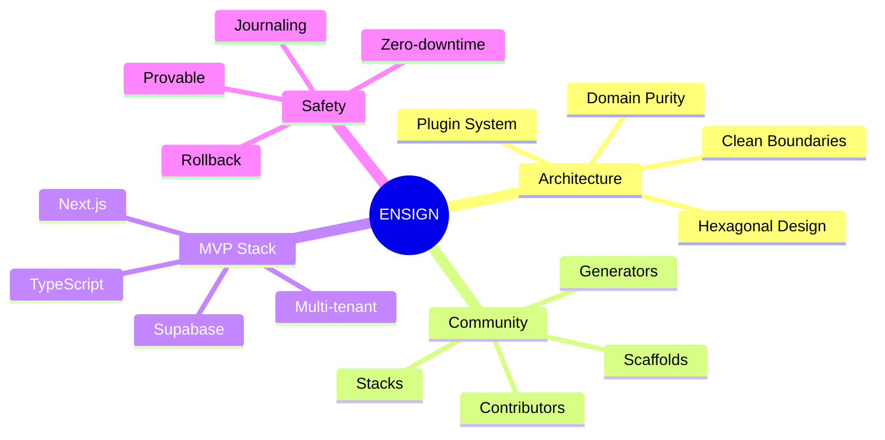
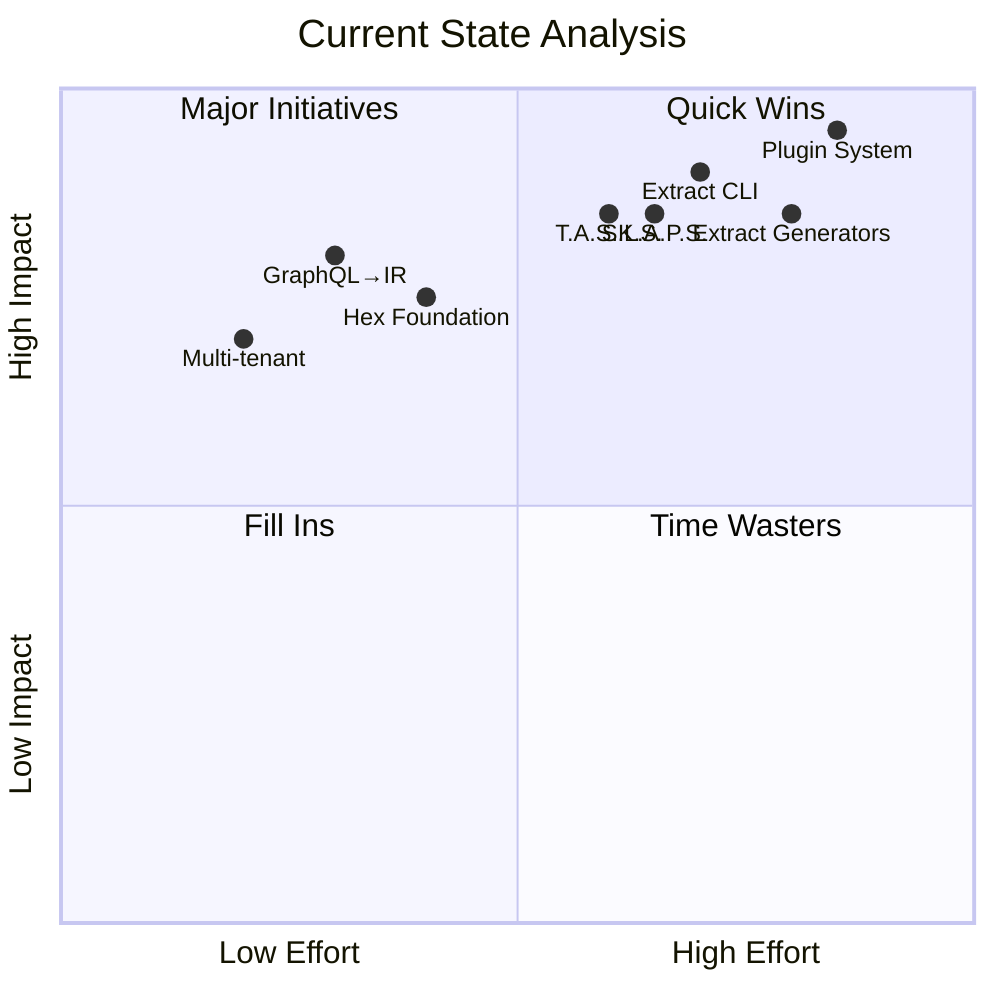
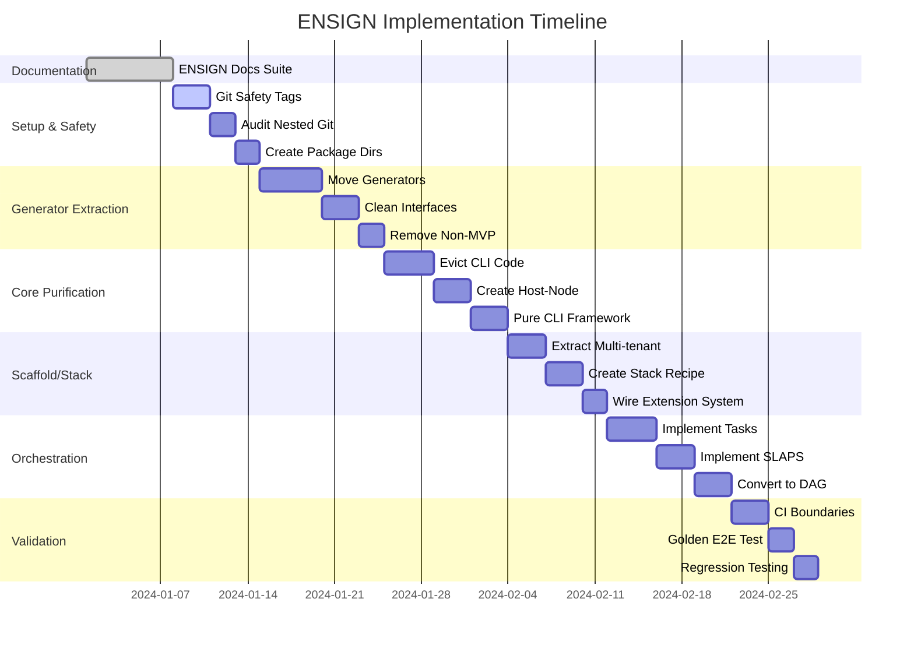
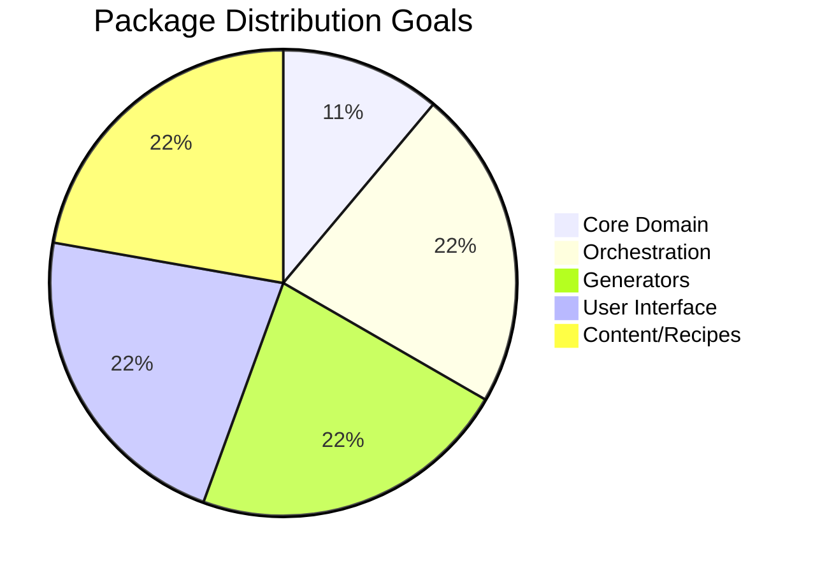
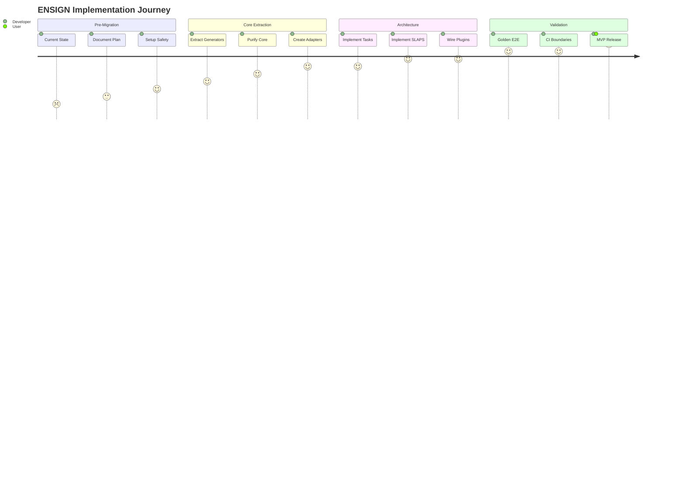

# ENSIGN - Wesley Repository Reorganization Milestone

**Status:** In Progress  
**Target Completion:** Q4 2025  
**Primary Objective:** Transform Wesley from a "god module" architecture into a clean, extensible hexagonal system ready for MVP and community contributions

---

## Mission Statement

ENSIGN (Enterprise Software Infrastructure Grid & Node) represents Wesley's transition from prototype to production-ready platform. We will ruthlessly reorganize the codebase to achieve:

1. **Architectural Clarity**: Clean separation of concerns with hexagonal architecture
2. **Community Readiness**: Extensible plugin system for scaffolds, stacks, and generators  
3. **MVP Focus**: Single reference stack (Supabase + Next.js) perfected for multi-tenant SaaS
4. **Production Safety**: Zero-downtime migrations with provable guarantees



## Current State Assessment

```mermaid
sankey-beta

"God Module (wesley-core)" as Core

Core,33.3,"CLI Commands"
Core,16.7,"Generators"
Core,16.7,"Scaffolds"
Core,16.7,"Platform Code"
Core,16.7,"Domain Logic"

"CLI Commands",33.3,"Needs Extraction"
"Generators",16.7,"Needs Extraction"
"Scaffolds",16.7,"Needs Extraction"
"Platform Code",16.7,"Needs Extraction"
"Domain Logic",16.7,"Keep in Core"
```

### **Problems We're Solving**
- ❌ **wesley-core has become a "god module"** with CLI, generators, scaffolds, and domain logic mixed together
- ❌ **Platform dependencies leaked into core** (Node.js imports, file system calls)
- ❌ **Nested git repository confusion** created duplicate/conflicting implementations
- ❌ **No clear extension points** for community contributions
- ❌ **Architectural violations** throughout the codebase

### **What's Working Well**
- ✅ **Core GraphQL → IR transformation** is solid
- ✅ **Multi-tenant scaffold** demonstrates full vision potential
- ✅ **Hexagonal architecture foundation** exists but needs extraction
- ✅ **Production safety concepts** (T.A.S.K.S., S.L.A.P.S.) are designed
- ✅ **Zero-downtime migration patterns** are conceptually proven



## Success Criteria

### **Technical Outcomes**
1. **Pure Domain Core**: wesley-core contains only GraphQL parsing and IR generation (zero platform dependencies)
2. **Clean Package Boundaries**: Each package has ONE responsibility with strict dependency rules enforced by CI
3. **Extensible Architecture**: Plugin system allows community to add scaffolds, stacks, and generators
4. **Golden E2E Test**: `wesley generate` runs twice with identical output (idempotency proof)
5. **Production Stack**: Supabase + Next.js + Multi-tenant scaffold works end-to-end

### **Strategic Outcomes**
1. **Developer Experience**: "If you're building SaaS on Supabase, you use Wesley"
2. **Community Growth**: Clear contribution paths for scaffolds and generators
3. **Architectural Confidence**: No more confusion about "where does this code belong?"
4. **MVP Readiness**: Foundation solid enough to build demo applications

## Scope Boundaries

### **In Scope (ENSIGN)**
- Complete package reorganization following Vision.md blueprint
- Single reference stack: wesley-supabase-nextjs with multi-tenant scaffold
- Core orchestration: tasks (DAG planning) + slaps (execution with journaling)
- Architectural enforcement: dependency-cruiser rules, ESLint boundaries
- MVP demo application specification

### **Out of Scope (Future)**
- Multiple stacks (postgres-django, planetscale-astro, etc.)
- Advanced advisor/registry features
- Browser/Deno host adapters
- Complex migration rollback scenarios
- Auto-generated documentation

## Risk Assessment

### **High-Risk Areas**
1. **Generator Extraction**: Moving generators from core may break existing integrations
2. **CLI Refactoring**: Converting from direct calls to DAG execution changes behavior
3. **Import Dependencies**: Complex web of imports may create circular dependencies during transition

### **Mitigation Strategies**
1. **Git Tag Safety Net**: `pre-rewrite` tag allows complete rollback
2. **Incremental Validation**: Test at each phase to catch regressions early  
3. **Golden E2E**: Establish idempotency test BEFORE major changes
4. **Clean Slate Approach**: New packages avoid carrying forward architectural debt

## Timeline & Phases



### **Phase 1: Documentation (Week 1)**
Complete ENSIGN documentation suite in docs/ENSIGN/

### **Phase 2: Setup & Safety (Week 1-2)**
- Create git safety tags
- Audit nested git artifacts  
- Create target package directories

### **Phase 3: Generator Extraction (Week 2-3)**
- Move generators from core to dedicated packages
- Establish clean generator interfaces
- Remove non-MVP generators

### **Phase 4: Core Purification (Week 3-4)**  
- Evict all CLI and Node.js code from wesley-core
- Create host-node with platform adapters
- Establish pure CLI framework

### **Phase 5: Scaffold/Stack System (Week 4-5)**
- Extract multi-tenant scaffold to dedicated package
- Create supabase-nextjs stack recipe
- Wire extensible scaffold system

### **Phase 6: Orchestration (Week 5-6)**
- Implement tasks (DAG planning)
- Implement slaps (execution engine)
- Convert generate command to orchestrated pipeline

### **Phase 7: Boundaries & Validation (Week 6-7)**
- Enforce package boundaries with CI rules
- Establish Golden E2E test
- Comprehensive regression testing

## Success Metrics



- **0** Node.js imports in wesley-core (enforced by CI)
- **100%** package boundary compliance (dependency-cruiser)
- **<10** total packages (focused, not fragmented)
- **1** reference stack working end-to-end
- **2x** identical output from repeated generate commands (idempotency)



---

**Next Steps**: See ENSIGN-Architecture.md for detailed package structure and ENSIGN-Migration-Plan.md for execution roadmap.