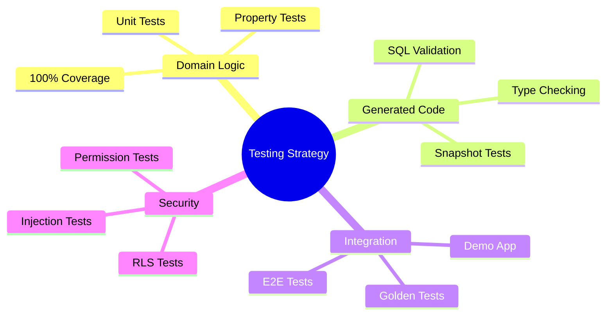
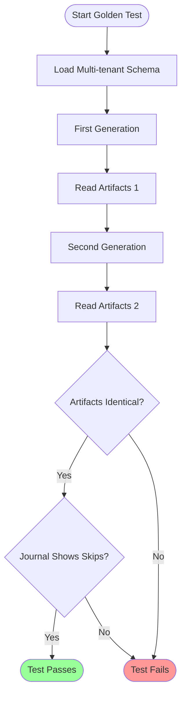
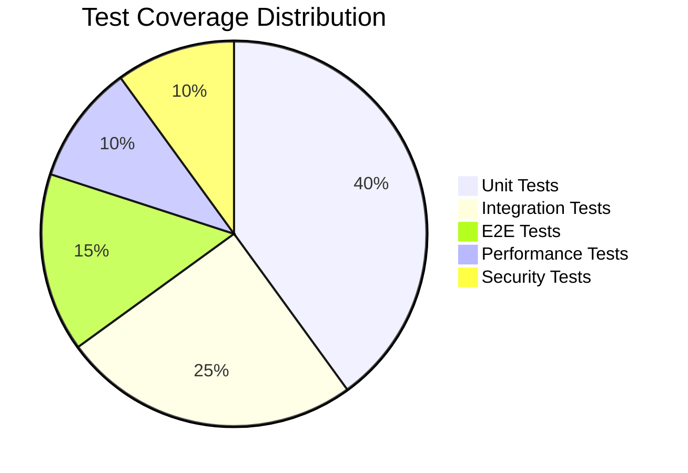
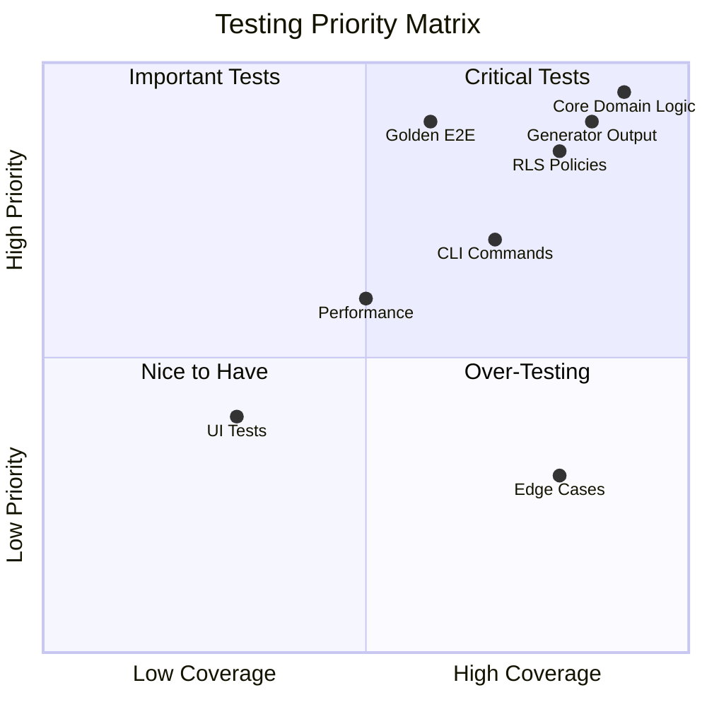

	# ENSIGN - Testing Strategy

This document outlines the comprehensive testing approach for Wesley's reorganized architecture.

---

## Testing Philosophy

**"Generated code must be provably correct. Manual code must be thoroughly tested."**

Wesley's testing strategy focuses on three critical areas:
1. **Domain Logic:** Core GraphQL → IR transformation must be bulletproof
2. **Generated Artifacts:** SQL, TypeScript, Zod schemas must be correct by construction  
3. **Integration:** Full pipeline from schema → deployed application must work reliably



---

## Testing Pyramid

```
                    ┌─────────────────────────┐
                    │     E2E Tests           │
                    │  - Golden Pipeline      │ ← Few, high-confidence
                    │  - Demo App             │
                    └─────────────────────────┘
                ┌───────────────────────────────────┐
                │        Integration Tests          │
                │  - Generator Output Validation    │ ← Some, focused
                │  - CLI Command Integration        │
                │  - Stack Recipe Execution         │
                └───────────────────────────────────┘
        ┌───────────────────────────────────────────────────┐
        │                Unit Tests                         │
        │  - Core Domain Models                             │ ← Many, fast
        │  - Parser Logic                                   │
        │  - Generator Functions                            │
        │  - CLI Command Logic                             │
        └───────────────────────────────────────────────────┘
```

---

## Package-Specific Testing

### **wesley-core (Domain Logic)**

#### **Unit Tests**
**Location:** `packages/wesley-core/test/unit/`

**Coverage Requirements:** 100% for all public APIs

```javascript
// Schema parsing tests
test('parseSchema handles all Wesley directives', () => {
  const schema = `
    type User @table {
      id: ID! @primaryKey
      org_id: ID! @tenant
      name: String!
    }
  `;
  const ir = parseSchema(schema);
  assert(ir.tables.User.directives.tenant);
});

// IR generation tests  
test('buildIR creates correct relationships', () => {
  const ir = buildIR(complexSchema);
  assert(ir.tables.Document.foreignKeys.org_id);
  assert(ir.tables.Document.tenant.column === 'org_id');
});

// Directive validation tests
test('tenant directive requires foreign key', () => {
  const invalidSchema = `
    type Document @table {
      id: ID! @primaryKey  
      title: String! @tenant(by: "nonexistent")
    }
  `;
  assert.throws(() => parseSchema(invalidSchema), /nonexistent/);
});
```

#### **Property-Based Tests**
**Location:** `packages/wesley-core/test/property/`

```javascript
// Test with randomly generated schemas
import fc from 'fast-check';

test('schema parsing is deterministic', () => {
  fc.assert(fc.property(
    validSchemaGenerator(),
    (schema) => {
      const ir1 = parseSchema(schema);
      const ir2 = parseSchema(schema);
      assert.deepEqual(ir1, ir2);
    }
  ));
});
```

### **wesley-generator-supabase (SQL Generation)**

#### **Snapshot Tests**
**Location:** `packages/wesley-generator-supabase/test/snapshots/`

```javascript
// DDL generation snapshots
test('generates correct DDL for multi-tenant schema', () => {
  const ir = buildIR(multiTenantSchema);
  const ddl = generateDDL(ir);
  expect(ddl).toMatchSnapshot('multi-tenant-ddl.sql');
});

// RLS policy snapshots
test('generates secure RLS policies', () => {
  const ir = buildIR(multiTenantSchema);  
  const policies = generateRLS(ir);
  expect(policies).toMatchSnapshot('multi-tenant-rls.sql');
});
```

#### **SQL Validation Tests**
```javascript
// Validate generated SQL syntax
test('generated DDL is valid PostgreSQL', async () => {
  const ddl = generateDDL(testIR);
  await testDb.query('BEGIN');
  await testDb.query(ddl); // Should not throw
  await testDb.query('ROLLBACK');
});

// Validate RLS policies work
test('RLS policies prevent cross-tenant access', async () => {
  await setupTestData();
  await testDb.setAuth({ org_id: 'org1' });
  
  const results = await testDb.query('SELECT * FROM documents');
  assert(results.every(doc => doc.org_id === 'org1'));
});
```

### **wesley-generator-js (TypeScript Generation)**

#### **Type Validation Tests**
```javascript
// Generated TypeScript compiles without errors
test('generated types compile cleanly', () => {
  const types = generateTypeScript(testIR);
  const result = ts.transpileModule(types, compilerOptions);
  assert(result.diagnostics.length === 0);
});

// Zod schemas validate correctly
test('generated Zod schemas match database constraints', () => {
  const schemas = generateZodSchemas(testIR);
  const UserInsert = eval(schemas).UserInsert;
  
  // Valid data passes
  assert.doesNotThrow(() => UserInsert.parse({
    name: 'John Doe',
    email: 'john@example.com'
  }));
  
  // Invalid data fails
  assert.throws(() => UserInsert.parse({
    name: '', // Required field
    email: 'invalid-email'
  }));
});
```

### **wesley-tasks (DAG Planning)**

#### **Graph Algorithm Tests**
```javascript
// Topological sort handles cycles
test('detects circular dependencies', () => {
  const cyclicPlan = {
    nodes: [
      { id: 'a', depends: ['b'] },
      { id: 'b', depends: ['a'] }
    ]
  };
  assert.throws(() => topologicalSort(cyclicPlan), /circular/i);
});

// Resource gating works correctly
test('serializes conflicting resources', () => {
  const plan = buildPlan([
    { id: 'create-table', resources: ['db:write'] },
    { id: 'create-index', resources: ['db:write'] }
  ]);
  const stages = planToStages(plan);
  
  // Should be in separate stages due to resource conflict
  assert(stages[0].includes('create-table') && stages[1].includes('create-index'));
});
```

### **wesley-slaps (Execution Engine)**

#### **Execution Tests**
```javascript
// Journaling prevents duplicate execution
test('journal skips completed steps', async () => {
  const journal = new MemoryJournal();
  await journal.write('step-1', { status: 'completed' });
  
  const plan = { nodes: [{ id: 'step-1' }, { id: 'step-2' }] };
  const executed = [];
  const handlers = {
    'step-1': () => executed.push('step-1'),
    'step-2': () => executed.push('step-2')
  };
  
  await run(plan, handlers, journal);
  assert.deepEqual(executed, ['step-2']); // step-1 skipped
});

// Retries work with exponential backoff
test('retries failed steps with backoff', async () => {
  let attempts = 0;
  const handlers = {
    'flaky-step': () => {
      attempts++;
      if (attempts < 3) throw new Error('Temporary failure');
      return { success: true };
    }
  };
  
  const result = await run({ nodes: [{ id: 'flaky-step' }] }, handlers);
  assert(result.success);
  assert(attempts === 3);
});
```

---

## Integration Testing

### **Generator Pipeline Tests**
**Location:** `test/integration/generators/`

```javascript
// Full schema → artifact pipeline
test('multi-tenant scaffold generates complete stack', async () => {
  const scaffoldSchema = await loadSchema('multitenant');
  const stackRecipe = await loadRecipe('supabase-nextjs');
  
  const plan = await buildPlan(scaffoldSchema, stackRecipe);
  const artifacts = await executePlan(plan);
  
  // Verify all expected artifacts generated
  assert(artifacts.sql.ddl.includes('CREATE TABLE organization'));
  assert(artifacts.sql.rls.includes('tenant_isolation'));
  assert(artifacts.typescript.includes('interface User'));
  assert(artifacts.zod.includes('UserInsert'));
});

// Cross-generator consistency
test('TypeScript types match SQL schema', async () => {
  const ir = buildIR(testSchema);
  const sql = generateDDL(ir);
  const types = generateTypeScript(ir);
  
  // Extract table/column info from both
  const sqlTables = parseSQLSchema(sql);
  const tsTables = parseTypeScript(types);
  
  // Verify consistency
  for (const tableName of Object.keys(sqlTables)) {
    const sqlTable = sqlTables[tableName];
    const tsTable = tsTables[tableName];
    
    assert.deepEqual(sqlTable.columns, tsTable.properties);
  }
});
```

### **CLI Integration Tests**
**Location:** `test/integration/cli/`

```javascript
// CLI commands work end-to-end
test('generate command produces expected output', async () => {
  const tempDir = await createTempDir();
  process.chdir(tempDir);
  
  await fs.writeFile('schema.graphql', testSchema);
  
  const result = await runCLI(['generate', '--schema', 'schema.graphql']);
  
  assert(result.exitCode === 0);
  assert(await fs.exists('generated/sql/schema.sql'));
  assert(await fs.exists('generated/types/database.ts'));
});

// Error handling works correctly
test('CLI shows helpful error for invalid schema', async () => {
  const invalidSchema = 'type User { invalid syntax }';
  await fs.writeFile('invalid.graphql', invalidSchema);
  
  const result = await runCLI(['generate', '--schema', 'invalid.graphql']);
  
  assert(result.exitCode > 0);
  assert(result.stderr.includes('GraphQL syntax error'));
  assert(result.stderr.includes('line 1')); // Specific error location
});
```

---

## End-to-End Testing (Golden Tests)



### **Golden Pipeline Test**
**The most critical test:** Ensures complete pipeline reliability

```javascript
// The Golden Test - run twice, get identical output
test('generate command is completely idempotent', async () => {
  const schema = await loadSchema('multitenant');
  
  // First generation
  const result1 = await runGenerate(schema);
  const artifacts1 = await readArtifacts();
  
  // Second generation (should be identical)
  const result2 = await runGenerate(schema);  
  const artifacts2 = await readArtifacts();
  
  // Files should be byte-identical
  assert.deepEqual(artifacts1, artifacts2);
  
  // Journal should show skips on second run
  const journal = await readJournal();
  assert(journal.entries.some(e => e.status === 'skipped'));
});
```

### **Demo Application E2E**
**Location:** `test/e2e/demo-app/`

```javascript
// Full demo application workflow
test('TaskCorp demo works end-to-end', async () => {
  // Deploy generated schema to test database
  await deploySchema(generatedSQL);
  
  // Run application tests
  const browser = await playwright.chromium.launch();
  const page = await browser.newPage();
  
  // Test multi-tenant isolation
  await page.goto('/login');
  await loginAs('user@org1.com');
  
  await page.goto('/dashboard');
  const tasks = await page.$$('[data-testid="task"]');
  
  // Switch to different org
  await page.click('[data-testid="org-switcher"]');
  await page.click('[data-testid="org-2"]');
  
  // Should see different tasks (tenant isolation)
  const org2Tasks = await page.$$('[data-testid="task"]');
  assert.notDeepEqual(tasks, org2Tasks);
});
```

---

## Performance Testing

### **Generation Performance**
```javascript
// Generation time benchmarks
test('multi-tenant scaffold generates in <10 seconds', async () => {
  const start = Date.now();
  await runGenerate(multiTenantSchema);
  const duration = Date.now() - start;
  
  assert(duration < 10000, `Generation took ${duration}ms, expected <10s`);
});

// Memory usage benchmarks
test('generation uses <100MB memory', async () => {
  const beforeMemory = process.memoryUsage().heapUsed;
  await runGenerate(largeSchema);
  const afterMemory = process.memoryUsage().heapUsed;
  const memoryUsed = afterMemory - beforeMemory;
  
  assert(memoryUsed < 100 * 1024 * 1024, `Used ${memoryUsed} bytes`);
});
```

### **Database Performance**
```javascript
// RLS policy performance
test('RLS policies do not significantly impact query performance', async () => {
  await setupLargeDataset(); // 10k+ records per tenant
  
  // Query without RLS (baseline)
  const baselineStart = Date.now();
  await testDb.query('SELECT * FROM documents WHERE org_id = $1', ['org1']);
  const baselineTime = Date.now() - baselineStart;
  
  // Enable RLS and query again
  await testDb.query('ALTER TABLE documents ENABLE ROW LEVEL SECURITY');
  const rlsStart = Date.now();
  await testDb.query('SELECT * FROM documents', [], { userId: 'user1', orgId: 'org1' });
  const rlsTime = Date.now() - rlsStart;
  
  // RLS should add <50% overhead
  assert(rlsTime < baselineTime * 1.5, `RLS too slow: ${rlsTime}ms vs ${baselineTime}ms`);
});
```

---

## Security Testing

### **RLS Policy Tests**
```javascript
// Tenant isolation tests
test('RLS prevents cross-tenant data access', async () => {
  await setupMultiTenantData();
  
  // Try to access org2 data as org1 user
  await testDb.setAuth({ userId: 'user1', orgId: 'org1' });
  
  const results = await testDb.query(`
    SELECT * FROM documents WHERE org_id = 'org2'
  `);
  
  assert(results.length === 0, 'Cross-tenant access should be blocked');
});

// Permission escalation tests
test('RLS prevents privilege escalation', async () => {
  await testDb.setAuth({ userId: 'viewer1', orgId: 'org1', role: 'viewer' });
  
  // Viewer should not be able to delete documents
  await assert.rejects(
    testDb.query('DELETE FROM documents WHERE id = $1', ['doc1']),
    /permission denied|policy violation/
  );
});
```

### **Input Validation Tests**
```javascript
// Zod schema security
test('Zod schemas prevent injection attacks', () => {
  const DocumentInsert = generatedSchemas.DocumentInsert;
  
  // SQL injection attempt should fail validation
  assert.throws(() => DocumentInsert.parse({
    title: "'; DROP TABLE documents; --",
    content: 'Malicious content'
  }), /validation/);
  
  // XSS attempt should be sanitized
  const result = DocumentInsert.parse({
    title: '<script>alert("xss")</script>',
    content: 'Content'
  });
  assert(!result.title.includes('<script>'));
});
```

---

## Testing Infrastructure

### **Test Database Management**
```javascript
// Isolated test databases
export class TestDatabase {
  static async create() {
    const dbName = `test_wesley_${Date.now()}`;
    await createDatabase(dbName);
    return new TestDatabase(dbName);
  }
  
  async cleanup() {
    await dropDatabase(this.dbName);
  }
  
  async reset() {
    await this.query('TRUNCATE TABLE audit_log, documents, projects, users CASCADE');
  }
}

// Test fixtures
export const testFixtures = {
  multiTenantSchema: readFileSync('test/fixtures/multi-tenant.graphql', 'utf8'),
  sampleUser: { name: 'Test User', email: 'test@example.com' },
  sampleOrg: { name: 'Test Org', slug: 'test-org' }
};
```

### **Continuous Integration**
```yaml
# .github/workflows/test.yml
name: Wesley Test Suite

on: [push, pull_request]

jobs:
  unit-tests:
    runs-on: ubuntu-latest
    steps:
      - uses: actions/checkout@v4
      - uses: actions/setup-node@v4
      - run: pnpm test:unit --coverage
      
  integration-tests:
    runs-on: ubuntu-latest
    services:
      postgres:
        image: postgres:15
        env:
          POSTGRES_PASSWORD: postgres
    steps:
      - run: pnpm test:integration
      
  e2e-tests:
    runs-on: ubuntu-latest
    steps:
      - run: pnpm test:e2e
      - uses: actions/upload-artifact@v4
        if: failure()
        with:
          name: playwright-screenshots
          path: test-results/
          
  performance-tests:
    runs-on: ubuntu-latest
    steps:
      - run: pnpm test:performance
      - name: Check performance regression
        run: node scripts/check-performance.js
```

---

## Testing Coverage Goals

```mermaid
gantt
    title Testing Timeline
    dateFormat HH:mm
    axisFormat %H:%M
    section Pre-commit
    Unit Tests          :done, unit, 00:00, 1m
    Linting            :done, lint, after unit, 30s
    Type Check         :done, type, after lint, 30s
    
    section CI Pipeline
    Integration Tests   :active, int, 00:02, 3m
    E2E Tests          :e2e, after int, 5m
    Performance Tests   :perf, after e2e, 2m
    
    section Release
    Security Audit      :sec, 00:12, 3m
    Golden Tests       :golden, after sec, 2m
    Demo Deploy        :deploy, after golden, 5m
```





## Quality Gates

### **Pre-Commit Checks**
- All unit tests pass
- Code coverage >95% for core packages
- No linting errors
- No type errors
- Dependency-cruiser rules pass

### **Pull Request Requirements**  
- All CI tests pass
- Integration tests cover new functionality
- Performance benchmarks within acceptable ranges
- Security review for any RLS/auth changes

### **Release Criteria**
- Golden pipeline test passes
- Demo application deploys successfully  
- All documentation up to date
- Performance regression tests pass
- Security audit complete

---

## Test Strategy Matrix



## Monitoring & Alerting

### **Production Monitoring**
```javascript
// Monitor generation performance in production
export function trackGenerationMetrics(schema, artifacts, duration) {
  metrics.histogram('wesley.generation.duration', duration, {
    schema_size: schema.length,
    artifact_count: Object.keys(artifacts).length
  });
  
  metrics.counter('wesley.generation.success', 1);
}
```

### **Error Tracking**
```javascript
// Comprehensive error reporting
export function reportGenerationError(error, context) {
  errorTracker.captureException(error, {
    tags: {
      phase: context.phase,
      generator: context.generator,
      schema_hash: context.schemaHash
    },
    extra: {
      schema: context.schema,
      ir: context.ir
    }
  });
}
```

---

**Next:** See ENSIGN-Community-Readiness.md for extensibility and contribution guidelines.