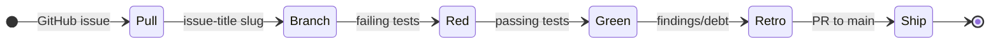

# METHOD

The Wesley work doctrine: GitHub Issues, a loop, and honest bookkeeping.

## Principles

- **The agent and the human sit at the same table.** Both matter. Both are named in every design.
- **The schema is the source of truth.** We never reconcile; we regenerate.
- **GitHub Issues are the live tracker.** Labels are lanes, legends, status, and work type. Repository files are durable evidence.
- **The repository is the evidence ledger.** Design docs, tests, playback witnesses, retros, release notes, and migration records stay in git because they are inspectable proof.
- **Tests are the executable spec.** Design names the hill and the playback questions. Tests prove the answers.
- **Reproducibility is the definition of done.** Results must be re-runnable proof, not static artifacts.

## Structure

| Signpost                   | Role                                              |
| :------------------------- | :------------------------------------------------ |
| **`README.md`**            | Public front door and project identity.           |
| **`docs/GUIDE.md`**        | Orientation and productive-fast path.             |
| **`BEARING.md`**           | Current direction and active tensions.            |
| **`VISION.md`**            | Core tenets and the "Trustworthy Change" mission. |
| **`docs/ARCHITECTURE.md`** | Authoritative system map and pipeline.            |
| **`docs/design/`**         | Active design packets and cycle-bound doctrine.   |
| **GitHub Issues**          | Live work tracker using Method labels.            |
| **`AGENTS.md`**            | Context recovery protocol for AI and humans.      |
| **`docs/METHOD.md`**       | Repo work doctrine (this document).               |
| **`docs/method/graveyard/github-issue-migration/`** | Historical migration evidence for retired filesystem backlog cards. |

## GitHub Issue Lanes

| Label               | Purpose                                  |
| :------------------ | :--------------------------------------- |
| **`lane:asap`**     | Imminent work; pull into the next cycle. |
| **`lane:bad-code`** | Technical debt that must be addressed.   |
| **`lane:cool-ideas`** | Uncommitted experiments.               |
| **`lane:inbox`**    | Raw ideas before triage.                 |
| **`lane:release`**  | Release-scoped work, usually with a milestone. |

The former filesystem lane `up-next/` was migrated into `lane:asap`.
The directory `docs/method/backlog/` is now a compatibility signpost only, not
the active queue.

Legend labels preserve Wesley's work taxonomy: `legend:SOURCE`,
`legend:TRANSMUTE`, `legend:RUNTIME`, `legend:EVIDENCE`, `legend:SPEC`,
`legend:BLADE`, `legend:DX`, `legend:DOCS`, `legend:PLATFORM`, and
`legend:PROCESS`.

Active work should carry `work-in-progress`. Follow-up work belongs in GitHub
Issues, not in chat or local-only backlog files.

## The Cycle Loop

1. **Pull**: Select a GitHub Issue, add `work-in-progress`, and link it from
   any design doc frontmatter or body.
2. **Branch**: Create a branch from the issue title slug.
3. **Red**: Write failing tests based on the design's playback questions.
4. **Green**: Implement the solution until tests pass.
5. **Retro**: Document findings, witness evidence, and follow-on issues in the
   cycle doc or PR closeout.
6. **Ship**: Open a PR to `main`. After merge, update `BEARING.md` and
   `CHANGELOG.md` on `main` when the shipped behavior changes those surfaces.

## Naming Convention

Design and retro files should keep the legend visible when it helps:
`<LEGEND>_<slug>.md`. Example:
`SPEC_fixture-extension-module-capability-matrix.md`.

GitHub Issue titles are workflow identity. Keep titles short, branch-safe, and
readable before starting work.
