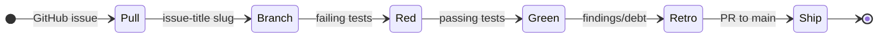

# METHOD

<!-- docs-truth: status=current owner=@flyingrobots -->

The Wesley work doctrine: GitHub Issues, a loop, and honest bookkeeping.

## Principles

- **The agent and the human sit at the same table.** Both matter. Both are named in every design.
- **The schema is the source of truth.** We never reconcile; we regenerate.
- **GitHub owns live work state.** Issues, Milestones, Projects, and labels are
  the live tracker. Repository files are durable evidence.
- **The repository is the evidence ledger.** Design docs, tests, playback witnesses, retros, release notes, and migration records stay in git because they are inspectable proof.
- **Markdown is not a backlog.** Repo docs may explain direction and preserve
  evidence, but they must not mirror live queues, progress counters, or release
  gates.
- **Tests are the executable spec.** Design names the hill and the playback questions. Tests prove the answers.
- **Reproducibility is the definition of done.** Results must be re-runnable proof, not static artifacts.

## Structure

| Signpost                   | Role                                                               |
| :------------------------- | :----------------------------------------------------------------- |
| **`README.md`**            | Public front door and project identity.                            |
| **`docs/GUIDE.md`**        | Orientation and productive-fast path.                              |
| **`docs/topics/`**         | Task-oriented routes across references, workflows, and boundaries. |
| **`BEARING.md`**           | Current direction and active tensions.                             |
| **`VISION.md`**            | Core tenets and the "Trustworthy Change" mission.                  |
| **`docs/ARCHITECTURE.md`** | Authoritative system map and pipeline.                             |
| **`docs/design/`**         | Active design packets and cycle-bound doctrine.                    |
| **GitHub Issues**          | Live work slices and raw intake.                                   |
| **GitHub Milestones**      | Sole scheduling authority for named releases.                      |
| **GitHub Projects**        | Roadmap and release-outcome views over scheduled issues.           |
| **`AGENTS.md`**            | Context recovery protocol for AI and humans.                       |
| **`docs/METHOD.md`**       | Repo work doctrine (this document).                                |

## Work Hierarchy

| Concept                | Canonical Surface                                                           | Rule                                                                         |
| :--------------------- | :-------------------------------------------------------------------------- | :--------------------------------------------------------------------------- |
| **Unscheduled Intake** | GitHub Issue                                                                | Exactly one `triage:*` label and no milestone.                               |
| **Scheduled Slice**    | GitHub Issue                                                                | Exactly one plain `vX.Y.Z` milestone; no triage or version scheduling label. |
| **Release**            | GitHub Milestone named exactly `vX.Y.Z`                                     | Contains every implementation, docs, prep, and gate issue for the release.   |
| **Release Gate**       | GitHub Issue in the same version milestone                                  | Final pre-tag issue; close it last.                                          |
| **Release Outcome**    | Release packet, tracking issue, or Project view                             | Narrative grouping only; never a scheduling authority.                       |
| **Roadmap Board**      | [Wesley Roadmap Project](https://github.com/users/flyingrobots/projects/18) | View layer over live GitHub Issues.                                          |
| **Classification**     | GitHub labels                                                               | Intake, legend, type, ownership, and optional status metadata.               |

A plain version milestone is the sole schedule for a named release. Labels
classify work but never schedule it into a release. All work committed to a
release shares its version milestone; before tagging, move or close every other
open issue and close the release gate last.

## GitHub Issue Triage

Use [Issue Triage](./topics/contributing/triage.md) for the label contract.
Short version:

- `triage:*` labels classify unscheduled intake; those issues have no
  milestone.
- Plain `vX.Y.Z` milestones schedule named-release work; those issues have no
  `triage:*` or concrete-version scheduling label.
- Do not use generic `lane:*` or concrete `vX.Y.Z` labels for scheduling.

Legend labels preserve Wesley's work taxonomy: `legend:SOURCE`,
`legend:TRANSMUTE`, `legend:RUNTIME`, `legend:EVIDENCE`, `legend:SPEC`,
`legend:BLADE`, `legend:DX`, `legend:DOCS`, `legend:PLATFORM`, and
`legend:PROCESS`.

Active work should carry `work-in-progress`. Follow-up work belongs in GitHub
Issues, not in chat, TODO prose, or local-only backlog files.

Every open issue must be in exactly one scheduling state: unscheduled with one
`triage:*` label and no milestone, or scheduled in one plain version milestone
with no triage or concrete-version scheduling label.

## The Cycle Loop

1. **Pull**: Select a GitHub Issue scheduled in exactly one plain version
   milestone, confirm it has no triage or concrete-version scheduling label,
   add it to the Wesley Roadmap Project if missing, add `work-in-progress`,
   and link it from any design doc frontmatter or body.
2. **Branch**: Create a branch from the issue title slug.
3. **Red**: Write failing tests based on the design's playback questions.
4. **Green**: Implement the solution until tests pass.
5. **Retro**: Document findings and witness evidence in the cycle doc or PR
   closeout. File follow-on work as GitHub Issues.
6. **Ship**: Open a PR to `main`. After merge, update `BEARING.md` and
   `CHANGELOG.md` on `main` when the shipped behavior changes those surfaces.

## Naming Convention

Design and retro files should keep the legend visible when it helps:
`<LEGEND>_<slug>.md`. Example:
`SPEC_fixture-extension-module-capability-matrix.md`.

GitHub Issue titles are workflow identity. Keep titles short, branch-safe, and
readable before starting work.

## Documentation Standard

Use [Wesley Documentation Standard](./governance/DOCUMENTATION_STANDARD.md) for
the repo-specific documentation contract. The short version:

- docs explain stable truth, direction, and evidence
- `docs/topics/` routes task readers to the current authoritative surface
- GitHub tracks backlog, progress, release gates, and roadmap state
- design packets are not live status boards
- `CHANGELOG.md` records merged behavior, not plans
