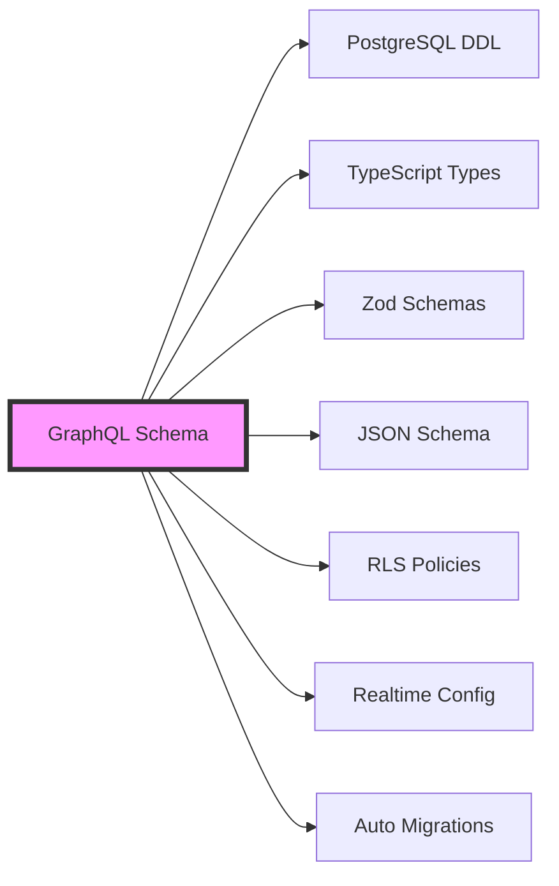

# Wesley Documentation

> "Things are only impossible until they're not." - Jean-Luc Picard

## The Revolution

Wesley inverts the entire database development paradigm. While everyone else generates GraphQL FROM databases, Wesley generates databases FROM GraphQL. This isn't just a technical choice—it's a philosophical revolution in how we think about data.

## Documentation Structure

### 📚 Core Concepts
- [The Paradigm Shift](./architecture/paradigm-shift.md) - Why GraphQL should be your source of truth
- [Architecture Overview](./architecture/overview.md) - Hexagonal, event-driven, command pattern design
- [The Algorithm](./architecture/algorithm.md) - How GraphQL becomes SQL, TypeScript, Zod, and more
- [Test Generation](./architecture/test-generation.md) - Automatic pgTAP tests from migrations

### 🔧 Implementation
- [Internals Deep Dive](./internals/deep-dive.md) - How Wesley works under the hood
- [Event Flow](./internals/event-flow.md) - Tracing events through the system
- [Parser Design](./internals/parser.md) - GraphQL SDL to domain model transformation

### 📖 Guides
- [Quick Start](./guides/quick-start.md) - Get running in 60 seconds
- [Extending Wesley](./guides/extending.md) - Add new generators and adapters
- [Migration Strategies](./guides/migrations.md) - Managing schema evolution

## The Wesley Manifesto

### The Problem
Every developer writes the same data shape 5+ times:
1. SQL DDL for the database
2. GraphQL schema for the API
3. TypeScript types for the frontend
4. Zod schemas for runtime validation
5. JSON Schema for OpenAPI docs

This is insane. It's error-prone. It's wasteful. It's time for a revolution.

### The Solution
**GraphQL is the single source of truth. Everything else is generated.**



### The Philosophy

**Migrations are a byproduct, not a task.**

You shouldn't "write migrations." You should evolve your schema and get migrations for free. Rails tried with ActiveRecord but got it backwards—they made you write migrations instead of schemas.

Wesley does it right: **Schema first. Migrations are just diffs.**

## Why This Matters

### For Developers
- Write once, generate everywhere
- Never sync types manually again
- Migrations become automatic
- Single source of truth eliminates bugs

### For Teams
- Schema is the contract
- Changes are trackable
- Review GraphQL, understand everything
- Onboarding becomes trivial

### For Architecture
- Clean separation of concerns
- Event-driven for extensibility
- Hexagonal for testability
- Platform-agnostic core

## The Technical Innovation

Wesley isn't just a code generator. It's a complete rethinking of the data layer:

1. **Directive-Driven Design**: GraphQL directives encode database semantics
2. **Event-Sourced Generation**: Every transformation emits events
3. **Hexagonal Architecture**: Core logic has zero dependencies
4. **Command Pattern**: All operations are replayable commands
5. **Platform Abstraction**: Run anywhere (Node, Deno, Browser, Edge)

## Getting Started

```bash
# Install Wesley
pnpm add -g @wesley/cli

# Create your schema
cat > schema.graphql << 'EOF'
type User @table {
  id: ID! @primaryKey @default(expr: "gen_random_uuid()")
  email: String! @unique @index
  posts: [Post!]! @hasMany
}

type Post @table {
  id: ID! @primaryKey @default(expr: "gen_random_uuid()")
  user_id: ID! @foreignKey(ref: "User.id")
  title: String!
  published: Boolean! @default(expr: "false")
}
EOF

# Generate everything
wesley generate --schema schema.graphql

# Watch for changes
wesley watch --schema schema.graphql
```

## The Future

Wesley is just the beginning. Imagine:

- **Visual Schema Editor**: Design your schema visually
- **Time-Travel Debugging**: Replay schema evolution
- **Multi-Database Support**: PostgreSQL, MySQL, SQLite, more
- **Framework Integration**: Next.js, Remix, SvelteKit plugins
- **AI-Powered Suggestions**: Let AI optimize your schema

Join the revolution. Make it so, schema.

---

*Wesley is named after Wesley Crusher, the brilliant ensign who saw possibilities others couldn't. Like his namesake, Wesley (the tool) transcends conventional thinking to solve problems in ways that seem obvious only in hindsight.*