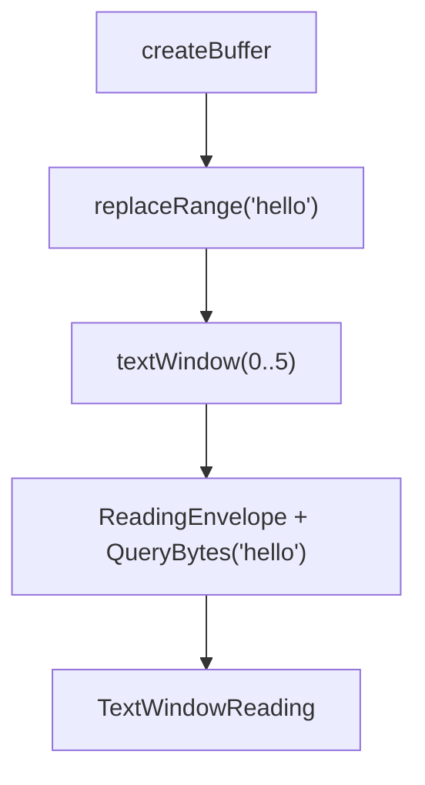

# SDL, Shape, And Law
<!-- docs-truth: status=experimental owner=@flyingrobots -->

This note supports the README. It explains why Wesley starts from GraphQL SDL
and where the line sits between generic compiler facts and domain-owned law.

For runnable commands, use [ENTRYPOINTS.md](./ENTRYPOINTS.md). For the ultimate
runtime-optic direction, use [NORTHSTAR.md](./NORTHSTAR.md). For the current
direction and active tensions, use [BEARING.md](./BEARING.md).

## Contract Substrate

Wesley treats authored GraphQL Schema Definition Language as the source
contract. SDL is useful here because it gives a stable, inspectable declaration
of:

- types and fields
- root operations
- arguments and result types
- nullability and lists
- interfaces, unions, enums, and input objects
- directives attached to known schema coordinates

That makes SDL a good substrate for a compiler. It is not only an API notation;
it is a compact semantic graph that can be lowered, hashed, diffed, and emitted
into multiple derived artifacts.

## Shape

Shape answers: what exists?

GraphQL types define entities, fields, relationships, arguments, payloads, and
operation boundaries.

```graphql
type Buffer {
  bufferId: ID!
  name: String!
  createdAtBasis: ID!
}

input TextWindowInput {
  bufferId: ID!
  basisRef: ID!
  start: Int!
  length: Int!
}
```

Generic Wesley can lower this shape into L1 IR, compute hashes, compare schema
structure, and emit Rust or TypeScript bindings without knowing anything about
editor runtimes, databases, replication, scheduling, or storage.

## Law-Shaped Data

Law answers: what is permitted, required, or forbidden?

GraphQL directives can carry law-shaped data at inspectable schema locations.
Wesley preserves that data. It does not interpret domain law in generic core.

```graphql
type Query {
  textWindow(input: TextWindowInput!): TextWindowReading!
    @wes_op(name: "textWindow")
    @wes_footprint(
      reads: ["Buffer", "Tick", "Receipt"]
      writes: []
      forbids: ["AstState", "Diagnostics", "GitWitness", "UiState"]
    )
}
```

The generic claim is bounded: Wesley can preserve the root operation, argument
type, result type, directive names, and directive arguments. An Echo-owned
extension can then decide whether `@wes_footprint` is honest, sufficient, or
admissible for Echo runtime law.

For runtime optic artifacts, `@wes_footprint` is admission-facing v0 metadata.
It is legal only on the selected root field, must declare `reads` and `writes`
arrays, may omit `forbids` to mean an empty forbidden-resource list, and must
not repeat labels within any single footprint array. Nested, fragment,
inline-fragment, or operation-level footprints are rejected until Wesley
intentionally designs scoped footprints.

## Runtime Optic Executable Subset

`shape.valid.v1` means the selected operation is valid inside Wesley's declared
runtime-optic executable subset. It does not claim that Wesley has implemented
the full GraphQL executable-validation spec by hand.

The v0 subset supports one selected root field, variables without default
values, schema-backed field selections, root and selected-field argument
validation, recursive input object literals, enum values, list/nullability
checks, fragment type-condition compatibility, required subselections for
composite fields, rejected subselections for leaf fields, response-name conflict
checks, and preserved executable directive metadata.

Unsupported executable features are rejected with structured operation lowering
errors instead of being implicitly accepted. Current explicit v0 rejections
include `__typename` selections, variable default values, interface
inheritance, non-root `@wes_footprint`, duplicate executable directive
arguments, and duplicate footprint labels.

## Extension Interpretation

Extensions own interpretation.

| Owner | Can interpret |
| --- | --- |
| Rust/TypeScript emitters | Domain-empty model and operation bindings |
| Echo-owned tooling | Footprints, observer plans, runtime admissibility |
| `wesley-postgres` | SQL schemas, migrations, indexes, database tests |
| Continuum-owned modules | Continuum release, witness, and protocol surfaces |

This keeps Wesley narrow. The compiler can make derived artifacts reproducible
and inspectable without silently becoming a runtime, database, scheduler, or
product-policy engine.

## Current Grounding

The Stack Witness 0001 fixture is the current small witness shape:



The fixture gives Wesley hermetic operation-catalog and Rust/TypeScript binding
coverage for a jedit-through-Echo file-history boundary. It deliberately marks
`fixtureVarsBytes` as temporary fixture metadata and records
`targetCodec: wesley-binary/v0` as the durable future codec target.

That is the posture to keep: stabilize proven contract seams, preserve the
facts needed by external owners, and avoid moving domain runtime law into
generic Wesley core.
