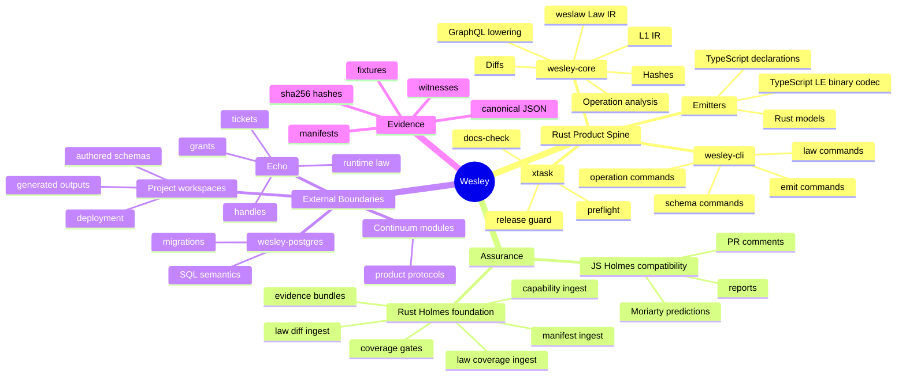
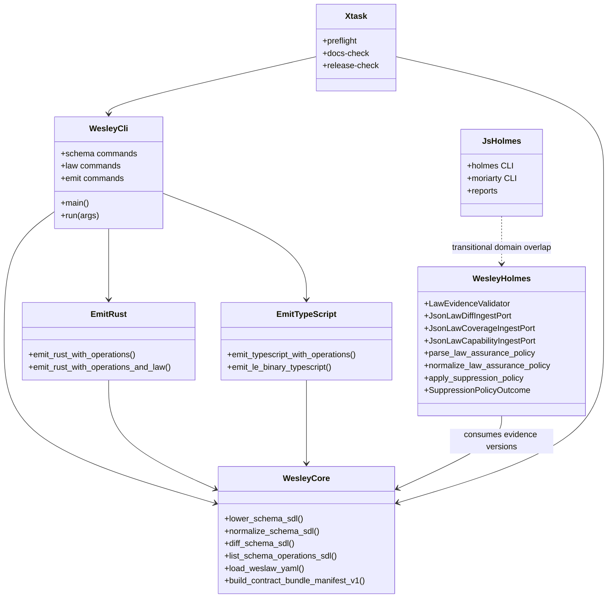
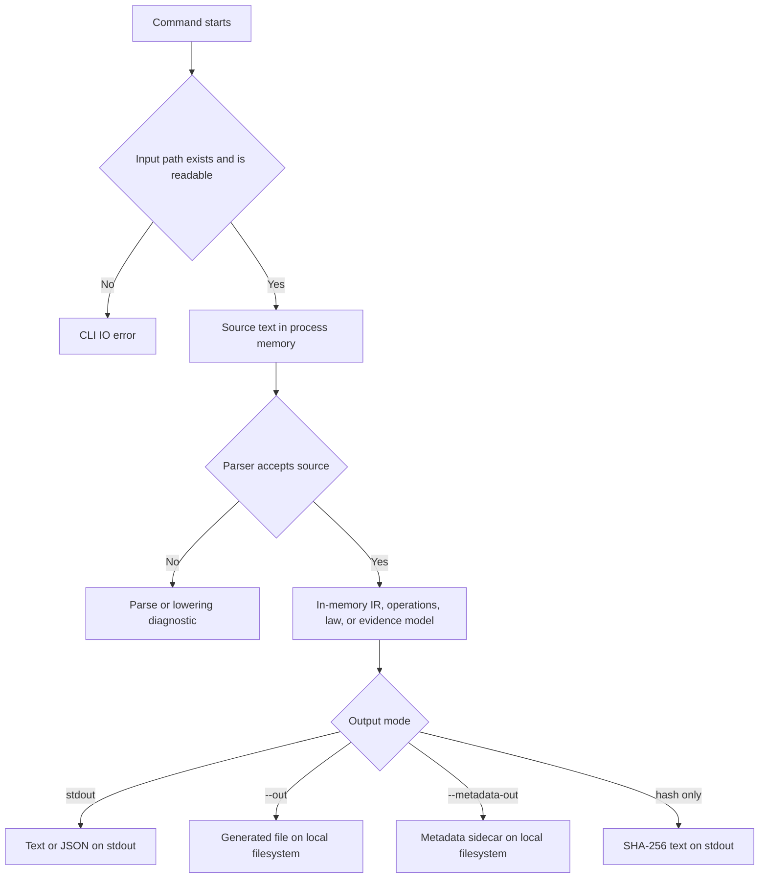
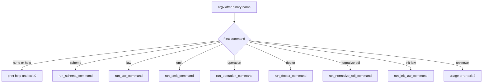
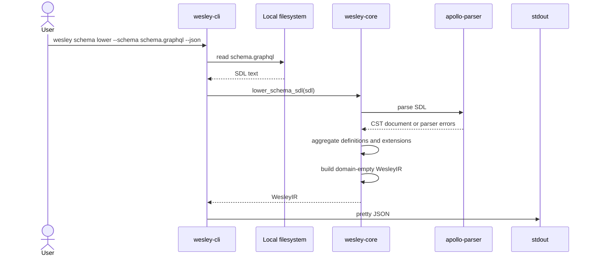
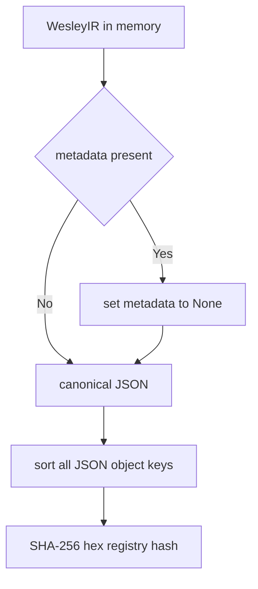
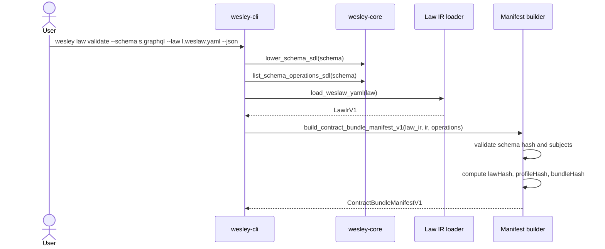
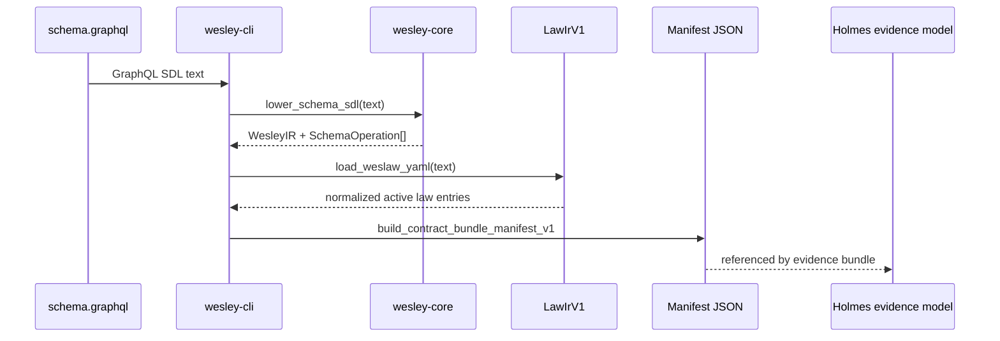
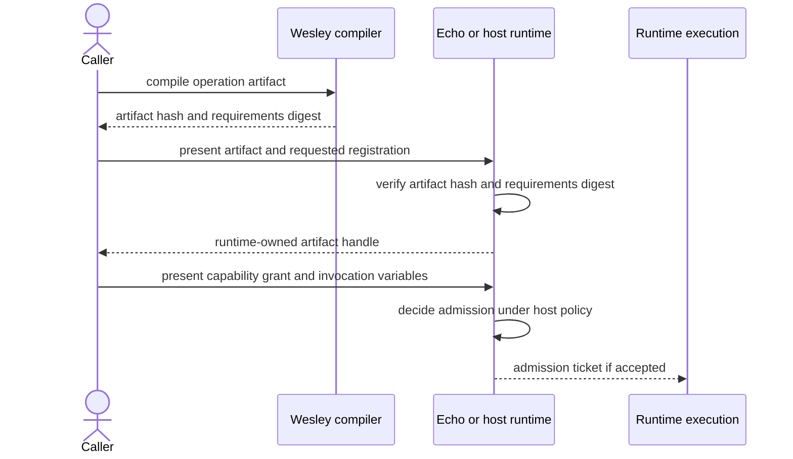
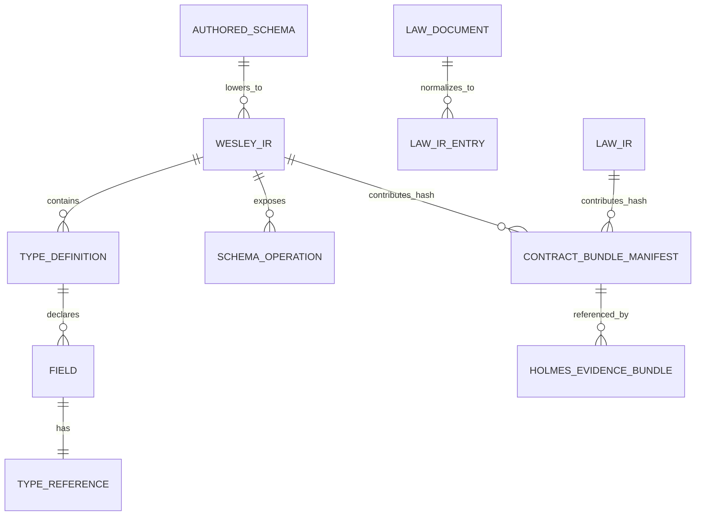

<!-- docs-truth: status=experimental owner=@flyingrobots -->

# Wesley Technical Teardown

This document is an end-to-end technical explanation of the Wesley repository
as it exists on the `main` branch on June 5, 2026 (post-PR #600).

It assumes no prior knowledge of Wesley, its domain, or its implementation.
The explanation starts with the business and domain concepts, then follows the
actual native Rust execution path from `crates/wesley-cli/src/main.rs` into the
compiler kernel, emitters, semantic law layer, and Holmes assurance foundation.

## Executive Summary

### What This Repository Contains

Wesley is a schema-first compiler kernel and assurance toolchain. Its central
promise is that an authored GraphQL Schema Definition Language document can be
treated as the source of truth, lowered into deterministic compiler facts, and
projected into generated artifacts or evidence reports without allowing those
derived artifacts to become peer authorities.

The current product center is the Rust workspace. The core compiler crate is
`crates/wesley-core`, the user-facing native binary is
`crates/wesley-cli`, and the retained native emitters are
`crates/wesley-emit-rust` and `crates/wesley-emit-typescript`. The
`crates/wesley-holmes` crate is an unpublished Rust foundation for law
assurance. JavaScript packages remain, but the repository docs classify them as
non-compiler surfaces: Holmes compatibility tooling, website or docs plumbing,
and browser/Bun/Deno host smoke experiments.

### How It Works

At runtime, a user normally runs the native command:

```bash
cargo wesley --help
```

or, after installation:

```bash
wesley --help
```

The command starts in `crates/wesley-cli/src/main.rs`. It manually parses the
first command word, validates command options, reads local files, calls pure
Rust library functions, and prints JSON, text, Markdown, or generated source
files. The CLI itself is intentionally thin. Compiler semantics live in
`wesley-core`; language-specific printing lives in emitter crates; law
assurance ingestion lives in `wesley-holmes`.

### Current Version And Next Work

The Rust crates in this checkout declare version `0.0.5`. The public README
still has a "What's New in v0.0.4" release note, so the honest version posture
is: the checked-out crates are at `0.0.5`, while the README still describes the
previous published alpha headline. The changelog has substantial unreleased
work around `weslaw` and Rust Holmes law evidence gates.

The active project direction is to finish the Rust-native compiler spine,
preserve the domain-empty boundary, and grow Holmes law-assurance ingestion
without making Holmes or external product semantics part of the compiler core.

## Table Of Contents

### Reading Path

Readers who are new to the system should read the Domain Dictionary, then the
Data Source Of Truth section, then The Entry Point. Those sections establish
what the nouns mean, where state lives, and where execution actually begins.

### Core Sections

- [Mermaid Mind Map](#mermaid-mind-map)
- [A "Domain Dictionary" (Glossary)](#a-domain-dictionary-glossary)
- [Where This Project Stands](#where-this-project-stands)
- [Package(s) Overview](#packages-overview)
- [The Data "Source of Truth"](#the-data-source-of-truth)
- [Bootstrapping vs. Runtime](#bootstrapping-vs-runtime)
- [The Entry Point](#the-entry-point)
- [The Golden Paths](#the-golden-paths)
- [Anatomy of a Payload (Data Schemas)](#anatomy-of-a-payload-data-schemas)
- [Test Coverage](#test-coverage)
- [Extreme Detail & Highlights](#extreme-detail--highlights)
- [The "Unhappy Paths" and Error Handling](#the-unhappy-paths-and-error-handling)
- [Concurrency and Asynchronous Flows](#concurrency-and-asynchronous-flows)
- [External Dependencies and Borders](#external-dependencies-and-borders)
- [Security Boundaries and Auth Flows](#security-boundaries-and-auth-flows)
- [Configuration and Environment Tuning](#configuration-and-environment-tuning)

### Closing Sections

- [The "Why Did We Build It This Way?" (Trade-offs)](#the-why-did-we-build-it-this-way-trade-offs)
- [Ten Use Cases](#ten-use-cases)
- [Summary Of The System's Key Features And Notable Design Decisions](#summary-of-the-systems-key-features-and-notable-design-decisions)
- [Future Work](#future-work)
- [Open Questions](#open-questions)
- [Conclusion](#conclusion)
- [References](#references)
- [Appendices](#appendices)

## Mermaid Mind Map

### Architecture At A Glance



### Boundary Doctrine

The most important architectural fact is that Wesley is deliberately
domain-empty. Wesley owns GraphQL compiler truth and structured evidence
surfaces. It does not own runtime scheduling, database migrations, Echo
footprint enforcement, Continuum product behavior, or deployment.

### How To Read The Diagram

The diagram separates the repository into three practical worlds. The Rust
product spine is the current compiler authority. The assurance world validates
evidence derived from compiler artifacts. The external boundary world consumes
Wesley facts but owns domain-specific meaning.

## A "Domain Dictionary" (Glossary)

### Why These Terms Matter

Wesley has a small set of recurring nouns. Understanding these nouns prevents a
common misunderstanding: generated files are useful, but the authored schema and
law artifacts remain the authority.

### Glossary Table

| Term | Definition |
| --- | --- |
| [GraphQL SDL](#golden-path-1-schema-lowering-and-hashing) | The authored schema language Wesley consumes. SDL declares types, fields, arguments, directives, enums, unions, interfaces, inputs, and root operations. |
| [Schema-first](#the-data-source-of-truth) | The discipline that the authored schema is the source of truth, while generated artifacts are projections. |
| [Domain-empty core](#packages-overview) | The rule that `wesley-core` preserves generic compiler facts but does not interpret product, database, Echo, or deployment semantics. |
| [L1 IR](#anatomy-of-l1-ir) | Wesley's Level 1 intermediate representation: deterministic, domain-empty GraphQL facts after parsing and consolidation. |
| [Directive](#golden-path-3-operation-analysis) | GraphQL metadata attached to schema or operation locations. Wesley preserves directive data as JSON; modules or runtimes interpret it. |
| [Root operation](#anatomy-of-a-schema-operation) | A field on Query, Mutation, or Subscription that represents a public operation boundary. |
| [Emitter](#golden-path-4-emission) | A Rust crate that turns L1 IR plus root operation facts into generated Rust or TypeScript source. |
| [Canonical JSON](#canonical-json-and-registry-hashes) | JSON serialized with sorted object keys and no whitespace so hashes are stable across runs. |
| [Registry hash](#canonical-json-and-registry-hashes) | A SHA-256 hash of canonical L1 IR with nondeterministic metadata stripped. |
| [weslaw](#golden-path-5-weslaw-semantic-law) | Wesley's semantic law authoring format and normalized Law IR layer for schema-bound constraints. |
| [Law IR](#anatomy-of-law-ir) | Normalized, typed representation of active `weslaw/v1` entries after YAML loading. |
| [Contract bundle manifest](#contract-bundle-manifest) | A JSON manifest linking schema hash, law hash, profile hash, bundle hash, compiler identity, and Law IR codec. |
| [Law coverage](#law-capabilities-and-coverage) | A profile/category report showing which schema subjects have active law coverage. |
| [Capability report](#law-capabilities-and-coverage) | A report-only summary of footprint resources read, written, created, or forbidden by operation law. |
| [Runtime optic](#golden-path-6-runtime-optic-artifact) | A compiled GraphQL operation artifact that describes bounded operation shape, requirements, and law claims without executing anything. |
| [Holmes](#golden-path-7-holmes-assurance-foundation) | Wesley's assurance family. Rust Holmes ingests law evidence; legacy JS Holmes still supports reports and historical tooling. |
| [Port](#external-dependencies-and-borders) | A trait boundary used by hexagonal architecture so application logic can depend on capabilities without depending on filesystem, GitHub, MCP, or wall-clock implementations. |
| [Evidence bundle](#evidence-bundle-validation) | A Holmes envelope that names required law evidence artifacts and their provenance. |
| [Preflight](#test-coverage) | Repository health check run through `cargo xtask preflight`, combining docs checks, Rust tests, and native CLI help verification. |

### Conceptual Anchors

If one idea should stay in mind throughout the document, it is this: Wesley
transforms authored contracts into deterministic facts and artifacts, but it
does not make the generated artifacts authoritative. The source file, normalized
compiler facts, and recorded hashes form the evidence chain.

## Where This Project Stands

### Current State

The repository has completed its legacy Node retirement campaign for compiler
authority. The old JavaScript compiler packages are deleted, and the current
compiler front door is the native Rust `wesley` binary. The main architectural
layers are Rust core, native CLI, Rust emitters, Rust Holmes foundation,
retained non-compiler JavaScript packages, fixtures, schemas, docs, scripts,
and xtask automation.

PR #600 (merged June 5, 2026) added the Holmes law assurance policy substrate
and suppression abuse-prevention layer through `HIMP-036`. The campaign stands
at 36 of 90 implementation slices closed. Concrete adapters, public CLI
commands, and reporting surfaces are not yet wired (planned in `HIMP-041+` and
`HIMP-061+`).

### Notable Achievements

The project now has native Rust support for schema lowering, normalized SDL,
schema hashing, structural diffs, root operation catalogs, operation selection
analysis, directive argument extraction, Rust emission, TypeScript emission,
little-endian TypeScript codec emission, `weslaw` validation, `weslaw` semantic
diffs, law coverage, law capabilities, and emit metadata sidecars.

The assurance side has an unpublished `wesley-holmes` Rust crate with domain
models, deterministic ports, evidence bundle validation, law diff ingest, law
coverage ingest, capability ingest, contract manifest ingest, semantic findings,
law coverage gate decisions, bundle traceability gate decisions, aggregate
assessment outcomes, bounded finding summaries, provenance reports, typed
`holmes.law-assurance-policy/v1` parsing and normalization, profile inheritance,
severity mappings, materialized coverage thresholds, suppression rules with
expiration and audit metadata, and suppression abuse prevention enforcing
invalid-evidence, non-overridable-gate, and expiry rules. That work is
intentionally not yet exposed as a public Holmes CLI from Rust.

### Current Tensions

The README now describes `v0.0.5`, aligned with the `Cargo.toml` crate version
declared across the workspace. The changelog's `[Unreleased]` section carries
the Holmes law assurance substrate work (`HIMP-001–036`) which has not yet been
cut into a versioned release.

## Package(s) Overview

### Rust Workspace As Product Center

The root `Cargo.toml` contains six workspace members:

```toml
[workspace]
members = [
    "crates/wesley-core",
    "crates/wesley-emit-typescript",
    "crates/wesley-emit-rust",
    "crates/wesley-holmes",
    "crates/wesley-cli",
    "xtask",
]
resolver = "2"
```

`wesley-core` is the compiler brain. It exposes public APIs such as
`lower_schema_sdl`, `normalize_schema_sdl`, `diff_schema_sdl`,
`list_schema_operations_sdl`, `resolve_operation_selections`, and
`load_weslaw_yaml`.

`wesley-cli` is the product body. It reads files, parses options, dispatches
subcommands, writes output files, and converts domain errors into process exit
codes.

`wesley-emit-rust` and `wesley-emit-typescript` are structured printers. They
consume L1 IR and root operation facts, build language-specific internal ASTs,
and then print deterministic source text.

`wesley-holmes` is the law-assurance foundation. It is not published and has no
public CLI yet. Its design is hexagonal: pure domain, application services,
ports, adapters, and reporting.

`xtask` is repository automation. It owns preflight, docs checks, release
checks, crates.io packaging guards, and legacy JavaScript preflight bridging.

### Non-Compiler JavaScript Packages

The pnpm workspace still includes `packages/*`, example fixtures, docs site,
and the website. The retained packages are not compiler authority.

`@wesley/holmes` is a legacy compatibility assurance package. It provides
Holmes, Watson, Moriarty, report, counterfactual, and PR-comment tooling while
the Rust Holmes foundation grows behind a stronger boundary.

`@wesley/host-browser`, `@wesley/host-bun`, and `@wesley/host-deno` are host
smoke experiments. Their code intentionally contains small local parser/hash
adapters and does not depend on the retired JavaScript compiler core.

### Package Relationship Diagram



### Dependency Borders

Rust dependencies mark the boundaries clearly. `wesley-core` depends on
`apollo-parser` for GraphQL parsing, `serde` and `serde_json` for data
serialization, `sha2` and `hex` for hashes, `indexmap` for deterministic
insertion-ordered maps, `yaml-rust2` for `weslaw` YAML loading, and
`ninelives` plus `tower` and `tokio` for explicit resilience seams.

The emitters depend on `wesley-core` and `serde_json`; they do not parse
GraphQL themselves. The CLI depends on core and emitters. Holmes depends on
`serde` and `serde_json`, keeping the assurance foundation small.

## The Data "Source of Truth"

### Authored State

The source of truth is an authored file, normally GraphQL SDL. A `weslaw/v1`
YAML file can also become a source artifact when semantic law is involved. The
authoritative state starts on disk and enters process memory only after the CLI
reads it.

There is no local SQLite database, Redis cache, or server-side application
store in the core compiler path. Wesley reads files, computes deterministic
in-memory facts, prints output, and optionally writes generated artifacts or
metadata sidecars back to the filesystem.

### Derived State

Derived state includes L1 IR JSON, normalized SDL, schema hashes, generated
Rust, generated TypeScript, generated TypeScript codec files, law manifests,
law diff reports, law coverage reports, and law capability reports. These are
derived evidence or projections. They are useful for CI and consumers, but they
are not allowed to become the source of truth.

### State Location Diagram



### Source Of Truth Rule

At every golden path, the source of truth remains the authored input plus the
compiler version and command options used to derive output. A generated file can
be checked, packaged, or shipped, but if it disagrees with the source, the
correct repair is to regenerate or fail the validation gate.

## Bootstrapping vs. Runtime

### Native CLI Bootstrapping

Bootstrapping begins when the OS starts the `wesley` process and Rust executes
`fn main() -> ExitCode` in `crates/wesley-cli/src/main.rs`. The CLI collects
command-line arguments, dispatches through `run(args)`, and maps any `CliError`
to a stable exit code.

There is no long-lived daemon bootstrap. The command starts, reads input,
computes output, writes or prints, and exits.

### Command Runtime

Runtime means the handling of one command invocation. For example,
`wesley schema lower --schema schema.graphql --json` reads one schema file,
lowers it to L1 IR in memory, serializes that IR to pretty JSON, prints it, and
exits. Nothing persists unless the user chooses a command with `--out` or
`--metadata-out`.

### Xtask Runtime

`cargo xtask preflight` is a different runtime surface. It is a repository
maintenance command that runs docs checks, `cargo test --workspace`, and
`cargo run --bin wesley -- --help`. It does not define compiler semantics; it
checks that the repository remains healthy.

## The Entry Point

### Exact Process Entry

The product entry point is:

```rust
fn main() -> ExitCode {
    let args = env::args().skip(1).collect::<Vec<_>>();

    match run(args) {
        Ok(code) => ExitCode::from(code),
        Err(error) => {
            eprintln!("{error}");
            ExitCode::from(error.exit_code())
        }
    }
}
```

This means the CLI never panics for ordinary user errors. It converts usage,
I/O, Git, JSON, core compiler, and law errors into printed diagnostics plus
exit codes.

### Command Dispatch

`run(args)` is a first-word router. It recognizes `normalize-sdl`, `doctor`,
`init-law`, `schema`, `law`, `emit`, `operation`, and `version`. Nested command
families then route their own second word.



### Error And Exit Code Contract

The CLI uses three process outcomes:

```rust
const EXIT_OK: u8 = 0;
const EXIT_FAILURE: u8 = 1;
const EXIT_USAGE: u8 = 2;
```

Usage errors return `2`, while I/O, compiler, law, Git, and JSON serialization
errors return `1`. This separation matters for automation because malformed
commands are different from valid commands that found invalid input.

## The Golden Paths

### Golden Path 1: Schema Lowering And Hashing

The most basic successful path is schema lowering. The user supplies GraphQL
SDL. The CLI reads the file, calls `lower_schema_sdl`, and prints `WesleyIR` as
JSON.



#### Anatomy Of L1 IR

The core serialized type is:

```rust
pub struct WesleyIR {
    pub version: String,
    pub metadata: Option<Metadata>,
    pub types: Vec<TypeDefinition>,
}
```

A small lowered payload looks like this:

```json
{
  "version": "1.0.0",
  "types": [
    {
      "name": "Query",
      "kind": "OBJECT",
      "directives": {},
      "fields": [
        {
          "name": "health",
          "type": {
            "base": "Boolean",
            "nullable": true,
            "isList": false
          },
          "directives": {}
        }
      ]
    }
  ]
}
```

The state lives only in process memory until the CLI prints it. If a caller
wants this JSON on disk, shell redirection or a wrapper script must write it;
`schema lower` itself prints to stdout.

#### Parser And Lowering Mechanics

`ApolloLoweringAdapter::parse_and_lower` first invokes `apollo-parser`. It
collects parse errors and returns the first one as a `WesleyError::ParseError`
with line and column.

If parsing succeeds, the lowerer aggregates definitions and extensions into a
`BTreeMap<String, TypeAggregate>`. The `BTreeMap` is a subtle but important
choice: it makes type iteration deterministic by type name. Extensions are
folded into the aggregate so that `type User` plus `extend type User` becomes
one consolidated `TypeDefinition` in L1 IR.

#### Canonical JSON And Registry Hashes

`schema hash` calls the same lowerer, then calls `compute_registry_hash`. That
function clones the IR, strips nondeterministic metadata, serializes the value
to canonical JSON with sorted object keys, and hashes the exact UTF-8 bytes with
SHA-256.



### Golden Path 2: Schema Diff

Schema diff compares old and new schemas after both have been lowered into the
same L1 shape. This is why the diff is structural rather than textual.

#### Explicit File Mode

The explicit mode reads two local files:

```bash
wesley schema diff --old old.graphql --new new.graphql --format json
```

Both files are lowered. Then `diff_schema_ir` compares types, fields, enum
values, union members, implemented interfaces, directives, and field arguments.

#### Git Revision Mode

The Git-aware mode reads the old schema state from a revision and the new
schema state from the worktree:

```bash
wesley schema diff --schema schema.graphql --against HEAD
```

The CLI resolves the schema path, asks Git for the repository root, constructs
`<revision>:<relative-path>`, and runs `git show`. The old source comes from
Git stdout; the new source comes from the filesystem.

#### Anatomy Of A Schema Delta

```json
{
  "addedTypes": [
    {
      "name": "NewType",
      "breaking": false,
      "description": "Type \"NewType\" added"
    }
  ],
  "removedTypes": [],
  "modifiedTypes": [
    {
      "name": "User",
      "breaking": true,
      "description": "Type \"User\" modified: field change",
      "fieldChanges": [
        {
          "name": "email",
          "kind": "removed",
          "breaking": true,
          "description": "Field \"email\" removed from User"
        }
      ]
    }
  ]
}
```

The CLI can flatten this structure into text or summary output. With
`--exit-code`, breaking changes produce exit code `1`, which makes the command
usable as a CI gate.

### Golden Path 3: Operation Analysis

Operation analysis is the generic replacement for older domain-specific command
surfaces. Wesley can list root operations, resolve operation selections, and
extract directive arguments without interpreting product meaning.

#### Anatomy Of A Schema Operation

Root operation data is serialized as:

```json
{
  "operationType": "MUTATION",
  "rootTypeName": "Mutation",
  "fieldName": "replaceRange",
  "arguments": [
    {
      "name": "input",
      "type": {
        "base": "ReplaceRangeInput",
        "nullable": false,
        "isList": false
      },
      "directives": {}
    }
  ],
  "resultType": {
    "base": "MutationReceipt",
    "nullable": false,
    "isList": false
  },
  "directives": {
    "wes_footprint": {
      "reads": ["Buffer"],
      "writes": ["Buffer"],
      "forbids": ["Diagnostics"]
    }
  }
}
```

The directive payload is JSON data, not an enforcement decision. If the
directive says a mutation writes `Buffer`, Wesley preserves that claim. Echo or
another runtime decides whether it is true and enforceable.

#### Response Paths And Schema Coordinates

Without schema SDL, `operation selections` returns response paths such as
`textWindow.bufferId` and respects aliases as response names. With schema SDL,
it resolves schema coordinates such as `TextWindowReading.bufferId`. The second
mode can reject selections for fields that do not exist on the parent type.

#### Directive Argument Extraction

`operation directive-args` parses operation documents and extracts directives
by name. The CLI strips a leading `@` from `--directive`, so both
`--directive wes_law` and `--directive @wes_law` address the same directive.

### Golden Path 4: Emission

Emission turns compiler facts into generated source. The current emitters do
not parse or patch existing files. They build an internal AST from L1 IR and
print a complete generated file.

#### Rust Emitter

The Rust emitter maps GraphQL scalars and shapes into Rust declarations:

```rust
pub type DateTime = String;

#[derive(Debug, Clone, PartialEq, serde::Serialize, serde::Deserialize)]
pub struct User {
    pub id: String,
    pub name: Option<String>,
}
```

Root operation object types are deliberately skipped as ordinary data models
when operation bindings are present. The emitter then emits request structs,
response aliases, and operation metadata constants for each root field.

#### TypeScript Emitter

The TypeScript emitter maps GraphQL objects and inputs to interfaces, enums to
string literal unions, unions to TypeScript unions, and custom scalars to
`unknown` by default:

```ts
export interface User {
  id: string;
  name: string | null;
}

export interface MutationReplaceRangeRequest {
  input: ReplaceRangeInput;
}

export type MutationReplaceRangeResponse = MutationReceipt;
```

#### Emit Metadata

When `--metadata-out` is supplied, the CLI writes a deterministic JSON sidecar:

```json
{
  "schemaHash": "ab12...",
  "schemaHashQualified": "sha256:ab12...",
  "lawHash": "sha256:cd34...",
  "lawDocumentHash": "sha256:ef56...",
  "profileHash": "sha256:...",
  "bundleHash": "sha256:...",
  "lawIrCodec": "wesley.law-ir.canonical-json.v1",
  "generator": "wesley-emit-rust",
  "generatorVersion": "0.0.5",
  "executionMode": "rust-native"
}
```

The state transition is local and explicit: generated source is written to
`--out`, metadata is written to `--metadata-out`, and no background service is
involved.

### Golden Path 5: Weslaw Semantic Law

`weslaw` is Wesley's semantic law layer. It lets a project express constraints
such as scalar semantics, discriminated input variants, operation footprints,
channel law, and typed invariants in a schema-bound form.

#### Anatomy Of Law IR

An authored `weslaw/v1` YAML document is loaded into normalized `LawIrV1`:

```json
{
  "apiVersion": "wesley.law-ir/v1",
  "family": "demo",
  "schemaHash": "sha256:...",
  "registries": {
    "resources": [],
    "verifiers": [],
    "channels": []
  },
  "entries": [
    {
      "id": "law.scalar.tick",
      "status": "active",
      "kind": "scalarSemantics",
      "subject": "scalar:TickId",
      "tags": [],
      "body": {
        "representation": "integer",
        "minInclusive": 0,
        "forbids": ["silentGraphQLIntNarrowing"]
      }
    }
  ]
}
```

Draft entries are authoring scaffolding, not active semantic law. The loader
filters them before normalized active Law IR is used for hashes and binding.

#### Contract Bundle Manifest

`wesley law validate --schema <schema> --law <law> --json` lowers the schema,
lists root operations, loads Law IR, validates that active law binds to the
active schema hash, and emits a contract bundle manifest.



The manifest payload looks like:

```json
{
  "apiVersion": "wesley.contract-bundle-manifest/v1",
  "schemaHash": "sha256:...",
  "lawHash": "sha256:...",
  "lawDocumentHash": "sha256:...",
  "profileHash": "sha256:...",
  "bundleHash": "sha256:...",
  "lawIrCodec": "wesley.law-ir.canonical-json.v1",
  "bundleHashCodec": "wesley.contract-bundle.hash-input.canonical-json.v1",
  "compiler": "wesley-core",
  "compilerVersion": "0.0.5",
  "lawEntryCount": 4
}
```

#### Law Capabilities And Coverage

`wesley law capabilities` emits a report-only footprint summary. It explicitly
sets `reportOnly: true` and `runtimeEnforcement: false`. This is a critical
honesty boundary: Wesley can summarize footprint law, but it does not claim the
runtime enforced it.

`wesley law coverage` reports profile-aware coverage categories for custom
scalar semantics, variant input law, mutation footprint law, and channel law.
Profiles `release` and `ci-release` treat categories as required; `local` is a
lighter posture.

### Golden Path 6: Runtime Optic Artifact

Runtime optics are not the ordinary CLI front door in this checkout, but they
are an important core API. They compile a GraphQL operation into an artifact
that a runtime can inspect, admit, reject, witness, or replay.

#### Why The API Exists

The runtime optic API supports the long-term bounded-autonomy direction. An
agent or application can declare a precise GraphQL operation shape. Wesley
compiles that declaration into a stable artifact. A host such as Echo owns
runtime admission, identity, grants, tickets, and enforcement.

#### Anatomy Of An Optic Artifact

```json
{
  "artifactId": "b7...",
  "artifactHash": "b7...",
  "schemaId": "a1...",
  "requirementsDigest": "c9...",
  "requirementsArtifact": {
    "digest": "c9...",
    "codec": "wesley.requirements.canonical-json.v0",
    "bytes": [123, 34, 100, 101, 99, 108, 97, 114, 101, 100]
  },
  "operation": {
    "operationId": "d2...",
    "kind": "QUERY",
    "rootField": "textWindow",
    "rootArguments": [],
    "selectionArguments": [],
    "directives": [],
    "lawClaims": []
  },
  "requirements": {
    "identity": {
      "required": true,
      "acceptedPrincipalKinds": []
    },
    "requiredPermissions": [],
    "forbiddenResources": []
  }
}
```

#### Validation Before Artifact Identity

The runtime optic compiler rejects unsupported executable features before it
computes identities. It rejects multiple top-level fields, unknown selected
fields, cyclic fragments, impossible fragment type conditions, duplicate
arguments, invalid input object literals, invalid subselection shapes,
unsupported `__typename`, non-root `@wes_footprint`, duplicate footprint labels,
and variable nullability mismatches.

### Golden Path 7: Holmes Assurance Foundation

Rust Holmes consumes evidence after Wesley produces it. It does not lower SDL
or emit source. Its concern is whether evidence bundles and artifact envelopes
are structurally valid, versioned, readable, and internally consistent.

#### Evidence Bundle Validation

The Holmes evidence bundle model names required artifacts:

```json
{
  "schemaVersion": "1.0.0",
  "bundleId": "law-demo",
  "artifacts": {
    "lawDiff": {
      "path": "artifacts/law-diff.json",
      "schemaVersion": "wesley.law-diff/v1"
    },
    "lawCoverage": {
      "path": "artifacts/law-coverage.json",
      "schemaVersion": "wesley.law-coverage/v1"
    },
    "lawCapabilities": {
      "path": "artifacts/law-capabilities.json",
      "schemaVersion": "wesley.law-capabilities/v1"
    },
    "contractBundleManifest": {
      "path": "artifacts/manifest.json",
      "schemaVersion": "wesley.contract-bundle-manifest/v1"
    }
  },
  "provenance": {
    "schemaHash": "sha256:...",
    "lawHash": "sha256:...",
    "bundleHash": "sha256:...",
    "source": "ci"
  }
}
```

`LawEvidenceValidator` first validates structure. If the structure only has
warnings, it continues to artifact availability checks. It resolves paths
through `WeslawArtifactLocator`, rejects escaping or platform-specific paths,
checks duplicate normalized artifact roles, loads artifacts through an
`ArtifactLoadPort`, and records byte lengths.

#### Ingest Ports

Holmes has JSON ingest ports for law diff, law coverage, law capability, and
contract bundle manifest artifacts. Each port deserializes untrusted bytes,
validates API version and shape, normalizes accepted payloads into domain
models, and returns deterministic diagnostics on failure.

#### Coverage Gates And Findings

Coverage gate decisions compare normalized coverage evidence to policy
thresholds. A gate can pass, warn, fail, or be unavailable. Semantic findings
preserve Wesley law diff event classifications rather than reclassifying them
inside Holmes, which keeps producer and consumer semantics aligned.

#### Law Assurance Policy Substrate

`parse_law_assurance_policy` deserializes a `holmes.law-assurance-policy/v1`
JSON document with strict unknown-field rejection
(`crates/wesley-holmes/src/domain/policy.rs:263`). `normalize_law_assurance_policy`
resolves a named profile, applies profile inheritance (profiles may extend other
profiles), merges parent and child severity mappings and coverage thresholds,
and produces a flat `NormalizedLawAssurancePolicy` ready for gate evaluation
(`policy.rs:330`). The normalized policy carries a `non_overridable_gates` set
naming gates that no suppression rule may override.

Suppression rules are declared in the policy with `id`, `target`
(`kind` + `selector`), `owner`, `reason`, `created_on`, `expires_on`,
`allowed_severities`, and `audit_tags` fields. `matching_suppressions_for_finding`
returns all unexpired rules that match a given finding against an
`evaluation_date` string in `YYYY-MM-DD` format (`policy.rs:711`).

#### Suppression Abuse Prevention

`apply_suppression_policy` enforces three abuse-prevention rules in order before
muting any finding (`policy.rs:551`):

1. **Invalid evidence blocks all suppressions.** If the evidence bundle's
   validation status is `Invalid` or `InfrastructureError`, every suppression is
   rejected with `HlawSuppressionRejectedInvalidEvidence` and the full finding
   set remains active.
2. **Non-overridable gates.** A suppression rule targeting a gate id listed in
   `non_overridable_gates` is rejected with `HlawSuppressionRejectedNonOverridable`
   regardless of other conditions.
3. **Expiry.** A suppression whose `expires_on` date is earlier than or equal to
   `evaluation_date` emits `HlawSuppressionExpired` at warning severity and is
   not applied. The boundary is exclusive: a rule expiring on the evaluation
   date is treated as expired.

Valid suppressions annotate the first matching finding (first-match wins),
producing an `AnnotatedFinding` that carries the original `SemanticChangeFinding`
plus an optional `suppressed_by: Option<LawAssuranceSuppressionMatch>`.

The output type `SuppressionPolicyOutcome` collects annotated findings, applied
`SuppressionApplicationRecord`s (with `target`, `owner`, `reason`, `created_on`,
and `audit_tags`), rejected `SuppressionRejectionRecord`s (with
`SuppressionRejectionReason`), expired suppression ids, and Holmes diagnostics.
`SuppressionPolicyOutcome::active_findings()` returns only findings that were
not suppressed, ready for downstream severity mapping and reporting.

## Anatomy of a Payload (Data Schemas)

### Why Payload Anatomy Gets Its Own Section

The golden paths show when data moves. This section pauses on what the data
looks like at those boundaries. That matters because Wesley is not a server
that hides state inside a database. Its important state is carried as explicit
payloads: Rust structs in memory, JSON on stdout, YAML on disk, generated
source files, and manifest artifacts.

The important pattern is always the same. Authored source enters the process as
text. Wesley parses or loads that text into a typed in-memory model. The model
is then printed as deterministic JSON, deterministic generated source, or a
hash-bearing manifest.

### Schema Payloads

The first payload boundary is the GraphQL SDL string. It is not JSON and it is
not a database row. It is just local file content read into memory:

```graphql
type Query {
  health: Boolean
}
```

After lowering, the in-memory Rust payload is `WesleyIR`. Its serialized JSON
shape is:

```json
{
  "version": "1.0.0",
  "types": [
    {
      "name": "Query",
      "kind": "OBJECT",
      "directives": {},
      "fields": [
        {
          "name": "health",
          "type": {
            "base": "Boolean",
            "nullable": true,
            "isList": false
          },
          "directives": {}
        }
      ]
    }
  ]
}
```

The same data is represented in Rust by these core structs:

```rust
pub struct WesleyIR {
    pub version: String,
    pub metadata: Option<Metadata>,
    pub types: Vec<TypeDefinition>,
}

pub struct TypeDefinition {
    pub name: String,
    pub kind: TypeKind,
    pub description: Option<String>,
    pub directives: IndexMap<String, serde_json::Value>,
    pub implements: Vec<String>,
    pub fields: Vec<Field>,
    pub enum_values: Vec<String>,
    pub union_members: Vec<String>,
}
```

### Operation Payloads

When the schema has root operation fields, Wesley turns those root fields into
`SchemaOperation` payloads. These are not execution plans. They are typed
descriptions of public GraphQL operation boundaries.

```rust
pub struct SchemaOperation {
    pub operation_type: OperationType,
    pub root_type_name: String,
    pub field_name: String,
    pub arguments: Vec<OperationArgument>,
    pub result_type: TypeReference,
    pub directives: IndexMap<String, serde_json::Value>,
}
```

The JSON form preserves directive data as ordinary JSON:

```json
{
  "operationType": "MUTATION",
  "rootTypeName": "Mutation",
  "fieldName": "replaceRange",
  "arguments": [
    {
      "name": "input",
      "type": {
        "base": "ReplaceRangeInput",
        "nullable": false,
        "isList": false
      },
      "directives": {}
    }
  ],
  "resultType": {
    "base": "MutationReceipt",
    "nullable": false,
    "isList": false
  },
  "directives": {
    "wes_footprint": {
      "reads": ["Buffer"],
      "writes": ["Buffer"],
      "forbids": ["Diagnostics"]
    }
  }
}
```

### Law Payloads

An authored `weslaw/v1` YAML document is loaded into `LawIrV1`. The loader
accepts authoring syntax, filters inactive drafts, normalizes active entries,
and sorts active law by id.

```rust
pub struct LawIrV1 {
    pub api_version: String,
    pub family: String,
    pub schema_hash: String,
    pub schema_source: Option<String>,
    pub registries: LawRegistrySetV1,
    pub entries: Vec<LawEntryV1>,
}
```

The normalized JSON shape looks like this:

```json
{
  "apiVersion": "wesley.law-ir/v1",
  "family": "demo",
  "schemaHash": "sha256:aaaaaaaaaaaaaaaaaaaaaaaaaaaaaaaaaaaaaaaaaaaaaaaaaaaaaaaaaaaaaaaa",
  "registries": {
    "resources": [],
    "verifiers": [],
    "channels": []
  },
  "entries": [
    {
      "id": "law.scalar.tick",
      "status": "active",
      "kind": "scalarSemantics",
      "subject": "scalar:TickId",
      "tags": [],
      "body": {
        "representation": "integer",
        "minInclusive": 0,
        "forbids": ["silentGraphQLIntNarrowing"]
      }
    }
  ]
}
```

### Manifest And Evidence Payloads

After schema-bound law validation succeeds, Wesley emits a contract bundle
manifest. This payload is important because it names exactly which schema,
law, profile, compiler, and codec identities were bound together.

```json
{
  "apiVersion": "wesley.contract-bundle-manifest/v1",
  "schemaHash": "sha256:...",
  "lawHash": "sha256:...",
  "lawDocumentHash": "sha256:...",
  "profileHash": "sha256:...",
  "bundleHash": "sha256:...",
  "lawIrCodec": "wesley.law-ir.canonical-json.v1",
  "bundleHashCodec": "wesley.contract-bundle.hash-input.canonical-json.v1",
  "compiler": "wesley-core",
  "compilerVersion": "0.0.5",
  "lawEntryCount": 1
}
```

Holmes then consumes evidence bundle payloads that reference those artifacts by
workspace-relative path and schema version. The path itself is not trusted until
the Holmes artifact locator normalizes it and rejects absolute or escaping
forms.

```json
{
  "schemaVersion": "1.0.0",
  "bundleId": "demo-law-assurance",
  "artifacts": {
    "lawDiff": {
      "path": "artifacts/law-diff.json",
      "schemaVersion": "wesley.law-diff/v1"
    },
    "lawCoverage": {
      "path": "artifacts/law-coverage.json",
      "schemaVersion": "wesley.law-coverage/v1"
    },
    "lawCapabilities": {
      "path": "artifacts/law-capabilities.json",
      "schemaVersion": "wesley.law-capabilities/v1"
    },
    "contractBundleManifest": {
      "path": "artifacts/manifest.json",
      "schemaVersion": "wesley.contract-bundle-manifest/v1"
    }
  },
  "provenance": {
    "schemaHash": "sha256:...",
    "lawHash": "sha256:...",
    "bundleHash": "sha256:...",
    "source": "ci"
  }
}
```



## The "Unhappy Paths" and Error Handling

### CLI Usage, IO, Git, And JSON Errors

Malformed command lines produce usage errors and exit `2`. Missing option
values, unknown command names, unexpected positional arguments, and unsupported
format names all take this path.

Filesystem failures produce I/O errors and exit `1`. The CLI includes the
label and path so the operator can tell whether the failed path was a schema,
law document, output file, or metadata sidecar.

Git-mode schema diff can fail if Git is unavailable, the schema path is outside
the repository, the revision does not contain the file, or Git output is not
UTF-8. Those errors are wrapped as `CliError::Git`.

### Parser, Lowering, And Law Failures

GraphQL parser errors become `WesleyError::ParseError` with line and column.
Lowering errors become `WesleyError::LoweringError` with an area such as
`directive`, `type`, `schema operation`, or `operation`.

`weslaw` failures carry stable diagnostic codes such as
`WESLAW_SCHEMA_HASH_MISMATCH`, `WESLAW_UNRESOLVED_SUBJECT`,
`WESLAW_WRONG_SUBJECT_KIND`, `WESLAW_CONFLICT`, and
`WESLAW_UNKNOWN_KIND`. The CLI prints the code, message, and path when present.

### External Failure Scenarios

If an external database drops, Wesley core is unaffected because the compiler
does not connect to databases. A database-owning module or consumer would fail
outside the compiler boundary.

If an API rate limits, the current compiler paths are unaffected because they
are local and file-based. Future concrete Holmes adapters for GitHub or MCP
would need to surface rate-limit failures through their ports.

If a user submits malformed data, the failure location depends on the payload.
Malformed SDL fails in the parser. Malformed `weslaw` fails in the YAML loader
or schema-binding gate. Malformed evidence JSON fails in the corresponding
Holmes ingest port.

## Concurrency and Asynchronous Flows

### Synchronous Compiler Path

The ordinary CLI paths are synchronous. The process reads a file, calls a Rust
function, serializes output, writes or prints, and exits. There is no worker
pool, queue, server loop, database connection pool, or background job runtime in
the native CLI.

### Resilience Boundaries

`wesley-core` exposes a resilience wrapper around the `LoweringPort` trait.
The design uses `ninelives` for cooperative timeout policy at explicit async
boundaries. This is intentionally not a hard preemption mechanism for CPU-bound
parser work that completes within a single future poll.

The trade-off is honest control. Wesley can enforce timeouts at cooperative
boundaries, but it does not pretend that an in-process synchronous parser can
be interrupted safely without moving it behind a process, thread, or runtime
boundary.

### JavaScript And Test Asynchrony

The retained JavaScript package tests use Node's test runner, Vitest, and
browser smoke harnesses. Those tests exercise asynchronous CLI and host adapter
behavior, but this is non-compiler tooling. The Rust compiler kernel remains
the product release authority.

## External Dependencies and Borders

### Rust Dependencies

`apollo-parser` is where Wesley stops implementing GraphQL parsing itself.
Wesley owns the translation from Apollo CST into L1 IR, but Apollo owns raw
GraphQL syntax parsing.

`serde`, `serde_json`, `sha2`, `hex`, `indexmap`, and `yaml-rust2` provide
serialization, hashing, deterministic map behavior, and YAML parsing. Wesley's
logic begins where those libraries return structured values or bytes.

### JavaScript Dependencies

The root package uses pnpm with Node `>=22.0.0`. Retained JavaScript package
tests rely on Node's `node --test`, `vitest`, `commander`, and browser tooling.
These dependencies support assurance, smoke, and docs workflows rather than the
core compiler authority.

### Operating System Borders

The CLI interacts with the operating system through command-line arguments,
local file reads/writes, process exit codes, and in Git-aware diff mode,
`git -C ... rev-parse` and `git -C ... show`. It does not own Git history; it
uses Git as an external source for the old schema state.

## Security Boundaries and Auth Flows

### No Application Authentication In Core

Wesley core does not authenticate users. There is no JWT lifecycle, web session,
OAuth flow, or database permission check in the native compiler path. The
security model is local-tool security: read only the input files the operator
names, write only the output files the operator names, and treat external
artifact bytes as untrusted until validated.

### Capability Shapes Without Authority Issuance

The runtime optic domain models define `CapabilityGrant`,
`CapabilityPresentation`, and `AdmissionTicket`. These are shared wire shapes,
not authorities Wesley issues. Echo or another host runtime owns grant issuance,
expiry, delegation, admission tickets, opaque artifact handles, and runtime
enforcement.



### Artifact And Path Security

Rust Holmes explicitly validates artifact paths. It rejects absolute paths,
escaping paths, backslash paths, and Windows drive-path input before loading
artifacts. It also rejects duplicate normalized artifact paths when distinct
artifact roles point at the same evidence file.

## Configuration and Environment Tuning

### CLI Options As Configuration

Most behavior is configured through explicit command options. `--json` changes
output shape. `--format` selects text, JSON, summary, or Markdown where
supported. `--exit-code` turns breaking schema diffs into CI failures.
`--metadata-out` records deterministic sidecars. `--profile` changes law
coverage posture among `release`, `ci-release`, and `local`.

### Environment Variables

The docs describe JavaScript-side external module variables such as
`WESLEY_MODULES`, `WESLEY_DISABLE_MODULES`, and `WESLEY_MODULE_ALLOWLIST`.
Those belong to module loading and retained package/tooling boundaries, not to
the ordinary Rust compiler lowering path.

Holmes compatibility tooling also has configuration files and environment
overrides for weights and counterfactual providers. Those surfaces are useful
for assurance, but they are not compiler semantics.

### Release And Repository Tuning

`xtask` has release-specific guards. Real crates.io publish requires GitHub
Actions, a tag ref, a clean worktree, matching manifest versions, release
backlog checks, package file checks, Rust tests, clippy, and release packaging
checks. It also has a Git identity guard that rejects known fixture identities
from local config or HEAD metadata.

## Test Coverage

### Rust Workspace Coverage

The Rust workspace registers 279 tests under `cargo test --workspace -- --list`
as of commit `ca2755ff` (PR #600). The full Rust workspace test run passes:

```text
cargo test --workspace
279 tests passed
0 failed
0 ignored
0 doc tests
```

The suite covers CLI commands, schema lowering, parser diagnostics, schema
diffs, operation analysis, resilience policy, runtime optic artifacts, module
capability registry behavior, Rust emission, TypeScript emission, LE binary
codec emission, Law IR loading and binding, law diffing, Holmes architecture,
Holmes evidence validation, law artifact ingest ports, semantic findings, law
coverage gates, xtask repository guards, law assurance policy parsing and
normalization, suppression rule matching, and suppression abuse prevention
(invalid-evidence guard, non-overridable gate guard, expiry guard).

### JavaScript Package Coverage

The retained `@wesley/holmes` package test run passed:

```text
pnpm --filter @wesley/holmes test
80 tests passed
0 failed
```

The retained `@wesley/host-browser` package test run passed:

```text
pnpm --filter @wesley/host-browser test
2 test files passed
26 tests passed
```

The first sandboxed pnpm attempts failed at package fetch time. After the
environment allowed normal package resolution, the package tests passed.

### Code Coverage Metrics

This checkout does not expose a line or branch coverage percentage through the
ordinary preflight commands. The available quantitative metric from verified
runs is test count, not coverage percentage. A future coverage report would
need a tool such as Rust coverage instrumentation and a JavaScript coverage
runner wired into preflight or CI.

## Extreme Detail & Highlights

### Domain-Empty Core

The most distinctive design choice is that Wesley preserves directives without
claiming to understand every directive's domain meaning. This is why
`@wes_footprint` can survive lowering as JSON but does not become Echo
enforcement inside `wesley-core`.

That choice prevents a common compiler failure mode: a generic compiler slowly
becomes a hidden product runtime. Wesley resists that by saying "the compiler
can preserve facts; the owning domain interprets them."

### Definition And Extension Consolidation

GraphQL allows type extensions. Wesley normalizes these into consolidated L1
types. This is not just formatting. It means downstream emitters and diffing
logic can consume a single deterministic object per type instead of carrying
source layout complexity into every target.

### Directive Alias Canonicalization

`canonical_core_directive_name` maps legacy aliases such as `wesley_table`,
`table`, and `primaryKey` into canonical directive names. For core directive
aliases, duplicate canonical directives are rejected. For repeated custom
directives, Wesley preserves multiple values as ordered arrays.

This is a narrow compatibility bridge. It helps old SDL survive migration
without reopening domain-specific compiler authority.

### Nested List Representation

GraphQL nested list nullability is tricky. Wesley stores simple list facts in
`isList` and `listItemNullable`, but when nested lists are present it also
preserves `listWrappers` from outermost to innermost and `leafNullable`.

That extra structure lets emitters reconstruct types such as `[[Int!]!]!`
without losing which layer is nullable.

### Stable Operation IDs

`stable_op_id` computes a u32 FNV-1a identifier from operation type rank plus
root field bytes. Query, Mutation, and Subscription ranks are pinned as
`0`, `1`, and `2`. The tests pin exact IDs for domain-neutral operation names.

This is a small algorithm with a large compatibility surface. If the seed,
rank, byte order, or multiplier changes, every generated envelope consumer that
routes by op id can break.

### Semantic Law Hashes

`lawHash` is computed over active semantic law, not authoring prose. Rationale,
source paths, draft entries, and resource notes are excluded. Set-like arrays
are sorted, v1 defaults are materialized, and order-sensitive arrays such as
channel messages preserve order.

The result is a stronger signal: a changed comment should not alter semantic
law identity, while a changed footprint or scalar bound should.

### Holmes Hexagon

Rust Holmes is shaped as a hexagonal system even before public adapters exist.
The domain layer does not import filesystem, network, process, GitHub, MCP, or
wall-clock dependencies. Application services orchestrate ports. Ports have
deterministic fakes for tests.

That architecture keeps future GitHub, MCP, CLI, and filesystem adapters from
infecting the law-assurance model.

## The "Why Did We Build It This Way?" (Trade-offs)

### Rust-Native Compiler Instead Of JavaScript Compiler Authority

The project traded JavaScript package continuity for a smaller and more
deterministic Rust product spine. The benefit is a normal compiler-library
shape with strong tests and release checks. The cost is migration work for old
package commands and host experiments.

### Files And Artifacts Instead Of A Database

Wesley uses the filesystem and command outputs as its coordination layer. This
keeps the compiler local-first, reproducible, and easy to run in CI. The trade
off is that Wesley does not provide server-side query history, multi-user
state, or transactional artifact storage.

### Structured AST Emitters Instead Of Templates

The emitters build internal Rust and TypeScript AST-like structures, then print
source. This costs more code than string templates, but it makes escaping,
reserved words, operation bindings, nested list rendering, and deterministic
source generation easier to reason about and test.

### Report-Only Capabilities Instead Of False Enforcement

`wesley law capabilities` deliberately says `reportOnly=true` and
`runtimeEnforcement=false`. That is a trade-off in favor of honesty. The report
is less impressive than a claimed enforcement gate, but it does not mislead
operators about what Wesley core can prove.

## Ten Use Cases

### Compiler Use Cases

- Use case 1: Lower a GraphQL schema into deterministic L1 IR for inspection
  or fixture generation.
- Use case 2: Compute a stable schema registry hash for release evidence.
- Use case 3: Compare two GraphQL schema versions and fail CI on breaking
  changes.
- Use case 4: Generate Rust models and operation bindings from a schema.
- Use case 5: Generate TypeScript declarations and operation metadata from a
  schema.

### Law And Assurance Use Cases

- Use case 6: Validate a `weslaw/v1` file against the active schema hash and
  subject coordinates.
- Use case 7: Produce a contract bundle manifest tying schema, law, profile,
  compiler, and codec identities together.
- Use case 8: Generate a semantic law diff for review and CI.
- Use case 9: Report law coverage by profile and category before release.
- Use case 10: Ingest law evidence into Holmes so later assurance reports can
  reason about versions, provenance, findings, and coverage gates.

### Host And Integration Use Cases

The host smoke packages demonstrate browser, Bun, and Deno compatibility
surfaces. The runtime optic API demonstrates how a future host can admit
bounded GraphQL operation artifacts without letting Wesley issue runtime
authority.

## Summary Of The System's Key Features And Notable Design Decisions

### Key Features

- Native Rust CLI for schema, law, emit, operation, doctor, and normalization
  commands.
- Domain-empty L1 IR with deterministic JSON and hashes.
- Schema diffing with explicit file mode and Git revision mode.
- Structured Rust and TypeScript emitters.
- TypeScript little-endian binary codec emission for operation variables.
- `weslaw/v1` loading, binding, hashing, diffing, coverage, and capabilities.
- Rust Holmes law evidence foundation with deterministic ports and gates.
- Xtask preflight, docs check, release guard, and package publication guards.

### Notable Decisions

The repository treats the Rust workspace as the compiler release gate. It keeps
JavaScript only where there is an explicit non-compiler owner. It rejects
domain leakage into core, preserves directives as data, and leaves runtime
enforcement to runtimes.

### Feature Interaction

The system is strongest when features compose. A schema can lower to L1 IR,
produce a registry hash, bind to `weslaw`, emit Rust or TypeScript artifacts,
write metadata sidecars, produce a law diff, and feed Holmes evidence. Each
step names its inputs and emits deterministic outputs.

## Future Work

### Holmes Public Surfaces

The Rust Holmes crate is a foundation, not yet a public command surface. Future
work can add CLI, API, MCP, GitHub, and report-rendering adapters without
weakening the domain boundary.

### Module And Runtime Boundaries

The module capability registry and WASM host-import policy are present as
planning and fixture-backed models. Future work can turn those descriptors into
concrete module execution boundaries while preserving deny-by-default behavior.

### Coverage And Release Metrics

The test suite is substantial, but ordinary preflight does not publish line or
branch coverage percentages. Future release evidence could add coverage reports
for Rust and JavaScript, then attach those reports to Holmes or CI artifacts.

## Open Questions

### Version Narrative

Should the README's release headline move from `v0.0.4` to the current
`0.0.5` crate state, or should it remain a published-release note while
unreleased `0.0.5` work accumulates in the changelog?

### Host Package Fate

The browser, Bun, and Deno host packages are classified as external host smoke
experiments pending deletion or externalization. The exact deletion or
externalization milestone is still a product decision.

### Holmes Cutover

Rust Holmes has many ingest and validation foundations, while JS Holmes still
contains active compatibility tooling. The cutover path needs to decide which
reporting and GitHub/MCP interfaces move first.

## Conclusion

### Key Takeaway

Wesley is best understood as a local-first compiler and evidence system. It
does not try to become the application runtime. It turns authored GraphQL and
law documents into deterministic facts, generated artifacts, hashes, manifests,
and evidence that other systems can trust or judge.

### Maintenance Posture

The repository is in a strong post-retirement state for compiler authority.
Rust is the center. JavaScript is explicit support tooling. Tests heavily cover
compiler behavior, law behavior, emitters, and assurance foundations.

### Reader Mental Model

When reading or changing Wesley, ask three questions. Is this compiler fact,
target/domain meaning, or assurance evidence? Does the state live in authored
source, process memory, generated files, or external systems? Does the command
preserve a claim, validate a claim, or enforce a claim? Wesley should preserve
and validate many things; enforcement belongs only where the owning runtime can
prove it.

## References

### Repository Sources

- `README.md`
- `CHANGELOG.md`
- `Cargo.toml`
- `package.json`
- `pnpm-workspace.yaml`
- `docs/ARCHITECTURE.md`
- `docs/BEARING.md`
- `docs/ENTRYPOINTS.md`
- `docs/GUIDE.md`
- `docs/METHOD.md`
- `docs/VISION.md`
- `docs/WESLEY_GLOSSARY.md`
- `docs/END_TO_END.md`
- `crates/wesley-cli/src/main.rs`
- `crates/wesley-core/src/lib.rs`
- `crates/wesley-core/src/adapters/apollo.rs`
- `crates/wesley-core/src/domain/ir.rs`
- `crates/wesley-core/src/domain/law.rs`
- `crates/wesley-core/src/domain/operation.rs`
- `crates/wesley-core/src/domain/optic.rs`
- `crates/wesley-emit-rust/src/lib.rs`
- `crates/wesley-emit-typescript/src/lib.rs`
- `crates/wesley-emit-typescript/src/le_binary.rs`
- `crates/wesley-holmes/src/lib.rs`
- `crates/wesley-holmes/src/application/evidence_validation.rs`
- `crates/wesley-holmes/src/domain/policy.rs`
- `crates/wesley-holmes/tests/suppression_abuse.rs`
- `xtask/src/main.rs`

### Validation Commands Used

```bash
cargo test --workspace -- --list
cargo test --workspace
pnpm --filter @wesley/holmes test
pnpm --filter @wesley/host-browser test
```

### Third-Party Boundaries

The codebase uses `apollo-parser` for GraphQL parsing, `serde` and
`serde_json` for serialization, `sha2` and `hex` for hashing, `indexmap` for
deterministic map behavior, `yaml-rust2` for YAML loading, `ninelives` for
resilience policy, Node's built-in test runner for JS package tests, and
Vitest for browser host tests.

No external web references were used to write this teardown; it is anchored to
the repository files and local command outputs listed above.

## Appendices

### Appendix A: Command Cheat Sheet

```bash
cargo wesley --help
cargo wesley doctor --json
cargo wesley normalize-sdl --schema schema.graphql --hash
cargo wesley schema lower --schema schema.graphql --json
cargo wesley schema hash --schema schema.graphql
cargo wesley schema diff \
  --old old.graphql \
  --new new.graphql \
  --format summary \
  --exit-code
cargo wesley schema operations --schema schema.graphql --json
cargo wesley law lint --law contract.weslaw.yaml --json
cargo wesley law validate --schema schema.graphql --law contract.weslaw.yaml --json
cargo wesley law diff --old old.weslaw.yaml --new new.weslaw.yaml --format markdown
cargo wesley law capabilities --law contract.weslaw.yaml --json
cargo wesley law coverage \
  --schema schema.graphql \
  --law contract.weslaw.yaml \
  --profile release \
  --json
cargo wesley emit rust \
  --schema schema.graphql \
  --out generated.rs \
  --metadata-out generated.metadata.json
cargo wesley emit typescript \
  --schema schema.graphql \
  --out generated.d.ts \
  --metadata-out generated.metadata.json
```

### Appendix B: Diagram Index

This teardown uses a mind map, flowcharts, sequence diagrams, a class diagram,
and an entity relationship diagram. Flowcharts are only used with `TD`
orientation.



### Appendix C: Minimal Payload Chain

The shortest successful schema-to-artifact chain is:

```text
schema.graphql on disk
-> String in CLI memory
-> Apollo CST in core memory
-> WesleyIR in core memory
-> canonical JSON bytes in core memory
-> SHA-256 hash string
-> stdout or metadata sidecar
```

The shortest successful schema-plus-law chain is:

```text
schema.graphql + contract.weslaw.yaml on disk
-> WesleyIR + SchemaOperation list + LawIrV1 in memory
-> binding validation
-> lawHash + profileHash + bundleHash
-> contract bundle manifest JSON
-> stdout or Holmes evidence artifact
```
