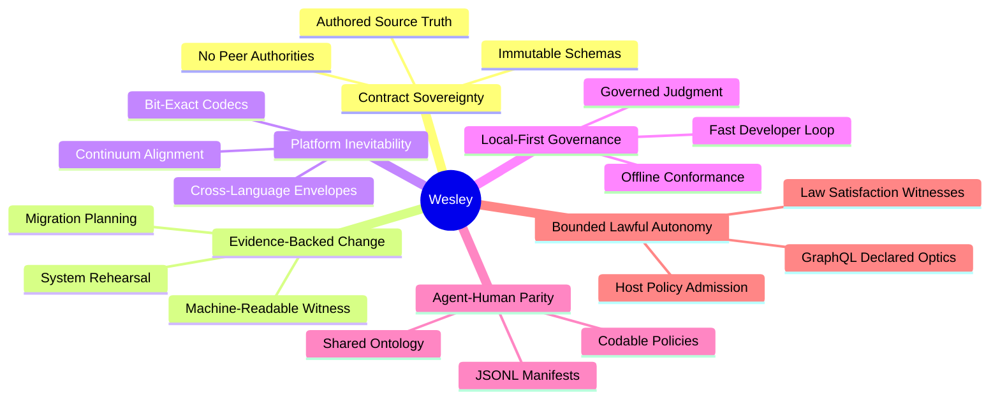

# VISION

<!-- docs-truth: status=experimental owner=@flyingrobots -->

Wesley is a schema-first compiler for trustworthy change where contract truth
and implementation evidence are unified.

The long-term north star is
[bounded, lawful autonomy](./NORTHSTAR.md): agents and applications declare the
GraphQL optic they need, Wesley compiles that declaration into a typed and
inspectable contract artifact, and runtimes such as Echo admit, obstruct,
schedule, witness, and replay it under explicit law.

## Core Tenets

### 1. Source Sovereignty

The authored schema (GraphQL SDL) is the system of record. Every derived
artifact, whether SQL, Rust, TypeScript, or JSON, is a projection of this truth.
We never reconcile; we regenerate.

### 2. Evidence Truth

Change is not a guess; it is a proof. Commands like `plan` and `rehearse`
produce machine-readable evidence that a proposed transformation is safe and
lawful before it is committed.

### 3. Bit-Exact Inevitability

Cross-language interoperability is an inherent property of the compiler. Wesley
generates bit-exact codecs and IR envelopes to ensure that Echo, `git-warp`,
and `warp-ttd` compute the same final state given the same binary contract.

### 4. Governed Judgment

Judgment should be honest about the strength of its evidence. Wesley produces
witnesses that explicitly link a conformance claim to the rerunnable tests and
fixtures that prove it.

### 5. Local-First Integrity

The compiler is an industrial instrument for the local workstation. Contract
verification happens in the developer's inner loop, ensuring that "Trustworthy
Change" is a first-class citizen of every cycle.

### 6. Bounded Lawful Autonomy

Wesley should empower agents without granting ambient authority. An agent can
propose a bounded GraphQL operation that names its basis, aperture, footprint,
variables, result shape, support obligations, and law hooks. Wesley compiles the
claim; host policy and runtimes decide whether it is admitted, obstructed, or
left unknown.

### 7. Law Satisfaction Witnesses

Law is not real just because it is declared. Wesley must preserve and compile
law claims so a runtime or verifier can emit evidence-bearing witnesses that a
law was satisfied, obstructed, or unknown under a specific basis and support
set.

---

**The goal is not more code generation. It is the geometric lawfulness of the
shared contract as a professional application bedrock.**
