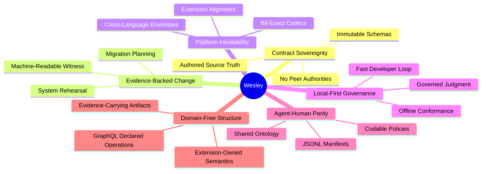

# VISION

<!-- docs-truth: status=experimental owner=@flyingrobots -->

Wesley is a schema-first compiler for trustworthy change where contract truth
and implementation evidence are unified.

The long-term north star is [domain-free structure](./NORTHSTAR.md): Wesley
extracts GraphQL structure into deterministic IR and evidence, then external
extensions decide what that structure means in their domains.

## Core Tenets

### 1. Source Sovereignty

The authored schema (GraphQL SDL) is the system of record. Every derived
artifact, whether SQL, Rust, TypeScript, or JSON, is a projection of this truth.
We never reconcile; we regenerate.

### 2. Evidence Truth

Change is not a guess; it is a proof. Commands like `plan` and `rehearse`
produce machine-readable evidence that a proposed transformation is safe and
lawful before it is committed.

### 3. Bit-Exact Inevitability

Cross-language interoperability is an inherent property of the compiler. Wesley
generates bit-exact codecs and IR envelopes so consumers can share one
deterministic contract without making any one consumer the core authority.

### 4. Governed Judgment

Judgment should be honest about the strength of its evidence. Wesley produces
witnesses that explicitly link a conformance claim to the rerunnable tests and
fixtures that prove it.

### 5. Local-First Integrity

The compiler is an industrial instrument for the local workstation. Contract
verification happens in the developer's inner loop, ensuring that "Trustworthy
Change" is a first-class citizen of every cycle.

### 6. Domain-Free Extension

Wesley should empower extensions without granting ambient authority. A consumer
can provide GraphQL SDL, operation documents, and directives; Wesley compiles
structure and evidence. External targets decide admission, execution, and
runtime policy.

### 7. Law Satisfaction Witnesses

Law is not real just because it is declared. Wesley preserves and compiles law
claims so an external runtime or verifier can emit evidence-bearing witnesses
under its own policy.

---

**The goal is not more code generation. It is one deterministic structural
contract that many domain owners can safely extend.**
