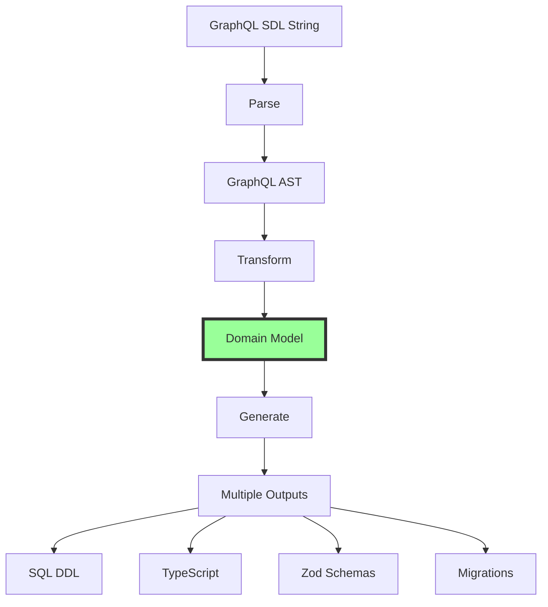
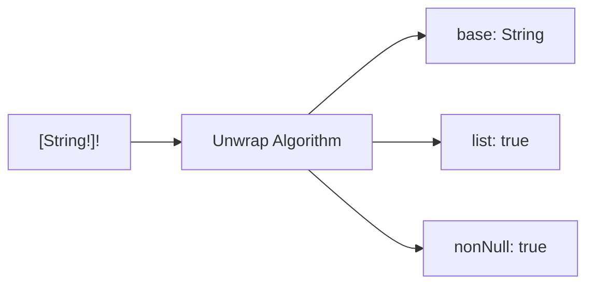
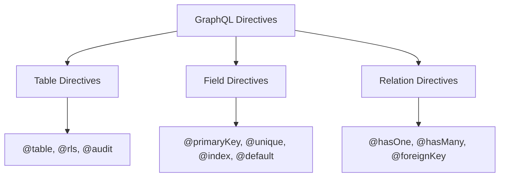
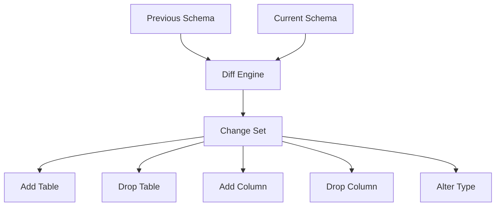

# The Wesley Algorithm: GraphQL → Everything

## Core Algorithm Overview

The Wesley algorithm transforms a GraphQL schema into multiple target formats through a series of well-defined steps:



## Step 1: Parsing GraphQL SDL

### Input
```graphql
type User @table {
  id: ID! @primaryKey @default(expr: "gen_random_uuid()")
  email: String! @unique @index
  posts: [Post!]! @hasMany
}
```

### Algorithm
```javascript
function parseSDL(sdl) {
  // 1. Tokenize the SDL
  const tokens = tokenize(sdl);
  
  // 2. Build AST using GraphQL parser
  const ast = parse(sdl);
  
  // 3. Visit nodes and extract semantic information
  const schema = { tables: {} };
  
  visit(ast, {
    ObjectTypeDefinition(node) {
      if (hasDirective(node, 'table')) {
        schema.tables[node.name] = extractTable(node);
      }
    }
  });
  
  return schema;
}
```

### Output (Internal Representation)
```javascript
{
  tables: {
    User: {
      name: 'User',
      directives: { '@table': {} },
      fields: {
        id: {
          name: 'id',
          type: 'ID',
          nonNull: true,
          directives: {
            '@primaryKey': {},
            '@default': { expr: 'gen_random_uuid()' }
          }
        },
        email: {
          name: 'email',
          type: 'String',
          nonNull: true,
          directives: {
            '@unique': {},
            '@index': {}
          }
        },
        posts: {
          name: 'posts',
          type: 'Post',
          list: true,
          nonNull: true,
          directives: {
            '@hasMany': {}
          }
        }
      }
    }
  }
}
```

## Step 2: Type Unwrapping

GraphQL types can be nested (lists, non-nulls). Wesley unwraps them:



### Unwrapping Algorithm
```javascript
function unwrapType(type) {
  let base = '';
  let nonNull = false;
  let list = false;
  let current = type;
  
  // Outer non-null (applies to list)
  if (current.kind === 'NON_NULL_TYPE') {
    nonNull = true;
    current = current.type;
  }
  
  // List type
  if (current.kind === 'LIST_TYPE') {
    list = true;
    current = current.type;
  }
  
  // Inner non-null (applies to list items)
  if (current.kind === 'NON_NULL_TYPE') {
    nonNull = true;
    current = current.type;
  }
  
  // Base type
  base = current.name.value;
  
  return { base, nonNull, list };
}
```

## Step 3: Directive Processing

Directives encode database semantics. Wesley processes them into actionable metadata:

### Directive Types



### Processing Algorithm
```javascript
function processDirectives(node) {
  const directives = {};
  
  for (const directive of node.directives || []) {
    const name = `@${directive.name.value}`;
    const args = {};
    
    // Extract directive arguments
    for (const arg of directive.arguments || []) {
      args[arg.name.value] = extractValue(arg.value);
    }
    
    directives[name] = args;
  }
  
  return directives;
}

function extractValue(valueNode) {
  switch (valueNode.kind) {
    case 'StringValue':
      return valueNode.value;
    case 'IntValue':
      return parseInt(valueNode.value);
    case 'BooleanValue':
      return valueNode.value;
    case 'EnumValue':
      return valueNode.value;
    default:
      return null;
  }
}
```

## Step 4: SQL Generation

### Type Mapping Algorithm

```javascript
const TYPE_MAPPINGS = {
  // Scalar mappings
  'ID': 'uuid',
  'String': 'text',
  'Int': 'integer',
  'Float': 'double precision',
  'Boolean': 'boolean',
  'DateTime': 'timestamptz',
  
  // Custom scalar mappings (extensible)
  'JSON': 'jsonb',
  'UUID': 'uuid',
  'Date': 'date',
  'Time': 'time',
  'Decimal': 'decimal'
};

function mapToSQLType(field) {
  const baseType = TYPE_MAPPINGS[field.type] || 'text';
  return field.nonNull ? `${baseType} NOT NULL` : baseType;
}
```

### Table Generation Algorithm

```javascript
function generateTable(table) {
  const columns = [];
  const constraints = [];
  const indexes = [];
  
  for (const field of Object.values(table.fields)) {
    // Skip virtual fields (relations)
    if (field.directives['@hasOne'] || 
        field.directives['@hasMany'] || 
        field.list) {
      continue;
    }
    
    // Generate column definition
    let column = `"${field.name}" ${mapToSQLType(field)}`;
    
    // Add default value
    if (field.directives['@default']) {
      const expr = field.directives['@default'].expr;
      column += ` DEFAULT ${expr}`;
    }
    
    columns.push(column);
    
    // Generate constraints
    if (field.directives['@primaryKey']) {
      constraints.push(`PRIMARY KEY ("${field.name}")`);
    }
    
    if (field.directives['@unique']) {
      constraints.push(`UNIQUE ("${field.name}")`);
    }
    
    if (field.directives['@foreignKey']) {
      const ref = field.directives['@foreignKey'].ref;
      const [refTable, refColumn] = ref.split('.');
      constraints.push(
        `FOREIGN KEY ("${field.name}") ` +
        `REFERENCES "${refTable}"("${refColumn || 'id'}") ` +
        `ON DELETE NO ACTION`
      );
    }
    
    // Generate indexes
    if (field.directives['@index']) {
      indexes.push(
        `CREATE INDEX IF NOT EXISTS ` +
        `"${table.name}_${field.name}_idx" ` +
        `ON "${table.name}" ("${field.name}");`
      );
    }
  }
  
  // Combine into CREATE TABLE statement
  const createTable = 
    `CREATE TABLE IF NOT EXISTS "${table.name}" (\n` +
    `  ${[...columns, ...constraints].join(',\n  ')}\n` +
    `);`;
  
  return [createTable, ...indexes].join('\n\n');
}
```

## Step 5: TypeScript Generation

### Type Generation Algorithm

```javascript
function generateTypeScript(schema) {
  const types = [];
  
  for (const table of Object.values(schema.tables)) {
    const fields = [];
    
    for (const field of Object.values(table.fields)) {
      const tsType = mapToTypeScriptType(field);
      const optional = !field.nonNull ? '?' : '';
      fields.push(`  ${field.name}${optional}: ${tsType};`);
    }
    
    types.push(
      `export interface ${table.name} {\n` +
      fields.join('\n') +
      `\n}`
    );
  }
  
  return types.join('\n\n');
}

function mapToTypeScriptType(field) {
  const typeMap = {
    'ID': 'string',
    'String': 'string',
    'Int': 'number',
    'Float': 'number',
    'Boolean': 'boolean',
    'DateTime': 'Date'
  };
  
  let type = typeMap[field.type] || 'unknown';
  
  if (field.list) {
    type = `${type}[]`;
  }
  
  return type;
}
```

## Step 6: Migration Diff Algorithm

### Schema Comparison



### Diff Algorithm

```javascript
function diffSchemas(previous, current) {
  const changes = [];
  
  // Find added tables
  for (const tableName in current.tables) {
    if (!previous.tables[tableName]) {
      changes.push({
        type: 'CREATE_TABLE',
        table: current.tables[tableName]
      });
      continue;
    }
    
    // Compare fields in existing tables
    const prevTable = previous.tables[tableName];
    const currTable = current.tables[tableName];
    
    // Find added fields
    for (const fieldName in currTable.fields) {
      if (!prevTable.fields[fieldName]) {
        changes.push({
          type: 'ADD_COLUMN',
          table: tableName,
          field: currTable.fields[fieldName]
        });
      } else {
        // Check for type changes
        const prevField = prevTable.fields[fieldName];
        const currField = currTable.fields[fieldName];
        
        if (prevField.type !== currField.type ||
            prevField.nonNull !== currField.nonNull) {
          changes.push({
            type: 'ALTER_COLUMN',
            table: tableName,
            field: fieldName,
            from: prevField,
            to: currField
          });
        }
      }
    }
    
    // Find removed fields
    for (const fieldName in prevTable.fields) {
      if (!currTable.fields[fieldName]) {
        changes.push({
          type: 'DROP_COLUMN',
          table: tableName,
          field: fieldName
        });
      }
    }
  }
  
  // Find removed tables
  for (const tableName in previous.tables) {
    if (!current.tables[tableName]) {
      changes.push({
        type: 'DROP_TABLE',
        table: tableName
      });
    }
  }
  
  return changes;
}
```

### Migration SQL Generation

```javascript
function generateMigrationSQL(changes) {
  const statements = [];
  
  for (const change of changes) {
    switch (change.type) {
      case 'CREATE_TABLE':
        // Generate full CREATE TABLE
        statements.push(generateTable(change.table));
        break;
        
      case 'DROP_TABLE':
        statements.push(
          `DROP TABLE IF EXISTS "${change.table}";`
        );
        break;
        
      case 'ADD_COLUMN':
        const sqlType = mapToSQLType(change.field);
        statements.push(
          `ALTER TABLE "${change.table}" ` +
          `ADD COLUMN "${change.field.name}" ${sqlType};`
        );
        break;
        
      case 'DROP_COLUMN':
        statements.push(
          `ALTER TABLE "${change.table}" ` +
          `DROP COLUMN "${change.field}";`
        );
        break;
        
      case 'ALTER_COLUMN':
        const newType = mapToSQLType(change.to);
        statements.push(
          `ALTER TABLE "${change.table}" ` +
          `ALTER COLUMN "${change.field}" TYPE ${newType};`
        );
        
        // Handle nullability changes
        if (change.to.nonNull && !change.from.nonNull) {
          statements.push(
            `ALTER TABLE "${change.table}" ` +
            `ALTER COLUMN "${change.field}" SET NOT NULL;`
          );
        } else if (!change.to.nonNull && change.from.nonNull) {
          statements.push(
            `ALTER TABLE "${change.table}" ` +
            `ALTER COLUMN "${change.field}" DROP NOT NULL;`
          );
        }
        break;
    }
  }
  
  return statements.join('\n\n');
}
```

## Step 7: Zod Schema Generation

### Zod Generation Algorithm

```javascript
function generateZodSchemas(schema) {
  const schemas = [];
  
  for (const table of Object.values(schema.tables)) {
    const fields = [];
    
    for (const field of Object.values(table.fields)) {
      // Skip virtual fields
      if (field.directives['@hasOne'] || 
          field.directives['@hasMany']) {
        continue;
      }
      
      let zodType = mapToZodType(field);
      
      // Apply validators from directives
      if (field.directives['@email']) {
        zodType += '.email()';
      }
      if (field.directives['@min']) {
        zodType += `.min(${field.directives['@min'].value})`;
      }
      if (field.directives['@max']) {
        zodType += `.max(${field.directives['@max'].value})`;
      }
      
      // Handle optionality
      if (!field.nonNull) {
        zodType += '.optional()';
      }
      
      fields.push(`  ${field.name}: ${zodType}`);
    }
    
    schemas.push(
      `export const ${table.name}Schema = z.object({\n` +
      fields.join(',\n') +
      `\n});`
    );
    
    // Generate TypeScript type from Zod
    schemas.push(
      `export type ${table.name} = z.infer<typeof ${table.name}Schema>;`
    );
  }
  
  return 'import { z } from "zod";\n\n' + schemas.join('\n\n');
}

function mapToZodType(field) {
  const zodMap = {
    'ID': 'z.string().uuid()',
    'String': 'z.string()',
    'Int': 'z.number().int()',
    'Float': 'z.number()',
    'Boolean': 'z.boolean()',
    'DateTime': 'z.date()'
  };
  
  let type = zodMap[field.type] || 'z.unknown()';
  
  if (field.list) {
    type = `z.array(${type})`;
  }
  
  return type;
}
```

## Step 8: Optimization Passes

### Dead Field Elimination

Remove fields that are never used:

```javascript
function eliminateDeadFields(schema, usageAnalysis) {
  const optimized = { ...schema };
  
  for (const table of Object.values(optimized.tables)) {
    for (const field of Object.values(table.fields)) {
      if (!usageAnalysis.isUsed(table.name, field.name)) {
        delete table.fields[field.name];
      }
    }
  }
  
  return optimized;
}
```

### Index Optimization

Suggest indexes based on foreign keys and common queries:

```javascript
function optimizeIndexes(schema) {
  const suggestions = [];
  
  for (const table of Object.values(schema.tables)) {
    for (const field of Object.values(table.fields)) {
      // Foreign keys should always be indexed
      if (field.directives['@foreignKey'] && 
          !field.directives['@index']) {
        suggestions.push({
          table: table.name,
          field: field.name,
          reason: 'Foreign key without index'
        });
      }
      
      // Unique fields benefit from indexes
      if (field.directives['@unique'] && 
          !field.directives['@index']) {
        suggestions.push({
          table: table.name,
          field: field.name,
          reason: 'Unique constraint benefits from index'
        });
      }
    }
  }
  
  return suggestions;
}
```

## Performance Characteristics

### Time Complexity

| Operation | Complexity | Notes |
|-----------|------------|-------|
| Parse SDL | O(n) | Linear in SDL size |
| Generate SQL | O(t × f) | Tables × fields |
| Diff Schemas | O(t × f) | Compare all fields |
| Generate Types | O(t × f) | All fields processed |

### Space Complexity

| Structure | Complexity | Notes |
|-----------|------------|-------|
| AST | O(n) | Proportional to SDL |
| Domain Model | O(t × f) | Compact representation |
| Generated Code | O(t × f × g) | Generators × output |

## Algorithm Extensibility

### Adding New Generators

The algorithm is designed to be extensible:

```javascript
class GeneratorPipeline {
  constructor() {
    this.generators = new Map();
  }
  
  register(name, generator) {
    this.generators.set(name, generator);
  }
  
  async generate(schema, targets) {
    const results = {};
    
    for (const target of targets) {
      const generator = this.generators.get(target);
      if (generator) {
        results[target] = await generator.generate(schema);
      }
    }
    
    return results;
  }
}

// Register generators
pipeline.register('sql', new SQLGenerator());
pipeline.register('typescript', new TypeScriptGenerator());
pipeline.register('python', new PythonGenerator());
pipeline.register('rust', new RustGenerator());
```

### Adding New Directives

Directives are processed through a plugin system:

```javascript
class DirectiveProcessor {
  constructor() {
    this.processors = new Map();
  }
  
  register(directive, processor) {
    this.processors.set(directive, processor);
  }
  
  process(field, directives) {
    const results = {};
    
    for (const [name, args] of Object.entries(directives)) {
      const processor = this.processors.get(name);
      if (processor) {
        results[name] = processor.process(field, args);
      }
    }
    
    return results;
  }
}

// Register directive processors
processor.register('@computed', new ComputedFieldProcessor());
processor.register('@deprecated', new DeprecationProcessor());
processor.register('@auth', new AuthorizationProcessor());
```

## Conclusion

The Wesley algorithm is:

1. **Simple**: Each step has a clear purpose
2. **Composable**: Steps can be combined differently
3. **Extensible**: New generators and directives plug in easily
4. **Efficient**: Linear time complexity for most operations
5. **Deterministic**: Same input always produces same output

The beauty of the algorithm is that it mirrors how developers think: start with the domain model (GraphQL), then derive the implementation details (SQL, types, etc.). This is the inverse of traditional approaches and the key to Wesley's power.