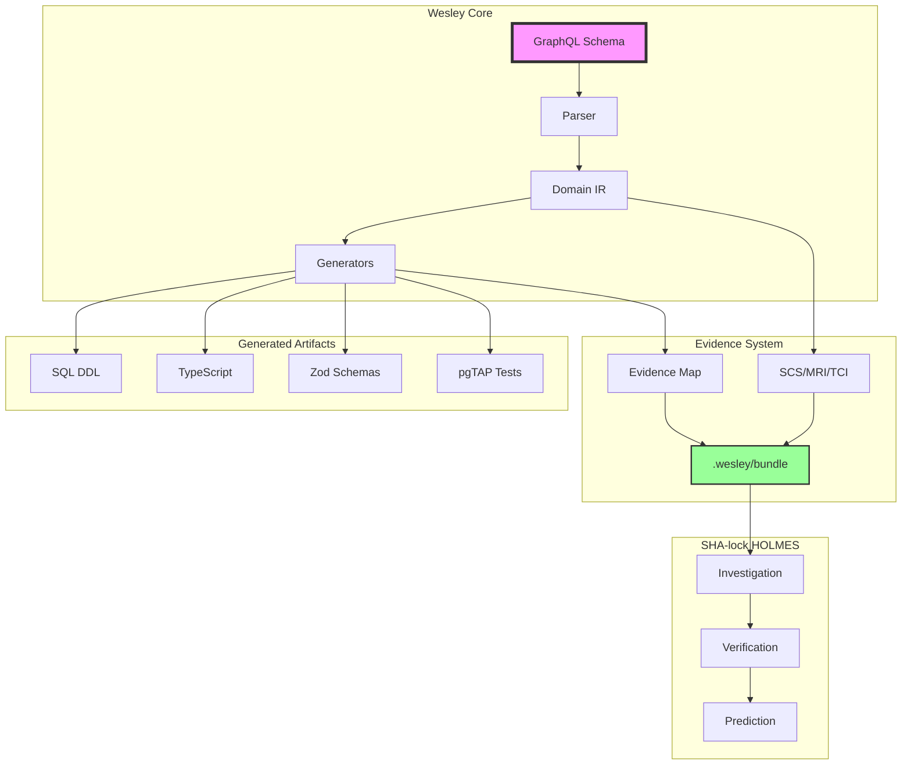

# Wesley + SHA-lock HOLMES Integration

## The Schema Intelligence System

Wesley generates code from GraphQL. SHA-lock HOLMES proves it's correct, WATSON verifies it independently, and MORIARTY predicts when it's production-ready.

**HOLMES is a separate sidecar package** (`@wesley/holmes`) that consumes Wesley's evidence bundle without bloating the core.



## New Directives

Wesley now supports intelligent directives that enable HOLMES analysis:

### Identity Directives

```graphql
directive @uid(value: String!) on OBJECT | FIELD_DEFINITION

type User @table @uid("tbl:user") {
  id: ID! @primaryKey @uid("col:user.id")
  email: String! @unique @uid("col:user.email")
}
```

**Purpose**: Stable identities that survive renames. HOLMES uses these to track elements across commits.

### Weight & Criticality Directives

```graphql
directive @weight(value: Int! = 5) on OBJECT | FIELD_DEFINITION
directive @critical on OBJECT | FIELD_DEFINITION
directive @sensitive on FIELD_DEFINITION
directive @pii on FIELD_DEFINITION

type User @table @critical {
  id: ID! @primaryKey
  email: String! @pii @weight(8)
  password: String! @sensitive @weight(10)
  theme: String @weight(2)  # Low priority UI preference
}
```

**Purpose**: Not all fields are equal. Critical auth fields matter more than UI preferences.

### Default Weights

| Directive/Type | Default Weight | Rationale |
|----------------|----------------|-----------|
| `@critical` | 10 | Mission-critical functionality |
| `@primaryKey` | 10 | Core identity field |
| `@sensitive` | 9 | Security-critical |
| `@foreignKey` | 8 | Relationship integrity |
| `@unique` | 8 | Business constraint |
| `@pii` | 8 | Privacy compliance |
| `@index` | 5 | Performance optimization |
| Default field | 3 | Standard field |

## The Evidence Map

Every `wesley generate` now produces `.wesley/evidence-map.json`:

```json
{
  "sha": "abc123def456",
  "timestamp": "2024-03-20T10:30:00Z",
  "evidence": {
    "col:user.email": {
      "sql": [{
        "file": "out/schema.sql",
        "lines": "42-49",
        "sha": "abc123d",
        "timestamp": "2024-03-20T10:30:00Z"
      }],
      "ts": [{
        "file": "out/types/User.d.ts",
        "lines": "5-10",
        "sha": "abc123d"
      }],
      "zod": [{
        "file": "out/zod/user.ts",
        "lines": "9-15",
        "sha": "abc123d"
      }],
      "tests": [{
        "file": "tests/schema/constraints.sql",
        "lines": "70-90",
        "sha": "abc123d"
      }]
    }
  }
}
```

**Purpose**: HOLMES can cite `file:lines@sha` without brittle grep. Every claim is SHA-locked.

## The Scoring System

Wesley calculates three scores:

### SCS - Schema Coverage Score

**Formula**: `Σ(weight × present) / Σ(weight)`

- Measures: Did artifacts exist for each schema element?
- Range: 0-1 (0% to 100%)
- Threshold: 0.8 (80%) recommended

Example:
```javascript
// High-weight critical field missing TypeScript type
User.password: weight=10, sql=✓, ts=✗, zod=✓ → 66% coverage
User.theme:    weight=2,  sql=✓, ts=✓, zod=✓ → 100% coverage

// Weighted average favors critical field
SCS = (10 × 0.66 + 2 × 1.0) / 12 = 0.72 (72%)
```

### MRI - Migration Risk Index

**Formula**: Risk points normalized to 0-1

| Operation | Risk Points | Reason |
|-----------|-------------|--------|
| DROP TABLE | 40 | Data loss |
| DROP COLUMN | 25 | Data loss |
| ALTER TYPE (unsafe) | 30 | May fail |
| ADD NOT NULL (no default) | 25 | Requires backfill |
| RENAME (no @uid) | 10 | Breaks references |
| CREATE INDEX (blocking) | 10 | Performance impact |

Example:
```sql
-- Migration with MRI = 0.55 (55% risk)
DROP COLUMN users.old_field;     -- +25
ALTER COLUMN posts.count TYPE bigint; -- +30 (unsafe)
-- Total: 55 points → 0.55 MRI
```

### TCI - Test Confidence Index

**Weighted formula**:
- Structure tests: 20%
- Constraint tests: 45% (weighted by field importance)
- Migration tests: 25%
- Performance tests: 10%

Example:
```
Structure:    15/15 tables tested = 100% × 0.20 = 0.20
Constraints:  23/25 tested = 92% × 0.45 = 0.41
Migrations:   8/10 tested = 80% × 0.25 = 0.20
Performance:  1/5 indexes = 20% × 0.10 = 0.02
TCI = 0.83 (83%)
```

## The Truth Bundle

Every `wesley generate` creates `.wesley/` bundle:

```
.wesley/
├── schema.ast.json       # Normalized AST (sorted)
├── schema.ir.json        # Wesley domain IR
├── artifacts.json        # {artifact: [files]} with hashes
├── evidence-map.json     # Element → file:lines@sha
├── snapshot.json         # Previous IR for diffs
├── scores.json          # SCS/MRI/TCI scores
└── history.json         # Score history for predictions
```

## Package Architecture

Wesley and HOLMES are separate packages:

```
@wesley/core        # Pure domain logic, zero dependencies
@wesley/host-node   # Platform adapters (fs, graphql parser)
@wesley/cli         # Main CLI for generation
@wesley/holmes      # Sidecar intelligence package
```

## Commands

### Wesley (Main Generator)
```bash
# Generate with evidence tracking
wesley generate --schema schema.graphql --emit-bundle

# Run tests
wesley test
```

### HOLMES (Sidecar Intelligence)
```bash
# Install separately
npm install -g @wesley/holmes

# Run investigation
holmes investigate

# Emit machine-readable JSON alongside markdown
holmes investigate --json holmes-report.json > holmes-report.md

# WATSON verification
holmes verify --json watson-report.json > watson-report.md

# MORIARTY predictions
holmes predict --json moriarty-report.json > moriarty-report.md

# Combined report
holmes report --json holmes-suite.json > holmes-suite.md

# All commands accept --json <path> to persist structured output
```

The JSON documents contain the same information rendered in the markdown (investigation metadata, evidence tables, verification stats, velocity analysis, etc.) and are ideal for downstream automation.

## CI/CD Integration

```yaml
name: Wesley + SHA-lock HOLMES

on: [push, pull_request]

jobs:
  wesley-generate:
    steps:
      - run: wesley generate --schema schema.graphql --emit-bundle
      
  holmes-investigate:
    needs: wesley-generate
    steps:
      - uses: ./.github/actions/holmes-setup
      - run: |
          holmes investigate \
            --json holmes-report.json > holmes-report.md
      - uses: actions/upload-artifact@v4
        with:
          name: holmes-report
          path: |
            holmes-report.md
            holmes-report.json

  watson-verify:
    needs: holmes-investigate
    steps:
      - uses: ./.github/actions/holmes-setup
      - run: |
          holmes verify \
            --json watson-report.json > watson-report.md
      - uses: actions/upload-artifact@v4
        with:
          name: watson-report
          path: |
            watson-report.md
            watson-report.json

  moriarty-predict:
    needs: watson-verify
    steps:
      - uses: ./.github/actions/holmes-setup
      - run: |
          holmes predict \
            --json moriarty-report.json > moriarty-report.md
      - uses: actions/upload-artifact@v4
        with:
          name: moriarty-report
          path: |
            moriarty-report.md
            moriarty-report.json

  comment-reports:
    needs: [holmes-investigate, watson-verify, moriarty-predict]
    steps:
      - uses: actions/download-artifact@v4
        with:
          merge-multiple: true
          path: reports
      - name: Post summary comment
        run: node .github/scripts/holmes-comment.mjs # combines markdown sections
```

## Report Validation & Dashboard

- **End-to-end integration test** – `test/holmes-e2e.bats` runs the full suite (`wesley generate --emit-bundle` → `holmes investigate/verify/predict`) and asserts that both Markdown and JSON artifacts exist with the expected keys (SCS/TCI/MRI, verdicts, velocity metrics). The test fails loudly if any file is missing, so HOLMES regressions surface immediately during local Bats runs or in the CLI workflows.
- **JSON schema validation** – `@wesley/holmes` ships lightweight runtime schemas (`packages/wesley-holmes/src/report-schemas.mjs`) with targeted node tests. The CLI validates each report against the schema before emitting JSON, which prevents malformed artifacts from leaking into CI.
- **Static dashboard artifact** – The HOLMES workflow now assembles a `holmes-dashboard` artifact containing `docs/holmes-dashboard/index.html` plus the suite JSON. Open the HTML locally (or host via GitHub Pages) to visualize recent SCS/TCI/MRI history, MORIARTY velocity/ETA, and verdict summaries without needing additional tooling.

The GitHub comment highlights the markdown narratives and links directly to the JSON artifacts so other workflows (or local tooling) can consume structured results without scraping text.

## Machine-Readable Reports

- `holmes-report.json` – investigation summary, weighted evidence table, gate results, verdict metadata
- `watson-report.json` – citation verification counts, recalculated SCS, inconsistencies, opinion verdict
- `moriarty-report.json` – latest score snapshot, blended velocity, optional ETA windows, detected patterns, recent history

These files live under the HOLMES workflow artifacts (flat files, no subdirectories) and mirror the markdown comment content. The combined `holmes report --json holmes-suite.json` command is convenient for local dashboards.

## History Hydration & Caching

- Each `wesley generate --emit-bundle` appends a point to `.wesley/history.json` (day, timestamp, SCS/TCI/MRI).
- When MORIARTY runs in CI, the CLI merges local history, the merge-base snapshot (`git show <merge-base>:.wesley/history.json`), and a GitHub Actions cache keyed by commit SHA (with branch/base fallbacks). This gives predictions continuity across branch reruns.

## Customising Weighting

HOLMES inspects environment variables at runtime:

| Variable | Purpose |
|----------|---------|
| `WESLEY_HOLMES_WEIGHTS` | JSON string mapping substrings → weights, e.g. `{"password":12,"default":4}` |
| `WESLEY_HOLMES_WEIGHT_FILE` | Path to a JSON file with the same structure |

If neither is provided HOLMES uses the defaults listed earlier. This allows teams to tune SCS weights without forking the core.

## Security Gates

Wesley + HOLMES enforces security automatically:

### Sensitive Field Gate
```graphql
password: String! @sensitive
```
❌ **BLOCKS** if no hash constraint in SQL:
```sql
-- Required constraint
CHECK (char_length(password_hash) = 60)  -- bcrypt
```

### PII Field Gate
```graphql
email: String! @pii
```
⚠️ **WARNS** if no RLS masking policy

### RLS Coverage Gate
```graphql
type Post @table @rls
```
❌ **BLOCKS** if RLS enabled but policies missing for used operations

## Example Investigation Output

```markdown
## 🔍 SHA-lock HOLMES Investigation

**Weighted Completion**: ████████░░ 84% (156/185 weighted points)
**Verification Status**: 47/47 claims independently verified
**Ship Verdict**: ELEMENTARY

| Feature | Weight | Status | Evidence | Deduction |
|---------|--------|--------|----------|-----------|
| User.password | 10 | ✅ | `schema.sql:45@abc123d` | "Properly hashed!" |
| User.email | 8 | ✅ | `schema.sql:42@abc123d` | "Unique as required" |
| Post.content | 5 | ⚠️ | Missing Zod validation | "Minor oversight" |
| User.theme | 2 | ✅ | `types.ts:8@abc123d` | "Low priority complete" |

## 📊 Scores

- **SCS**: 0.84 (84%) ✅ Threshold: 80%
- **MRI**: 0.23 (23%) ✅ Threshold: ≤40%
- **TCI**: 0.71 (71%) ✅ Threshold: 70%

## 🔮 Prediction

Based on velocity of 3.2%/day:
- **ETA**: 5 days (March 25, 2024)
- **Confidence**: 87%
```

## Benefits

1. **Weighted Priorities**: Critical fields matter more than cosmetic ones
2. **SHA-Locked Evidence**: Every citation tied to commit SHA
3. **Independent Verification**: WATSON double-checks HOLMES
4. **Risk Assessment**: Know migration danger before production
5. **Predictive ETAs**: Data-driven completion estimates
6. **Automatic Security**: Sensitive fields enforced

## The Revolution Continues

Wesley generates the code. HOLMES proves it's correct. WATSON verifies independently. MORIARTY predicts readiness.

**One schema. Complete intelligence.**
