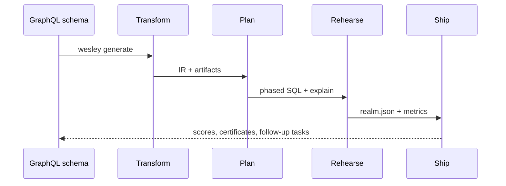

# Wesley Delivery Lifecycle

Wesley’s tooling still revolves around the heartbeat we built for the MVP: **Transform → Plan → Rehearse → Ship**. Each milestone in the roadmap adds capabilities to one or more steps in that ladder.

| Phase     | What happens                                                                                                     | Delivered by                                       |
| --------- | ---------------------------------------------------------------------------------------------------------------- | -------------------------------------------------- |
| Transform | Parse GraphQL SDL to our canonical IR and emit artifacts (SQL, pgTAP, TypeScript/Zod, evidence bundle).          | `wesley-core`, generators, `wesley-host-node`      |
| Plan      | Diff schema changes, produce phased migrations (expand/backfill/validate/switch/contract) with lock annotations. | `wesley-core` planner and CLI `plan` command       |
| Rehearse  | Execute the plan in a controlled environment, capture timings/locks/tests, record verdicts.                      | Shadow REALM tooling (`wesley shadow`, CI harness) |
| Ship      | Aggregate evidence, compute HOLMES scores, gate releases, and archive approvals in SHIPME.                       | HOLMES CLI, evidence schemas                       |

## Sequence diagram

## Why it matters

- The roadmap is grouped by the phase each feature improves (QIR → Transform, REALM → Rehearse, HOLMES → Ship, etc.).
- Preflight checks ensure we never regress on the invariants that keep the lifecycle boring: reproducible artifacts, additive-safe plans, and auditable evidence.
- Demo flows like BLADE are just scripted tours through the four phases.

If you are working on a new feature, spell out which phase it improves when you open an issue or PR—this keeps the roadmap and docs aligned.
