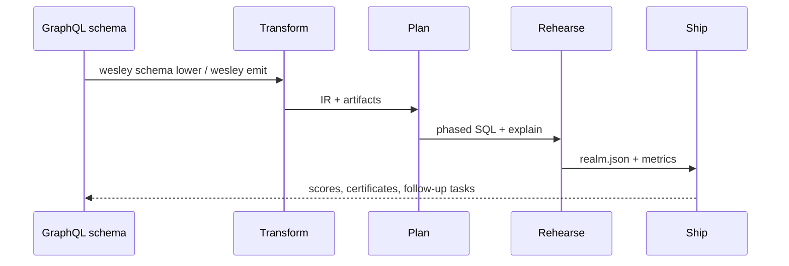

# Wesley Delivery Lifecycle

<!-- docs-truth: status=experimental owner=@flyingrobots -->

Wesley's tooling still revolves around the heartbeat we built for the MVP:
**Transform -> Plan -> Rehearse -> Ship**. Each milestone in the roadmap adds
capabilities to one or more steps in that ladder.

| Phase     | What happens                                                                                                    | Delivered by                                           |
| --------- | --------------------------------------------------------------------------------------------------------------- | ------------------------------------------------------ |
| Transform | Parse GraphQL SDL to canonical Rust IR and emit explicitly selected artifacts.                                  | `crates/wesley-core`, `crates/wesley-cli`, emit crates |
| Plan      | Diff schema changes and produce bounded migration or target plans when a module owns that semantics.            | Rust schema diff today; external modules for domains   |
| Rehearse  | Execute domain-specific plans in controlled environments and capture timings, locks, tests, and verdicts.       | Owning module or product repo                          |
| Ship      | Aggregate evidence, compute HOLMES scores, gate releases, and archive approvals in SHIPME or successor tooling. | HOLMES assurance tooling                               |

## Sequence diagram

```mermaid
sequenceDiagram
    participant Git as GraphQL schema
    participant Transform
    participant Plan
    participant Rehearse
    participant Ship

    Git->>Transform: wesley schema lower / wesley emit
    Transform->>Plan: IR + artifacts
    Plan->>Rehearse: phased SQL + explain
    Rehearse->>Ship: realm.json + metrics
    Ship-->>Git: scores, certificates, follow-up tasks
```

## Why it matters

- The roadmap is grouped by the phase each feature improves (QIR → Transform, REALM → Rehearse, HOLMES → Ship, etc.).
- Preflight checks ensure we never regress on the invariants that keep the lifecycle boring: reproducible artifacts, additive-safe plans, and auditable evidence.
- Demo flows like BLADE are just scripted tours through the four phases.

If you are working on a new feature, spell out which phase it improves when you open an issue or PR—this keeps the roadmap and docs aligned.
