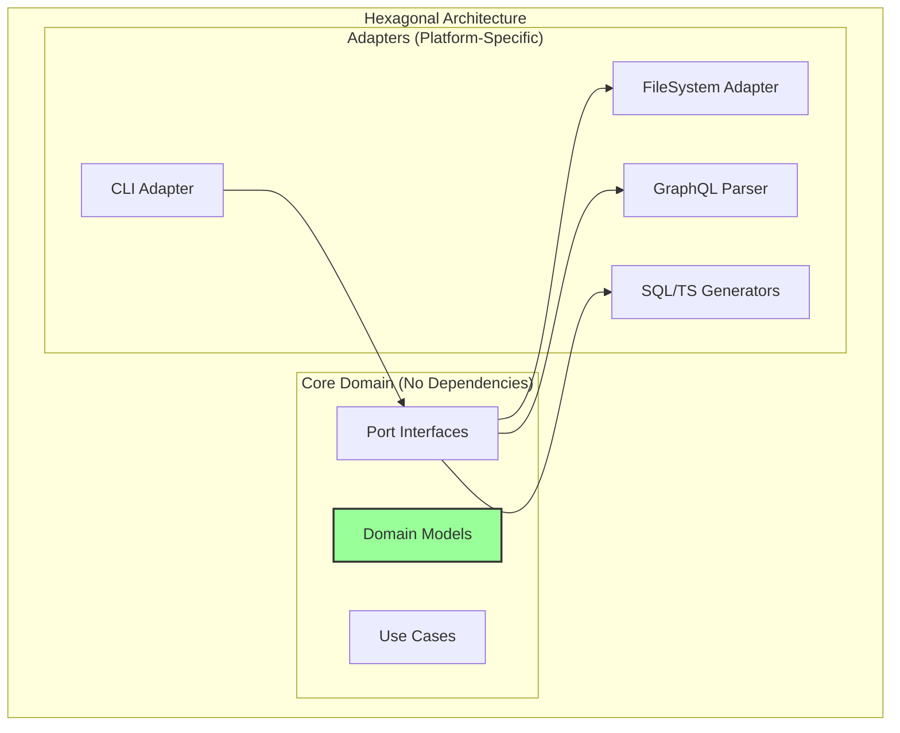
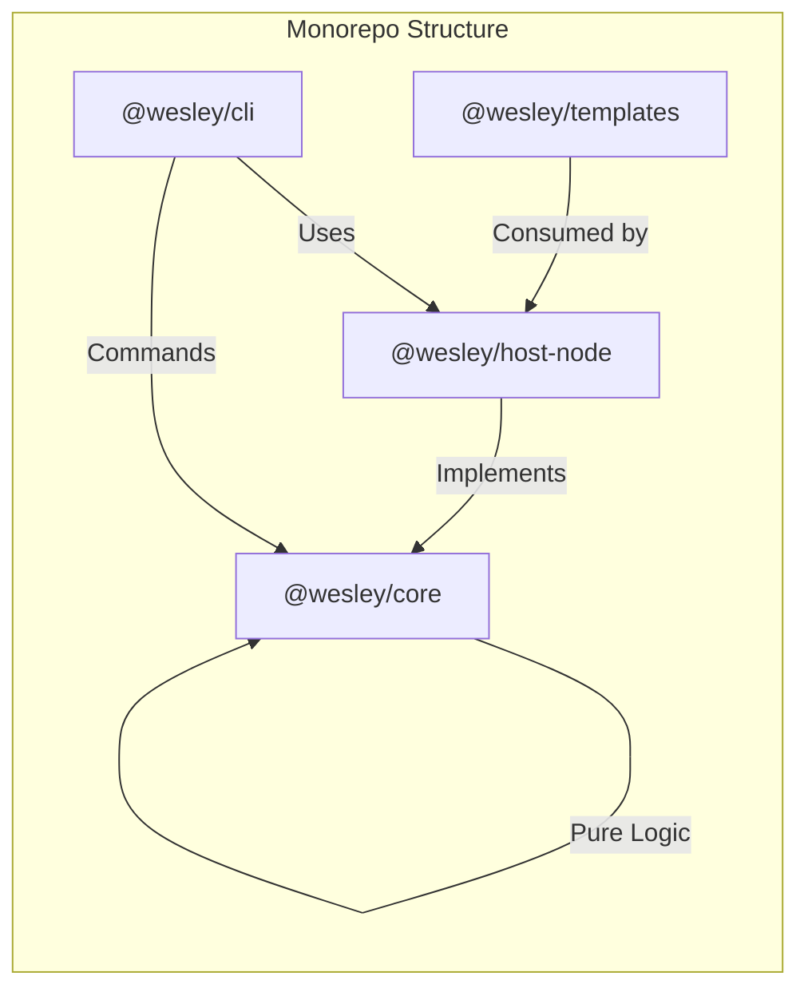
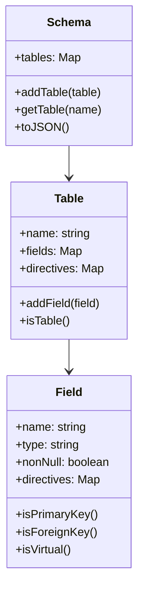
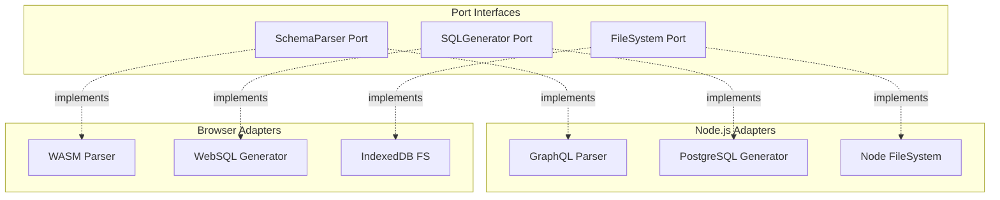
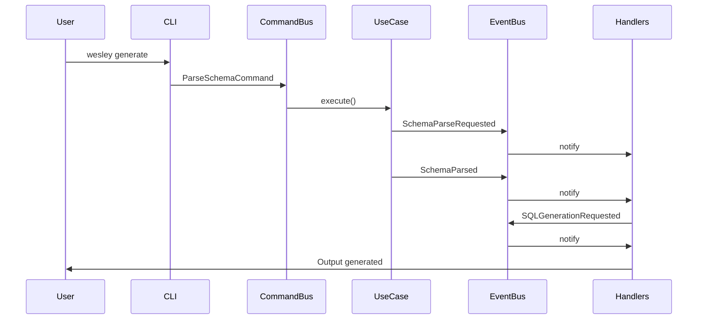
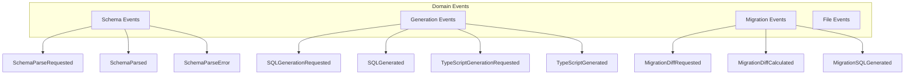
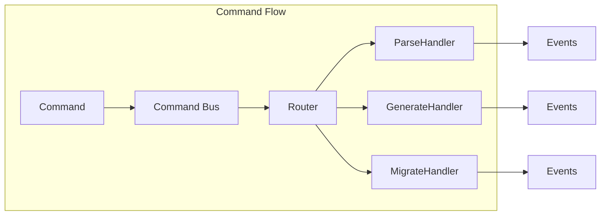
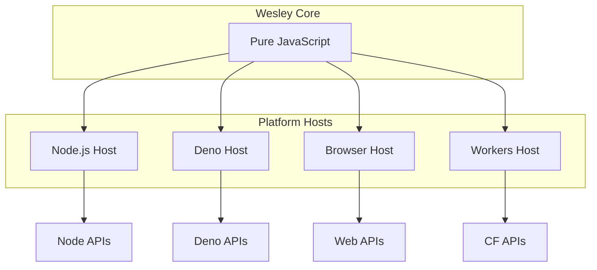

# Wesley Architecture Overview

## Architectural Patterns

Wesley combines three powerful architectural patterns to create a flexible, extensible, and testable system:

1. **Hexagonal Architecture** (Ports & Adapters)
2. **Event-Driven Architecture** (Event Sourcing)
3. **Command Pattern** (CQRS-inspired)



## Package Structure



### Package Responsibilities

| Package | Purpose | Dependencies | Key Concepts |
|---------|---------|--------------|--------------|
| `@wesley/core` | Domain logic, pure functions | None | Models, Events, Commands, Ports |
| `@wesley/host-node` | Node.js implementations | GraphQL, fs, @wesley/core | Adapters, Parsers, Generators |
| `@wesley/cli` | Command-line interface | Commander, @wesley/core, @wesley/host-node | Commands, Event handlers |
| `@wesley/templates` | Code generation templates | None | Handlebars templates, patterns |

## Hexagonal Architecture Deep Dive

### The Core (Domain)

The core contains pure business logic with zero external dependencies:



### The Ports (Interfaces)

Ports define contracts that adapters must implement:

```javascript
// Input Ports (Primary/Driving)
class SchemaParser {
  async parse(sdl) { /* contract */ }
}

class CommandHandler {
  async handle(command) { /* contract */ }
}

// Output Ports (Secondary/Driven)
class SQLGenerator {
  async generate(schema) { /* contract */ }
}

class FileSystem {
  async read(path) { /* contract */ }
  async write(path, content) { /* contract */ }
}
```

### The Adapters (Implementations)

Adapters implement ports for specific platforms:



## Event-Driven Architecture

### Event Flow

Every operation in Wesley emits events that can be observed and handled:



### Event Types



### Event Sourcing Benefits

1. **Audit Trail**: Complete history of all operations
2. **Replay**: Reconstruct state from events
3. **Debugging**: Trace exact event flow
4. **Extensions**: Add handlers without modifying core
5. **Testing**: Assert on emitted events

## Command Pattern

### Command Structure

Commands encapsulate user intentions as objects:

```javascript
class GenerateProjectCommand {
  constructor(schemaPath, outputPath) {
    this.type = 'GENERATE_PROJECT';
    this.payload = { schemaPath, outputPath };
    this.timestamp = new Date().toISOString();
  }
}
```

### Command Bus

The command bus routes commands to appropriate handlers:



### Command Benefits

1. **Decoupling**: Commands separate intent from execution
2. **Queuing**: Commands can be queued, delayed, or batched
3. **Undo/Redo**: Commands can be reversed
4. **Macro Recording**: Sequence of commands = macro
5. **Testing**: Test commands in isolation

## Dependency Injection

Wesley uses constructor injection for all dependencies:

```javascript
// Pure domain use case
class GenerateSQLUseCase {
  constructor(generator) {
    this.generator = generator; // Injected dependency
  }
  
  async execute(schema) {
    const sql = await this.generator.generate(schema);
    return new SQLGenerated(sql, schema);
  }
}

// Composition root
const postgresGenerator = new PostgreSQLGenerator();
const useCase = new GenerateSQLUseCase(postgresGenerator);
```

### Benefits

1. **Testability**: Inject mocks/stubs for testing
2. **Flexibility**: Swap implementations at runtime
3. **Clarity**: Dependencies are explicit
4. **No Magic**: No hidden global state

## Platform Abstraction

### Multi-Platform Support



### Platform-Specific Adapters

Each platform provides its own adapters:

| Platform | FileSystem | Logger | HTTP | Process |
|----------|------------|--------|------|---------|
| Node.js | fs/promises | console | node:http | process |
| Deno | Deno.readFile | console | fetch | Deno.env |
| Browser | IndexedDB | console | fetch | - |
| Workers | KV Store | console | fetch | env |

## Testing Strategy

### Unit Testing (Core)

Pure functions with no dependencies:

```javascript
test('Field identifies as primary key', () => {
  const field = new Field({
    name: 'id',
    type: 'ID',
    directives: { '@primaryKey': {} }
  });
  
  assert(field.isPrimaryKey() === true);
});
```

### Integration Testing (Adapters)

Test adapters against port contracts:

```javascript
test('GraphQLParser implements SchemaParser', async () => {
  const parser = new GraphQLParser();
  const sdl = 'type User @table { id: ID! }';
  const schema = await parser.parse(sdl);
  
  assert(schema instanceof Schema);
  assert(schema.getTable('User'));
});
```

### End-to-End Testing (Commands)

Test complete command flows:

```javascript
test('Generate command produces SQL', async () => {
  const events = [];
  eventBus.subscribe('*', e => events.push(e));
  
  await commandBus.handle(
    new GenerateProjectCommand('./schema.graphql', './out')
  );
  
  assert(events.some(e => e.type === 'SQL_GENERATED'));
});
```

## Performance Considerations

### Lazy Loading

Generators are loaded on-demand:

```javascript
class GeneratorFactory {
  async getGenerator(type) {
    switch(type) {
      case 'postgresql':
        const { PostgreSQLGenerator } = await import('./PostgreSQLGenerator.mjs');
        return new PostgreSQLGenerator();
      case 'mysql':
        const { MySQLGenerator } = await import('./MySQLGenerator.mjs');
        return new MySQLGenerator();
    }
  }
}
```

### Event Batching

Events are batched for performance:

```javascript
class BatchedEventBus {
  constructor(batchSize = 100, flushInterval = 10) {
    this.batch = [];
    this.batchSize = batchSize;
    this.flushInterval = flushInterval;
  }
  
  async publish(event) {
    this.batch.push(event);
    if (this.batch.length >= this.batchSize) {
      await this.flush();
    }
  }
}
```

### Caching

Parse results are cached:

```javascript
class CachedParser {
  constructor(parser) {
    this.parser = parser;
    this.cache = new Map();
  }
  
  async parse(sdl) {
    const hash = crypto.hash(sdl);
    if (this.cache.has(hash)) {
      return this.cache.get(hash);
    }
    
    const result = await this.parser.parse(sdl);
    this.cache.set(hash, result);
    return result;
  }
}
```

## Security Considerations

### Input Validation

All inputs are validated at boundaries:

```javascript
class ValidatedParser {
  async parse(sdl) {
    // Validate input is string
    if (typeof sdl !== 'string') {
      throw new InvalidInputError('SDL must be a string');
    }
    
    // Validate size limits
    if (sdl.length > MAX_SDL_SIZE) {
      throw new InvalidInputError('SDL exceeds size limit');
    }
    
    return await this.parser.parse(sdl);
  }
}
```

### SQL Injection Prevention

Generated SQL uses parameterized queries:

```javascript
class SafeSQLGenerator {
  generateInsert(table, data) {
    const columns = Object.keys(data);
    const placeholders = columns.map((_, i) => `$${i + 1}`);
    
    return {
      sql: `INSERT INTO "${table}" (${columns.join(', ')}) VALUES (${placeholders.join(', ')})`,
      params: Object.values(data)
    };
  }
}
```

## Extensibility

### Adding New Generators

1. Implement the generator port:

```javascript
class MySQLGenerator {
  async generate(schema) {
    // MySQL-specific SQL generation
  }
}
```

2. Register in the factory:

```javascript
factory.register('mysql', MySQLGenerator);
```

3. Use via CLI:

```bash
wesley generate --target mysql
```

### Adding New Directives

1. Define directive behavior:

```javascript
class RLSDirectiveProcessor {
  process(field, directive) {
    return {
      policy: `CREATE POLICY ${field.name}_policy ...`
    };
  }
}
```

2. Register processor:

```javascript
directiveRegistry.register('@rls', RLSDirectiveProcessor);
```

3. Use in schema:

```graphql
type User @table {
  email: String! @rls(read: "auth.uid() = user_id")
}
```

## Conclusion

Wesley's architecture is designed for:

- **Flexibility**: Swap any component via ports
- **Extensibility**: Add features via events
- **Testability**: Pure functions, dependency injection
- **Portability**: Run anywhere with platform hosts
- **Maintainability**: Clear separation of concerns

The combination of hexagonal architecture, event-driven design, and command pattern creates a system that's both powerful and elegant—true to the Wesley philosophy of making complex things simple.
