# The Paradigm Shift: GraphQL as Source of Truth

## The Traditional Approach (What Everyone Does)

```mermaid
graph TD
    DB[Database Schema] -->|pg_graphql| GraphQL[GraphQL API]
    DB -->|Prisma/TypeORM| TS[TypeScript Types]
    DB -->|Manual Sync| Zod[Zod Schemas]
    DB -->|OpenAPI Gen| JSON[JSON Schema]
    
    style DB fill:#f66,stroke:#333,stroke-width:2px
    
    DB -.->|"⚠️ Manual Migrations"| DB2[Updated Database]
    DB2 -.->|"😱 Update Everything!"| GraphQL
    DB2 -.->|"😱 Update Everything!"| TS
    DB2 -.->|"😱 Update Everything!"| Zod
```



### The Problems

1. **SQL is the Source of Truth**: But SQL is terrible at expressing relationships, constraints, and business logic
2. **Everything is Derived**: GraphQL, types, validation—all generated FROM the database
3. **Migration Hell**: Every schema change requires manual migration writing
4. **Synchronization Nightmare**: Change the database? Update 5+ places manually
5. **Impedance Mismatch**: SQL thinks in tables, developers think in objects/graphs

## The Wesley Way (The Revolution)

```mermaid
graph TD
    GraphQL[GraphQL Schema] -->|Wesley| SQL[SQL DDL]
    GraphQL -->|Wesley| Migrations[Auto Migrations]
    GraphQL -->|Wesley| TS[TypeScript]
    GraphQL -->|Wesley| Zod[Zod Schemas]
    GraphQL -->|Wesley| RLS[RLS Policies]
    GraphQL -->|Wesley| Realtime[Realtime Config]
    
    style GraphQL fill:#9f9,stroke:#333,stroke-width:4px
    
    GraphQL -->|"✨ Change Once"| GraphQL2[Updated Schema]
    GraphQL2 -->|"🎉 Auto Generate"| Everything[Everything Else]
```



### The Innovation

1. **GraphQL is the Source of Truth**: It's already how developers think about data
2. **Everything is Generated**: SQL, migrations, types—all derived FROM GraphQL
3. **Migrations are Diffs**: Not tasks, just automatic byproducts of schema evolution
4. **Single Update Point**: Change GraphQL, everything else updates automatically
5. **Natural Expression**: GraphQL naturally expresses relationships and constraints

## Why This Has Never Been Done

### Historical Context


### The Mental Block

Everyone assumed the database HAD to come first because:

1. **"That's Where Data Lives"**: But data doesn't live in SQL—it lives in our mental models
2. **"SQL is Fundamental"**: But SQL is just one implementation of data storage
3. **"GraphQL is for APIs"**: But GraphQL is actually a schema definition language
4. **"Tools Generate FROM Databases"**: Because nobody questioned if it should be reversed

## The Theoretical Foundation

### Why GraphQL is Superior as Source of Truth

| Aspect | SQL | GraphQL |
|--------|-----|---------|
| **Relationships** | Foreign keys, joins | Natural graph expressions |
| **Types** | Limited, DB-specific | Rich, extensible |
| **Constraints** | Verbose, scattered | Directives, co-located |
| **Readability** | Table-centric | Domain-centric |
| **Evolution** | Manual migrations | Automatic diffing |
| **Validation** | Triggers, constraints | Built-in type system |

### The Directive System

Wesley extends GraphQL with semantic directives that map to database concepts:

```graphql
type User @table {                          # This is a database table
  id: ID! @primaryKey                       # Primary key constraint
          @default(expr: "gen_random_uuid()") # SQL default expression
  
  email: String! @unique                    # Unique constraint
                 @index                      # Create index
  
  profile: Profile! @hasOne                 # Virtual relation (no FK)
  posts: [Post!]! @hasMany                  # Virtual relation (no FK)
  
  created_at: DateTime! @default(expr: "now()") # Timestamp default
}
```

These directives are:
- **Declarative**: Say what, not how
- **Co-located**: Constraints live with fields
- **Composable**: Combine multiple directives
- **Extensible**: Add custom directives

## The Philosophical Shift

### From Imperative to Declarative

**Traditional (Imperative)**:
```sql
CREATE TABLE users (id UUID PRIMARY KEY DEFAULT gen_random_uuid());
ALTER TABLE users ADD COLUMN email TEXT NOT NULL;
CREATE UNIQUE INDEX ON users(email);
-- Oh wait, I need to update my GraphQL schema...
-- And my TypeScript types...
-- And my validation schemas...
```

**Wesley (Declarative)**:
```graphql
type User @table {
  id: ID! @primaryKey @default(expr: "gen_random_uuid()")
  email: String! @unique @index
}
# Everything else is generated automatically
```

### From Bottom-Up to Top-Down


## The Practical Benefits

### Developer Experience

1. **Think Once**: Design your domain model in GraphQL
2. **Write Once**: Express it in schema
3. **Generate Everything**: SQL, types, validation, migrations
4. **Evolve Freely**: Change schema, get migrations automatically
5. **Stay Synchronized**: Everything always matches

### Team Collaboration

1. **Single Review Point**: Review GraphQL schema changes, understand everything
2. **Clear Contracts**: GraphQL schema IS the contract
3. **No Drift**: Types can't drift from database
4. **Easy Onboarding**: New devs read one schema, understand entire data layer

### Production Safety

1. **Automatic Migrations**: No forgotten migration files
2. **Type Safety**: End-to-end type safety guaranteed
3. **Validation**: Runtime validation matches schema exactly
4. **Rollback**: Schema version = complete system state

## Case Study: The User/Post Model

### Traditional Approach (5 Files, Manual Sync)

```sql
-- 1. migrations/001_create_users.sql
CREATE TABLE users (
  id UUID PRIMARY KEY DEFAULT gen_random_uuid(),
  email TEXT NOT NULL UNIQUE
);

-- 2. migrations/002_create_posts.sql  
CREATE TABLE posts (
  id UUID PRIMARY KEY DEFAULT gen_random_uuid(),
  user_id UUID NOT NULL REFERENCES users(id),
  title TEXT NOT NULL
);
```

```graphql
# 3. schema.graphql (manually kept in sync)
type User {
  id: ID!
  email: String!
  posts: [Post!]!
}
```

```typescript
// 4. types.ts (manually kept in sync)
interface User {
  id: string;
  email: string;
}
```

```typescript
// 5. validation.ts (manually kept in sync)
const userSchema = z.object({
  id: z.string().uuid(),
  email: z.string().email()
});
```

### Wesley Approach (1 File, Auto Everything)

```graphql
# schema.graphql (THE ONLY FILE YOU WRITE)
type User @table {
  id: ID! @primaryKey @default(expr: "gen_random_uuid()")
  email: String! @unique @index
  posts: [Post!]! @hasMany
}

type Post @table {
  id: ID! @primaryKey @default(expr: "gen_random_uuid()")
  user_id: ID! @foreignKey(ref: "User.id") @index
  title: String!
  user: User! @hasOne
}
```

That's it. Everything else is generated.

## The Future This Enables

### Immediate Possibilities

1. **Schema Versioning**: GraphQL schema versions = complete system snapshots
2. **Time-Travel Debugging**: Replay schema evolution
3. **Multi-Database**: Same schema, different SQL dialects
4. **Smart Migrations**: AI-suggested schema improvements
5. **Visual Editing**: Drag-and-drop schema design

### Long-Term Vision


Wesley isn't just about SQL generation. It's about making GraphQL the universal schema language for ALL data systems.

## Conclusion: The Inversion

The revolution isn't the code. It's the inversion of thinking. 

Everyone assumes SQL must come first because "that's where the data lives." But data doesn't live in SQL—it lives in our mental models. GraphQL expresses those models better than SQL ever could.

Wesley makes the computer work the way our brains work, not the other way around.

**The future is schema-first. The future is Wesley.**