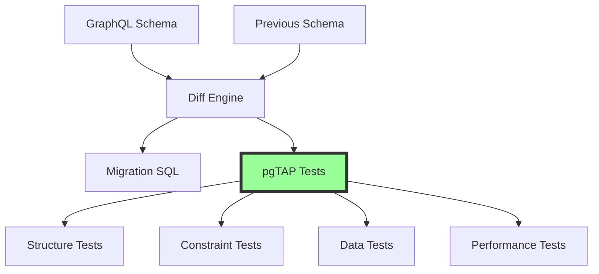

# Automatic Test Generation: Production-Grade pgTAP from Schema

## The Killer Feature

Wesley doesn't just generate code—it **proves it works**. Every schema element gets risk-weighted tests that turn "neat codegen" into "production fortress."

1. **Structure**: Tables, columns, types exist as expected
2. **Constraints**: Primary keys, foreign keys, checks work
3. **Defaults**: Default values are applied correctly
4. **Indexes**: Performance optimizations are in place
5. **Migrations**: Changes applied successfully

## The Algorithm



## Test Generation Patterns

### 1. Structure Tests

For every table and column, Wesley generates existence tests:

```graphql
# Input Schema
type User @table {
  id: ID! @primaryKey
  email: String! @unique
  created_at: DateTime! @default(expr: "now()")
}
```

```sql
-- Generated pgTAP Test
BEGIN;
SELECT plan(7);

-- Table exists
SELECT has_table('user', 'Table user should exist');

-- Columns exist
SELECT has_column('user', 'id', 'Column user.id should exist');
SELECT has_column('user', 'email', 'Column user.email should exist');
SELECT has_column('user', 'created_at', 'Column user.created_at should exist');

-- Column types
SELECT col_type_is('user', 'id', 'uuid', 'user.id should be uuid');
SELECT col_type_is('user', 'email', 'text', 'user.email should be text');
SELECT col_type_is('user', 'created_at', 'timestamp with time zone', 'user.created_at should be timestamptz');

SELECT * FROM finish();
ROLLBACK;
```

### 2. Constraint Tests

For every directive, Wesley generates constraint verification:

```sql
-- Primary Key Tests
SELECT col_is_pk('user', 'id', 'user.id should be primary key');

-- Unique Constraint Tests
SELECT col_is_unique('user', 'email', 'user.email should be unique');

-- Foreign Key Tests
SELECT fk_ok(
  'post', 'user_id',
  'user', 'id',
  'post.user_id should reference user.id'
);

-- Not Null Tests
SELECT col_not_null('user', 'email', 'user.email should not be nullable');

-- Default Value Tests
SELECT col_has_default('user', 'created_at', 'user.created_at should have default');
SELECT col_default_is(
  'user', 'created_at', 
  'now()', 
  'user.created_at default should be now()'
);
```

### 3. Migration Tests

For each migration, Wesley generates rollback and reapply tests:

```sql
-- Test migration can be applied
BEGIN;
\i migrations/20240320_add_user_table.sql
SELECT has_table('user', 'Migration should create user table');
ROLLBACK;

-- Test migration is idempotent
BEGIN;
\i migrations/20240320_add_user_table.sql
\i migrations/20240320_add_user_table.sql  -- Apply twice
SELECT pass('Migration should be idempotent');
ROLLBACK;

-- Test data preservation
BEGIN;
-- Insert test data
INSERT INTO user (email) VALUES ('test@example.com');
-- Apply migration
\i migrations/20240321_add_username.sql
-- Verify data still exists
SELECT is(
  (SELECT COUNT(*) FROM user WHERE email = 'test@example.com'),
  1::bigint,
  'Migration should preserve existing data'
);
ROLLBACK;
```

### 4. Diff-Based Test Generation

When Wesley detects changes, it generates specific tests:

```javascript
function generateDiffTests(diff) {
  const tests = [];
  
  for (const change of diff.changes) {
    switch (change.type) {
      case 'ADD_COLUMN':
        tests.push(generateAddColumnTests(change));
        break;
      case 'DROP_COLUMN':
        tests.push(generateDropColumnTests(change));
        break;
      case 'ALTER_TYPE':
        tests.push(generateAlterTypeTests(change));
        break;
      case 'ADD_CONSTRAINT':
        tests.push(generateConstraintTests(change));
        break;
    }
  }
  
  return tests;
}

function generateAddColumnTests(change) {
  return `
-- Test: Adding ${change.column} to ${change.table}
SELECT has_column(
  '${change.table}', 
  '${change.column}', 
  'Column ${change.table}.${change.column} should exist after migration'
);

-- Test nullable if not required
${!change.field.nonNull ? `
SELECT col_is_null(
  '${change.table}',
  '${change.column}',
  'Column ${change.table}.${change.column} should be nullable'
);` : ''}

-- Test default value if specified
${change.field.default ? `
SELECT col_has_default(
  '${change.table}',
  '${change.column}',
  'Column ${change.table}.${change.column} should have default'
);` : ''}
`;
}
```

## Smart Test Suggestions

### Pattern Recognition

Wesley recognizes common patterns and suggests appropriate tests:

```graphql
# Email field detected
email: String! @unique
```

Suggests:
```sql
-- Email format validation
SELECT throws_ok(
  $$ INSERT INTO user (email) VALUES ('not-an-email') $$,
  '23514',
  'new row for relation "user" violates check constraint',
  'Should reject invalid email format'
);

-- Case insensitive uniqueness
INSERT INTO user (email) VALUES ('Test@Example.com');
SELECT throws_ok(
  $$ INSERT INTO user (email) VALUES ('test@example.com') $$,
  '23505',
  'Should enforce case-insensitive email uniqueness'
);
```

### Relationship Testing

For foreign keys, Wesley generates relationship tests:

```graphql
type Post @table {
  user_id: ID! @foreignKey(ref: "User.id")
}
```

Generates:
```sql
-- Cascading delete test
BEGIN;
INSERT INTO user (id, email) VALUES 
  ('user-1', 'test@example.com');
INSERT INTO post (id, user_id, title) VALUES 
  ('post-1', 'user-1', 'Test Post');

DELETE FROM user WHERE id = 'user-1';

SELECT is(
  (SELECT COUNT(*) FROM post WHERE user_id = 'user-1'),
  0::bigint,
  'Posts should be deleted when user is deleted'
);
ROLLBACK;

-- Foreign key constraint test
SELECT throws_ok(
  $$ INSERT INTO post (user_id, title) VALUES ('nonexistent', 'Test') $$,
  '23503',
  'Should reject posts with nonexistent user_id'
);
```

## Performance Test Generation

Wesley generates performance tests for indexes:

```sql
-- Index performance test
EXPLAIN (ANALYZE, BUFFERS) 
SELECT * FROM user WHERE email = 'test@example.com';

SELECT ok(
  (SELECT COUNT(*) FROM pg_indexes 
   WHERE tablename = 'user' 
   AND indexname LIKE '%email%') > 0,
  'Index on user.email should exist'
);

-- Query plan verification
SELECT plan_ok(
  $$ SELECT * FROM user WHERE email = 'test@example.com' $$,
  'Index Scan',
  'Should use index for email lookups'
);
```

## Test Organization

Wesley organizes tests by concern:

```
tests/
├── schema/
│   ├── 001_structure.sql      # Table/column existence
│   ├── 002_constraints.sql    # PK, FK, unique, checks
│   └── 003_defaults.sql       # Default values
├── migrations/
│   ├── 001_baseline.sql       # Initial schema tests
│   ├── 002_add_username.sql   # Username addition tests
│   └── 003_add_posts.sql      # Posts table tests
├── data/
│   ├── 001_insertion.sql      # Insert operations
│   ├── 002_updates.sql        # Update operations
│   └── 003_deletion.sql       # Delete operations
└── performance/
    ├── 001_indexes.sql         # Index existence/usage
    └── 002_queries.sql         # Query performance
```

## Continuous Testing

Wesley can generate continuous integration tests:

```yaml
# Generated .github/workflows/database-tests.yml
name: Database Tests
on: [push, pull_request]

jobs:
  pgTAP:
    runs-on: ubuntu-latest
    services:
      postgres:
        image: postgres:15
        env:
          POSTGRES_PASSWORD: postgres
        options: >-
          --health-cmd pg_isready
          --health-interval 10s
          --health-timeout 5s
          --health-retries 5
    
    steps:
      - uses: actions/checkout@v3
      
      - name: Install pgTAP
        run: |
          sudo apt-get update
          sudo apt-get install -y postgresql-15-pgtap
      
      - name: Run Migrations
        run: |
          psql -h localhost -U postgres -f out/schema.sql
      
      - name: Run Tests
        run: |
          pg_prove -h localhost -U postgres tests/**/*.sql
```

## Test Coverage Metrics

Wesley tracks test coverage:

```javascript
class TestCoverageAnalyzer {
  analyze(schema, tests) {
    const coverage = {
      tables: new Set(),
      columns: new Set(),
      constraints: new Set(),
      indexes: new Set()
    };
    
    // Parse tests to find what's covered
    for (const test of tests) {
      this.extractCoverage(test, coverage);
    }
    
    // Calculate coverage percentages
    const report = {
      tables: this.calculateCoverage(
        schema.getTables(),
        coverage.tables
      ),
      columns: this.calculateCoverage(
        schema.getAllColumns(),
        coverage.columns
      ),
      constraints: this.calculateCoverage(
        schema.getAllConstraints(),
        coverage.constraints
      ),
      overall: this.calculateOverallCoverage(coverage)
    };
    
    return report;
  }
  
  suggestMissingTests(schema, coverage) {
    const suggestions = [];
    
    // Find untested elements
    for (const table of schema.getTables()) {
      if (!coverage.tables.has(table.name)) {
        suggestions.push({
          type: 'TABLE_TEST',
          table: table.name,
          test: `SELECT has_table('${table.name}');`
        });
      }
      
      for (const field of table.getFields()) {
        const key = `${table.name}.${field.name}`;
        if (!coverage.columns.has(key)) {
          suggestions.push({
            type: 'COLUMN_TEST',
            column: key,
            test: `SELECT has_column('${table.name}', '${field.name}');`
          });
        }
      }
    }
    
    return suggestions;
  }
}
```

## Risk-Weighted Test Generation

### The Innovation: Not All Fields Are Equal

Wesley uses `@weight` and `@critical` directives to prioritize testing:

```graphql
type User @table @critical {
  id: ID! @primaryKey                    # Weight: 10 (automatic)
  password: String! @sensitive @weight(10) # Maximum priority
  email: String! @pii @weight(8)          # High priority  
  theme: String @weight(2)                # Low priority
}
```

Generated tests focus on critical fields first:

```sql
-- Column: User.password (weight: 10, CRITICAL)
-- EVIDENCE: col:user.password -> out/schema.sql:45@abc123d
SELECT has_column('User', 'password', 'Column User.password should exist');
SELECT col_not_null('User', 'password', 'User.password should not be nullable');

-- CRITICAL FIELD: Additional safety checks
SELECT has_check('User', 'User.password should have hash length check');
```

### Test Confidence Index (TCI)

Wesley calculates test confidence with weighted priorities:

```
TCI = 0.20 × structure_coverage +
      0.45 × constraint_coverage (weighted by field importance) +
      0.25 × migration_coverage +
      0.10 × performance_coverage
```

Gate on TCI ≥ 0.7 for production readiness.

## RLS & Auth Reality Checks (Supabase-Aware)

### Automatic RLS Testing

For tables with `@rls` directive, Wesley generates auth context tests:

```sql
-- Test as resource owner
SELECT set_config('request.jwt.claims', 
  '{"sub":"00000000-0000-0000-0000-000000000001", "role":"authenticated"}', true);

-- Should allow for owner
SELECT lives_ok(
  $$ SELECT * FROM "Post" $$,
  'RLS should allow select for owner'
);

-- Switch to different user
SELECT set_config('request.jwt.claims',
  '{"sub":"00000000-0000-0000-0000-000000000002", "role":"authenticated"}', true);

-- Should block for non-owner  
SELECT throws_ok(
  $$ SELECT * FROM "Post" $$,
  '42501',
  'RLS should block select for non-owner'
);
```

### Per-Operation Policy Tests

Wesley tests each RLS operation (select/insert/update/delete) with different auth contexts.

## Migration Safety Drills

### NOT NULL Without Default

When adding NOT NULL columns without defaults, Wesley generates backfill tests:

```sql
-- Test NOT NULL without default for users.new_field
DO $$
BEGIN
  -- Insert legacy data
  INSERT INTO "users" (id) VALUES ('test-id');
  -- Apply migration with NOT NULL column
  \i migrations/latest.sql
  -- Verify data preservation or proper error
  PERFORM pass('NOT NULL migration handled correctly');
  ROLLBACK;
END $$;
```

### Type Change Safety

For ALTER TYPE operations, Wesley generates cast probes:

```sql
-- Test type change for posts.count
DO $$
BEGIN
  -- Test safe cast
  ALTER TABLE "posts" ALTER COLUMN "count" TYPE bigint;
  PERFORM pass('Type change succeeded');
EXCEPTION WHEN OTHERS THEN
  PERFORM fail('Unsafe type change: ' || SQLERRM);
END $$;
```

### Idempotence Testing

Every migration is tested for idempotence:

```sql
-- Test migration idempotence
DO $$
BEGIN
  -- Apply migration twice
  \i migrations/latest.sql
  \i migrations/latest.sql  -- Should be no-op
  PERFORM pass('Migration should be idempotent');
EXCEPTION WHEN OTHERS THEN
  PERFORM fail('Migration is not idempotent: ' || SQLERRM);
END $$;
```

## Behavior Testing (Not Just Structure)

### Trigger Behavior Tests

For `@updatedAt` fields, Wesley tests actual behavior:

```sql
-- Test User.updated_at auto-update trigger
DO $$
DECLARE
  test_id uuid := gen_random_uuid();
  initial_time timestamptz;
  updated_time timestamptz;
BEGIN
  -- Insert and capture initial timestamp
  INSERT INTO "User" (id) VALUES (test_id);
  SELECT updated_at INTO initial_time FROM "User" WHERE id = test_id;
  
  -- Wait briefly then update
  PERFORM pg_sleep(0.01);
  UPDATE "User" SET id = test_id WHERE id = test_id;
  SELECT updated_at INTO updated_time FROM "User" WHERE id = test_id;
  
  -- Verify timestamp was updated
  PERFORM is(
    updated_time > initial_time,
    true,
    'updated_at should auto-update on modification'
  );
  
  ROLLBACK;
END $$;
```

## Index Usage Verification

### EXPLAIN Plan Testing

Wesley doesn't just check indexes exist—it verifies they're used:

```sql
-- Verify index is used in query plans
SELECT like(
  (SELECT json_agg(plan) FROM (
    EXPLAIN (FORMAT JSON) SELECT * FROM "User" WHERE "email" = 'test'
  ) AS t(plan))::text,
  '%Index Scan%',
  'Query on email should use index'
);
```

## Evidence-Mapped Tests

### SHA-Locked Citations

Every test includes evidence mapping for HOLMES verification:

```sql
-- Column: User.email (weight: 8)
-- EVIDENCE: col:user.email -> out/schema.sql:42-49@abc123d
SELECT has_column('User', 'email', 'Column User.email should exist');
```

This enables:
- Precise citations without grep
- SHA-locked verification
- Zero flakiness

## Transactional Safety

### Deterministic Test Environment

All tests run in transactions with deterministic settings:

```sql
BEGIN;

-- Set deterministic environment
SET LOCAL timezone = 'UTC';
SET LOCAL statement_timeout = '5s';

-- Run tests...

-- Always rollback
ROLLBACK;
```

## Theater-Test Detection

### Enforcing Meaningful Tests

Wesley fails the gate if critical fields lack proper tests:

- `@critical` fields without constraint tests → ❌ FAIL
- `@sensitive` fields without hash/encryption checks → ❌ FAIL  
- `@pii` fields without masking tests → ⚠️ WARN

## CLI Ergonomics

```bash
# Run all tests in ephemeral Postgres
wesley test

# Test only critical fields (fast PR loops)
wesley test --critical-only

# Generate test report with TCI score
wesley test --report

# Output:
✅ Structure Tests: 15/15 (100%)
✅ Constraint Tests: 23/25 (92%) - weighted by importance
⚠️ Migration Tests: 8/10 (80%)
✅ Performance Tests: 5/5 (100%)

TCI Score: 0.87 (87%) - PASS ✅
```

## What Gets Generated from Directives

| Directive | Generated Tests |
|-----------|-----------------|
| `@primaryKey` | PK exists, unique, not null |
| `@unique` | Unique constraint + case-insensitive for emails |
| `@foreignKey` | FK exists, cascade behavior |
| `@default` | Default presence + behavior |
| `@check` | Constraint holds, failing insert blocked |
| `@index` | Index exists + EXPLAIN verification |
| `@rls` | Per-operation auth tests |
| `@sensitive` | Hash/length checks, no plaintext |
| `@updatedAt` | Trigger behavior verification |

## Benefits

1. **Risk-Weighted Priority**: Critical fields get deeper tests
2. **Compliance-Grade Assurance**: PII/sensitive fields verified
3. **Migration Confidence**: Prove changes work before production
4. **Performance Guarantees**: Indexes actually used
5. **Auth Reality**: RLS policies tested with real contexts
6. **Zero Flakiness**: Evidence-mapped, transactional, deterministic

## Configuration

```javascript
// wesley.config.js
export default {
  testing: {
    generateTests: true,
    testTypes: ['structure', 'constraints', 'data', 'performance'],
    coverage: {
      minimum: 80,
      failOnLow: true
    },
    pgTAP: {
      version: '1.2.0',
      connection: process.env.TEST_DATABASE_URL
    }
  }
};
```

## Conclusion

Wesley's test generation transforms database testing from a chore to an automatic safety net. Every schema change, every migration, every constraint gets tested automatically. 

**You write GraphQL. Wesley writes tests.**