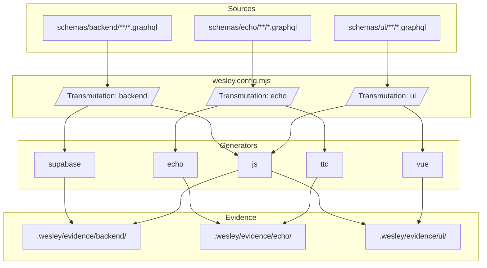
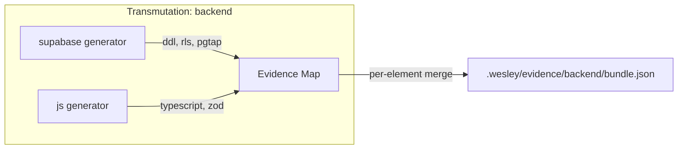
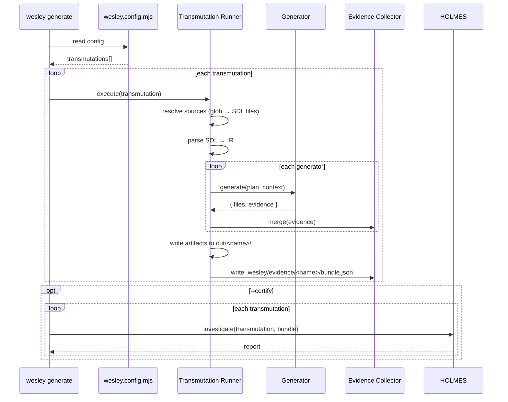
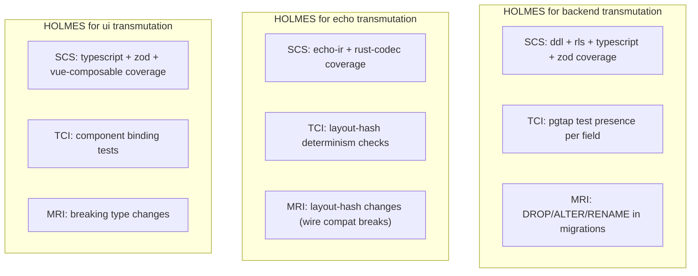

# Transmutations

> *"The alchemist does not create gold — he reveals what was always latent in the lead."*

Wesley compiles GraphQL SDL into executable artifacts: SQL, TypeScript, Zod schemas, Rust codecs, Vue composables, and more. Each compilation path is a **transmutation** — a declared mapping from source schemas to generators, with evidence tracking that proves the output is correct.

This document specifies the transmutation system: how projects declare what they build, how Wesley executes it, and how HOLMES verifies it.

## Status

**Draft** — proposed architecture, not yet implemented.

---

## Problem

Wesley currently runs all enabled generators in sequence against all source files. This creates three problems:

1. **No source-to-generator mapping.** An Echo project compiles Rust codecs but Wesley still checks for pgTAP tests. A Supabase project generates DDL but gets scored on layout hashes it never produces.

2. **HOLMES scores are context-free.** SCS/TCI/MRI are computed via placeholder heuristics (`MRI = 0.2`, always). There is no mechanism for generators to report what they actually produced.

3. **Evidence is coarse-grained.** The evidence map cites entire files with dummy line ranges (`1-9999`) rather than per-field, per-artifact citations.

Transmutations solve all three by making the compilation unit explicit, giving generators an evidence contract, and tracking coverage per source file.

---

## Concepts



### Transmutation

A named compilation unit that maps source files to generators. Declared in `wesley.config.mjs`. Each transmutation runs independently and produces its own evidence bundle.

### Evidence Contract

Each generator declares what artifact categories it produces and how they can be verified. Evidence is collected *during generation*, not reconstructed after the fact.

### SHA-lock Certification

A per-transmutation stamp asserting that all evidence thresholds are met. A project is fully certified when every declared transmutation passes.

---

## Configuration

Transmutations are declared in `wesley.config.mjs` under a new `transmutations` key:

```javascript
export default {
  version: '2.0.0',

  transmutations: {
    backend: {
      sources: ['schemas/backend/**/*.graphql'],
      generators: ['supabase', 'js'],
    },

    echo: {
      sources: ['schemas/echo/**/*.graphql'],
      generators: ['echo', 'ttd'],
    },

    ui: {
      sources: ['schemas/ui/**/*.graphql'],
      generators: ['js', 'vue'],
    },
  },

  // Thresholds can be global (defaults) or per-transmutation
  thresholds: {
    scs: 0.8,
    tci: 0.7,
    mri: 0.4,
  },

  // Existing keys (weights, paths, security, etc.) remain unchanged
  weights: { /* ... */ },
  paths: { /* ... */ },
  security: { /* ... */ },
};
```

### Transmutation Options

| Key | Type | Required | Description |
|-----|------|----------|-------------|
| `sources` | `string[]` | Yes | Glob patterns resolving to GraphQL SDL files |
| `generators` | `string[]` | Yes | Generator names to run (order = execution order) |
| `thresholds` | `object` | No | Per-transmutation threshold overrides |
| `output` | `string` | No | Output directory override (default: `out/<name>/`) |

### Backward Compatibility

If no `transmutations` key is present, Wesley synthesizes a single implicit transmutation from the existing `generators` config — same behavior as today. Existing projects keep working without changes.

```javascript
// No transmutations key → implicit single transmutation:
// {
//   default: {
//     sources: ['**/*.graphql'],
//     generators: [/* all enabled generators from config */],
//   }
// }
```

---

## Evidence Contract

### Generator Interface Extension

`GeneratorPlugin` gains an `evidenceContract` getter and `generate()` returns evidence alongside files:

```javascript
class SupabaseGenerator extends GeneratorPlugin {
  get name() { return 'supabase'; }

  get evidenceContract() {
    return {
      // Artifact categories this generator produces
      artifacts: ['ddl', 'rls', 'migrations', 'pgtap'],

      // How each category can be verified
      verification: {
        ddl:        { type: 'sql-parse' },
        rls:        { type: 'sql-parse' },
        migrations: { type: 'sql-parse', risk: ['DROP', 'ALTER', 'RENAME'] },
        pgtap:      { type: 'sql-parse' },
      },
    };
  }

  async generate(plan, context) {
    const files = {};
    const evidence = {};

    // Generate DDL — track per-field evidence
    for (const table of plan.tables) {
      const ddl = emitDDL(table);
      const path = `ddl/${table.name}.sql`;
      files[path] = ddl;

      for (const field of table.fields) {
        evidence[`col:${table.name}.${field.name}`] = {
          artifacts: {
            ddl: { file: path, lines: [field.startLine, field.endLine] },
          },
        };
      }
    }

    return { files, evidence };
  }
}
```

### Evidence Shape

Each generator returns per-element evidence keyed by UID (`col:User.email`, `tbl:Orders`, `op:createUser`):

```json
{
  "col:User.email": {
    "artifacts": {
      "ddl":       { "file": "ddl/User.sql",       "lines": [4, 4],   "sha": "a1b2c3" },
      "rls":       { "file": "rls/User.sql",       "lines": [2, 8],   "sha": "d4e5f6" },
      "pgtap":     { "file": "tests/User.sql",     "lines": [12, 18], "sha": "789abc" },
      "typescript":{ "file": "models/User.ts",      "lines": [3, 3],   "sha": "def012" },
      "zod":       { "file": "zod/User.ts",         "lines": [5, 5],   "sha": "345678" }
    }
  },
  "col:User.password_hash": {
    "artifacts": {
      "ddl":   { "file": "ddl/User.sql",   "lines": [5, 5], "sha": "a1b2c3" },
      "rls":   { "file": "rls/User.sql",   "lines": [9, 15], "sha": "d4e5f6" },
      "pgtap": { "file": "tests/User.sql", "lines": [20, 32], "sha": "789abc" }
    }
  }
}
```

### Evidence Aggregation

After all generators in a transmutation complete, Wesley merges their evidence maps per-element:



A single element like `col:User.email` ends up with citations from every generator that touched it.

---

## Execution

### CLI

```
wesley generate                     # run all transmutations
wesley generate --transmutation backend  # run one
wesley generate -t backend -t echo  # run several
wesley generate --certify           # run + HOLMES verification
```

### Execution Flow



### Source Resolution

Each transmutation resolves its `sources` globs independently. If a source file matches multiple transmutations, it is compiled once per transmutation — this is intentional. A schema might transmute into both Postgres DDL and Echo IR.

Composition directives (`@wes_import`) are resolved relative to the source files, not the project root. Imported files inherit the transmutation context of the file that imports them.

---

## Contextual HOLMES

### Investigation Profiles

HOLMES no longer applies a single scoring rubric. Each transmutation's generators define what evidence exists, so HOLMES checks only what's relevant:



### Score Computation (Real, Not Placeholder)

**SCS (Schema Coverage Score)** — computed from the evidence map:

```
For each schema element (col:X.Y, tbl:X, op:X):
  expected_artifacts = union of all generator evidence contracts
  present_artifacts  = artifacts with valid citations in evidence map
  element_score      = |present| / |expected| * weight(element)

SCS = Σ(element_score) / Σ(weight)
```

A field with weight 10 (`password_hash`) that's missing its `pgtap` citation drags SCS down more than a weight-2 field (`theme`) missing the same.

**TCI (Test Confidence Index)** — computed from test-category evidence:

```
test_categories = artifacts where verification.type involves testing
                  (pgtap, layout-hash determinism, component tests)

For each schema element:
  element_tci = |present test artifacts| / |expected test artifacts| * weight

TCI = Σ(element_tci) / Σ(weight)
```

**MRI (Migration Risk Index)** — computed from migration artifacts:

```
For supabase transmutations:
  Parse migration SQL, count DROP/ALTER/RENAME statements
  Weight by affected element importance
  MRI = risk_score / max_possible_risk

For echo transmutations:
  Compare layout_hash values against previous bundle
  MRI = changed_hashes / total_hashes (wire compatibility breaks)
```

### Watson Verification (Real Citations)

Watson verifies that evidence citations are accurate:

```
For each citation { file, lines, sha }:
  content = git show <sha>:<file>
  actual_lines = extract lines[start..end] from content
  verify actual_lines contain the expected artifact
```

This works because generators now produce **precise line ranges** rather than `1-9999`.

### Moriarty Prediction

Moriarty's math is already real (EMA, linear regression, variance). With real scores flowing in from real evidence, its predictions become meaningful. No changes needed to Moriarty itself — just real input data.

---

## Per-Source-File Evidence Tracking

Within a transmutation, evidence is tracked per source file. If `schemas/backend/` contains `users.graphql` and `orders.graphql`, the evidence bundle tracks them separately:

```json
{
  "transmutation": "backend",
  "sources": {
    "schemas/backend/users.graphql": {
      "elements": {
        "col:User.id": { "artifacts": { "ddl": {}, "typescript": {}, "zod": {}, "pgtap": {} } },
        "col:User.email": { "artifacts": { "ddl": {}, "rls": {}, "typescript": {}, "zod": {}, "pgtap": {} } }
      },
      "scores": { "scs": 1.0, "tci": 1.0, "mri": 0.0 }
    },
    "schemas/backend/orders.graphql": {
      "elements": {
        "col:Order.total": { "artifacts": { "ddl": {}, "typescript": {}, "zod": {} } }
      },
      "scores": { "scs": 0.6, "tci": 0.0, "mri": 0.0 }
    }
  },
  "aggregate": { "scs": 0.82, "tci": 0.55, "mri": 0.0 }
}
```

This lets HOLMES report: *"backend transmutation: users.graphql is fully certified, orders.graphql is missing pgtap tests for Order.total."*

---

## Project Organization

### Current Structure

```
packages/
├── wesley-cli/
├── wesley-core/
├── wesley-generator-echo/
├── wesley-generator-js/
├── wesley-generator-supabase/
├── wesley-generator-ttd/
├── wesley-generator-vue/
├── wesley-holmes/
├── wesley-host-browser/
├── wesley-host-bun/
├── wesley-host-deno/
├── wesley-host-node/
├── wesley-scaffold-multitenant/
├── wesley-slaps/
├── wesley-stack-supabase-nextjs/
└── wesley-tasks/
```

### Proposed Structure

Group packages by role. Generators become transmutation modules — each one knows how to transmute schemas into a specific artifact domain and prove it did so correctly.

```
packages/
├── core/                          # @wesley/core — pure domain
│
├── cli/                           # @wesley/cli — command framework
│
├── transmute-supabase/            # @wesley/transmute-supabase
│   ├── src/
│   │   ├── generators/            #   DDL, RLS, migrations
│   │   ├── evidence/              #   evidence contract + collector
│   │   └── index.mjs
│   └── test/
│
├── transmute-echo/                # @wesley/transmute-echo
│   ├── src/
│   │   ├── generators/            #   Echo IR, Rust codecs, TS codecs
│   │   ├── evidence/              #   evidence contract + collector
│   │   └── index.mjs
│   └── test/
│
├── transmute-js/                  # @wesley/transmute-js
│   ├── src/
│   │   ├── generators/            #   TypeScript types, Zod schemas
│   │   ├── evidence/              #   evidence contract + collector
│   │   └── index.mjs
│   └── test/
│
├── transmute-ttd/                 # @wesley/transmute-ttd
│
├── transmute-vue/                 # @wesley/transmute-vue
│
├── holmes/                        # @wesley/holmes — sidecar intelligence
│   ├── src/
│   │   ├── Holmes.mjs             #   contextual investigation
│   │   ├── Watson.mjs             #   citation verification
│   │   └── Moriarty.mjs           #   prediction (unchanged)
│   └── test/
│
├── hosts/                         # Runtime adapters
│   ├── node/                      #   @wesley/host-node
│   ├── bun/                       #   @wesley/host-bun
│   ├── deno/                      #   @wesley/host-deno
│   └── browser/                   #   @wesley/host-browser
│
├── tasks/                         # @wesley/tasks (T.A.S.K.S.)
├── slaps/                         # @wesley/slaps (S.L.A.P.S.)
│
└── stacks/                        # Full-stack scaffolds
    ├── supabase-nextjs/
    └── scaffold-multitenant/
```

Key changes:

- **`generator-*` → `transmute-*`**: Generators become transmutation modules. Each module bundles its generators *and* its evidence contract. The module is the unit of accountability.
- **Hosts grouped**: `hosts/node`, `hosts/bun`, etc. — they're adapters, not primary actors.
- **Stacks grouped**: Scaffolds and stacks are templates, not core packages.
- **Shorter names**: Drop the `wesley-` prefix from directory names (npm package names stay scoped: `@wesley/transmute-supabase`).

### Migration Path

This is a **naming and directory reorganization**, not a rewrite. The code inside each package stays the same. The main work is:

1. Rename directories and update `pnpm-workspace.yaml`
2. Update `package.json` names (`@wesley/generator-supabase` → `@wesley/transmute-supabase`)
3. Update cross-package imports
4. Add `evidence/` directories with contract and collector to each transmutation module
5. Update `createNodeRuntime` to discover transmutation modules

---

## SHA-lock Certification

### Per-Transmutation Certificate

When `wesley generate --certify` runs, each transmutation that passes its thresholds receives a certificate:

```json
{
  "transmutation": "backend",
  "certified": true,
  "scores": {
    "scs": 0.92,
    "tci": 0.85,
    "mri": 0.15
  },
  "thresholds": {
    "scs": 0.80,
    "tci": 0.70,
    "mri": 0.40
  },
  "generators": ["supabase", "js"],
  "sources": ["schemas/backend/users.graphql", "schemas/backend/orders.graphql"],
  "evidence_sha": "sha256:a1b2c3d4...",
  "timestamp": "2026-03-08T14:30:00Z"
}
```

### Project-Level Certification

A project is SHA-lock certified when **all** declared transmutations pass:

```json
{
  "project": "my-app",
  "certified": true,
  "transmutations": {
    "backend": { "certified": true,  "scs": 0.92, "tci": 0.85, "mri": 0.15 },
    "echo":    { "certified": true,  "scs": 0.88, "tci": 0.90, "mri": 0.05 },
    "ui":      { "certified": false, "scs": 0.71, "tci": 0.45, "mri": 0.00 }
  },
  "sha": "sha256:combined-evidence-hash",
  "timestamp": "2026-03-08T14:30:00Z"
}
```

### CI Gate

```yaml
# .github/workflows/wesley-certify.yml
- name: Certify transmutations
  run: wesley generate --certify --fail-on-threshold
  # Exit code 0 = all transmutations certified
  # Exit code 1 = at least one transmutation failed thresholds
```

---

## PR Reporting

HOLMES PR comments become contextual — one section per transmutation:

```markdown
## 🔬 Wesley SHA-lock Report

### Transmutation: `backend` ✅ CERTIFIED
| Score | Value | Threshold | Status |
|-------|-------|-----------|--------|
| SCS   | 0.92  | 0.80      | ✅     |
| TCI   | 0.85  | 0.70      | ✅     |
| MRI   | 0.15  | 0.40      | ✅     |

<details><summary>Evidence: 2 sources, 14 elements, 56 citations</summary>

- `users.graphql`: 8/8 elements fully covered
- `orders.graphql`: 6/6 elements fully covered

</details>

### Transmutation: `echo` ✅ CERTIFIED
| Score | Value | Threshold | Status |
|-------|-------|-----------|--------|
| SCS   | 0.88  | 0.80      | ✅     |
| TCI   | 0.90  | 0.70      | ✅     |
| MRI   | 0.05  | 0.40      | ✅     |

### Transmutation: `ui` ❌ NOT CERTIFIED
| Score | Value | Threshold | Status |
|-------|-------|-----------|--------|
| SCS   | 0.71  | 0.80      | ❌     |
| TCI   | 0.45  | 0.70      | ❌     |
| MRI   | 0.00  | 0.40      | ✅     |

<details><summary>Missing evidence</summary>

- `components.graphql` → `col:Widget.label`: missing zod, vue-composable
- `components.graphql` → `col:Widget.config`: missing typescript, zod, vue-composable

</details>

---
📊 Moriarty projection: `ui` transmutation on track for certification in ~3 PRs
  based on SCS velocity +0.07/PR (EMA, 5-PR window)
```

---

## Implementation Phases

### Phase 1: Config + Transmutation Runner
- Add `transmutations` key to `wesley.config.mjs` schema
- Build transmutation runner in CLI (source resolution, generator dispatch)
- Backward-compatible implicit transmutation when key is absent
- Tests: config parsing, source glob resolution, generator selection

### Phase 2: Evidence Contracts
- Extend `GeneratorPlugin` with `evidenceContract` getter
- Modify `generate()` return type to include evidence
- Implement evidence collection in `transmute-supabase` (first mover)
- Implement evidence merge logic in transmutation runner
- Tests: evidence shape validation, per-element tracking

### Phase 3: Real HOLMES Scoring
- Replace placeholder heuristics with evidence-based SCS/TCI/MRI
- Wire HOLMES investigation to transmutation context
- Update Watson to verify real citations
- Tests: scoring accuracy against known evidence bundles

### Phase 4: Package Reorganization
- Rename `generator-*` → `transmute-*`
- Group hosts and stacks into subdirectories
- Update workspace config, imports, CI workflows
- Tests: all existing tests pass under new paths

### Phase 5: Certification + CI
- Implement per-transmutation certification stamps
- Project-level certification aggregation
- `--certify` and `--fail-on-threshold` CLI flags
- GitHub Actions workflow for PR reporting
- Tests: certification logic, CI gate behavior
