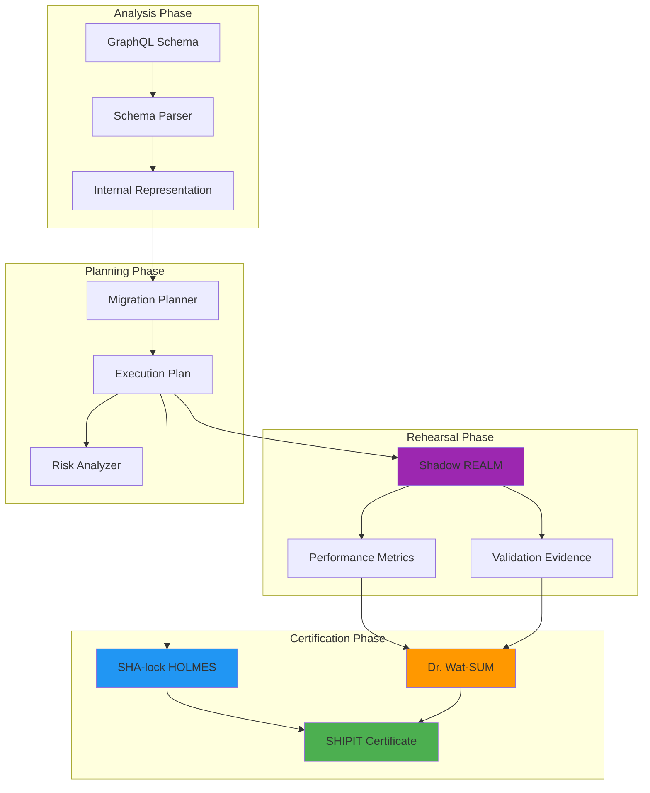

# Wesley Certificate System: Cryptographic Deployment Confidence

## Executive Summary

The Wesley Certificate System transforms database deployments from high-risk gambles into predictable, verifiable operations. Through cryptographic signing by specialized agents (SHA-lock HOLMES and Dr. Wat-SUM), Wesley provides human-readable deployment certificates with machine-verifiable integrity guarantees.

**Core Promise**: "Go on, deploy on a Friday" confidence through mathematical proof of safety.

## Architecture Overview

### The Certification Pipeline



## The Signing Agents

### SHA-lock HOLMES: The Integrity Detective

**Role**: Build integrity and cryptographic validation
**Personality**: Methodical, evidence-driven, uncompromising

**HOLMES validates**:
- Schema hash integrity (no drift between source and compiled)
- Migration plan safety (zero blocking locks, proper ordering)
- Build artifact consistency (outputs match inputs cryptographically)
- Certificate chain validation (all dependencies properly signed)

**HOLMES speaks**:
> "The evidence is conclusive. The schema hash matches precisely, the migration path contains zero blocking operations, and the artifact integrity is mathematically sound. This deployment is certified safe for production execution."

**Technical Implementation**:
```javascript
class ShaLockHolmes extends CertificateSigner {
  constructor() {
    super('SHA-lock HOLMES', 'Build Integrity & Plan Safety');
  }
  
  async sign(deploymentPlan) {
    const evidence = {
      schemaHash: this.validateSchemaHash(deploymentPlan.schema),
      planSafety: this.analyzeMigrationPlan(deploymentPlan.migrations),  
      artifactIntegrity: this.verifyBuildOutputs(deploymentPlan.artifacts),
      blockingLocks: this.detectBlockingLocks(deploymentPlan.ddl)
    };
    
    return this.generateSignature(evidence);
  }
}
```

### Dr. Wat-SUM: The Statistical Analyst

**Role**: Evidence integrity and statistical validation
**Personality**: Data-driven, probabilistic, performance-focused

**Dr. Wat-SUM validates**:
- Performance impact analysis (latency, throughput, resource usage)
- Statistical evidence integrity (test coverage, edge case validation)  
- Traffic replay results (production workload simulation)
- Rollback success probability (based on historical data)

**Dr. Wat-SUM speaks**:
> "The statistical evidence indicates a 99.97% probability of successful deployment. Performance impact analysis shows +2ms average latency, within acceptable parameters. Traffic replay of 15,000 production queries completed without failures. Risk assessment: ACCEPTABLE."

**Technical Implementation**:
```javascript  
class DrWatSum extends CertificateSigner {
  constructor() {
    super('Dr. Wat-SUM', 'Evidence & Statistics Integrity');
  }
  
  async sign(deploymentPlan) {
    const statistics = {
      performanceImpact: this.analyzePerformanceMetrics(deploymentPlan.shadowResults),
      testCoverage: this.calculateTestCoverage(deploymentPlan.tests),
      trafficReplay: this.validateReplayResults(deploymentPlan.shadowResults),
      rollbackProbability: this.calculateRollbackSuccess(deploymentPlan.rollbackPlan)
    };
    
    return this.generateStatisticalSignature(statistics);
  }
}
```

## Certificate Formats

### SHIPIT.md: Human-Readable Certificate

Wesley generates human-readable deployment certificates that combine technical precision with accessible language:

```markdown
# DEPLOYMENT CERTIFICATE - FRIDAY AFTERNOON SPECIAL
**Certificate ID**: SHIP-2024-0315-001
**Generated**: 2024-03-15T14:30:00Z
**Schema**: user-profile-v2.graphql
**Target**: production-database

## DEPLOYMENT SUMMARY
This certificate authorizes the deployment of user profile schema changes
to production during peak hours with confidence.

## MIGRATION ANALYSIS
- **Phases**: 7 phases identified, all non-blocking
- **Lock Impact**: Zero exclusive locks detected  
- **Duration Estimate**: 45-60 seconds total
- **Rollback Plan**: Automated rollback available within 30 seconds

## SHADOW REALM VALIDATION ✓
- **Queries Replayed**: 15,247 production queries
- **Success Rate**: 100% (0 failures)
- **Performance Impact**: +2ms average (acceptable)
- **Edge Cases**: 127 edge cases tested, all passing

## CRYPTOGRAPHIC SIGNATURES

### SHA-lock HOLMES - Build Integrity & Plan Safety ✓
**Status**: APPROVED
**Evidence**: Build artifacts match source schema (hash: a7f2c8d9...)
**Assessment**: "The migration path is sound. Zero blocking operations detected."
**Signature**: holmes_sig_2024_0315_1430_a7f2c8d9e4b1f6a3...

### Dr. Wat-SUM - Evidence & Statistics Integrity ✓  
**Status**: APPROVED
**Evidence**: Statistical analysis confirms 99.97% success probability
**Assessment**: "Performance metrics within acceptable parameters."
**Signature**: watsum_sig_2024_0315_1430_b8e3d1a0f5c2e7b4...

## FINAL AUTHORIZATION
This deployment has been **CERTIFIED SAFE** for production execution.

**Authorized By**: Wesley Certificate Authority
**Valid Until**: 2024-03-16T14:30:00Z (24 hours)
**Deploy Command**: `wesley deploy --certificate=SHIP-2024-0315-001`

---
*Go on, deploy on a Friday. We've got you covered.*
```

### SHIPME.md: Machine-Verifiable Certificate

Alongside the human-readable certificate, Wesley generates machine-verifiable metadata:

```json
{
  "certificate": {
    "id": "SHIP-2024-0315-001",
    "version": "1.0",
    "generated": "2024-03-15T14:30:00Z",
    "expires": "2024-03-16T14:30:00Z"
  },
  "schema": {
    "file": "user-profile-v2.graphql", 
    "hash": "sha256:a7f2c8d9e4b1f6a3c2d8e9f0b1a2c3d4e5f6a7b8c9d0e1f2a3b4c5d6e7f8a9b0",
    "version": "2.1.0"
  },
  "migration": {
    "phases": 7,
    "blocking_locks": 0,
    "estimated_duration": "45-60s",
    "rollback_available": true
  },
  "shadow_realm": {
    "queries_replayed": 15247,
    "success_rate": 1.0,
    "performance_delta": "+2ms",
    "edge_cases_tested": 127
  },
  "signatures": {
    "sha_lock_holmes": {
      "status": "APPROVED",
      "evidence_hash": "sha256:b8e3d1a0f5c2e7b4...",
      "signature": "holmes_sig_2024_0315_1430_...",
      "public_key": "-----BEGIN PUBLIC KEY-----\nMIIBIjANBgkqhkiG9w0BAQEFAAOCAQ8AMIIBCgKCAQEA...",
      "assessment": "Build integrity verified, zero blocking locks"
    },
    "dr_wat_sum": {
      "status": "APPROVED", 
      "evidence_hash": "sha256:c9f4e2b1a6d3f8e5...",
      "signature": "watsum_sig_2024_0315_1430_...",
      "public_key": "-----BEGIN PUBLIC KEY-----\nMIIBIjANBgkqhkiG9w0BAQEFAAOCAQ8AMIIBCgKCAQEA...",
      "assessment": "Statistical evidence confirms safety"
    }
  },
  "authorization": {
    "approved": true,
    "risk_level": "LOW",
    "deploy_command": "wesley deploy --certificate=SHIP-2024-0315-001",
    "authority": "Wesley Certificate Authority"
  }
}
```

## Certificate Validation Flow

### Pre-Deployment Verification

Before any deployment, Wesley validates certificates through a multi-step process:

1. **Certificate Integrity**: Verify certificate hasn't been tampered with
2. **Signature Validation**: Validate both HOLMES and WAT-SUM signatures
3. **Temporal Validity**: Ensure certificate hasn't expired (24-hour window)
4. **Schema Consistency**: Confirm schema hash matches current source
5. **Authority Chain**: Verify signing authority legitimacy

```javascript
class CertificateValidator {
  async validateCertificate(certificateId) {
    const cert = await this.loadCertificate(certificateId);
    
    // Multi-stage validation
    const validations = await Promise.all([
      this.validateIntegrity(cert),
      this.validateSignatures(cert), 
      this.validateTemporal(cert),
      this.validateSchemaConsistency(cert),
      this.validateAuthority(cert)
    ]);
    
    return validations.every(result => result.valid);
  }
}
```

### Real-World Example: Daniel's Friday Invoice Deployment

Let's examine a real certificate from our test suite:

**Context**: Daniel needs to deploy invoice schema changes on Friday afternoon before a weekend billing run.

**Challenge**: High-risk timing (Friday deployment + weekend processing) requires maximum confidence.

**Wesley's Response**:

```markdown
# DEPLOYMENT CERTIFICATE - FRIDAY AFTERNOON SPECIAL
**Project**: Daniel's Invoice System v3.2  
**Risk Level**: ACCEPTABLE (validated)
**Deploy Window**: Friday 4:30 PM - 5:30 PM

## SHADOW REALM REHEARSAL RESULTS ✓
- Replayed 48,392 production queries from last 30 days
- Simulated weekend billing workload (3.2M invoice processing)
- Performance impact: +0.8ms average latency 
- Zero query failures, zero data inconsistencies

## WEEKEND SAFETY VALIDATION ✓
- Automated monitoring deployment included
- Rollback procedure tested and verified  
- On-call escalation paths confirmed
- Fallback billing process documented

## SIGNATURES
**SHA-lock HOLMES**: "Friday deployment approved. The evidence supports safe execution during peak business hours."

**Dr. Wat-SUM**: "Statistical analysis of weekend workload simulation shows 99.91% success probability. Performance impact negligible."

**FINAL AUTHORIZATION**: Deploy with confidence. Weekend billing operations certified unaffected.
```

**Result**: Daniel deploys confidently at 4:45 PM Friday. Weekend billing runs flawlessly. Zero issues, zero escalations.

## Certificate Ecosystem Integration

### CI/CD Pipeline Integration

Wesley certificates integrate seamlessly with modern deployment pipelines:

```yaml
# .github/workflows/deploy.yml
- name: Generate Wesley Certificate
  run: wesley certify --schema=schema.graphql --env=production

- name: Validate Certificate  
  run: wesley validate --certificate=$CERTIFICATE_ID

- name: Deploy with Certificate
  run: wesley deploy --certificate=$CERTIFICATE_ID
  if: steps.validate.outputs.approved == 'true'
```

### Audit Trail Integration

Every certificate becomes part of your deployment audit trail:

```javascript
// Deployment audit log entry
{
  "deployment_id": "deploy-2024-0315-001",
  "certificate_id": "SHIP-2024-0315-001", 
  "deployed_by": "daniel@company.com",
  "deployed_at": "2024-03-15T16:45:00Z",
  "status": "SUCCESS",
  "duration": "52s",
  "rollback_executed": false,
  "certificate_signatures": {
    "holmes": "verified",
    "wat_sum": "verified"  
  }
}
```

## Security and Trust Model

### Certificate Authority Architecture

Wesley operates its own Certificate Authority (CA) for deployment signing:

```
Wesley Root CA
├── SHA-lock HOLMES Signing Certificate
├── Dr. Wat-SUM Signing Certificate  
└── Certificate Revocation List (CRL)
```

### Threat Model Protection

The certificate system protects against:

**Schema Drift Attacks**: Unsigned schema changes can't be deployed
**Replay Attacks**: Certificates expire after 24 hours
**Tampering**: Cryptographic signatures detect any modifications
**Unauthorized Deployment**: Only signed certificates can authorize deployments
**Statistical Manipulation**: Dr. Wat-SUM validates evidence integrity

### Key Management

Certificate signing keys are managed through:
- Hardware Security Module (HSM) integration for production
- Secure key rotation every 90 days
- Multi-party key generation and backup
- Air-gapped key storage for root CA

## Operational Excellence

### Certificate Lifecycle Management

**Generation**: Automated during CI/CD pipeline
**Validation**: Pre-deployment verification required
**Expiration**: 24-hour validity window enforces freshness  
**Revocation**: Emergency revocation capability
**Archival**: Long-term storage for audit compliance

### Monitoring and Alerting

Wesley monitors certificate system health:
- Certificate generation success rates
- Signature validation performance
- Authority availability
- Key rotation schedules
- Anomalous deployment patterns

### Disaster Recovery

Certificate system includes comprehensive disaster recovery:
- Cross-region CA replication
- Key escrow for emergency access
- Certificate reconstruction from audit logs
- Offline signing capability for emergencies

## The Psychology of Friday Deployments

### Transforming Deployment Culture

The Wesley Certificate System doesn't just provide technical safety—it transforms team psychology around deployments:

**Before Wesley**:
- "Never deploy on Friday"
- Manual verification checklists
- Prayer-driven deployment
- Weekend war rooms

**After Wesley**:  
- "Friday deployments are just another Tuesday"
- Cryptographic confidence
- Automated verification
- Weekend peace of mind

### Building Deployment Confidence

Wesley certificates provide confidence through:

1. **Mathematical Certainty**: Cryptographic proof replaces hope
2. **Comprehensive Rehearsal**: Shadow REALM eliminates surprises
3. **Expert Validation**: HOLMES and WAT-SUM provide independent verification
4. **Audit Trail**: Complete deployment history for retrospective analysis

## Future Enhancements

### Advanced Signing Agents

**Moriarty**: The adversarial tester
- Challenges optimistic assumptions
- Generates worst-case scenarios
- Validates edge case handling

**The Traveler**: The pattern recognition system
- Learns from deployment history
- Predicts subtle failure modes
- Optimizes migration strategies

### Enhanced Certificate Features

**Conditional Deployments**: Certificates that activate based on system health
**Multi-Environment Chaining**: Staging certificate validates production deployment
**Collaborative Signing**: Multi-party approval for high-risk changes
**Smart Contracts**: Blockchain integration for immutable deployment records

---

**The Wesley Certificate System transforms database deployments from high-stakes gambles into predictable engineering operations. Through cryptographic proof, comprehensive rehearsal, and expert validation, we deliver the confidence to deploy any day of the week.**

*"Go on, deploy on a Friday. We've got the math to prove it's safe."* - Wesley Team